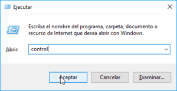
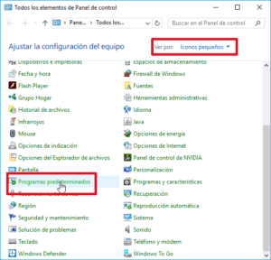
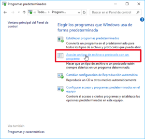
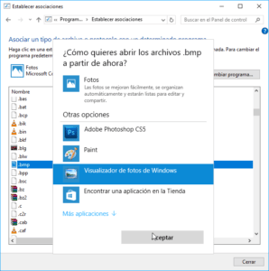
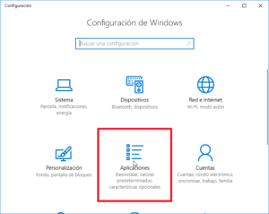
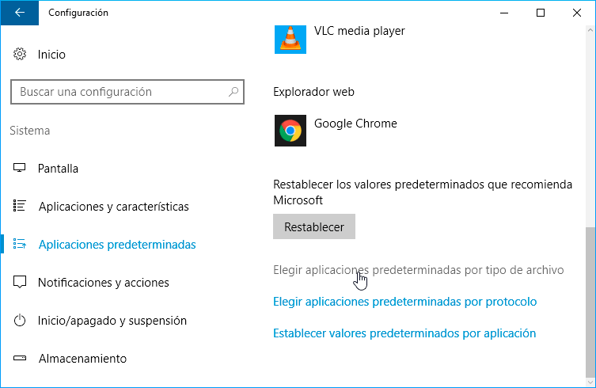
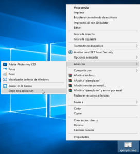
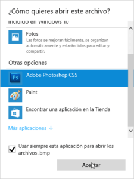

Existen muchas formas para seleccionar el programa predeterminado para abrir una determinada extensión de archivo en Windows. Por este motivo a continuación mostraré las formas que considero más apropiadas para realizar esta operación en Windows 10.<!--more-->

## ESTABLECER EL PROGRAMA PREDETERMINADO PARA ABRIR UNA EXTENSIÓN DE ARCHIVO CON EL PANEL DE CONTROL

En el caso que tengamos un gran número de extensiones de archivo que no se abren con el programa que queremos, les recomiendo aplicar la siguiente solución.

Tenemos que acceder al panel de control de Windows. Para ello presionamos la combinación de teclas Win+R.

Al aparecer la ventana de Ejecutar tecleamos el comando control y presionamos el botón Aceptar.

Seguidamente, en el apartado Ver Por seleccionamos la opción Iconos pequeños. A continuación, clicamos en la opción Programas predeterminados.

El siguiente paso es clicar en la opción Asociar un tipo de archivo o protocolo con un programa.

A continuación, aparecerá la ventana en la que tendremos que seleccionar el programa predeterminado para abrir una determinada extensión.

A modo de ejemplo en mi caso tengo configurado que los archivos .bmp se abran con Fotos. Para cambiar este comportamiento seguiré los siguientes pasos:

1. Inicialmente busco la fila que contiene la extensión .bmp.
2. Seguidamente hago doble clic sobre el programa predeterminado de la extensión .bmp que en mi caso es Fotos.
3. Cuando me aparezca la ventana ¿Cómo quiere abrir los archivos…? clico encima del programa que quiero usar, que en mi caso es el Visualizador de fotos de Windows
4. Una vez seleccionado el programa clico encima del botón Aceptar.

Siguiendo estos simples pasos, la próxima vez que abra un archivo .bmp se abrirá con visualizador de fotos de Windows en vez de la aplicación de Fotos.

###### Nota: Si en la lista de programas no les aparece el que están buscando tan solo tiene que clicar encima del apartado Más Aplicaciones.

## ESTABLECER EL PROGRAMA PREDETERMINADO PARA ABRIR UNA EXTENSIÓN DE ARCHIVO CON EL MENÚ DE CONFIGURACIÓN DE WINDOWS 10

La operación que acabamos de realizar también se puede realizar usando los nuevos menús de configuración de Windows 10. Para ello tenemos que seguir los siguientes pasos:

Accedemos al panel de configuración de Windows presionando la combinación de teclas Win+I. Cuando aparezca la ventana de configuración clicamos encima del icono Aplicaciones.

Seguidamente, en el panel de la izquierda clicamos encima de la opción Aplicaciones predeterminadas. A continuación, clican en la opción Elegir aplicaciones predeterminadas por tipo de archivo.

Finalmente aparecerá la ventana en la que tendremos que seleccionar el programa predeterminado para abrir una determinada extensión.

A modo de ejemplo en mi caso tengo configurado que los archivos .bmp se abran con Adobe Photoshop. Para cambiar este comportamiento tengo que realizar los siguientes pasos:

1. Me dirijo a la fila que contiene la extensión .bmp.
2. Seguidamente clico sobre el programa predeterminado para abrir las extensiones .bmp que en mi caso es Photoshop.
3. Finalmente, cuando aparezca la ventana elegir una aplicación clico encima del programa que quiero usar que en mi caso es El visor de fotos de Windows.

En estos momentos podemos estar seguros que la próxima vez que abramos una imagen .bmp, lo haremos mediante el Visualizador de fotos de Windows.

## ESTABLECER EL PROGRAMA PREDETERMINADO PARA ABRIR UNA EXTENSIÓN DE ARCHIVO CON EL MENÚ CONTEXTUAL

En el caso que únicamente pretendamos asociar una única extensión de archivo a un programa existen soluciones más prácticas a las que acabamos de ver.

De este modo, si queremos que todos los archivos con extensión .bmp se abran con Adobe Photoshop seguiremos los siguientes pasos:

1. Seleccionamos un fichero con extensión .bmp.
2. Seguidamente presionamos el botón derecho del ratón.
3. Cuando aparezca el menú contextual nos dirigimos a las opciones del menú Abrir con y clicamos encima de la opción Elegir otra aplicación.

Cuando aparezca la ventana como Como quieres abrir este archivo realizamos lo siguiente:

1. Seleccionamos el programa predeterminado para abrir los archivos .bmp.
2. Tildamos la casilla Usar siempre esta aplicación para abrir los archivos .bmp.
3. Finalmente presionamos encima del botón Aceptar.

De este modo tan simple a partir de estos momentos todos los archivos .bmp se abrirán con el programa Photoshop.

###### Nota: Si en la lista de programas no les aparece el que están buscando tan solo tiene que clicar encima del apartado Más Aplicaciones.
