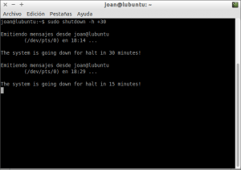
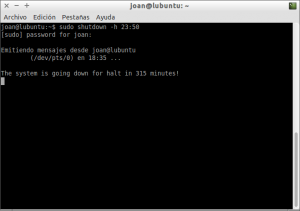
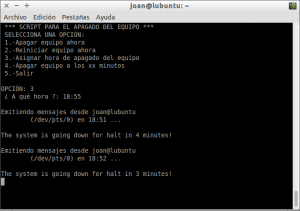
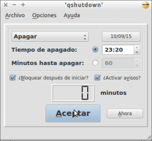
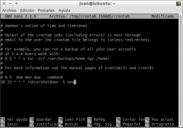

Antes de irme a dormir existen ocasiones en las que me pongo en la cama escuchando un podcast o la radio a través del ordenador. Al rato de estar escuchando la radio o el podcast acaba pasando una de estas dos cosas:

1. Me quedo dormido y el ordenador queda abierto toda la noche. Obviamente no me gusta quedarme dormido con el ordenador y la radio encendida.
2. Una vez estoy ya medio dormido tengo que levantarme para apagar el ordenador. Obviamente esto molesta ya que después hay que volver a coger el sueño.

<!--more-->

Para solucionar este pequeño problema tenemos varias soluciones. Una de ellas es programar el apagado del ordenador. Algunos de los métodos que podemos usar para programar el apagado del ordenador son las siguientes:

## MÉTODO 1: PROGRAMAR EL APAGADO DEL ORDENADOR MANUALMENTE DESDE LA TERMINAL

Es el método que acostumbro a usar. Mediante el uso de la terminal podemos programar el apagado del ordenador muy fácilmente. Algunos ejemplos de como podemos programar el apagado del ordenador son los siguientes:

### Apagar el ordenador después de un tiempo determinado

**Abrimos una terminal**. Una vez abierta la terminal **ejecutamos el siguiente comando**:

> ```
> sudo shutdown -h +30
> ```

El significado de cada uno los términos del comando son los siguientes:

**sudo:** Porque el programa shutdown precisa permisos de superusuario para ejecutarse.

**shutdown:** Es el programa que permite programar el apagado del ordenador.

**\-h:** Indica la acción a realizar una vez pasado un tiempo determinado. En este caso la acción es la acción halt (**\-h**). Por lo tanto una vez pasado el tiempo que queramos el ordenador se apagará.

**+30:** Indicamos el tiempo en minutos que queremos que tarde en apagarse el ordenador.

Tal y como se observa en la captura de pantalla, justo después de ejecutarse el comando empezará la cuenta atrás para apagar el ordenador.

[](images/Programar-apagado-del-ordenador-en-30-minutos.png)

Una vez transcurridos los 30 minutos nuestro ordenador se apagará de forma irremediable consiguiendo así nuestro objetivo.

**Si durante el proceso de cuenta atrás queremos abortar el proceso** tan solo tenemos que **presionar** la combinación de teclas **Ctrl+C** con la terminal activa.

### Apagar el ordenador a una hora determinada

En el apartado anterior hemos visto como apagar el ordenador después de un tiempo determinado que puede ser una hora, dos horas, etc. Si lo que queremos es apagar el ordenador a una hora en concreto lo podemos hacer **ejecutando este comando en la terminal**:

> ```
> sudo shutdown -h 23:50
> ```

El significado de cada uno los términos del comando son los siguientes:

**sudo:** Porque el programa shutdown precisa permisos de superusuario para ejecutarse.

**shutdown:** Es el programa que permite programar el apagado del ordenador.

**\-h:** Indica la acción a realizar una vez pasado un tiempo determinado. En este caso la acción es la acción halt (**\-h**). Por lo tanto una vez pasado el tiempo que queramos el ordenador se apagará.

**23:50:** Indicamos la hora en la que queremos que se apague el ordenador. En mi caso he indicado que sean las 23 horas y 50 minutos.

Después de ejecutar el comando, tal y como se puede ver en la captura de pantalla, se iniciará la cuenta atrás para apagarse el ordenador:

[](images/Apagado-a-una-hora-determinada.png)

**Si durante el proceso de cuenta atrás queremos abortar el proceso** tan solo tenemos que **presionar** la combinación de teclas **Ctrl+C** con la terminal activa

## MÉTODO 2: PROGRAMAR EL APAGADO DEL ORDENADOR MEDIANTE UN SCRIPT

Con un simple Script también podemos programar el apagado automático del ordenador. Para crear el script abrimos la terminal. Justo al abrir la terminal **creamos el archivo** **apagar.sh** **ejecutando el siguiente comando en la terminal**:

> ```
> touch apagar.sh
> ```

Una vez creado el archivo **lo abriremos ejecutando el siguiente comando en la terminal**:

> ```
> nano apagar.sh
> ```

Una vez abierto el editor de texto nano **pegaremos el siguiente código**:

> ```
> #!/bin/bash
> clear
> echo " *** SCRIPT PARA EL APAGADO DEL EQUIPO *** "
> echo " SELECCIONA UNA OPCIÓN:"
> echo " 1.-Apagar equipo ahora"
> echo " 2.-Reiniciar equipo ahora"
> echo " 3.-Asignar hora de apagado del equipo"
> echo " 4.-Apagar equipo a los xx minutos"
> echo " 5.-Salir"
> echo ""
> read -p "OPCIÓN: " OPCION
> case $OPCION in
> 1) sudo halt;;
> 2) sudo reboot;;
> 3) echo -n " ¿ A qué hora ?: "
> read hora
> sudo shutdown -h $hora;;
> 4)echo -n " ¿ En cuántos minutos se apagará el equipo?: "
> read minutos
> sudo shutdown -h $minutos;;
> 5) exit;;
> *) echo " OPCIÓN NO VÁLIDA "
> exit 1;;
> esac
> exit 0
> ```

###### [Fuente del script](https://ubunturoot.wordpress.com/2007/11/30/automatiza-el-apagado-de-tu-equipo/)

Una vez copiado el texto **guardamos los cambios y cerramos el fichero**. El siguiente paso será otorgar los permisos necesarios para que se pueda ejecutar el script. Para ello ejecutamos el siguiente comando en la terminal:

> ```
> sudo chmod +x apagar.sh
> ```

Una vez ejecutado el comando ya podemos usar el script. Para ello **ejecutamos el siguiente comando en la terminal**:

> ```
> sh ./apagar.sh
> ```

Justo después de ejecutar el script, tal y como se puede ver en la captura de pantalla, podremos programar la hora en que queremos que se apague nuestro ordenador.

[](images/Script-para-programar-el-apagado-del-ordenador.png)

Si queremos evitar tener que abrir la terminal cada vez que queramos ejecutar el script podemos crear un lanzador en el escritorio. Para ello ejecutamos el siguiente comando en la terminal:

> ```
> touch /home/joan/Escritorio/Apagar
> ```

Después de ejecutar el comando se creará un archivo con nombre Apagar en nuestro escritorio. Para que este archivo se convierta en un lanzador de escritorio tenemos que editar su contenido. Para editar su contenido tenemos que teclear el siguiente comando en la terminal:

> ```
> nano /home/joan/Escritorio/Apagar
> ```

Una vez se abra el editor de textos nano pegaremos el siguiente texto:

> ```
> [Desktop Entry]
> Name=Apagar
> Name[de_DE]=Apagar
> Exec=/home/joan/apagar.sh
> Terminal=true
> Type=Application
> Icon=home/joan/Imágenes/red_glasses
> ```

###### Nota: Las partes del texto a pegar que están en rojo las tendréis que modificar en función los siguientes aspectos. En la variable Exec hay que poner la ruta del script que hemos creado. En la variable Icon hay que poner la ruta del icono que queremos que tenga nuestro lanzador.

Una vez pegado el contenido en el archivo Apagar guardamos los cambios y cerramos el fichero. A partir de estos momentos, cada vez que cliquemos encima del nuevo icono que tenemos en el escritorio se ejecutará el script para programar el apagado de nuestro ordenador.

###### Nota: Existen formas alternativas para ejecutar el script sin tener que abrir una terminal. En vez de crear un lanzador de escritorio podríamos haber creado un enlace duro o introducir el script dentro de los menús de la distribución que usamos.

## MÉTODO 3: PROGRAMAR EL APAGADO DEL ORDENADOR USANDO UN PROGRAMA

Las personas a las que no les guste la terminal, programar scripts o simplemente prefieren no complicarse la vida, pueden optar por instalar un programa con interfaz gráfica para programar el apagado del ordenador.

Existen varios programas disponibles, pero en mi caso detallaré como usar qshutdown por los siguientes motivos:

1. Es muy sencillo de usar.
2. Funciona a la perfección.
3. Está presente en los repositorios de la gran mayoría de distros Linux.

**Para instalar qshutdown** abriremos una terminal y **ejecutaremos el siguiente comando**:

> ```
> sudo apt-get install qshutdown
> ```

**Una vez instalado el programa ya lo podemos abrir** sin ningún tipo de problema. Una vez abierto el programa verán una interfaz gráfica parecida a la siguiente:

[](images/Programar-el-apagado-con-qshutdown.png)

Tal y como se puede en la captura de pantalla, tan solo hay que **detallar el día y la hora en que queremos apagar el ordenador**. Una vez seleccionadas las opciones que queramos tan solo tenemos que **presionar el botón** **Aceptar** y empezará la cuenta atrás para apagar el ordenador.

## MÉTODO 4: PROGRAMAR EL APAGADO DEL ORDENADOR DE FORMA AUTOMÁTICA MEDIANTE CRON

Finalmente existe una ultima opción para programar el apagado del ordenador. Esta opción es utilizando cron. Posiblemente sea la opción que presente más opciones de configuración, pero con toda seguridad es la opción menos amigable de configurar.

Para programar el apagado de nuestro equipo con cron tenemos que **ejecutar el siguiente comando en la terminal**:

> ```
> sudo crontab -e
> ```

Una vez abierto el editor de texto tenemos que **editar el contenido del fichero crontab** para programar el apagado del ordenador. La estructura a usar para programar el apagado del ordenador es la siguiente:

> ```
> m h dom mon dow /sbin/shutdown -h now
> ```

Cada una de las partes en color rojo de este comando las tendréis que reemplazar por los siguientes términos:

**m:** Reemplazar m por un número entre el **0** y el **59**. Este número indica el minuto en el que queremos que se apague nuestro ordenador.

**h:** Reemplazar h por un número entre el **0** y el **23**. Este número indica la hora en la que queremos que se apague nuestro ordenador.

**dom:** Reemplazar dom por un número entre el **1** y el **31**. Este número indica el día del mes en el que queremos que se apague nuestro ordenador. Si queremos que nuestro ordenador se apague todos los días del mes hay que reemplazar m por un **\***

**mon:** Reemplazar mon por un número entre el **1** y el **12**. Este número indica el número de mes en el que queremos que se apague nuestro ordenador. Si queremos que nuestro ordenador se apague todos los meses hay que reemplazar mon por un **\***

**dow:** Reemplazar dow por un número entre el **0** y el **6**. Este número indica el día de la semana en el que queremos que se apague nuestro ordenador. Si escribimos un cero se apagará el domingo y si un 6 se apagará el sábado. Si queremos que nuestro ordenador se apague todos los días deberemos reemplazar dow por un \*.

**/sbin/shutdown -h now:** Esta parte del comando no hay que reemplazarla. Esta parte del comando es la que hace que el ordenador se apague una vez transcurrido el tiempo fijado en los parámetros anteriores.

**Algunos ejemplos de comandos a introducir en el archivo crontab** para programar el apagado de nuestro ordenador **son los siguientes**:

### Apagar el ordenador todos los días a las 23 horas y 30 minutos

**Si queremos programar el apagado del ordenador todos los días a las 23:30 horas**, tal y como se puede ver en la captura de pantalla, tenemos que **introducir el siguiente comando dentro del archivo contrab**:

> ```
> 30 23 * * * /sbin/shutdown -h now
> ```

[](images/Apagado-del-ordenador-con-Cron.png)

Una vez introducido el comando **guardamos los cambios y cerramos el fichero**.

Para que los cambios surjan efecto tenemos que reiniciar el servicio cron. Para ello **ejecutamos el siguiente comando en la terminal**:

> ```
> sudo service cron restart
> ```

Una vez reiniciado el servicio el proceso ha finalizado.

### Apagar el ordenador a las 23 horas y 30 minutos todos los domingos

Si queremos que nuestro ordenador se apague a las 23:30 horas pero únicamente los domingos, tenemos que introducir el siguiente comando dentro del archivo contrab:

> ```
> 30 23 * * 0 /sbin/shutdown -h now
> ```

Una vez introducido el comando guardamos los cambios y cerramos el fichero.

Para que los cambios surjan efecto tenemos que reiniciar el servicio cron. Para ello ejecutamos el siguiente comando en la terminal:

> ```
> sudo service cron restart
> ```

Una vez reiniciado el servicio el proceso ha finalizado.

### Apagar el ordenador a las 23 horas y 30 minutos al 15 de Junio

Si queremos que nuestro ordenador se apague a las 23:30 horas del día 15 de Junio, tenemos que introducir el siguiente comando dentro del archivo contrab:

> ```
> 30 23 15 6 * /sbin/shutdown -h now
> ```

Una vez introducido el comando guardamos los cambios y cerramos el fichero.

Para que los cambios surjan efecto tenemos que reiniciar el servicio cron. Para ello ejecutamos el siguiente comando en la terminal:

> ```
> sudo service cron restart
> ```

Una vez reiniciado el servicio el proceso ha finalizado.

### Apagar el ordenador a las 23 horas y 30 minutos el 15 de Junio si es martes

Si queremos que nuestro ordenador se apague los martes que sean 15 de Junio a las 23:30 horas, tenemos que introducir el siguiente comando dentro del archivo contrab:

> ```
> 30 23 15 6 2 /sbin/shutdown -h now
> ```

Una vez introducido el comando guardamos los cambios y cerramos el fichero.

Para que los cambios surjan efecto tenemos que reiniciar el servicio cron. Para ello ejecutamos el siguiente comando en la terminal:

> ```
> sudo service cron restart
> ```

Una vez reiniciado el servicio el proceso ha finalizado.
