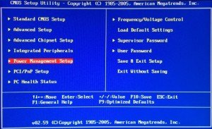
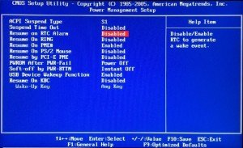
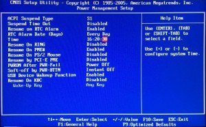
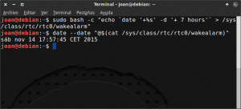
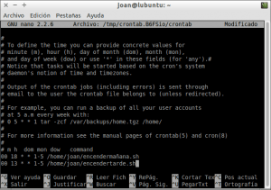
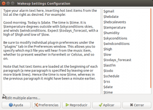
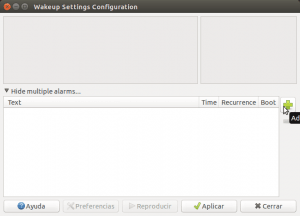
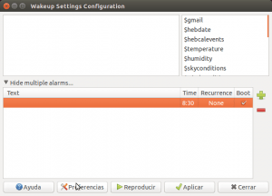
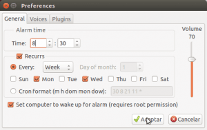
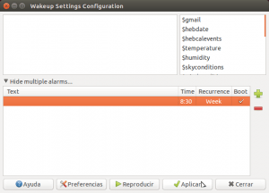

Hace unas semanas vimos varias formas para [programar el apagado del ordenador](). En esta ocasión veremos como podemos programar el encendido del ordenador a una hora determinada.<!--more-->

## UTILIDADES QUE PODEMOS DAR A PROGRAMAR EL ENCENDIDO DEL ORDENADOR

Algunas de las utilidades que puede tener el hecho de programar el encendido del ordenador son las siguientes:

1. En mi caso cuando voy de viaje al extranjero durante varias semanas utilizo mi ordenador como un servidor VPN. Para no tener que tener abierto mi ordenador durante semanas enteras lo que hago es programar el encendido y el apagado de mi ordenador a las horas que más me interesa. De este modo consigo **ahorrar energía**.
2. **Evitar tener que abrir el ordenador en las horas que habitualmente usamos el ordenador**. En el caso que siempre usemos el ordenador cuando lleguemos de nuestro trabajo podemos programar el encendido del ordenador 5 minutos antes de llegar a nuestra casa. En el caso que siempre empecemos a trabajar a las 9 en punto podemos programar el encendido del ordenador a las 9 en punto.
3. Para encender el ordenador y realizar tareas de mantenimiento  y copias de seguridad un día y hora determinados.

## MÉTODO 1: PROGRAMAR EL ENCENDIDO DEL ORDENADOR MEDIANTE LA BIOS

Los pasos para poder programar el encendido del ordenador son sumamente fáciles. Los pasos a seguir son los siguientes:

### Acceder a la BIOS de nuestro ordenador

El primer paso a realizar es acceder a la configuración de la BIOS de nuestro ordenador. Para ello e**n el momento que arranca el ordenador tenemos que presionar la tecla Supr**. Después de presionar la tecla Supr, tal y como se muestra en la captura de pantalla, accederé a la configuración de la BIOS.

[](images/Menú-inicial-de-la-BIOS.jpg)

###### Nota: El proceso para acceder a la configuración de la BIOS varia en función del ordenador que tengamos. Es más que posible que en vuestro caso en vez de presionar la tecla Supr tengáis que presionar otras teclas como por ejemplo Del, F2, F10, Esc, etc.

### Configurar la hora en que queremos que se encienda el ordenador

Una vez dentro de la configuración de la BIOS tenemos que seleccionar la hora en que queremos que se encienda el ordenador. Para ello, tal y como se puede ver en la captura de pantalla anterior, **accedemos a la opción Power Management Setup**. Una vez hayamos accedido dentro de esta opción veremos un contenido parecido al de la siguiente captura de pantalla:

[](images/Activar-RTC-Alarm.jpg)

Seguidamente, tal y como se puede ver en la captura de pantalla, **localizaremos la opción Resume on RTC Alarm y la activaremos**. **Una vez activada** la opción, tal y como se puede ver en la captura de pantalla, **aparecerán los campos RTC Alarm Date (Days) y Time**.

[](images/Hora-que-queremos-encender-el-ordenador.jpg)

Tal y como se puede ver en la captura de pantalla, **en los campos RTC Alarm Date (Days) y Time podemos seleccionar el día y la hora en que queremos que se encienda nuestro ordenador**. En mi caso, tal y como se puede ver en la captura de pantalla, he seleccionado que mi ordenador se encienda todos los días a las 16 horas y 20 minutos y 30 segundos.

###### Nota: El proceso para programar la hora de encendido del ordenador varia en función del ordenador que tengamos. Por lo tanto es posible que en vuestro caso el menú de configuración de la BIOS sea diferente al que se muestra en este post. En el caso de ser así tendréis que buscar las opciones equivalentes en vuestro menú de configuración.

### Guardar los cambios

Una vez finalizada la configuración tan solo tenemos que guardar los cambios realizados y el proceso ha finalizado. Generalmente para guardar los cambios realizados tan solo tenemos que **presionar la tecla F10**.

Una vez guardados los cambios salimos de la configuración de la BIOS y ya podemos iniciar nuestro ordenador de forma habitual.

### Ventajas y limitaciones de este método

El método que acabamos de describir **dispone de 2 aspectos sumamente interesantes** que son los siguientes:

1. Se trata de un método **extremadamente simple**.
2. Se puede aplicar independientemente del sistema operativo que estamos usando. Por lo tanto es una solución **multiplataforma**.

No obstante, el método de programar el encendido del ordenador mediante la BIOS **también presenta limitaciones** importantes. Algunas de ellas son las siguientes:

1. **El menú de configuración de la BIOS para programar el encendido es muy limitado**. El menú solo nos permite iniciar el ordenador todos los días o un día determinado. Por lo tanto esta opción no nos permite programar que nuestro ordenador se inicie todos los días laborales de una semana a las 9 en punto.
2. **Cada vez que queremos programar el encendido del ordenador tenemos que acceder a la BIOS** y esto sin duda es molesto. En Linux podemos solucionar este problema usando el programa nvram-wake que permite programar la hora de encendido de la BIOS desde el sistema operativo, pero en mi caso este software me da problemas y no lo puedo usar.
3. **Cada vez que arrancamos el ordenador tenemos que programar el siguiente encendido**, a no ser que queramos que el ordenador se encienda a diario. Este método no nos permitirá encender y apagar nuestro ordenador varias veces por día.

## MÉTODO 2: PROGRAMAR LA HORA DE ENCENDIDO CON WAKEALARM

Otro método para programar el encendido del ordenador en Linux es mediante [real time clock alarm](https://en.wikipedia.org/wiki/Real-time_clock_alarm "Explicación de lo que es real time clock alarm"). Con este método podremos programar el encendido de nuestro ordenador sin tener que acceder constantemente a la BIOS.

### Programar de forma sencilla el encendido del ordenador con wakealarm

Si queremos programar el inicio del ordenador a una hora determinada lo podemos realizar fácilmente a través de la terminal. Lo primero que tenemos que hacer es **abrir una terminal y teclear el siguiente comando**:

> ```
> sudo sh -c "echo 0 > /sys/class/rtc/rtc0/wakealarm"
> ```

Ejecutando este comando estaremos reseteando la totalidad de encendidos que podamos tener programados.

Una vez reseteados la totalidad de encendidos programados podemos fijar o programar una nueva hora de encendido. Para ello podemos optar por las siguientes opciones:

### Programar el encendido del ordenador después de un determinado tiempo

**Si actualmente son las 12 de la noche y queremos nuestro ordenado se encienda de forma automática a las 7 de la mañana tan solo tenemos que aplicar el siguiente comando**:

> ```
> sudo sh -c "echo `date '+%s' -d '+ 7 hours'` > /sys/class/rtc/rtc0/wakealarm"
> ```

###### Nota: El texto en color rojo es la única parte variable del comando. Es la única parte que deberemos modificar en función de la hora que queramos que se inicie nuestro ordenador.

Lo que hace el comando que acabamos de ejecutar es tan simple como acceder al archivo **/sys/class/rtc/rtc0/wakealarm** para introducir la fecha y la hora en que queremos que se encienda nuestro ordenador.

El significado de cada uno de los términos del comando usado son los siguientes:

**sudo:** El primer término es sudo porque el proceso usado para programar el encendido del ordenador únicamente puede ser realizado por el usuario root.

**sh:** El termino sh se usa para indicar que el comando que aplicaremos para programar la hora de encendido es utilizando uno de los lenguajes que utiliza la terminal de Linux que es bash.

**\-c:** El significado del termino -c indica que la parte del comando que se introduce a posteriori de -c, es el comando que hay que ejecutar en la terminal para programar la hora de encendido.

**“echo \`date '+%s' -d '+ 7 hours'\`:** Esta parte del comando que indica la hora en que queremos que se encienda nuestro ordenador. **Date** indica la hora actual. El término **'+%s'** hace que el formato de la hora introducida sea en segundos tomando como referencia el 1 de Enero de 1970 a las 00:00 horas. La opción **\-d** nos permitirá trabajar con elementos relativos y por lo tanto es la parte del comando que nos permitirá añadir o quitar tiempo respecto la hora actual y finalmente **\+ 7 hours** unido con el comando -d hará que la hora de encendido de nuestro ordenador sea 7 horas respecto la hora actual.

**\> /sys/class/rtc/rtc0/wakealarm":** Finalmente la última parte del comando indica la ruta del archivo en la que hay introducir la hora en que queremos iniciar nuestro ordenador.

Una vez ejecutado el comando el proceso ha finalizado. Como medida de seguridad **para asegurar que hemos introducido bien la hora de encendido, podemos ejecutar el siguiente comando en la terminal**:

> ```
> date --date "@$(cat /sys/class/rtc/rtc0/wakealarm)"
> ```

Tal y como se puede ver en la captura de pantalla, este comando nos tiene que dar la hora en que nosotros hemos programado el inicio del ordenador.

[](images/programar-hora-con-wake-alarm.png)

Si la hora es correcta podemos apagar el ordenador y esperar a que lleguen las 17:57:45 del día 14 Noviembre. Cuando llegue la hora nuestro ordenador se encenderá de forma completamente automática.

### Programar el encendido del ordenador a una determinada fecha

Siguiendo exactamente el mismo procedimiento que acabamos de ver podemos programar el encendido de nuestro ordenador en una fecha concreta.

Para ello lo primero que tenemos que hacer es **abrir una terminal y teclear el siguiente comando para resetear la totalidad de alarmas que tengamos programadas**:

> ```
> sudo sh -c "echo 0 > /sys/class/rtc/rtc0/wakealarm"
> ```

Una vez reseteadas las alarmas programadas, **si queremos que nuestro ordenador se abra el 9 de Noviembre de 2017 a las 17:00 horas** tan solo deberíamos **ejecutar el siguiente comando**:

> ```
> sudo sh -c "echo `date '+%s' -d 'nov 9 17:00:00 2017'` > /sys/class/rtc/rtc0/wakealarm"
> ```

###### Nota: El texto en color rojo es la parte modificada respecto al primer ejemplo que hemos visto.

Una vez ejecutado el comando el proceso ha finalizado. Otras variantes del comando que usamos para programar la hora de encendido del ordenador son las siguientes:

**Para que nuestro ordenador se encienda mañana las 8 de la mañana**:

> ```
> sudo sh -c "echo `date '+%s' -d 'tomorrow 8:00'` > /sys/class/rtc/rtc0/wakealarm"
> ```

### Ventajas e inconvenientes de este método

El sistema que acabamos de ver para programar el enciendo del ordenador presenta los siguientes **puntos fuertes**:

1. Es un método **efectivo** y además es sumamente **fácil y rápido de aplicar**.
2. **No tenemos que acceder a la BIOS** cada vez que necesitamos programar la hora de encendido de nuestro ordenador.

No obstante al igual que el caso anterior también presenta algunas **limitaciones** como por ejemplo las siguientes:

1. Solo es aplicable **para usuarios de GNU-Linux**.
2. **Cada vez que arrancamos el ordenador tenemos que programar el siguiente encendido**. Este método no nos permitirá encender nuestro ordenador varias veces por día de forma automática.

## MÉTODO 3: PROGRAMAR LA HORA DE ENCENDIDO Y APAGADO DEL ORDENADOR CON WAKEALARM Y CRON

Para intentar solucionar los inconvenientes que presentan los métodos 1 y 2, en este apartado comentaremos como podemos programar el encendido del ordenador evitando prácticamente la totalidad de inconvenientes que hemos visto hasta el momento.

La forma de solucionar la totalidad de problemas es combinando [real time clock alarm](https://en.wikipedia.org/wiki/Real-time_clock_alarm "Explicación de lo que es real time clock alarm") (método 2) con Cron. De esta forma conseguiremos automatizar el encendido y el apagado de nuestro ordenador al milímetro. Para ello tenemos que seguir el siguiente procedimiento:

### Elaborar script para automatizar el encendido y apagado del ordenador

En el apartado anterior hemos visto como programar el encendido del ordenador de forma manual. Si queremos automatizar el proceso y programar el ordenador para que se encienda y apague varias veces por día durante los días que queramos podemos usar diferentes Scripts y cron.

Para explicar lo que acabo de comentar lo haremos mediante un ejemplo. Así por lo tanto **nos plantearemos crear un sistema automático que todos los Lunes, Martes, Miércoles, Jueves y Viernes realice las siguientes operaciones en nuestro ordenador**:

1. A las 9 de la mañana se debe iniciar nuestro ordenador.
2. A las 13:05 horas el ordenador se apagará y se volverá a encender a les 15:00 horas.
3. A las 18:05 de la tarde nuestro ordenador se apagará y se encenderá de nuevo a las 9 horas de la mañana del próximo día.

**Para realizar lo que acabo de comentar lo haremos generando 2 scripts**.

El primero de los scripts será para encender el ordenador por la mañana. Para crear el script abrimos la terminal. Justo al abrir la terminal **creamos el archivo** **encendermañana.sh** **ejecutando el siguiente comando en la terminal**:

> ```
> touch encendermañana.sh
> ```

Una vez creado el archivo **lo abriremos ejecutando el siguiente comando en la terminal**:

> ```
> nano encendermañana.sh
> ```

Una vez abierto el archivo con el editor de texto nano **pegaremos el siguiente código**:

> ```
> #!/bin/bash
> sh -c "echo 0 > /sys/class/rtc/rtc0/wakealarm"
> sh -c "echo `date '+%s' -d '+ 15 hours'` > /sys/class/rtc/rtc0/wakealarm"
> shutdown -h 18:05
> ```

El funcionalidad de cada una de las lineas del script es la siguiente:

La primera de las líneas del script es para asegurar que el contenido del fichero que estamos generando se interpretará como un script de bash.

La segunda línea del script resetea cualquier alarma que tengamos preestablecida con anterioridad.

La tercera línea del script hace que el ordenador se encienda una vez hayan pasado 15 horas respecto la hora a la que se ejecuta el script. Como el script se ejecutará a las 18:00 horas implica que la hora en que se encenderá el ordenador será a las 9 de la mañana.

La última línea es para que el ordenador se apague de forma automática a las 18:05 y de la tarde.

Una vez copiado el texto **guardamos los cambios y cerramos el fichero**. **El siguiente paso será otorgar los permisos necesarios para que se pueda ejecutar el script. Para ello ejecutamos el siguiente comando en la terminal**:

> ```
> sudo chmod +x encendermañana.sh
> ```

**Seguidamente repetiremos el mismo proceso con el segundo de los scripts**, para ello abrimos la terminal. Justo al abrir la terminal creamos el archivo **encendertarde.sh** ejecutando el siguiente comando en la terminal:

> ```
> touch encendertarde.sh
> ```

Una vez creado el archivo lo abriremos ejecutando el siguiente comando en la terminal:

> ```
> nano encendertarde.sh
> ```

Una vez abierto el archivo con el editor de texto nano pegaremos el siguiente código:

> ```
> #!/bin/bash
> sh -c "echo 0 > /sys/class/rtc/rtc0/wakealarm"
> sh -c "echo `date '+%s' -d '+ 120 minutes'` > /sys/class/rtc/rtc0/wakealarm"
> shutdown -h 13:05
> ```

El funcionalidad de cada una de las lineas del script es la siguiente:

La primera de las líneas del script es para asegurar que el contenido del fichero que estamos generando se interpretará como un script de bash.

La segunda línea del script resetea cualquier alarma que tengamos preestablecida con anterioridad.

La tercera línea hace que el ordenador se encienda una vez hayan pasado 120 minutos respecto la hora en que se ejecuta el script. Como el script se ejecutará a las 13:00 horas implica que la hora en que se encenderá el ordenador será las 15:00 de la tarde.

Finalmente la última línea es para que el ordenador se apague de forma automática a las 13:05 horas del mediodía.

Una vez copiado el texto guardamos los cambios y cerramos el fichero. El siguiente paso será otorgar los permisos necesarios para que se pueda ejecutar el script. Para ello ejecutamos el siguiente comando en la terminal:

> ```
> sudo chmod +x encendertarde.sh
> ```

### Programar los encendidos y apagador del ordenador con Crontab

Una vez generados los scripts tan solo tenemos que programar la hora en que queremos que se ejecuten. Para ello **utilizaremos cron ejecutando el siguiente comando en la terminal**:

> ```
> sudo crontab -e
> ```

Una vez abierto el editor de texto tenemos que **editar el contenido del fichero crontab para ejecutar los scripts de encendido y apagado** del ordenador que hemos realizado.

La estructura a usar para programar la ejecución de los scripts es la siguiente:

> ```
> m h dom mon dow ruta_del_script
> ```

Cada una de las partes de este comando la tendréis que reemplazar por los siguientes términos:

**m:** Reemplazar m por un número entre el **0** y el **59**. Este número indica el minuto en el que queremos que se ejecute el script que queremos ejecutar.

**h:** Reemplazar h por un número entre el **0** y el **23**. Este número indica la hora en la que queremos que se ejecute el script que queremos ejecutar.

**dom:** Reemplazar dom por un número entre el **1** y el **31**. Este número indica el día del mes en el que queremos que se ejecute el script que queremos ejecutar. Si queremos que nuestro script se ejecute todos los días del mes hay que reemplazar m por un \*. Si queremos que nuestro ordenador solo se encienda los días 10 y 20 deberemos reemplazar la letra m por 10, 20, etc.

**mon:** Reemplazar mon por un número entre el **1** y el **12**. Este número indica el número de mes en el que queremos que se ejecute nuestro script. Si queremos que nuestro script se ejecute todos los meses hay que reemplazar mon por un \*

**dow:** Reemplazar dow por un número entre el **0** y el **6**. Este número indica el día de la semana en el que queremos que se ejecute el script. Si escribimos un cero se ejecutará el domingo y si escribimos un 6 se ejecutará el sábado. Si queremos que el script se ejecute todos los días deberemos reemplazar dow por un \*. Si queremos que el script se ejecute todos los días de la semana a excepción del Sábado y del Domingo escribiremos 1-5.

**ruta\_del\_script:** Esta parte del comando simplemente hay que reemplazarla por la ruta del script que queremos ejecutar.

Por lo tanto si queremos que se ejecuten los scripts, tal y como se puede ver en la captura de pantalla, tenemos que **introducir los siguientes comandos dentro del archivo crontab**:

> ```
> 00 18 * * 1-5 /home/joan/encedermañana.sh
> ```
> 
> ```
> 00 13 * * 1-5 /home/joan/encendertarde.sh
> ```

[](images/Programar-ejecucón-de-los-scripts-en-Cron.png)

###### Nota: En este apartado hay que tener en cuenta que la hora de ejecución de los scripts tiene que estar en consonancia con las horas de encendido y apagado que hemos usado en los scripts. Si no es así el ordenador no se encenderá ni apagará cuando nosotros queramos.

Una vez editado el fichero **guardamos los cambios y cerramos el fichero**. Para que los cambios surjan efecto tenemos que **reiniciar el servicio cron. Para ello ejecutamos el siguiente comando en la terminal**:

> ```
> sudo service cron restart
> ```

Una vez realizados estos pasos, el proceso ha terminado y podemos estar seguros que todos los días de Lunes a Viernes nuestro ordenador se encenderá y apagará en las horas que hemos indicado en el inicio de este apartado.

### Ventajas e inconvenientes de este método

Aplicando el método que acabamos de ver **soluciona**mos **prácticamente la totalidad de inconvenientes de los métodos anteriores**. Así por lo tanto este método nos proporcionará las siguientes ventajas:

1. Podemos **programar la hora de encendido** de nuestro ordenador **sin** tener que **acceder a la BIOS**.
2. De una sola tacada podemos programar todos los días que queremos que se encienda nuestro ordenador. Por lo tanto **no es necesario que en cada reinicio del ordenador estemos pendientes de programar el siguiente inicio**.
3. **Aparte de programar el encendido del ordenador podemos realizar muchísimas más acciones**, como por ejemplo apagar el ordenador a una hora determinada. Para incluir las acciones adicionales tan solo tenemos que introducir el código adecuado en cada uno de los scripts que hemos generado.

**Como contrapartida este método es más complicado y laborioso de implementar** en comparación con los métodos anteriores. Además este método únicamente es aplicable en sistemas operativos GNU-Linux.

## MÉTODO 4: PROGRAMAR LA HORA DE ENCENDIDO MEDIANTE UNA INTERFAZ GRÁFICA

**En el caso que prefiráis programar la hora de encendido mediante una aplicación gráfica** también **tenemos** alternativas disponibles. El software que en mi caso he probado y me ha funcionado a la perfección es **wakeup**.

Wakeup tiene otras utilidades aparte de programar el encendido del ordenador. Wakeup es también un software que sirve para programar alarmas a horas concretas. En el momento de activarse la alarma, el programa permite que se ejecuten ciertas acciones como por ejemplo:

1. Que se nos de información meteorológica.
2. Que se nos cuenten los emails nuevos de nuestra cuenta de gmail.
3. Que se reproduzca un sonido o cualquier fichero mp3.
4. etc.

Por lo tanto si queremos también podremos usar wakeup como despertador, ya que cuando se enciende el ordenador podemos ordenar que se reproduzca nuestra canción preferida.

### Instalar Wakeup

Para instalar wakeup tan solo hay que **abrir una terminal y ejecutar el siguiente comando**:

> ```
> sudo apt-get install wakeup
> ```

###### Nota: En el caso que los repositorios de vuestra distribución no disponga del software wakeup, podéis descargar el paquete binario o el código fuente desde el siguiente [enlace](https://launchpad.net/wakeup "Web de descarga de wakeup").

Una vez instalado wakeup tan solo tenemos que **abrirlo y empezar a programar la hora** en que queremos que se encienda nuestro ordenador.

### Programar la hora de encendido del ordenador con wakeup

Una vez abierto el software wakeup, nos encontraremos con la siguiente ventana:

[](images/Editar-las-alarmas.png)

En esta ventana, tal y como se puede ver en la captura de pantalla, tenemos que **clicar encima de la opción** **Edit multiple alarms**. Una vez clicada la opción aparecerá la siguiente pantalla:

[](images/Añadir-un-alarma.png)

En esta pantalla, tal y como se puede ver en la captura de pantalla, tenemos que **presionar el símbolo +**. Una vez presionado el símbolo +, tal y como se puede ver en la captura de pantalla, **se programará una alarma de forma completamente automática**.

[](images/Ajustar-configuración-de-la-alarma.png)

Una vez introducida la alarma **la seleccionamos y seguidamente**, tal y como se puede ver en la captura de pantalla, **presionamos en el botón** **Preferencias**. Después de presionar le botón de preferencias **aparecerá la siguiente ventana en la que tendremos diversas formas de programar la hora de encendido de nuestro ordenador**.

[](images/Seleccionar-la-hora-de-encendido-del-ordenador.png)

###### Nota: Por vuestra cuenta podéis mirar y probar las diferentes opciones que proporcionan la pestaña Voices y Plugins. En las pestañas Voices y Plugins podréis personalizar acciones que se ejecutaran una vez se inicie la alarma.

Tal y como se puede ver en la captura de pantalla, en mi caso he programado que el ordenador se encienda todos los Lunes y Martes a las 8 horas y 30 minutos. **Es importante que una vez fijada la hora de encendido tildéis la celda** **Set computer to wake up for alarm (Requires root permission)**. Una vez realizados estos pasos, tal y como se puede ver en la captura de pantalla, tan solo tenemos que **apretar** encima d**el botón Aceptar**. Una vez apretado el botón aceptar aparecerá la siguiente pantalla:

[](images/Aplicar-la-alarma.png)

En estos momentos si queremos crear una nueva alarma deberemos repetir de nuevo los pasos que acabamos de llevar a término. Si por lo contrario tenemos todas las alarmas programadas, tal y como se puede ver en la captura de pantalla, tendremos que **presionar encima del botón** **Aplicar**.

Una vez presionado el botón Aplicar el proceso a terminado. En estos momentos podemos cerrar el ordenador y podemos estar seguros que la totalidad de Lunes y Miércoles nuestro ordenador se abrirá a las 8 horas y 30 minutos.

### Ventajas e inconvenientes de este método

El último de los métodos que hemos visto en este post **presenta la gran ventaja de poder programar la totalidad de inicios que queramos de forma gráfica y sencilla**. Para quien no quiera complicarse la vida y quiera una solución polivalente sin duda es una muy buena opción.

No obstante aunque es una solución muy práctica, si la comparamos con el método 3, veremos que **presenta limitaciones por el mero hecho de depender de una GUI**.

Mientras que con el método 3 podemos realizar absolutamente lo que queramos introduciendo el código adecuado en los scripts, en el método 4 **solo podemos realizar las acciones que nos permite realizar la GUI que ha diseñado el programador**.

## OTROS MÉTODOS PARA PROGRAMAR EL ENCENDIDO DEL ORDENADOR

En este post se presentan distintas formas para poder programar el inicio de nuestro ordenador para que cada uno use la forma que más le convenga. No obstante aún existen opciones adicionales no comentadas en el post como por ejemplo usar otras aplicaciones de terceros o programar un script.

En el caso que alguien proponga un método alternativo interesante puedo escribir un post sobre ello.
