En el siguiente post veremos como podemos programar el envío de emails con el gestor de correo electrónico Thunderbird. Pero antes de explicar como hacerlo citaremos algunas de las ventajas que nos proporciona el hecho de poder programar el envío de emails a determinadas horas especificas.<!--more-->

## UTILIDADES DE PROGRAMAR EL ENVÍO DE EMAILS

El hecho de enviar un correo electrónico a una persona, o grupo de personas, a una hora y día determinados puede tener ciertas utilidades. Algunas de las que se me ocurren en este momento son las siguientes:

1. **Si sabemos que el destinatario de nuestro email llega a la oficina a las 9 de la mañana, es recomendable programar el envío del email alrededor de las 9 de las nueve de la mañana**. Si lo enviamos el día antes es más que posible que nuestro mail pase desapercibido por lo muchos otros emails que habrán en la bandeja de entrada del destinatario del correo.
2. **En el momento de terminar un trabajo/informe que se tiene que entregar por email a un determinado día y hora, ya podemos programar tranquilamente el envío**. De esta forma evitaremos tener que recordar que un determinado día a una determinada hora tenemos que realizar el envío de este trabajo/informe.
3. Es posible que en determinados casos tengamos que enviar un email a una hora poco habitual como puede ser la madrugada. **Si no queremos que el receptor del email sepa que le hemos enviado el email a las 3 de la madrugada**, podemos programar el envío del email para las 9 de la mañana cuando posiblemente estemos durmiendo.
4. Si sois de las personas que acostumbra a enviar mails por accidente mientras los estáis redactando, o una vez enviados los emails os lamentáis de lo que habéis puesto y os gustaría cambiar el contenido, **podéis hacer que los emails se envíen 15 minutos después de presionar el botón Enviar. De esta forma si queréis podréis cancelar el envío, modificar el contenido y enviar el email de nuevo**.
5. Para **programar el envío de un mailing a una hora en la que los servidores de correo electrónico estén menos saturados**, **o a una hora en la que consideremos que se maximice la tasa de apertura** del mailing enviado, etc. Para ver como programar el envío de un mailing con Thunderbird pueden consultar el siguiente enlace.
6. Para **programar el envío de las felicitaciones de cumpleaños de nuestros conocidos, amigos, clientes, etc**. De esta forma en unos pocos minutos podremos programas las felicitaciones de nuestros conocidos para todo un año. Además podremos hacer que estas felicitaciones se envíen de forma periódica año tras año.

Una vez expuestas las principales ventajas que puede tener el hecho de programar el envío de un email, ahora veremos los pasos que tenemos que realizar para llevarlo a término.

## INSTALAR LA EXTENSIÓN ENVIAR MÁS TARDE

El primer paso a realizar es instalar la extensión [Enviar más tarde](https://addons.mozilla.org/es/thunderbird/addon/send-later-3/ "Web de descarga de la extensión enviar más tarde") para poder programar el envío de los emails.

Para poder instalarla **accedéis al menú** **Herramientas** de vuestro gestor de correo Thunberbird. Una vez abierto el menú Herramientas se desplegará un submenú en el que tendréis que **seleccionar la opción** **Complementos**.

Seguidamente se abrirá una pestaña para administrar los complementos. Para instalar Enviar más tarde, tal y como se puede ver en la captura de pantalla, **accedemos al cuadro de búsqueda**, **escribimos el nombre del complemento**, que en nuestro caso es **Enviar Más Tarde**, y **presionamos la tecla** **Enter**.

[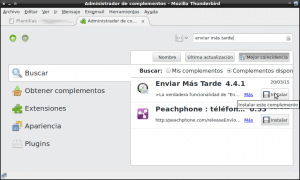](images/3-Instalar-enviar-mas-tarde.png)

Después de presionar Enter se realizará la búsqueda de la extensión. **Una vez encontrada**, tal y como se muestra en la captura de pantalla, **presionamos el botón** **Instalar** y la extensión se instalará.

Una vez instalada la extensión, cerramos Thunderbird y lo volvemos a abrir.

## PROGRAMAR EL ENVÍO DE UN EMAIL

Una vez instalada la extensión enviar más Tarde, el proceso de programar el envío de los emails es sumamente fácil. Tal y como se puede ver en la captura de pantalla, tan solo tenemos que redactar el email que queremos enviar.

[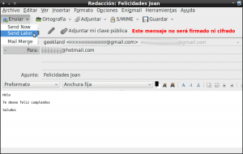](images/3-Enviar-con-Send-Later.png)

Una vez redactado el email. Tal y como se puede ver en la captura de pantalla, **clicamos encima de la flechita del botón** **Enviar**, **y justo después seleccionamos la opción** **Send Later**.

Al presionar encima de la opción Send Later aparecerá la siguiente ventana para programar el envío de nuestro email:

[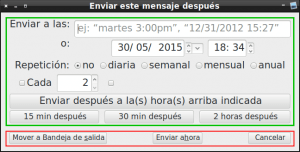](images/4-Ventana-de-programación-de-los-emails.png)

###### Nota: Existen formas alternativas de acceder al menú para programar el envío de emails. Una de ellas es acceder al menú Archivo y clicar encima de la opción Enviar más tarde. Otra forma es presionar la combinación de teclas Ctrl+Mayús+Enter una vez redacto el email.

Las distintas opciones que tenemos para programar el envío de nuestro emails son las siguientes:

### Enviar un email 15 minutos, 30 minutos o 2 horas después de dar la orden de envío

**Si queremos que el email se envié 15 minutos después de dar la orden de envío**, tal y como se puede ver en la captura de pantalla, tan solo tenemos que **clicar encima del botón** **15 min después**:

[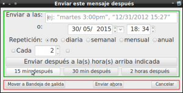](images/5-Enviar-un-email-15-minutos-después.png)

**Si queremos que el email se envíe 30 minutos después de dar la orden de envío**, tan solo tenemos que **presionar en el botón** **30 min después**.

**Si queremos que el email se envíe 2 horas después de dar la orden de envío**, tan solo tenemos que **presionar en el botón 2 horas después**.

Una vez hayamos presionado sobre uno de los tres botones, nuestro email, tal y como se puede en la captura de pantalla, quedará almacenado la carpeta de borradores.

[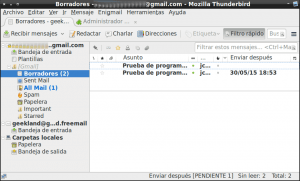](images/6-Mail-pendiente-de-envío-en-la-carpeta-borradores.png)

Ahora tan solo tenemos que esperar que llegue la hora del envío. Una vez haya llegado la hora del envío, el email se enviará de forma automática.

###### Nota: Los tiempos predeterminados para el envío rápido de los emails son 15 minutos, 30 minutos y 2 horas. Si queréis modificar estos tiempos, lo podéis hacer tal y como se indica en el apartado de modificar las preferencias de enviar más tarde.

### Programar el envío del email a un día y hora determinados

Otra de las opciones que tenemos es hacer que un email se envíe a un día y a una hora determinada. Por ejemplo **si queremos que nuestro email se envíe el 2 de Junio del año 2015 a las 7 horas y 32 minutos, tan solo tenemos aplicar la configuración que se puede ver en la siguiente captura de pantalla**:

[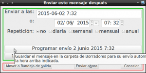](images/7-Programar-email-a-un-día-y-hora.png)

Una vez seleccionados el día y la hora, tal y como se puede ver en la captura de pantalla, tan solo tenemos que **presionar encima del botón Programar envío 2 junio 2015 7:32**.

Una vez presionado el botón, nuestro email se almacenará en la carpeta de borradores a la espera que llegue el día 2 de Junio de 2015 a las 7:32 horas. Cuando llegue el día y la hora, el email se enviará de forma automática.

### Programar el envío del email a un día y hora determinados y con una determinada periodicidad

**Si queremos que un email se envíe todos los años a un día y a una hora determinada, tan solo tenemos que aplicar la configuración que se muestra en la siguiente captura de pantalla**:

[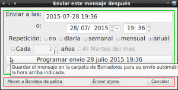](images/8-Programar-un-email-con-periodicidad1.png)

Una vez aplicada la configuración, tan solo tenemos que **presionar encima del botón Programar envío 2 junio 2015 7:32**.

Una vez presionado el botón, nuestro email quedará permanentemente almacenado en la carpeta de borradores. Cada 28 Julio a las 19:36 horas se procederá al envío automático del email que tenemos almacenado en nuestra carpeta de borradores.

### Programar el envío del email a un día y hora determinados y con una determinada periodicidad (ejemplo 2)

**Si queremos enviar un email el día 30/05/2015 a las 18:39, y que a partir de este día y fecha se reenvie el email cada 2 semanas, tenemos que aplicar la configuración que se muestra en la siguiente captura de pantalla**:

[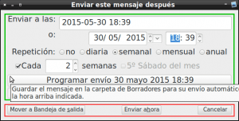](images/9-Enviar-un-email-cada-2-semanas.png)

Una vez aplicada la configuración, tan solo tenemos que **presionar en el botón** **Programar envío 30 mayo 2015 18:39**.

Una vez presionado el botón, nuestro email quedará permanentemente almacenado en la carpeta de borradores. A partir del 30 de mayo de 2015 a las 18:39 horas, nuestro email se irá enviando cada 2 semanas a las personas destinatarias del email.

### Otras opciones que ofrece la ventana de programación de envío de emails

En la parte inferior de la ventana de programación de los emails, aparecen los botones de **Mover a Bandeja de salida**, **Enviar ahora** y **Cancelar**. La función de cada uno de estos botones es la siguiente:

**Mover a la Bandeja de salida:** **Si presionamos encima del botón** **Mover a la Bandeja de salida**, no se programará ningún envío. Lo que pasará es que **nuestro email**, en vez de ir a la carpeta de borradores, **se ubicará en la bandeja de salida de nuestro correo**. Para enviar los mensajes almacenados en la bandeja de salida tendremos que acceder al menú **Archivo** y posteriormente clicar encima de la opción **Procesar mensaje no enviados**.

**Enviar ahora:** Si presionamos el botón **Enviar ahora**, el mensaje **se enviará automáticamente como si enviáramos un email de forma habitual**. No se programará ningún envío.

**Cancelar:** Si presionamos el botón **Cancelar**, **cancelaremos la programación del envío y volveremos a la ventana de edición del email** para que lo podamos modificar o eliminar.

### Advertencia sobre los emails con fecha de envío programada

Una vez programado el envío del correo, tan solo hay que esperar que llegue el día y la hora del envío. **En el día y en la hora del envío nuestro gestor de correo Thunderbird tiene que estar abierto para que se envíe el correo**. Si lo tenemos cerrado el correo no se enviará. En el caso de no enviarse, cuando abramos Thunderbird los correos pendientes de enviar se enviarán automáticamente.

## MODIFICAR LAS PREFERENCIAS DE ENVIAR MÁS TARDE

Con lo expuesto hasta el momento, es más que suficiente para sacar partido de la programación del envío de emails con Thunderbird y la extensión Enviar más tarde. No obstante quien lo desee puede personalizar ciertos aspectos de la extensión Enviar más tarde.

### Opciones de configuración

Para acceder a las opciones de configuración de la extensión Enviar más tarde, tenemos que **acceder al menú** **Herramientas**. Dentro del menú Herramientas tenemos que **clicar en la opción** **Complementos**.

Una vez hemos clicado en la opción Complementos se abrirá la pestaña de administración de Complementos. En la pestaña de administración de complementos **clicamos en el apartado** **Extensiones**. **Localizamos la extensión Enviar más Tarde y presionamos el botón Preferencias**. Al presionar el botón preferencias aparecerá la siguiente ventana:

[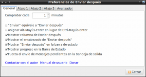](images/10-Modificar-preferencias-de-enviar-después.png)

En la ventana de preferencias disponemos de varias pestañas. **En la pestaña** **General** **podemos modificar los siguientes parámetros:**

**Comprobar cada:** En este campo tenemos seleccionar la frecuencia con la que la extensión Enviar después chequea los emails pendientes de envío. En principio la opción ideal seria que lo hiciera cada minuto.

**“Enviar” equivale a “Enviar después”:** Si activamos esta opción, cada vez que enviemos un email se activará la extensión Enviar después y nos aparecerá la ventana para programar el envío sin tener que realizar absolutamente nada.

**Asignar Alt-Mayús-enter en lugar de Ctrl-Mayús-Enter:** Una vez redactado el email, podemos presionar la combinación de teclas **Ctrl-Mayús-Enter** para que aparezca la ventana para programar el envío del email. Si activamos esta opción cambiaremos la combinación de teclas de **Ctrl-Mayús-Enter** a **Alt-Mayús-Enter**.

**Mostrar columna de enviar después:** Si activamos esta opción, cuando entremos en la carpeta borradores, aparecerá una columna que nos indica la fecha en que se enviarán los correos que tenemos programados y almacenados en la carpeta Borradores.

**Mostrar encabezado de enviar después:** En el caso de desactivar esta opción, si miramos el código fuente de los mensajes pendientes de envío almacenados en la carpeta borradores, no encontraremos ningún rastro de la extensión Enviar después en las cabeceras del email.

**Mostrar “Enviar después” en la barra de estado:** Si activamos esta opción, en la barra de estado ubicada en la parte inferior de la ventana de Thunderbird aparecerá información relacionada con el estado de la extensión Enviar más tarde, como por ejemplo si está la extensión activa, inactiva, los mensajes programados pendientes de enviar, etc.

**Mostrar progreso en la barra de estado:** Si activamos esta opción, en la barra de estado de Thunderbird aparecerá una barra de estado que nos mostrará de forma gráfica si se han enviado todos los mensajes, si se están realizado comprobaciones para ver si hay mensajes pendientes de envío, etc. Para que la barra de estado aparezca, también tendréis que tener activada la propiedad (Mostrar “Enviar después” en la barra de estado)

**Fuerza el envío de mensajes pendientes en la Bandeja de salida:** Si tenemos activada esta opción, en el momento que llega la hora de enviar los emails, los mensajes pasan de la carpeta Borradores a la Bandeja de salida y se envían automáticamente. Si desactivamos esta opción, cuando llegue la hora de enviar estos mensajes, los emails pasan de la carpeta borradores a la carpeta bandeja de Salida pero no se enviarán. Entonces para enviarlos deberemos hacerlo manualmente accediendo al menú **Archivo** y clicando sobre la opción **Procesar mensajes no enviados**.

**Si examinamos las pestañas** **Atajo 1**, **Atajo 2** y **Atajo 3 encontraremos las siguientes opciones** (**Etiqueta de botón** y **Minutos**):

[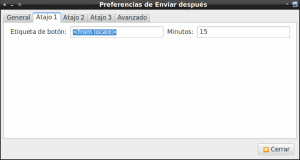](images/11-Modificar-preferencias-de-los-atajos.png)

La opción **Etiqueta de botón** **es para definir el texto que queramos que tengan los botones de envío rápido** que aparecen en la ventana de programación de los emails:

[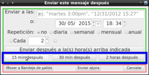](images/12-Botones-de-envío-rápido.png)

El valor predeterminado de la extensión se obtiene escribiendo el texto <from locale> . Si queremos modificar el texto que aparece en el botón tan solo tenemos que sustituir <from locale> por el texto que queramos.

Para finalizar, en **la opción** **Minutos** tenemos que seleccionar **el tiempo en minutos que queremos que transcurra desde que presionamos el botón de envío rápido que estamos configurando, hasta que se envía el email.**

### Personalizar la barra de herramientas

Si lo deseamos podemos personalizar la barra de herramientas de Thunderbird incluyendo botones de la extensión Enviar más tarde. Para ello, tal y como se puede ver en la captura de pantalla, en la ventana de redacción del email, **presionamos el botón derecho del mouse sobre la barra de herramientas y seguidamente seleccionamos la opción** **Personalizar...**

[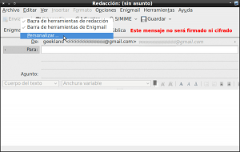](images/13-Personalizar-barra-de-herramientas.png)

Después de presionar el botón personalizar, aparecerá la ventana modificar barra de herramientas. Una vez aparezca, tal y como se puede ver en la captura de pantalla, tan solo tendremos que **arrastrar los elementos que queramos encima de nuestra barra de herramientas**.

[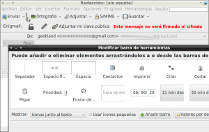](images/14-Arrastrar-iconos-en-la-barra-de-herramientas.png)

###### Nota: En el caso que alguien precise información adicional acerca del funcionamiento de Thunderbird y la extensión Enviar mas tarde, le recomiendo que visite el siguiente [enlace](http://blog.kamens.us/send-later/ "Información adicional sobre la extensión enviar más tarde").
