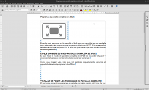
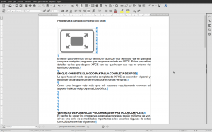

En este post veremos un tip sencillo y fácil que nos permitirá ver en pantalla completa (Fullscreen en inglés) cualquier programa que tengamos abierto en XFCE. Estos pequeños detalles de los que dispone XFCE son los que hacen que sea mi entorno de escritorio preferido.<!--more-->

## EN QUE CONSISTE EL MODO PANTALLA COMPLETA DE XFCE

Lo que hace el modo de pantalla completa de XFCE es **esconder el panel y la barra que contiene los botones de las ventanas**.

Como una imagen vale más que mil palabras, en la siguiente captura de pantalla podemos ver el aspecto habitual del programa LibreOffice:

Si en estos momentos ponemos Libreoffice en modo pantalla completa visualizaremos lo siguiente:

## VENTAJAS DE PONER LOS PROGRAMAS A PANTALLA COMPLETA

El hecho de poner los programas a pantalla completa ofrece una serie de comodidades importantes a los usuarios. Algunas de estas comodidades son las siguientes:

1. Es útil para pantallas pequeñas ya que **nos ayuda a ahorrar espacio de pantalla**.
2. En cualquier monitor nos ayudará a **visualizar los elementos de los programas más grandes**.
3. Nos permite ser más productivos ya que en ningún caso nos molestaran los bordes de las ventanas y el panel de XFCE. Por lo tanto **nos podremos concertar más en lo que estamos haciendo**.
4. Combinando el modo pantalla completa juntamente con los escritorios virtuales nos permite **cambiar entre aplicaciones de una forma fácil y cómoda** mediante atajos de teclado.

## COMO ACTIVAR Y DESACTIVAR EL MODO PANTALLA COMPLETA

Activar y desactivar el modo de pantalla completa es sumamente fácil.

**Si queremos poner cualquier programa a pantalla completa** tan solo tenemos que **presionar** la combinación de teclas **Alt + F11**.

Una vez en modo pantalla completa **podemos salir del modo volviendo a presionar** la combinación de teclas **Alt + F11**.

Por lo tanto simplemente presionando dos teclas de forma simultanea podremos pasar de un modo a otro modo de forma fácil.

También tenemos que tener en cuenta que **hay programas que de por si traen implementado un modo de pantalla completa, por lo tanto en estos programas podemos obtener el modo pantalla completa en la totalidad de entornos de escritorios Linux**. Ejemplo de estros programas son los siguientes:

**Firefox y Chrome:** Se puede activar y desactivar presionando la tecla **F11**. **Libreoffice:** Se puede activar y desactivar presionando la combinación de teclas **Ctrl + Mayús + J**. **Gedit, Mousepad:** Se puede activar y desactivar presionando la tecla **F11**. **VLC:** Se puede activar y desactivar presionando la tecla **F11**. **Banshee:** Se puede activar y desactivar presionando la tecla **F**. **etc.**..

###### Nota: El modo de pantalla completa nativo de Chrome me parece totalmente inútil. No se si se tratará de un bug, pero la realidad es que no te deja ni escribir y por lo tanto únicamente lo puedes usar cuando te quieres centrar en leer algo.

## ¿FUNCIONA EN OTROS ENTORNOS DE ESCRITORIO?

**El tip** citado en este post también **funciona en otros entornos de escritorio diferentes a XFCE**. En mi caso también me ha funcionado en los siguientes entornos de escritorio:

1. **LXDE** en la distribución Debian.
2. **LXDE** en la distribución Ubuntu.
3. **IceWM** en la en la distribución AntiX

###### Nota: IceWM no se trata de un entorno de escritorio. Se trata de de un gestor de ventanas.

También **hay otros entornos de escritorio en los que este tip no funciona como por ejemplo**:

1. **Gnome Shell** en la distribución Debian.

En este apartado solo menciono los entornos de escritorio que acostumbro a usar y tengo disponibles en mi ordenador. Agradecería a los lectores de este post que reportaran si el tip funciona en su entorno de escritorio y de este modo podría ampliar este apartado.

## ABRIR UN PROGRAMA A PANTALLA COMPLETA DE FORMA PREDETERMINADA

**En el caso de que haya un programa que lo queramos abrir directamente en pantalla completa sin tener que presionar Alt+F11** también lo podemos realizar. Para ello les recomiendo que **sigan las instrucciones que se detallan en el siguiente post**:

https://geekland.eu/configurar-el-comportamiento-de-las-ventanas-con-devilspie/

Las instrucciones mencionadas en el post que acabo de recomendar también serán útiles para disponer de un modo de pantalla completa en cualquier entorno de escritorio. Saludos y hasta la próxima.
