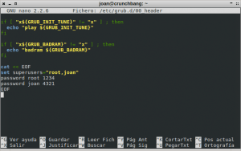
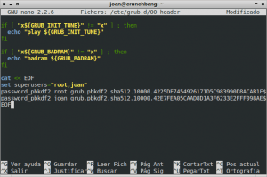

En este post veremos de forma clara y sencilla como podemos proteger el Grub de nuestro ordenador con una contraseña cifrada, y en que casos y porqué motivos se recomienda la protección del gestor de arranque Grub.

El proceso para proteger el Grub varia sensiblemente a partir de la versión 2.0 del Grub. No obstante en este post explicaremos como proteger el grub tanto para versiones inferiores a la 2.0 como para versiones superiores a la 2.0.<!--more-->

## ¿QUÉ ES EL GRUB?

De buen seguro los lectores que en estos momentos estén leyendo este post sabrán sobradamente y mejor que yo que es el Grub. No obstante como nota introductoria al post me parece interesante explicar brevemente que es el Grub.

El Grub, (Grand Unified Bootloader), **es un gestor de arranque múltiple** desarrollado inicialmente para el sistema GNU Hurd. El gestor de arranque grub **tiene varias funciones, pero sin duda su misión principal es permitirnos seleccionar el sistema operativo que queremos usar** justo en el momento de arrancar nuestro ordenador.

En este post no pretendo tampoco entrar en tecnicismos acerca del funcionamiento del Grub. Si alguna vez lo hago escribiré un post especifico para ello. Si alguien precisa más información acerca del gestor de arranque Grub puede consultar el siguiente [enlace](https://es.wikipedia.org/wiki/GNU_GRUB "Información adicional del gestor de arranque Grub").

## MOTIVOS PARA PROTEGER EL GRUB

Hay gente que realmente se toma molestias para evitar accesos no autorizados a su ordenador a través de permisos de usuarios, de firewalls, de contraseñas, etc. A pesar de esto muchos de estos usuarios olvidan proteger el Grub. Si el Grub de nuestro equipo no está protegido cualquier usuario con un nivel medio/bajo puede realizar las siguientes acciones:

1. Editando los parámetros del Grub es fácil **acceder a nuestro ordenador como superusuario o usuario root**. Si un atacante puede acceder a nuestro equipo como usuario root tendrá el control total del equipo y de la información almacenada en él.
2. Sin necesidad de introducir ningún usuario ni contraseña un atacante puede **abrir un interprete de ordenes para intentar recabar información de nuestro equipo**, para modificar configuraciones, etc.
3. En el caso de tener el control sobre el Grub, podemos **prevenir que ciertos usuarios puedan usar sistemas operativos inseguros**, o sistemas operativos que simplemente no queremos que se usen.

En definitiva, si no protegemos el Grub, estaremos dejando un agujero de seguridad muy grande a la totalidad de personas que tengan acceso directo a nuestro ordenador. Este agujero de seguridad permitirá al atacante hacerse con el control absoluto de nuestro equipo de forma muy fácil y rápida.

## CASOS EN LO QUE SE ACONSEJA PROTEGER EL GRUB

Bajo mi punto de vista, no es necesario que el cien por cien de usuarios protejan el Grub ni sigan las recomendaciones de seguridad que se mencionan en este post. No obstante es recomendable que en los siguientes casos se tomen medidas de seguridad para proteger el Grub:

1. **En entornos laborales y profesionales.**
2. En situaciones **en** los que **un equipo es compartido por varias personas**.
3. **En el caso que usemos un ordenador portátil**, y no lo tengamos permanente en casa usándolo como un ordenador de sobremesa.
4. **En el caso que a menudo tengamos que dejar nuestro equipo informático desatendido** en lugares donde transiten personas conocidas/desconocidas.

###### Nota: En principio un usuario con un ordenador de sobremesa que no sale de su casa no tiene necesidad de proteger el Grub. No obstante si lo hace estará añadiendo una capa de seguridad adicional a su equipo.

## COMO PROTEGER EL GRUB

El modo de proteger el Grub será mediante una contraseña o password. Si aplicamos los pasos detallados en este apartado conseguiremos los siguientes resultados:

1. Bloquear el acceso a la línea de comandos del Grub.
2. Bloquear la posibilidad de edición de las entradas del Grub.
3. Bloquear la posibilidad de ejecución de todas las entradas del Grub.

Para obtener los resultados que acabamos de mencionar, tenemos que realizar los siguientes:

### PASO 1: Hacer una copia de seguridad de los archivos de configuración

Antes de empezar a modificar la configuración del Grub tenemos que tomar ciertas precauciones. Para ello antes de iniciar todo el proceso realizaremos copias de seguridad de la totalidad de archivos que vamos a modificar. **Para hacer las copias de seguridad abrimos una terminal y ejecutamos los siguientes comandos:**

> ```
> sudo cp /boot/grub/grub.cfg ~/grub.cfg.old
> ```

> ```
> sudo cp /etc/grub.d/00_header ~/00_header.old
> ```

> ```
> sudo cp /etc/grub.d/10_linux ~/10_linux.old
> 
> ```

> ```
> sudo cp /etc/grub.d/30_os-prober ~/30_os-prober.old
> 
> ```

Estos tres comandos generarán una copia de seguridad de los archivos ****grub.cfg****, ****00\_header****, ****10\_linux**** y ****30\_os\_prober**** en nuestra partición home.

**También se aconseja disponer de un liveCD o liveUSB para poder restaurar las copias de seguridad que acabamos de realizar**. El liveCD será necesario, porqué si realizamos alguno de los pasos de forma incorrecta, es posible que nuestro sistema operativo no arranque. Para realizar un liveCD o un LiveUSB pueden seguir los pasos que se detallan en el siguiente [enlace]().

### Paso 2: Definir los usuarios y las contraseñas de los usuarios que podrán modificar el Grub

Para definir los usuarios y las contraseñas de los usuarios, que podrán usar la línea de comandos del grub, y ejecutar y editar las entradas del grub, tenemos que **abrir una terminal y ejecutar el siguiente comando:**

> ```
> sudo nano /etc/grub.d/00_header
> 
> ```

Una vez abierto el editor de textos nano, vamos al final del archivo y tenemos que **añadir la lista de usuarios y de contraseñas añadiendo el siguiente texto:**

> ```
> cat << EOF
> set superusers="root,joan"
> password root 1234
> password joan 4321
> EOF
> ```

Como se puede ver en este texto hemos definido 2 usuarios. El usuario root y el usuario joan. Cada uno de estos usuarios tendrá respectivamente las contraseñas 1234 y 4321. Las partes en color rojo son las que vosotros tenéis que adaptar en función de los usuarios que queráis crear y las contraseñas que queráis establecer.

Por si a alguien le queda algún tipo de duda de como debería quedar este archivo después del paso 2, les dejo la siguiente captura de pantalla:

[](images/Usuarios-y-contraseña-creadas.png)

Una vez definidos los usuarios y las contraseñas ya podemos **guardar los cambios.**

###### Nota: Los usuarios que definamos en este apartado pueden ser completamente diferentes a los usuarios del sistema. En mi caso los usuarios que he creado son root y joan. Cada uno de los usuarios va separado por una coma.

###### Nota: Los passwords o contraseñas que fijamos para cada uno de los usuarios creados no tienen porqué tener relación alguna con los passwords de los usuarios del sistema. En mi caso, a modo de ejemplo, el usuario root tendrá el password 1234 y el usuario joan tendrá el password 4321.

### Paso 3: Cifrar las contraseñas de los usuarios

Las contraseñas de los usuarios definidas en el paso 2 están disponible en texto plano en el archivo ****/etc/grub.d/00\_header**** . Obviamente esto no es lo más aconsejable para proteger nuestro equipo. Para solucionar este inconveniente vamos a generar un hash para ocultar las contraseñas que acabamos de crear. Para ello **abrimos una terminal y tecleamos el siguiendo comando:**

> ```
> sudo grub-mkpasswd-pbkdf2
> 
> ```

Seguidamente nos saldrá un mensaje en pantalla que nos dirá que **introducir la contraseña que queremos ocultar**. En mi caso como quiero ocultar la contraseña del usuario joan teclearé:

> ```
> 4321
> ```

Seguidamente, al **presionar** ****Enter**** **nos volverá a preguntar de nuevo la contraseña. Por lo tanto vuelvo a teclear:**

> ```
> 4321
> ```

**Después de introducir la contraseña por segunda vez y** **presionar** ****Enter****, **obtendremos el hash de la contraseña del usuario joan**. En mi caso el hash es el siguiente:

```
grub.pbkdf2.sha512.10000.42E7FEA05CAAD8D1A3F6233E2FFF098AE3FEDB4A45FE6712E06C68999A907312D86FCE0AFE158E5EEAE5EF4B15B1D889F2A4D004ED2CD206675E1DC1A2847849.53309C627E6DAC144D54F7C159E4EF4DECF73319819EAC4CBF993B5E80FB5B2417C993EAB30F8D0C50B02BC1A8470529780CF6E7776E6A285A5331CB18AFB93A
```

**Repetimos el mismo paso para el usuario root**, pero usando la contraseña 1234, y obtenemos el siguiente hash:

```
grub.pbkdf2.sha512.10000.4225DF7454926171D5C983990D8ACAB1F274695CA1406D10C228803A83920D7B6FC7D6C9B6CB4CA27107430D13EBAB783D57CFA7134A1A97C5577AA346BF0564.383C1F3C341668D08F02B61CD7069C040D34B576207AC668D3A859329962FA02B69F39E55FD540313FC1B44704828019648E7C8359BBDEBBFB4A73C62895F29B
```

Ahora que hemos obtenido los hash, tan solo tenemos que **reemplazar la contraseña que creamos en el paso 2 por el hash. Para ello abrimos una terminal y ejecutamos el siguiente comando:**

> ```
> sudo nano /etc/grub.d/00_header
> ```

**Localizamos las siguientes lineas** en el final del archivo:

> ```
> cat << EOF
> set superusers="root,joan"
> password root 1234
> password joan 4321
> EOF
> ```

Una vez localizadas **las reemplazamos las contraseñas por los hash del siguiente modo:**

> ```
> cat << EOF
> set superusers="root,joan"
> password_pbkdf2 root grub.pbkdf2.sha512.10000.4225DF7454926171D5C983990D8ACAB1F274695CA1406D10C228803A83920D7B6FC7D6C9B6CB4CA27107430D13EBAB783D57CFA7134A1A97C5577AA346BF0564.383C1F3C341668D08F02B61CD7069C040D34B576207AC668D3A859329962FA02B69F39E55FD540313FC1B44704828019648E7C8359BBDEBBFB4A73C62895F29B
> password_pbkdf2 joan grub.pbkdf2.sha512.10000.42E7FEA05CAAD8D1A3F6233E2FFF098AE3FEDB4A45FE6712E06C68999A907312D86FCE0AFE158E5EEAE5EF4B15B1D889F2A4D004ED2CD206675E1DC1A2847849.53309C627E6DAC144D54F7C159E4EF4DECF73319819EAC4CBF993B5E80FB5B2417C993EAB30F8D0C50B02BC1A8470529780CF6E7776E6A285A5331CB18AFB93A
> EOF
> ```

Después de esto tan solo tenemos que **guardar los cambios realizados.** Para quien tenga algún tipo de duda, dejo la siguiente captura de pantalla en la que podrán ver el texto introducido en el archivo****/etc/grub.d/00\_header****:

[](images/contraseñas-cifradas.png)

Ahora cualquiera que quiera consultar nuestras contraseña en el archivo****/etc/grub.d/00\_header**** lo tendrá francamente difícil.

### Paso 4: Actualizar la configuración del Grub

Finalmente para que los cambios se apliquen para actualizar la configuración del grub. Para ello en una terminal **ejecutamos el siguiente comando:**

> ```
> sudo update-grub2
> ```

**Con todos pasos realizados hasta el momento la situación es la siguiente:**

**Si estamos usando una versión de GRUB inferior a la 2.0, el grub está completamente protegido contra el acceso a la línea de comandos y contra la edición de las entradas.**

**Si estamos usando una versión de GRUB igual o superior a la 2.0, el grub está completamente protegido contra el acceso a la línea de comandos, contra la edición de las entradas y contra la ejecución de las entradas del grub.**

### Paso 5.1 (Solo para usuarios con versiones de grub inferiores a la 2.0): Bloquear la posibilidad de ejecución de las entradas del Grub

###### Nota: Para saber la versión de Grub que tenemos instalada podemos usar el comando en la terminal:

> ```
> grub-install --version
> ```

Aunque el acceso a la linea de comandos esté protegida y no podamos editar las entradas, es posible que un usuario pueda ejecutar cualquiera de las entradas del Grub. Si queremos evitar que los usuarios no puedan ejecutar algunas de las entradas del grub, como por ejemplo la entrada de Windows o la de Crunchbang, sin previamente definir un usuario y una contraseña, lo podemos hacer del siguiente modo:

#### Proteger las entradas pertenecientes al sistema operativo principal

En mi caso el sistema operativo principal es Crunchbang, porqué el grub que estoy usando y configurando, y que aparece cuando arranco el ordenador, es el de la distribución Crunchbang. Si queremos que cualquier usuario tenga que poner un usuario y una contraseña para poder ejecutar Crunchbang lo podemos realizar de la siguiente forma:

Abrimos una terminal y **ejecutamos el siguiente comando:**

> ```
> sudo nano /etc/grub.d/10_linux
> ```

Una vez abierto el editor de textos **localizamos la siguiente linea:**

> ```
> printf "menuentry '${title}' ${CLASS} {\n" "${os}" "${version}"
> ```

**Una vez localizada esta linea, tenemos que modificarla** para que los usuarios root y joan tengan que introducir un usuario y contraseña para arrancar Crunchbang. **La modificación a realizar es la siguiente:**

> ```
> printf "menuentry '${title}' ${CLASS} --users root,joan {\n" "${os}" "${version}"
> ```

Una vez añadidas las modificaciones, **guardamos los cambios realizados en el fichero de configuración**. Abrimos una terminal y **actualizamos la configuración del grub aplicando el siguiente comando**:

> ```
> sudo update-grub2
> ```

En estos momentos únicamente los usuarios root y joan podrán acceder a Crunchbang, siempre y cuando introduzcan su usuario y su contraseña de acceso.

#### Proteger las entradas de otros sistemas operativos

Si el menú del grub incluye otros sistemas operativos, aparte del sistema operativo principal, tenemos que realizar los siguientes pasos para proteger las entradas.

Si en mi caso tengo instalados otros sistema operativos en el disco duro, como por ejemplo Manjaro, Ubuntu, Mac OS X o Windows, y quiero proteger la totalidad de las entradas que aparecen en el Grub, tenemos que **abrir una terminal y ejecutar el siguiente comando:**

> ```
> sudo nano /etc/grub.d/30_os-prober
> ```

Una vez abierto el editor, **si queremos proteger la totalidad de las entradas pertenecientes a sistemas operativos Linux** tenemos que **localizar la siguiente linea:**

> ```
> menuentry "${LLABEL} (on ${DEVICE})" --class gnu-linux --class gnu --class os {
> ```

**Una vez localizada esta linea**, tenemos que modificarla para que los usuarios root y joan tengan que introducir un usuario y contraseña para arrancar cualquiera de los sistamas operativos Linux que aparecen en el menú del grub. **La modificación a realizar es la siguiente:**

> ```
> menuentry "${LLABEL} (on ${DEVICE})" --class gnu-linux --class gnu --class os --users root,joan {
> ```

Una vez protegidas las entradas correspondientes a Linux **si queremos proteger la totalidad de las entradas pertenecientes a sistemas operativos Windows** tenemos que **localizar la siguiente linea:**

> ```
> menuentry "${LONGNAME} (on ${DEVICE})" --class windows --class os {
> ```

Una vez localizada esta linea, para que los usuarios root y joan tengan que introducir un usuario y contraseña para arrancar cualquiera de los sistemas operativos Windows, tenemos **añadir las siguientes modificaciones:**

> ```
> menuentry "${LONGNAME} (on ${DEVICE})" --class windows --class os --users root,joan {
> ```

Una vez protegidas las entradas correspondientes a Linux y Windows, **si queremos proteger la totalidad de las entradas pertenecientes a sistemas operativos Mac OS X** tenemos que **localizar la siguiente linea:**

> ```
> menuentry "${LONGNAME} (${2}-bit) (on ${DEVICE})" --class osx --class darwin --class os {
> ```

Una vez localizada esta linea, para que los usuarios root y joan tengan que introducir un usuario y contraseña para arrancar cualquiera de los sistemas operativos Mac OS X, tenemos **añadir las siguientes modificaciones:**

> ```
> menuentry "${LONGNAME} (${2}-bit) (on ${DEVICE})" --class osx --class darwin --class os --users root,joan {
> ```

Una vez añadidas la totalidad de modificaciones en el fichero****/etc/grub.d/30\_os-prober****, **guardamos los cambios realizados**. Una vez guardados los cambios **abrimos una terminal y actualizamos la configuración del Grub con el siguiente comando:**

> ```
> sudo update-grub2
> ```

En estos momentos únicamente los usuarios root y joan podrán acceder a sistemas operativos Linux, Windows y Mac OS X, siempre y cuando introduzcan su usuario y su contraseña de acceso.

### Paso 5.2  (Solo para usuarios con versiones de grub superiores a la 2.0): Hacer que ciertas entradas del Grub las pueda usar cualquier persona

###### Nota: Para saber la versión de Grub que tenemos instalada podemos usar el comando en la terminal:

> ```
> grub-install --version
> ```

Como seguro podréis comprobar, el mecanismo de protección aplicado al Grub es muy agresivo, ya que aparte de proteger el acceso a la linea de comandos y a la edición de entradas, para arrancar cualquiera de los sistemas operativos que aparecen en el Grub tendremos que introducir un usuario y una contraseña.

Si queremos que algunas de las entradas del grub se puedan ejecutar sin tener que introducir ningún usuario ni contraseña, lo podemos realizar de la siguiente forma:

#### Desproteger las entradas pertenecientes al sistema operativo principal

En mi caso el sistema operativo principal es Debian, porqué el grub que estoy usando y configurando, y que aparece cuando arranco el ordenador, es el de la distribución Debian. Si queremos que la totalidad de usuarios de nuestro ordenador puedan ejecutar Debian sin necesidad de introducir ningún usuario ni ninguna contraseña lo podemos realizar de la siguiente forma:

Abrimos una terminal y **ejecutamos el siguiente comando:**

> ```
> sudo nano /etc/grub.d/10_linux
> ```

Una vez abierto el editor de textos, **localizamos las siguientes lineas:**

> ```
> echo "menuentry '$(echo "$title" | grub_quote)' ${CLASS} \$menuentry_id_option 'gnulinux-$version-$type-$boot_device_id' {" | sed "s/^/$submenu_indentation/"
> 
> else
> 
> echo "menuentry '$(echo "$os" | grub_quote)' ${CLASS} \$menuentry_id_option 'gnulinux-simple-$boot_device_id' {" | sed "s/^/$submenu_indentation/"
> ```

**Una vez localizadas las lineas, las tenemos que modificar de la siguiente manera:**

> ```
> echo "menuentry '$(echo "$title" | grub_quote)' ${CLASS} --unrestricted \$menuentry_id_option 'gnulinux-$version-$type-$boot_device_id' {" | sed "s/^/$submenu_indentation/"
> 
> else
> 
> echo "menuentry '$(echo "$os" | grub_quote)' ${CLASS} --unrestricted \$menuentry_id_option 'gnulinux-simple-$boot_device_id' {" | sed "s/^/$submenu_indentation/"
> ```

Una vez añadidas las modificaciones, **guardamos los cambios realizados en el fichero de configuración**. Abrimos una terminal **y actualizamos la configuración del grub aplicando el siguiente comando:**

> ```
> sudo update-grub2
> ```

En estos momentos cualquier usuario podrá arrancar el sistema operativo principal, que en mi caso es Debian, sin tener que introducir ningún usuario ni contraseña.

#### Desproteger las entradas de otros sistemas operativos

Si el menú del grub incluye otros sistemas operativos, aparte del sistema operativo principal, tenemos que realizar los siguientes pasos para desproteger las entradas.

Si en mi caso tengo instalados otros sistema operativos en el disco duro, como por ejemplo Ubuntu, Mac OS X o Windows, y quiero desproteger la totalidad de las entradas que aparecen en el Grub. Para ello tenemos que **abrir una terminal y ejecutar el siguiente comando:**

> ```
> sudo nano /etc/grub.d/30_os-prober
> ```

Una vez abierto el editor, **si queremos desproteger la totalidad de las entradas pertenecientes a sistemas operativos Linux** tenemos que **localizar la siguiente linea:**

> ```
> menuentry '$(echo "$OS $onstr" | grub_quote)' --class gnu-linux --class gnu --class os \$menuentry_id_option 'osprober-gnulinux-simple-$boot_device_id' {
> ```

**Una vez localizada esta linea, tenemos que modificarla** para que cualquiera de los usuarios del ordenador, no tenga que introducir ningún usuario ni contraseña para poder arrancar cualquiera de los sistemas operativos Linux que aparecen en el menú del Grub. **La modificación a realizar es la siguiente:**

> ```
> menuentry '$(echo "$OS $onstr" | grub_quote)' --class gnu-linux --class gnu --class os \$menuentry_id_option 'osprober-gnulinux-simple-$boot_device_id' --unrestricted {
> ```

Una vez desprotegidas las entradas correspondientes a Linux, **si queremos desproteger la totalidad de las entradas pertenecientes a sistemas operativos Windows** tenemos que l**ocalizar la siguiente linea:**

> ```
> menuentry '$(echo "${LONGNAME} $onstr" | grub_quote)' --class windows --class os \$menuentry_id_option 'osprober-chain-$(grub_get_device_id "${DEVICE}")' {
> ```

**Una vez localizada esta linea, tenemos que modificarla** para que cualquiera de los usuarios del ordenador, no tenga que introducir ningún usuario ni contraseña para poder arrancar cualquiera de los sistemas operativos Windows que aparecen en el menú del Grub. **La modificación a realizar es la siguiente:**

> ```
> menuentry '$(echo "${LONGNAME} $onstr" | grub_quote)' --class windows --class os \$menuentry_id_option 'osprober-chain-$(grub_get_device_id "${DEVICE}")' --unrestricted {
> ```

Una vez desprotegidas las entradas correspondientes a Windows, **si queremos desproteger la totalidad de las entradas pertenecientes a sistemas operativos Mac OS X** tenemos que **localizar la siguiente linea:**

> ```
> menuentry '$(echo "${LONGNAME} $bitstr $onstr" | grub_quote)' --class osx --class darwin --class os \$menuentry_id_option 'osprober-xnu-$2-$(grub_get_device_id "${DEVICE}")' {
> ```

**Una vez localizada esta linea, tenemos que modificarla** para que cualquiera de los usuarios del ordenador, no tenga que introducir ningún usuario ni contraseña para poder arrancar cualquiera de los sistemas operativos Mac OS X que aparecen en el menú del Grub. **La modificación a realizar es la siguiente:**

> ```
> menuentry '$(echo "${LONGNAME} $bitstr $onstr" | grub_quote)' --class osx --class darwin --class os \$menuentry_id_option 'osprober-xnu-$2-$(grub_get_device_id "${DEVICE}")' --unrestricted {
> ```

Una vez realizadas la totalidad de modificaciones en el fichero ****/etc/grub.d/30\_os-prober****, **guardamos los cambios realizados**. Una vez guardados los cambios, **abrimos una terminal y actualizamos la configuración del Grub con el siguiente comando:**

> ```
> sudo update-grub2
> ```

En estos momentos cualquier usuario podrá arrancar sistemas operativos Windows, Mac OS X o Gnu-Linux, sin tener que introducir ningún usuario ni contraseña.

## FUNCIONAMIENTO DESPUÉS DE PROTEGER EL GRUB

Una vez seguidos la totalidad de pasos detallados en este post es posible que tengáis la totalidad, o parte de las entradas, del grub protegidas. Así por lo tanto en el momento que queramos ejecutar nuestro sistema operativo, acceder a la linea de comandos o editar una entrada nos aparecerá la siguiente pantalla:

[](images/funcionamiento-grub-protegido.png)

Una vez nos aparezca esta pantalla, tan solo tenemos que **introducir el usuario y contraseña que hemos establecido y podremos realizar la acción que queremos sin ningún tipo de problema.**

## PROTEGER EL GRUB NO ES SUFICIENTE: MEDIDAS ADICIONALES

**Esta muy bien proteger el Grub** con una contraseña para poder evitar los peligros que se citan en este post. **Pero a pesar de realizar los pasos citados en este post, un atacante podría fácilmente obtener acceso root a nuestro ordenador con un LiveCD o un LiveUSB**. Por lo tanto **para intentar evitar esta problemática tenemos que tomar medidas adicionales**. Algunas de estas medidas pueden ser las siguientes:

1. **Cifrar las particiones de nuestro disco duro** para evitar que desde un LiveCD se puedan montar las particiones de nuestro equipo.
2. **Configurar la BIOS/UEFI** de nuestro ordenador **para que** nuestro ordenador **no se pueda arrancar mediante un LiveUSB.**
3. **Proteger la BIOS/UEFI de nuestro ordenador con una contraseña** para que nadie pueda modificar la configuración que hemos establecido.
4. Si alguien es muy paranoico incluso podemos llegar a **deshabilitar los medios externos de nuestro ordenador como por ejemplo los USB, los CD, el Bluetooth, etc.**
5. **Limitar el acceso físico a los ordenadores**. Esto lo podríamos realizar poniendo los ordenadores dentro de una urna o medio que imposibilite que los usuarios puedan acceder a él. Si no hay acceso físico al ordenador nadie podrá arrancarlo con ningún LiveCD o LiveSUB.
