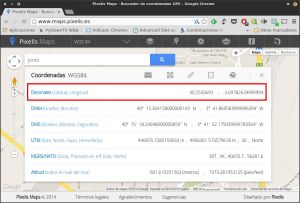
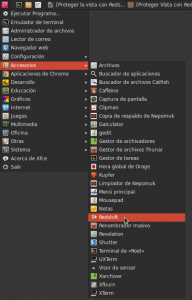
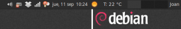
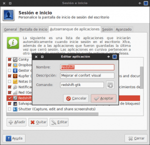

Hace pocas semanas publiqué como [activar el modo lectura en los navegadores Firefox, Opera y Chrome](). Uno de los principales usos del modo lectura era relajar la vista y hacer que después de horas y horas delante de una pantalla no tengamos molestias en nuestros ojos y por lo tanto no sea molesto leer un artículo en nuestro navegador.<!--more-->

Continuando con la misma tónica ahora **hablaremos de un software llamado Redshift que modificará la temperatura del color y el brillo** **de nuestro monitor** de forma automática para adaptarse a las condiciones de luminosidad del lugar donde usamos el ordenador. Os aseguro que si tenéis molestias oculares cuando trabajáis con el ordenador en una habitación a oscuras o por la noche, Redshift es la solución definitiva a vuestros problemas.

###### Nota: El alcance de Redshift no es únicamente el navegador web. Redshift modificará temporalmente la configuración de nuestro monitor con el fin de aliviar y prevenir molestias visuales.

###### Nota: Para diseñadores gráficos, gente que calibre periódicamente el color de su monitor y para usuarios que necesiten ver los colores en pantalla con una elevada precisión no les recomiendo el uso de este software ni de otros similares.

## INFORMACIÓN SOBRE EL SOFTWARE REDSHIFT

Redshift **es un software con licencia [GPLv3](https://www.gnu.org/licenses/quick-guide-gplv3.en.html "Explicación de la licencia GPLv3") escrito en C y en Phyton desarrollado por el Sueco Jon Lund Steffensen. Por lo tanto Redshift es 100% Software libre.**

El creador del programa comenta que Redshift fue creado a partir de la inspiración de F-lux. El era usuario de F-Lux y considero que el funcionamiento de F-Lux en Linux no era correcto y además no tenia las mismas funcionalidades que en Windows y en otros sistemas operativos. Este motivo lo impulso a crear Redshift.

Si precisan de mayor información de este programa pueden consultar información en la [Wikipedia](https://en.wikipedia.org/wiki/Redshift_\(software\) "Información sobre Redshift") o en la página web del [desarrollador](http://jonls.dk/redshift/ "Página web del desarrollador").

###### Nota: A pesar de que Redshift es un software desarrollado para trabajar en Linux, si consultan el siguiente [enlace](http://jonls.dk/redshift/ "Enlace para descargar binarios de Redshift"), verán que existen versiones experimentales para Windows.

###### Nota: Si a los usuarios de Windows no les funciona Redshift siempre pueden usar F-lux. Quien quiera usar F-Lux Windows o en OS X lo puede descargar del siguiente [enlace](https://justgetflux.com/ "Descarga de binarios de F-Lux").

## BENEFICIOS QUE OBTENDREMOS CON REDSHIFT

Como acabo de citar Redshift es la herramienta ideal para personas que padezcan molestias visuales cuando se ponen a trabajar con el ordenador en situaciones en que la luminosidad ambiental es baja. Por lo tanto **el principal beneficio de Redshift es:**

**Proteger nuestros ojos y mejorar nuestro confort cuando estamos trabajando con el ordenador**. Imagino que una gran mayoría de personas les molesta el elevado brillo que desprende el monitor del ordenador por las noches, o se han encontrado con la situación que al encender el monitor del ordenador en una habitación oscura quedan ciejos temporalmente.

###### Nota: La gente que pasa muchas horas delante del ordenador tiene que saber que no es bueno. Pasar demasiado tiempo trabajando con el ordenador puede tener efectos secundarios en nuestros ojos, provocarnos insomnio, dolores posturales, etc.

## COMO FUNCIONA REDSHIFT

A grosso modo el funcionamiento de Redshift es fácil de comprender. **Redshift ajusta la** [temperatura de color](https://es.wikipedia.org/wiki/Temperatura_de_color "Explicación de lo que es la temperatura de color") **de nuestro monitor de forma automática en función nuestras coordenadas GPS y de la hora del día en que nos encontramos.**

En las primeras horas del día nuestro monitor tendrá un color frío y por lo tanto una tonalidad azulada ya que la temperatura de color será de aproximadamente 6500 ºK. A medida que vaya transcurriendo el día, Redshift irá bajando progresivamente la temperatura de color de nuestro monitor. Así cuando llegue la noche nuestro monitor tendrá un color cálido y por lo tanto una tonalidad rojiza ya que la temperatura de color será de aproximadamente 3500 ºK

###### Nota: La temperatura de color máxima y la temperatura de color mínima la podemos seleccionar nosotros mismos en los parámetros de configuración.

###### Nota: Como curiosidad simplemente comentar que existen creencias que la temperatura de color tiene efectos psicológicos sobre las personas. Se cree que los colores cálidos (temperatura de color baja) transmiten energía, alegría, confort y son estimulantes mientras que los colores fríos (temperatura de color alta) causan justamente los efectos contrarios, tristeza, pasividad, lejanía, etc.

## INSTALAR REDSHIFT

Instalar este software es fácil. La mayoría de distros Linux tienen este programa en sus repositorios.

Así por lo tanto **si** quieren instalar este programa de forma fácil y **usan Debian o distribuciones derivadas de Debian**, como por ejemplo Ubuntu o Linux Mint tan solo tiene que **abrir una terminal y teclear**:

> ```
> sudo apt-get install redshift gtk-redshift
> ```

**En el caso de usar distribuciones derivadas de Red Had**, como por ejemplo Fedora o CentOS, tenéis que **usar el siguiente comando en la terminal**:

> ```
> sudo yum install redshift redshift-gtk
> ```

Finalmente **los usuarios de Archlinux**, o alguna distro derivada de Archlinux como por ejemplo Manjaro, **tienen que escribir el siguiente comando en la terminal**:

> ```
> sudo pacman -S redshift
> ```

**En el caso que los usuarios de Ubuntu o Linux Mint quieran tirar de repositorios ppa** para tener siempre la versión más actual, tan solo tienen que **abrir una terminal y teclear los siguientes comandos**:

```
sudo add-apt-repository ppa:jonls/redshift-ppa
sudo apt-get update
sudo apt-get install redshift
```

**Para quien quiera instalar Redshift compilando su código fuente, o simplemente quiera estudiar el código fuente del programa, puede consultar el siguiente** [link](https://github.com/jonls/redshift/releases "Estudiar el código fuente de redshift").

Una vez hemos instalado Redshift en nuestro ordenador ya podemos proceder a configurarlo para adaptar su funcionamiento a nuestras necesidades.

## CONFIGURAR REDSHIFT

Podríamos usar Redshift ejecutándolo desde la terminal, pero a no ser que creáramos un script, cada vez que arrancáramos el ordenador tendríamos que abrir una terminal, recordar los parámetros de configuración e introducir el comando adecuado en la terminal para arrancar Redshift usando nuestra configuración.

Para evitar esta molestia lo primero que tenemos que realizar es abrir un **archivo de texto**. **Dentro del archivo de texto** tendrán que introducir los parámetros de configuración de Redshift. Si quieren usar los mismo parámetros de configuración que yo, tienen que **pegar el siguiente texto** dentro del archivo:

```
; Global settings for redshift
[redshift]
; Set the day and night screen temperatures
temp-day=6500
temp-night=4000
```

```
; Enable/Disable a smooth transition between day and night
; 0 will cause a direct change from day to night screen temperature. 
; 1 will gradually increase or decrease the screen temperature
transition=1
```

```
; Set the screen brightness. Default is 1.0
;brightness=0.9
; It is also possible to use different settings for day and night since version 1.8.
;brightness-day=0.7
;brightness-night=0.4
; Set the screen gamma (for all colors, or each color channel individually)
gamma=0.8
;gamma=0.8:0.7:0.8
```

```
; Set the location-provider: 'geoclue', 'gnome-clock', 'manual'
; type 'redshift -l list' to see possible values
; The location provider settings are in a different section.
location-provider=manual
```

```
; Set the adjustment-method: 'randr', 'vidmode'
; type 'redshift -m list' to see all possible values
; 'randr' is the preferred method, 'vidmode' is an older API
; but works in some cases when 'randr' does not.
; The adjustment method settings are in a different section.
adjustment-method=randr
```

```
Configuration of the location-provider:
; type 'redshift -l PROVIDER:help' to see the settings
; ex: 'redshift -l manual:help'
[manual]
lat=40.25
lon=-3.69
```

```
; Configuration of the adjustment-method
; type 'redshift -m METHOD:help' to see the settings
; ex: 'redshift -m randr:help'
; In this example, randr is configured to adjust screen 1. 
; Note that the numbering starts from 0, so this is actually the second screen.
[randr]
screen=0
```

Una vez copiado el texto **guardan el archivo**. El archivo **lo tienen que guardar con el nombre** **redshift.conf** **y ubicarlo dentro de la carpeta** **home/vuestro\_usuario/.config**

###### Nota: Las lineas que empiezan por ; son solo de lectura. Algunas se podrán descomentar para ajustar la configuración de Redshift.

Si os fijáis **en la configuración he marcado una serie de lineas en color rojo**. **Estás son las lineas que en función de vuestras preferencias y ubicación geográfica tenéis que modificar**. **Para que podáis modificar adecuadamente la configuración seguidamente encontraréis una explicación de lo que hace cada uno de los parámetros**:

#### Selección de la temperatura de color máxima y mínima

**temp-day=6500** **temp-night=4200**

El parámetro **temp-day=6500** **indica que la máxima temperatura de color de nuestro monitor sea de 6500 ºK**. Está temperatura se dará en la hora del día en las condiciones de luminosidad en el exterior son máximas. 6500 ºK es la temperatura de color estandard de muchos de los monitores que hay en el mercado.

En el parámetro **temp-night=4000** **indica que la temperatura de color mínima de nuestro monitor sea de 4000 ºK**. Está temperatura se dará por la noche cuando las condiciones de iluminación en el exterior sean mínimas.

###### Nota: El valor de temperatura diurna es recomendable que tenga un valor entre 5500 y 6500 ºK. El valor de temperatura nocturna se recomienda que esté entre 3000 y 4000 ºK. Pero vosotros soys libres de seleccionar las temperaturas que mas os convengan.

#### Modificación gradual del color de temperatura

**transition=1**

Si seleccionamos la opción **transition=1** **la temperatura de color se ira modificando progresivamente a medida que pasan las horas de forma que nuestros ojos prácticamente no percibirán el cambio** de temperatura de color.

Si seleccionamos la opción **transition=0** **nuestro monitor solo trabajará con 2 temperaturas de color. La máxima que se aplicará durante las horas diurnas y la mínima que se aplicará durante las horas nocturnas**. El cambio entre y día y noche se producirá de repente cuando llegue la hora oportuna.

#### Selección del parámetro de corrección gamma

**gamma=0.8**

**Con el** [parámetro de corrección gamma](https://es.wikipedia.org/wiki/Correcci%C3%B3n_gamma "Explicación de lo que es el parámetro de corrección gamma") lo que **podemos controlar es la cantidad de luz que emiten los colores nuestro monitor**. El valor estándard que se recomienda en la web del desarrollador es 0.8 y de momento no lo he modificado. Este parámetro lo podemos regular entre 1 y 0.

###### Nota: Si observan el texto del archivo de configuración podrán ver que este parámetro lo podemos modificar para todos los colores o para cada uno de los 3 canales de color. (RGB “Red” “Green” “Blue”)

#### Indicación de nuestras coordenadas GPS

**lat=40.25** **lon=-3.69**

Con **los parámetros lat y lon estamos indicando la latitud y la longitud del pueblo o ciudad en el que estamos viviendo**. **Para averiguar la latitud y longitud de vuestra ubicación pueden acceder al siguiente** [link](http://www.maps.pixelis.es/ "Consultar nuestras coordenadas GPS"). Una vez dentro introducen el nombre de vuestra población y presionan la tecla Enter. En mi caso a modo de ejemplo he seleccionado Pinto. Tal como se puede ver en la captura de pantalla, después de presionar la tecla Enter y clicar encima del circulo rojo, obtenemos las coordenadas que hay que poner en **lat** y en **lon**.

[](images/Obtener-coordenadas-GPS.png)

###### Nota:  Redshift debería ser capaz de obtener nuestra ubicación mediante geoclue. Pero a mi geoclue no me funciona. Además geoclue debería formar parte de las dependencias de instalación de este programa y no lo hace. Este es el motivo por el cual en este post se realiza una configuración manual de Redshift.

#### Indicar el monitor en el que queremos aplicar los cambios

**screen=0**

El comando **screen=0** **indica el monitor en el que queremos se modifique la temperatura de color**. En mi caso solo tengo un monitor, por lo tanto el valor que tengo que usar es 0. **En el caso que tuviera 2 monitores podría elegir la opción** **0** o **1** para seleccionar el monitor en el que se aplican los cambios.

###### Nota: Aparte de los parámetros que cito, también podemos modificar parámetros adicionales como el brillo, etc. Tan solo tienen que mirar las descripciones del archivo de configuración y aplicar los cambios que cada uno considera oportunos.

## USAR REDSHIFT PARA PROTEGER NUESTROS OJOS

Ahora que tenemos instalado y configurado Redshift ya lo podemos usar. **Para usarlo tan solo tienen que acceder al menú de aplicaciones vuestra distro, buscar la aplicación Redshift y abrirla**. En la siguiente captura de pantalla podéis ver como utilizo redshift en Debian con Xfce.

[](images/Arrancar-redshift.png)

Justo **al iniciar Redshift verán que aparece un icono con una bombilla roja en nuestro panel**:

[](images/Redshift-funcionando.png)

**Si lo activáis en las horas diurnas el cambio que notaréis será mínimo. Si lo activáis por la noche verán como la pantalla adquiere una tonalidad rojiza para hacer que nuestros ojos esten más confortables**. Al principio quizás puede costar acostumbrarse a la tonalidad rojiza pero una vez te acostumbras no la cambiarás para nada.

**Si la tonalidad de color no les parece confortable se tendrá que jugar y modificar el fichero de configuración hasta que nos sintamos plenamente a gusto** con los colores de nuestro monitor.

###### Nota: Si quieres desactivar Redsifht o suspenderlo por un tiempo determinado tan solo tienen que hacer clicar con el ratón encima de la bombilla roja del panel y seleccionar las opciones pertinentes.

## AUTOARRANCAR REDSHIFT CADA VEZ QUE USAMOS EL ORDENADOR EN XFCE

Si Redsifht les gusta y quieren que se active cada vez que enciendan el ordenador lo podemos realizar de la siguiente forma:

**Abrimos una terminal y tecleamos el siguiente comando**:

> ```
> xfce4-session-settings
> ```

Aparecerá una ventana para configurar el inicio de nuestra sesión. En este ventana tenemos que **seleccionar la pestaña** **Autoarranque de aplicaciones** y seguidamente tenemos que **presionar el botón** **Añadir**. Una vez presionado el botón Añadir tienen que **introducir los comando que se muestran en la siguiente captura de pantalla**:

[](images/Autoarranque-Redshift.png)

Una vez introducidos los comando **presionan el botón** **Aceptar**. Después de realizar todos los pasos mencionados el proceso ya ha finalizado.

###### Nota: Quien utilice escritorios XFCE y tenga dudas de como realizar el proceso le recomiendo que busque en google como realizar el procedimiento en otros escritorios.

## MUESTRA DEL RESULTADO OBTENIDO

Para quien sea escéptico con este software les dejo el siguiente link para que vean el cambio que se tiene que producir al usar Redshift:

[Vídeo en el que se muestra el funcionamiento de Redshift](https://www.youtube.com/watch?v=2Olq3WYskzU "Vídeo en que se muestra el funcionamiento de Redshift")

###### Nota: El cambio que se produce es notable pero hay que tener en cuenta que el video se grabo a las 2 de la tarde. A las 10 de la noche el cambio tiene que ser aun más acentuados. Los valores de temperaturas que usa el usuario del video son bastante extremos. En mi caso uso unos valores bastante más conservadores.

###### Nota: El vídeo está en inglés pero sirve para ver el cambio que se produce. Además quien entienda inglés verá que lo que cuenta el que realiza el vídeo es interesante.
