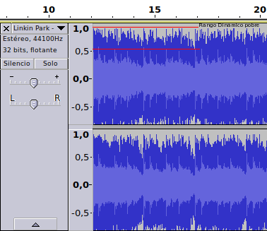
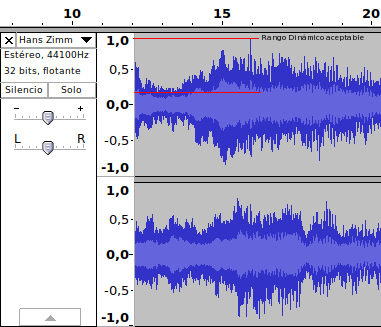

En pasados post escribimos sobre como [analizar la calidad de un archivo de audio](). A raíz de este artículo he creído interesante hablar sobre rango dinámico porque es otro de los parámetros que podemos analizar para conocer la calidad de un audio.<!--more-->

## ¿QUÉ ES EL RANGO DINÁMICO DE UN ARCHIVO DE AUDIO?

El rango dinámico no es más que la diferencia de nivel de presión sonora existente entre los sonidos más bajos y los sonidos más altos que podemos escuchar.

Está diferencia de sonido se mide en dB (decibelios). Cuanto mayor sea la diferencia en dB, mayor será el rango dinámico del audio.

Un ejemplo de un audio con un rango dinámico malo seria el siguiente:

Un ejemplo de un audio con un rango dinámico medianamente aceptable seria el siguiente:

La diferencia entre el nivel de señal más baja y más alta vemos que es mayor en el segundo caso. Esto se traduce en que el rango dinámico de la segunda canción es mejor que la primera.

###### Nota: El ejemplo que acabamos de ver es meramente conceptual ya que el signo de la señal debería ser en dB y solo se consideran 2 puntos de un tramo muy reducido de una de las canciones.

## VENTAJAS DE LA MÚSICA CON UN RANGO DINÁMICO ELEVADO

El audio que dispone de un buen rango proporciona las siguientes ventajas:

1. Un sonido más limpio.
2. El sonido es sin saturación.
3. Transmite más las emociones.
4. Permite distinguir más fácilmente el instrumento que está sonando en cada momento.
5. Permite escuchar más fácilmente la letra de las canciones.
6. Da mayor realismo al audio que estamos escuchando.
7. Es mejor para nuestro oído. Las canciones con un rango dinámico bajo transmiten un nivel de energía superior a nuestros oídos.

Asimismo el audio con un rango dinámico alto también puede generar inconvenientes como por ejemplo que sea difícil escuchar las partes de las canciones que contienen niveles de presión sonora bajos.

## FACTORES QUE AFECTAN AL RANGO DINÁMICO

Existen muchos factores a considerar. Algunos de ellos son los siguientes:

1. El equipo usado para enregistrar la canción.
2. Los altavoces y equipo que usamos para escuchar una canción.
3. El genero de música. El tipo de música determina en cierto modo el rango dinámico de una canción. En la música clásica la diferencia de sonido entre las partes más suaves y las más fuertes siempre acostumbra a ser grande y esto hace que el rango dinámico sea alto. Si consideramos otros géneros musicales, como por ejemplo el hip-hop, veremos que la situación es completamente la opuesta.
4. En los inicios de los años 90 la industria musical decidió que cuanto más alta sonara la música mejor. La forma para subir el volumen fue comprimir la señal de audio y esto ocasiona una pérdida del rango dinámico. Está práctica se ha extendido hasta la actualidad y ha acabado originando lo que se denomina la [Guerra del Volumen](https://es.wikipedia.org/wiki/Guerra_del_volumen "Explicación de la guerra del sonido").

## ¿POR QUÉ HOY EN DIA LA GRAN MAYORÍA DE MÚSICA QUE COMPRAMOS TIENE UN RANGO DINÁMICO BAJO?

El principal motivo es porque la indústria musical comprime la señal de audio para incrementar el volumen de la canción. Haciendo lo que acabo de citar se reduce el rango dinámico y en primera instancia parece que las canciones se escuchan mejor.

Parece que se escuchan mejor porque a un volumen alto, el contenido de sonido a bajas frecuencias y altas frecuencias es superior.

Esta particularidad es usada para intentar potenciar las ventas de música ya que hoy en día la gente acostumbra a escuchar las canciones antes de comprarlas.

Hoy en día existen asociaciones, como la [Pleasurize Music Foundation](http://www.pleasurizemusic.com/en/our-aim "Quien es la fundación Pleasurize Music") o la [Turn me up](http://www.turnmeup.org/about_us.shtml), que intentan combatir este tipo de prácticas. Según estas asociaciones, uno de los motivos de porque la gente no compra música es por los bajos rangos dinámicos que la música tiene en la actualidad.

También existen muchos ingenieros de sonido y músicos reconocidos, como por ejemplo Bob Dylan, que están en contra de las prácticas adoptadas por la industria musical durante los últimos años.

## ¿CÓMO MEDIR EL RANGO DINÁMICO DE UNA CANCIÓN?

Hoy en día existen varios métodos para medir y evaluar el rango dinámico de una canción.

En un futuro escribiré un artículo en el que detallaré el proceso de medición en Linux y en Windows.

**Fuentes:**

[dynamicrange.de](http://www.dynamicrange.de/en/why-do-strongly-compressed-tracks-seem-more-attractive-fletcher-munson-curves)

[pleasurizemusic.com](http://www.pleasurizemusic.com/)
