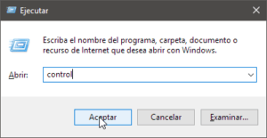
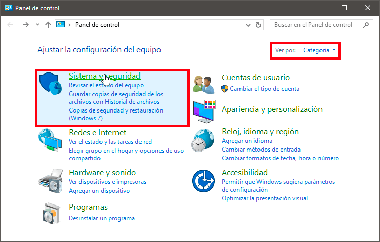
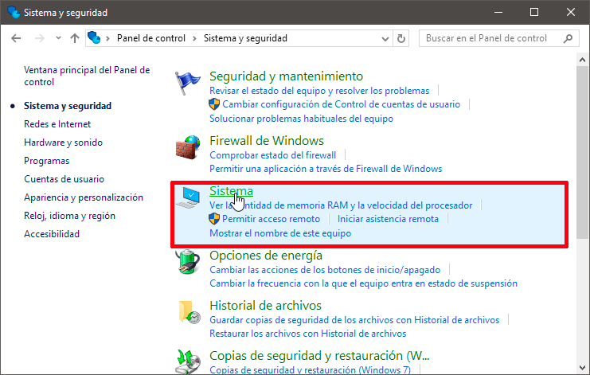
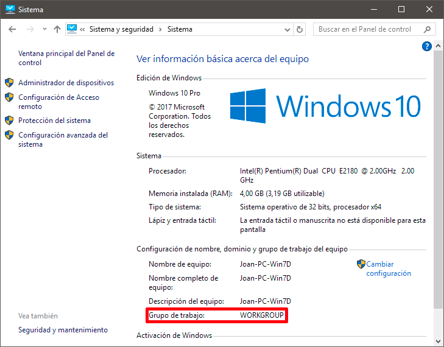

En el siguiente artículo explicaré de forma clara que es y para que sirve un grupo de trabajo en Windows. Además, en futuros artículos veremos cómo podemos configurar nuestros grupos de trabajo y compartir archivos de forma fácil y sencilla.<!--more-->

## ¿QUÉ ES Y PARA QUE SIRVEN LOS GRUPOS DE TRABAJO EN WINDOWS?

Los grupos de trabajo son una de las posibles formas de organizar los equipos dentro de una red local. Otras formas de organizar los equipos que pertenecen a una red local son mediante un [dominio](https://smrbitabit.wordpress.com/2012/10/22/que-es-un-dominio-en-windows/ "Explicación de lo que es un dominio") o mediante un [grupo de hogar](https://support.microsoft.com/es-es/help/17145/windows-homegroup-from-start-to-finish "Explicación de lo que es un grupo de trabajo").

La totalidad de equipos pertenecientes a un mismo grupo de trabajo podrán verse y comunicarse entre ellos. Este hecho proporcionará las siguientes **ventajas**:

1. Los equipos pertenecientes a un mismo grupo podrán compartir archivos y directorios entre ellos de forma extremadamente sencilla.
2. Los equipos pertenecientes a un mismo grupo podrán compartir recursos como por ejemplo impresoras, etc.

En ningún momento los grupos de trabajo sirven para centralizar o gestionar permisos de equipos. La administración de usuarios y privilegios se hará de forma individual en cada uno de los equipos que forman parte del grupo de trabajo. Cada uno de los equipos pertenecientes a un grupo de trabajo tienen una relación de igual a igual entre ellos y se administran de forma local.

Los grupos de trabajo son útiles para ser usados en redes locales pequeñas. Por lo tanto, los grupos de trabajo son una buena solución para usarlos en nuestro hogar. En ambientes corporativos es más recomendable usar dominios.

## PROPIEDADES DE LOS GRUPOS DE TRABAJO

Las características básicas de los equipos que forman parte de grupos de trabajo son las siguientes:

1. La relación entre todos los equipos de un grupo de trabajo es de igual a igual. Por lo tanto, ningún ordenador perteneciente al grupo tiene control sobre el otro.
2. El número de equipos que forma un grupo de trabajo acostumbra a ser bajo. Si disponemos de un grupo de trabajo con más de 20 equipos deberíamos plantearnos migrar a un dominio.
3. Para que los usuarios de un grupo de trabajo puedan verse entre ellos deben encontrarse en la misma red local.
4. Cada equipo perteneciente al grupo de trabajo debe disponer de su cuenta de usuario local. Por lo tanto, para iniciar la sesión en un equipo perteneciente a un grupo de trabajo debemos disponer de una cuenta de usuario en este equipo.
5. Todos los usuarios de una red local pueden pertenecer a un grupo de trabajo sin necesidad de pedir permiso ni introducir ninguna contraseña. Por lo tanto, cuando compartimos una carpeta hay que configurar de forma adecuada los permisos y los usuarios que tendrán acceso a nuestra carpeta compartida.

## COMPROBAR SI NUESTRO EQUIPO FORMA PARTE DE UN GRUPO DE TRABAJO

Queramos o no queramos, todos los equipos con Microsoft Windows forman parte de un dominio o de un grupo de trabajo. Para conocer nuestro grupo de trabajo, o dominio, tenemos que acceder a nuestro panel de control. Para ello seguimos los siguientes pasos:

1. Presionamos la combinación de teclas Ctrl+R.
2. Cuando aparezca la ventana de ejecutar escribimos la palabra control y presionamos Enter.

Una vez dentro del panel de control, en la opción Ver Por seleccionamos la opción Categoría. Seguidamente clicamos encima de la opción Sistema y Seguridad.

A continuación, dentro de Sistema y seguridad clicamos encima del icono Sistema.

Dentro de Sistema, tal y como se puede ver en la captura de pantalla, verán que mi grupo de trabajo es WORKGROUP.

###### Nota: En el caso que perteneciera a un dominio, dentro del recuadro de color rojo figuraria la palabra dominio seguido del nombre del dominio al que pertenecemos.

## CREAR Y CONFIGURAR UN GRUPO DE TRABAJO

En las próximas semanas publicaré un artículo en el que explicaré de forma detallada como crear y configurar grupos de trabajo para poder compartir archivos y directorios con los distintos usuarios de nuestra red local.
