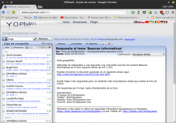

Hace ya muchos años que existen los servicios de email temporal. No obstante no todo el mundo conoce el uso y las precauciones que hay que tener al usar este tipo de servicios. Por esto motivo he redactado el siguiente post en el que se detalla que es un email temporal, las utilidades que le podemos dar y finalmente se detallan una serie de consejos para elegir un servicio de email temporal que sea adecuado y respetuoso con nuestra privacidad.<!--more-->

## ¿QUÉ ES UN EMAIL TEMPORAL?

Un email temporal es una cuenta de correo que bajo mi punto de vista tiene que cumplir con las siguientes características:

1. La cuenta de correo **se crea sin tener que realizar ningún tipo de registro**. Por lo tanto nadie podrá sabrá nuestros datos personales y de este modo estaremos protegiendo nuestra privacidad.
2. La **duración de la cuenta de correo electrónico es limitada**. Al cabo de un determinado tiempo, que pueden ser horas, minutos o días, la cuenta de correo electrónico dejará de existir y toda la información relacionada con la cuenta de correo electrónico desaparecerá.

## ¿QUÉ UTILIDADES PODEMOS DAR A UN EMAIL TEMPORAL?

**La única utilidad que tienen las cuentas de email temporal son evitar el Spam**.

En multitud de ocasiones tenemos que proporcionar nuestro email para poder registrarnos a foros, suscribirnos a un sitio web, para realizar una descarga de un determinado sitio web, etc. En el momento de proporcionar nuestra dirección de correo electrónico es muy posible que nuestro correo acabe formando parte de una base de datos que se usará para enviarnos publicidad. En ocasiones incluso es posible que estas bases de datos con nuestros correos sean robadas por spammers o vendidas a terceros con las consiguientes consecuencias.

## ¿QUÉ UTILIDADES NO SE DEBEN DAR A UN EMAIL TEMPORAL?

**No debemos usar este tipo de servicio para enviar o recibir correos que contengan información privada o datos personales**. La seguridad de la información transmitida por la gran mayoría de estos servicios brilla por su ausencia y además existen servicios, como por ejemplo **yopmail**, que deja a la vista pública la totalidad de los mensajes enviados por sus usuarios.

Obviamente **no deberemos usar un email temporal para suscribirnos a servicios que acostumbramos a usar habitualmente** porqué perderíamos la totalidad de información y notificaciones que este servicio nos proporciona a través de nuestro correo.

Un email temporal **no es para enviar mensajes importantes**. Existe la posibilidad que algunos de los emails que mandamos no acaben llegando nunca a sus destinatarios porque la IP o el dominio del servidor de email temporal estén bloqueados por spam o por el administrador del servidor receptor del mensaje.

## SERVICIOS DE EMAIL TEMPORAL NO RECOMENDABLES

Existen multitud de servicios de email temporal, pero no todos funcionan del mismo modo. Algunas variantes de funcionamiento de este tipo de servicios son los siguientes:

1. Existen s**ervicios de email temporal que redireccionan el email basura a nuestra cuenta de correo electrónico real**. Por temas de privacidad aconsejo evitar este tipo de servicios ya que el correo real se puede usar para asociarlo con todas las direcciones de email temporal que hayamos usado. Algunos de los servicios que trabajan de esta forma son por ejemplo **Jetable y Trashmail**.
2. Existen **servicios en que la información de nuestras cuentas de correo electrónico temporal es pública**. Cualquiera que introduzca nuestra dirección de correo temporal podrá ver nuestros mensajes. Algunos de estos servicios son **yopmail y mailnator**. Obviamente es recomendable no usar este tipo de servicios.
3. Hay **servicios que** independientemente de su funcionamiento nos **exigen un registro e introducir nuestros datos personales**. Obviamente desaconsejo el uso de este tipo de servicios porque estos servicios no necesitas nuestros datos para nada.

## SERVICIOS DE EMAIL TEMPORAL RECOMENDABLES

Algunos de los servicios de email temporal que a priori considero recomendables son los siguientes:

[10minutemail.com](http://10minutemail.com "Link al servicio 10minutemail.com"): Servicio recomendable que justo después de entrar en su web te crea una dirección de correo electrónico completamente aleatoria que será válida durante 10 minutos. Una vez transcurridos los 10 minutos la cuenta de correo electrónico se autodestruirá y nunca más se podrá volver a recuperar. El contenido de nuestro buzón de entrada y de salida es privado y únicamente nosotros tendremos acceso a él.

[10minutemail.net](http://10minutemail.net "Link al servicio 10minutemail.net"): Servicio que justo al entrar en su web te crea una cuenta de correo electrónico completamente aleatoria que será válida durante 10 minutos. El contenido de nuestro buzón de entrada y de salida es privado y únicamente nosotros tendremos acceso a él. Una vez transcurridos los 10 minutos de vida de la cuenta, el servicio nos ofrece la opción de prolongar la duración de la dirección de email o eliminarla completamente y crear otra de nueva.

[NowMyMail](http://www.nowmymail.com "Link al servicio nowmymail.com"): Servicio de email temporal que nos proporciona una dirección de email temporal aleatoria que será válida durante una hora. Después de la hora el contenido de nuestro email temporal se borrará.

###### Nota: En los servicios de email temporal recomiendo borrar los mensajes de la bandeja de entrada una vez leídos. De este modo minimizaremos la probabilidad de que terceros puedan leer nuestros mensajes.

###### Nota: Si buscáis en Google encontraréis muy fácilmente multitud de servicios adicionales de email temporal a los que recomiendo en este artículo. Usad el que que creáis que sean más seguro siguiendo las recomendaciones de este post.

## ALTERNATIVAS AL EMAIL TEMPORAL

En el caso que no os convenza la opción de usar un email temporal para combatir el spam, siempre tenemos otras opciones como por ejemplo **crear una cuenta de correo electrónico normal que usaremos siempre que sospechemos que alguien quiera usar nuestra dirección de correo para enviarnos spam**.

Así en el caso que queramos suscribirnos a un foro, o tengamos que dar nuestra dirección de correo a una persona o ente que queremos que no la tenga, usaremos la cuenta de correo electrónico que hemos creado para estos casos.
