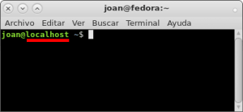
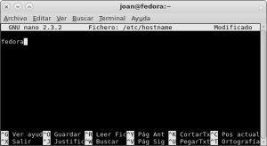
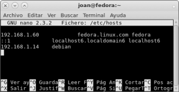
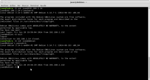

Recientemente acabo de instalar Fedora. En la instalación no me percate que en ninguno de los pasos me estuviera pidiendo el nombre del equipo y cuando finalice la instalación vi que el nombre del equipo de Fedora era localhost. A raíz de esto me surgió la idea de escribir un **post explicando lo que es el nombre del equipo o hostname, para que sirve y como podemos cambiarlo si el que tenemos no nos gusta o no es el adecuado para nosotros**. El método usado para cambiar el hostname o nombre de equipo es válido tanto para distribuciones basadas en en Debian como en Fedora.<!--more-->

## ¿QUÉ ES EL NOMBRE DEL EQUIPO O HOSTNAME?

**El hostname o nombre del equipo es un nombre único e informal que nosotros mismos ponemos a un equipo que puede ser un ordenador**, una impresora, un servidor ftp, un servidor de mail, etc. Este nombre informal ayudará a identificar el equipo dentro de una red informática.

**El nombre de equipo o hostname** **solo identificará máquinas o será visible dentro de nuestra red local**. En el caso que queramos identificar o acceder a nuestra máquina fuera de nuestra red local deberemos hacerlo configurando un [dominio completamente cualificado](https://es.wikipedia.org/wiki/FQDN "Explicación de lo que es un dominio completamente cualificado").

## ¿CÚAL ES NUESTRO NOMBRE DEL EQUIPO O HOSTNAME?

En el caso de tener duda solo decir que **hay bastantes formas de identificar nuestro hostname**. **La primera** de ellas es abrir una terminal. Una vez abierta la terminal tan solo tienen que **teclear el siguiente comando**:

> ```
> hostname
> ```

**La salida de este comando en mi caso es** **localhost**. **Por lo tanto el nombre de equipo actual que tiene mi equipo es** **localhost**.

Otra forma de saber nuestro nombre de equipo o hostname es abriendo una simple terminal. Una vez abierta verán una imagen parecida a la siguiente:

[](images/Identificar-nombre-del-equipo.png)

Tal y como se puede ver en la captura de pantalla verán una linea con la siguiente estructura:

**nombre de usuario****@****Nombre de equipo o hostname**

Por lo tanto en mi caso concluimos que mi nombre de usuario es **joan** y el nombre de mi equipo es **localhost**.

## COMO CAMBIAR EL NOMBRE DEL EQUIPO O HOSTNAME

**La forma correcta de cambiar el nombre del equipo es modificando el archivo** **/etc/hostname**. En muchos sitios se detalla que también es necesario actuar sobre el archivo **/etc/hosts**, pero la verdad es que este archivo tiene otro propósito que es definir el nombre de dominio completamente cualificado (FQDN).

Así por lo tanto ahora **vamos a modificar el nombre de equipo de mi ordenador de **localhost** a **fedora****. Para ello **abrimos una terminal y tecleamos el siguiente comando**:

> ```
> sudo nano /etc/hostname
> ```

Una vez se abra el editor de texto verán que el único texto que figura en este archivo es el nombre actual de vuestro equipo que en mi caso es localhost. Ahora **reemplazamos el nombre del equipo actual por el que queremos que es ****fedora******:

[](images/Nombre-del-equipo-cambiado.png)

Una vez elegido el nombre **guardamos los cambios realizados en el archivo y ya lo podemos cerrar**. Los cambios han sido realizados. Para asegurar que los cambios sean efectivos se aconseja reiniciar el ordenador.

###### Nota: El nombre de la máquina tiene que estar comprendido entre 2 y 63 caracteres.

###### Nota: Aunque hayamos cambiado el nombre de localhost a fedora, siempre podemos seguir usando localhost para referirnos a nuestro propio equipo.

**En el caso** poco probable **que tuvierais configurado un nombre de dominio completamente cualificado** ([FQDN](https://es.wikipedia.org/wiki/FQDN "Explicación de lo que es el Nombre de dominio completamente cualificado")), como hemos cambiado el nombre del equipo o hostname, también deberemos modificar el nombre de dominio completamente cualificado. **Lo tendremos que cambiar ya que el nombre de dominio completamente cualificado esta compuesto por el nombre del equipo** más [un nombre de dominio](https://es.wikipedia.org/wiki/Nombre_de_dominio "Explicación de lo que es un nombre de dominio") asociado a nuestro equipo más un [dominio de nivel superior](https://es.wikipedia.org/wiki/Dominio_de_nivel_superior "explicación de lo que es un dominio de nivel superior").

Entonces para llevar a cabo la modificación **abren una terminal y teclean el siguiente comando**:

> ```
> sudo nano /etc/hosts
> ```

Se abrirá el editor de texto nano en el que podremos ver el contenido del fichero hosts. **Dentro del verán una linea que tiene la siguiente estructura**:

```
ip interna del equipo             nombredelequipo.nombrededominio.dominionivelsuperior nombredelequipo
```

**Una vez localizada está linea tienen que cambiar el** **nombre del equipo** **viejo por el nuevo**. En mi caso después de realizar las modificaciones, el archivo hosts ha quedado de la siguiente forma:

[](images/Configuración-del-archivo-hosts.png)

## ¿PARA QUE SIRVE EL HOSTNAME?

Como acabamos de citar, el nombre de equipo o hostname ayudará a identificar un equipo dentro de una red informática.

Actualmente **multitud de utilidades que se usan para trabajar en una red informática pueden ser configuradas para usar el nombre del equipo o hostname para identificar una máquina**. **Un ejemplo muy claro e ilustrativo de lo que acabo de decir es ssh**. En la siguiente captura pantalla podemos ver un ejemplo muy claro del funcionamiento del hostname con ssh:

[](images/Ejemplo-de-uso-del-nombre-del-equipo-o-hostname.png)

Como se puede ver en la captura de pantalla hay dos accesos al mismo servidor ssh que está instalado en el equipo joan@debian.

1. En el primer acceso el equipo ****joan@fedora**** ha accedido vía ssh al equipo ****joan@debian****. Para acceder al equipo ****joan@debian****, el equipo ****joan@fedora**** ha usado la ip interna del equipo ****joan@debian**** que es ****192.168.1.14****.
2. En el segundo acceso vemos que **el equipo** ****joan@fedora**** **accede al equipo** ****joan@debian****. Pero este vez **en vez de usar la ip interna** **192.168.1.14** **se usa la palabra** ****debian**** que es el nombre de equipo o hostname del servidor ssh ubicado en la red local. **De esta forma no es necesario memorizar las ip internas de los integrantes de nuestra red informática**.

Hay varios métodos para realizar lo que acabamos de ver. Lo podemos hacer actuando sobre el fichero de configuración del cliente ssh o configurando adecuadamente el archivo /etc/hosts. En mi caso lo he realizado actuando sobre el fichero ****/etc/hosts****. La forma de hacerlo es abrir una terminal y teclear el siguiente comando:

> ```
> sudo nano /etc/hosts
> ```

Una vez abierto el fichero hosts introducimos el siguiente contenido:

> ```
> 192.168.1.14    debian
> 
> ```

**192.168.1.14 corresponde a la ip interna del servidor ssh mientas que debian es el hostname del servidor ssh**. Después de introducir estos datos guardamos el archivo y tarea finalizada. Para quien lo necesite le dejo una captura de mi fichero hosts una vez finalizada la configuración:

[](images/Configuración-del-archivo-hosts.png)

###### Nota: Al igual que ssh existen multitud de aplicaciones de red que permiten realizar esto. Algunas de ellas son [telnet](https://es.wikipedia.org/wiki/Telnet "Explicación de lo que es Telnet"), [ping](https://es.wikipedia.org/wiki/Ping "Explicación del programa ping"), [nslookup](https://es.wikipedia.org/wiki/Nslookup "Explicación programa nslookup"), etc.
