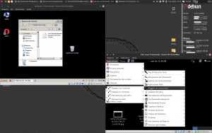

En varios de mis artículos hago referencia al uso de una máquina virtual para realizar ciertas operaciones. A raíz de esto he recibido varias consultas de usuarios preguntando que es una máquina virtual y obviamente no es una cuestión fácil de responder en un email o en los comentarios del post. Por este motivo he decidido redactar este post explicando lo que es una máquina virtual y que usos podemos darle.<!--more-->

## ¿QUÉ ES UNA MÁQUINA VIRTUAL?

Una máquina virtual es un software que instalamos en nuestro ordenador. Este software nos permite instalar y usar otros sistemas operativos de forma simultanea sobre nuestro sistema operativo. Así de este modo, tal y como se puede ver en la captura de pantalla, en un mismo ordenador puedo estar usando, Windows, Kali Linux y Debian de forma simultanea sin ningún tipo de problema.

Por lo tanto después de ver la captura de pantalla podemos afirmar que una máquina virtual **es un software que nos permitirá ejecutar varios sistemas operativos de forma simultanea sobre un mismo hardware**. Los sistemas operativos que ejecuta la máquina virtual se llaman sistemas operativos virtualizados. Estos sistemas operativos virtualizados podrán ejecutar programas y realizar la totalidad de tareas que nosotros podríamos realizar en una sistema operativo real.

###### Nota: Tal y como puede verse reflejado en la definición de máquina virtual, en este artículo nos estamos focalizando en las maquinas virtuales de sistema. Existen otro tipo de máquinas virtuales, como por ejemplo las máquinas virtuales de proceso o los emuladores.

## ¿QUÉ CARACTERÍSTICAS TIENE UNA MÁQUINA VIRTUAL?

Una vez hemos definido lo que es una máquina virtual, podemos comentar las características que acostumbran a tener la mayoría de máquinas virtuales existentes en la actualidad:

1. La gran mayoría de máquinas virtuales, como por ejemplo Virtualbox o VMWare, **permiten instalar prácticamente cualquier sistema operativo** como por ejemplo Linux, Android, Mac OS X, Windows, Chrome OS, etc. Sin embargo existen otras máquinas virtuales, como por ejemplo Virtual PC, Hiper-V o Parallels, que están principalmente destinadas a virtualizar Windows.
2. **Cada uno de los sistemas operativos que virtualizamos es completamente independiente de los otros sistemas operativos**. De este modo en el caso que una de las máquinas virtuales deje de funcionar, el resto seguirá funcionando sin ningún tipo de problema.
3. Una vez instalado un sistema operativo en la máquina virtual, **tenemos que usar el sistema operativo virtualizado del mismo modo que lo usaríamos si lo hubiéramos instalado en nuestro ordenador.**
4. Una máquina virtual **dispone de todos los elementos de que dispone un ordenador real**. Dispone de disco duro, memoria RAM, unidad de CD-Rom, tarjeta de red, tarjeta de vídeo, etc, pero a diferencia de un ordenador real estos elementos en vez de ser físicos son virtuales.
5. **Todos los elementos de una máquina virtual se encapsulan en un conjunto de archivos**. Esto permite que podamos copiar un sistema operativo virtual de un ordenador a otro o que podemos realizar copias de seguridad sin ningún tipo de problema y de forma muy fácil y muy rápida.

## ¿QUÉ NECESITO PARA USAR UNA MÁQUINA VIRTUAL?

Actualmente la virtualización de un sistema operativo o servidor se puede implementar por Software o por Hardware. Como en este post me focalizo en la virtualización por software, **lo único que precisamos para poder usar una máquina virtual es un ordenador medianamente actual e instalar y configurar el software de la máquina virtual**.

Cuanto más potente y actual sea el ordenador que tengamos, mejor experiencia obtendremos trabajando con sistemas operativos virtualizados. Algunos de los puntos importantes **para obtener un rendimiento óptimo del sistema operativo virtualizado son los siguientes:**

1. Disponer de un **procesador rápido y que disponga de capacidad de virtualización por Hardware** (Intel VTx/AMD-v). Cuanto mayor sea la capacidad del procesador mejor experiencia de virtualización obtendremos. Cualquier ordenador actual dispone de un procesador apto para virtualizar sistemas operativos.
2. Disponer de **espacio suficiente en el disco duro**. Además es interesante disponer de un disco duro con una buena la velocidad de lectura y escritura como por ejemplo un disco SSD.
3. Necesitamos disponer de **memoria RAM suficiente y adecuada**. Cuanta más cantidad de memoria RAM y cuanto más rápida sea, mejores resultados de virtualización obtendremos. Así por lo tanto es mejor tener 4GB de RAM que 2GB, y del mismo modo es mejor disponer de una memoria RAM del tipo DDR4 que DDR3. La cantidad de memoria RAM ideal dependerá del sistema operativo que queremos virtualizar y del número de sistemas operativos que queramos virtualizar de forma simultanea. Si tan solo queremos virtualizar un sistema operativo con 2 o 3 GB de RAM debería ser suficiente.
4. Sin duda el hecho de tener **una buena GPU** también ayudará a disponer de una mejor experiencia de virtualización. Por lo tanto es recomendable disponer de una buena tarjeta gráfica con aceleración gráfica.

## ¿CÓMO FUNCIONA UNA MÁQUINA VIRTUAL?

Explicar el funcionamiento en detalle de una máquina virtual es algo sumamente complicado y que además poca gente tiene los conocimientos necesarios para hacerlo. No obstante a grandes rasgos podemos decir que una máquina virtual **es un software que mediante una capa de virtualización se comunica con el hardware que tenemos disponible en nuestro ordenador consiguiendo de este modo emular la totalidad de componentes de un ordenador real**. De este modo la máquina virtual será capaz de emular un disco duro, una memoria RAM, una tarjeta de red, un procesador, etc.

Una vez sabemos esto cuando abrimos una máquina virtual, como por ejemplo Virtualbox, nos encontramos con un entorno gráfico que nos permitirá configurar y asignar recursos a cada uno de los componentes físicos que emula la máquina virtual. Así por ejemplo en prácticamente la totalidad de máquinas virtuales deberemos definir detalles del siguiente tipo:

1. Espacio que queramos asignar a nuestro disco duro.
2. Memoria RAM que queremos asignar a la máquina virtual.
3. La memoria de nuestra tarjeta gráfica.
4. La configuración de red que queremos.
5. etc.

Una vez configurados estos parámetros habremos creado una máquina virtual para instalar un sistema operativo. De este modo tan solo tendremos que abrir la máquina virtual que se acaba de crear e instalar el sistema operativo tal y como si se tratará de un ordenador real normal y corriente.

En el futuro escribiré un post detallando paso a paso los puntos a seguir para la instalación y uso de un sistema operativo en la máquina virtual.

## ¿QUÉ UTILIDADES NOS PROPORCIONAN LAS MÁQUINAS VIRTUALES?

Las utilidades y beneficios que podemos sacar de una máquina virtual son numerosos.

Algunos de los usos que podemos dar a las máquinas virtuales son los siguientes:

1. **Para probar sistemas operativos**. Si toda vuestra vida habéis usado Windows y queréis probar otro sistema operativo, como por ejemplo Linux Mint, podéis hacerlo a través de una máquina virtual. Además el proceso de una instalación en la máquina virtual es sumamente fácil ya que no nos tendremos que preocupar de crear particiones adicionales en nuestro disco duro, etc.
2. **Para usar un software que no está disponible en nuestro sistema operativo**. Así por ejemplo si somos usuarios de Linux y queremos usar Photoshop, lo podemos hacer a través de una máquina virtual.
3. En ocasiones tenemos que **usar software que únicamente se puede ejecutar en sistemas operativos que son obsoletos**. Así por lo tanto si tenemos un programa que solo se puede usar en Windows 98, podemos crear una máquina virtual con Windows 98 y ejecutar y usar el software sin ningún tipo de problema.
4. Podemos **experimentar en el sistema operativo que corre dentro de la máquina virtual** haciendo cosas que no nos atreveríamos a realizar con nuestro sistema operativo, como por ejemplo aplicar una actualización de software, navegar de forma segura en una página web que consideramos sospechosa, etc.
5. Podemos usar las máquinas virtuales **como sandbox con el fin de por ejemplo ejecutar aplicaciones maliciosas o abrir correos sospechosos** en un ambiente controlado y seguro.
6. Podemos **crear/simular una red de ordenadores** con tan solo un ordenador. Esta red de ordenadores virtualizados la podemos usar con fines formativos y de este modo adquirir conocimientos sobre administración de redes.
7. Si eres un desarrollador de software puedes **testear si el programa que estás desarrollando funciona correctamente** en varios sistemas operativos.
8. Para testear versiones alfa, Beta y Release candidate de ciertos programas y sistemas operativos.
9. Para **montar un servidor web, un servidor VPN, un servidor de correo** o cualquier otro tipo de servidor.
10. Para probar multitud de programas en Windows y **evitar que se ensucie el registro** mediante las instalaciones y desinstalaciones de los programas.

## ¿QUÉ VENTAJAS NOS PROPORCIONAN LAS MÁQUINAS VIRTUALES?

Algunas de las ventajas que proporcionan las máquinas virtuales y la virtualización son las siguientes:

1. Si se desconfigura un servidor o un sistema operativo virtualizado **es sumamente fácil de restaurar** si lo comparamos con un máquina real. Si tomamos las precauciones necesarias podemos restaurar el estado que tenia un sistema operativo virtualizado, o un servidor, de forma muy fácil y muy rápida.
2. Si hablamos del entorno empresarial, la virtualización de sistemas operativos y de servidores supone un **ahorro económico y de espacio considerable**. Mediante el uso de la virtualización evitamos la inversión en multitud de equipos físicos ahorrando dinero y espacio.
3. Como acabamos de ver, el uso de máquinas virtual implica disponer de menos equipos físicos. Por lo tanto el hecho de virtualizar servidores o sistemas operativos puede suponer un **ahorro importante en mantenimiento y en consumo energético**.
4. Mediante la virtualización y el balanceo dinámico podemos **incrementar las tasas de servicio** de un servidor del siguiente modo. Si disponemos de un servidor web podemos asignar recursos adicionales al servidor, como por ejemplo memoria RAM y CPU, en los picos de carga para evitar que el servidor se caiga y de este modo incrementar la tasa de servicio. Una vez finalizado el pico de carga podemos desviar los recursos aplicados al servidor web a otra necesidad que tengamos. Por lo tanto aparte de mejorar la tasa de servicio se pueden **optimizar mejor los recursos**.
5. Si estamos usando una máquina virtual en un entorno de producción, **podemos ampliar los recursos de un sistema operativo o servidor de una forma muy sencilla**. Tan solo tenemos que acceder al software de virtualización y asignar más recursos de forma muy sencilla.
6. Es **sumamente fácil crear un entorno para realizar pruebas de todo tipo**. Así de este modo obtendremos fácilmente un entorno de pruebas completamente aislado del resto de sistemas.
7. Las máquinas virtuales y la virtualización **permiten usar un solo servicio por servidor virtualizado** de forma fácil y sencilla. De este modo aunque se caiga uno de los servidores virtualizado el otro seguirá funcionando.

## INCONVENIENTES DE VIRTUALIZAR UN SISTEMA OPERATIVO

Algunos de los inconvenientes que puede tener el uso de una máquina virtual, o sistema operativo virtualizado son los siguientes:

1. Para usar una máquina virtual en condiciones **necesitamos un ordenador potente**. Tenemos que tener en cuenta que si usamos 2 sistemas operativos de forma simultanea estamos empleando el doble de recursos. No obstante cualquier ordenador doméstico medianamente actual dispone de los recursos suficientes para usar una máquina virtual.
2. **Los sistemas operativos y los programas se ejecutaran con mayor lentitud** en las máquinas virtuales. Esto es debido a que las máquinas virtuales no pueden sacar un rendimiento ideal del hardware que tenemos en nuestro equipo. Cuanto más potente sea nuestro ordenador menos se notará la pérdida de rendimiento.
3. Si tenemos un problema en el ordenador que aloja el sistema operativo anfitrión puede caerse el servicio en la totalidad de máquina virtuales. Por lo tanto **el ordenador que hace funcionar la máquina virtual es una parte crítica**.

A pesar de los inconvenientes que se citan en este apartado, bajo mi punto de vista la virtualización y las máquinas virtuales proporcionan unas ventajas y una flexibilidad que compensan claramente los inconvenientes que acabamos de citar.

## ¿QUÉ MÁQUINAS VIRTUALES PODEMOS INSTALAR EN NUESTRO ORDENADOR?

Hoy en día tenemos varias maquinas virtuales a nuestra disposición. Algunas de las máquinas virtuales que podemos probar son las siguientes:

**Virtualbox:** Software desarrollado por Oracle. Se trata de un software multiplataforma capaz de virtualizar prácticamente la totalidad de sistemas operativos con arquitectura x86/amd64. Es la máquina virtual que siempre he usado y siempre me ha permitido hacer lo que quería hacer de forma fácil. La base de este software dispone de una la licencia GPL2, mientras que el pack de extensiones que añaden funcionalidades están bajo licencia privativa. Virtualbox es gratuito para un uso no comercial y si lo desean lo pueden descargar a través del siguiente [enlace](https://www.virtualbox.org/wiki/Downloads "Enlace para descargar Virtualbox").

**Vmware Workstation Player:** Software privativo multiplataforma desarrollado por EMC corporation y que es utilizado ampliamente en el entorno profesional en las áreas del cloud computing entre muchas otras. Al igual que Virtualbox, esta máquina virtual nos permite virtualizar infinidad de sistemas operativos. Vmware dispone de muchas soluciones de virtualización y prácticamente todas son de pago, no obstante Vmware Workstation Player es totalmente gratuita para un uso no comercial. Quien esté interesado en probar esta máquina virtual la puede descargar del siguiente [link](https://my.vmware.com/web/vmware/free#desktop_end_user_computing/vmware_workstation_player/12_0 "Enlace para descargar VmWare").

**Parallels:** Aunque se trata de una máquina virtual multiplataforma, acostumbra a ser usado por los usuarios del sistema operativo OS X de Apple que desean virtualizar el sistema operativo Windows. Esta máquina virtual es de pago y únicamente puede virtualizar los sistemas operativos Windows y Mac OS. Quien quiera probar parallels lo puede hacer descargando la versión de prueba del siguiente [enlace](https://www.parallels.com/es/products/desktop/download/ "Enlace para descargar Parallels"). Obviamente Parallels es Software privativo.

**Windows Virtual PC:** Software gratuito y privativo propiedad de Microsoft que se puede usar tanto en Windows como en Mac OS. Virtual PC está destinado únicamente a Virtualizar sistemas operativos Windows. Este software se puede usar y descargar gratuitamente a través del siguiente [enlace](https://www.microsoft.com/es-es/download/details.aspx?id=3702 "Enlace para descargar Windows Virtual Pc").

**Qemu:** Software libre multiplataforma que dispone de licencia GPL 2. Qemu permite virtualizar un gran número de sistemas operativos y además soporta varios tipos de arquitectura como por ejemplo X86, x86-64, MIPS, Arm, PowerPC, etc. El rendimiento que ofrece Qemu es igual o superior a las opciones que hemos visto con anterioridad, pero su instalación y uso también es ligeramente más complicado y en caso de problemas es más difícil de obtener soporte. Como gran ventaja Qemu te permite usar una máquina virtual sin necesidad de tener privilegios root. Quien quiera probar Quemu puede descargar el código fuente del programa a través del siguiente [enlace](http://wiki.qemu.org/Download "Enlace para descargar Qemu"), o instalarlo directamente a través de los repositorios de su distribución Linux.

###### Nota: Dentro de las opciones que acabamos ver observamos que existen opciones que son Software Libre y opciones que son Software privativo. Quien esté interesado en opciones libres también puede echar un ojo a [Xen](http://www.xenproject.org/ "Enlace a la web de Xen project").

###### Nota: La totalidad de software propuesto en este apartado se basa en máquinas virtuales que funcionan a partir de un sistema operativo.

De entre todas las máquinas virtuales citadas en mi caso utilizo Virtualbox. Los motivos para utilizar Virtualbox en detrimento de las demás en mi caso son los siguientes:

**1-** Se trata de un software gratuito y multiplataforma. Por lo tanto podemos usar esta herramienta tanto en Linux, en Mac OS y en Windows.

**2-** No es un proyecto muerto. Detrás de Virtualbox está Oracle y día tras día se esfuerzan para sacar nuevas actualizaciones y mejorar el programa.

**3-** En caso de tener problemas es fácil encontrar ayuda ya que existe una gran comunidad dispuesta a ayudar a la gente.

**4-** Es una herramienta fácil de usar y polivalente. Permite realizar prácticamente cualquier cosa que tengas en mente y además permite virtualizar un gran número de sistemas operativos.

**5-** Existen varias páginas web para poder descargar máquinas virtuales preconfiguradas. De este modo en caso necesario podemos ahorrarnos el hecho de tener que instalar y configurar el sistema operativo virtualizado. Algunas de las páginas web que nos permiten descargar sistemas operativos preconfigurados son las siguientes:

[Web 1 de descarga de imágenes de Virtualbox](http://virtualboxes.org/images/ "Web para poder descargar Imágenes de máquinas virtuales")

[Web 2 de descarga de imágenes de Virtualbox](https://virtualboximages.com/Free.VirtualBox.VDI.Downloads "Web para poder descargar Imágenes de máquinas virtuales")

**6-** Es la primera opción que probé y siempre me ha funcionado de forma correcta.

###### Nota: Aparte de las máquinas virtuales citadas seguro que existen más. En el caso que quieran comentar alguna alternativa, lo pueden hacer a través de los comentarios del blog.
