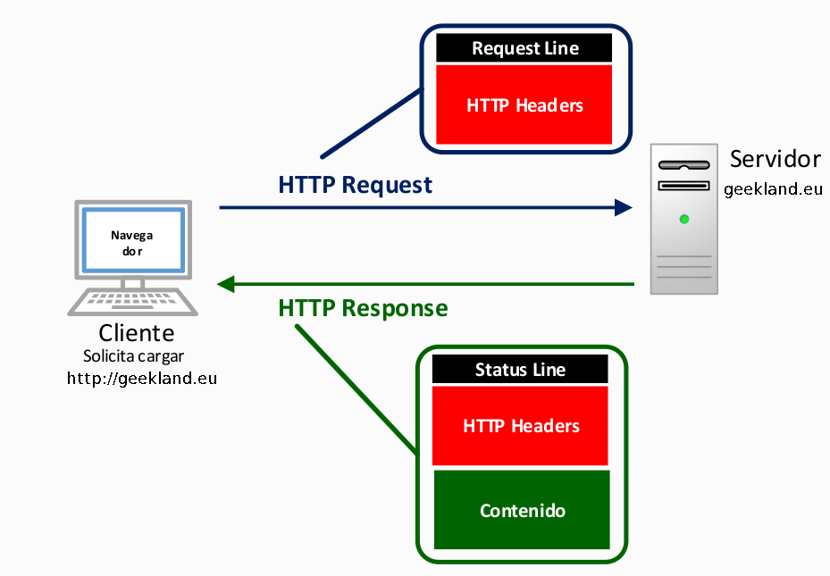
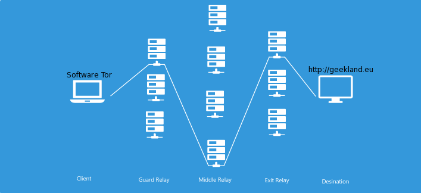
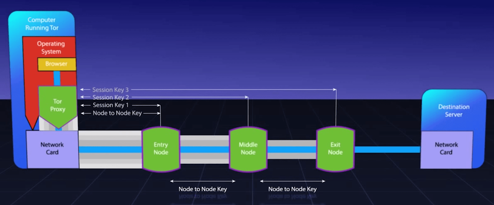
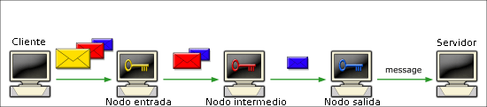
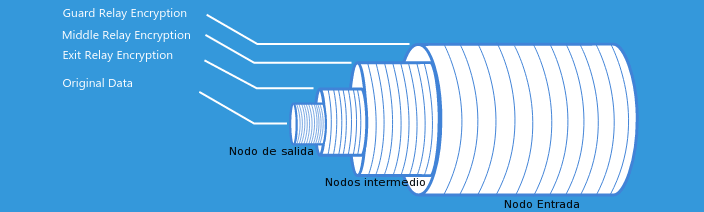

Son muchas las personas que en los últimos años usan y hablan sobre la red Tor. No obstante la gran mayoría de ellos no sabría explicar que es ni como funciona. Por este motivo en el siguiente artículo explicaremos lo que es la red Tor y como funciona.<!--more-->

## ¿QUÉ ES TOR?

TOR es una sigla formada por las palabras “The Onion Router”. La traducción de la palabra The Onion Router vendría a ser enrutador cebolla.

TOR no es más que un proyecto de software libre cuya función es hacer que las comunicaciones entre un cliente y un servidor se hagan mediante lo que se denomina el enrutamiento de cebolla.

###### Nota: En uno de los apartados de este artículo se explica de forma detallada el funcionamiento del enrutamiento de cebolla.

### Objetivos de la red TOR

TOR originariamente fue creado por el ejercito de los Estados Unidos con fines militares a mediados de los años 90. Actualmente TOR es gestionado por un grupo de voluntarios que tienen los siguientes objetivos:

1. Preservar la privacidad cuando navegamos por Internet.
2. Mantener las comunicaciones anónimas y seguras.
3. Asegurar la integridad de la información transmitida por Internet.
4. Proteger la libertad de los usuarios de Internet.
5. Evitar que pueda ser monitorizada y registrada nuestra actividad en Internet.
6. Evitar la censura que determinados países aplican sobre sus ciudadanos.

A pesar de las buenas intenciones de TOR hay que remarcar que también hay gente que utiliza la red TOR para actividades ilegales como por ejemplo:

1. Compraventa de sustancias prohibidas.
2. Compraventa de armas.
3. Distribución pornografía infantil.
4. Contratación de sicarios.
5. Etc

## FUNCIONAMIENTO DE LA RED TOR

Para comprender como funciona TOR primero tenemos que entender el funcionamiento del enrutamiento tradicional.

### FUNCIONAMIENTO DEL ENRUTAMIENTO TRADICIONAL

Si nos conectamos a internet de forma habitual y queremos visitar una página web, se establecerán varias conexiones directas entre nuestro navegador y el servidor que aloja la página que web para poder obtener el contenido que queremos.

Así de este modo si nos queremos conectar a [https://geekland.eu](https://geekland.eu) nuestro navegador enviará directamente una petición al servidor de [https://geekland.eu](https://geekland.eu).

Cuando se reciba la petición, el servidor analizará el contenido de las cabeceras http (HTTP Headers) de nuestra petición para saber el contenido que tiene que proporcionar.

Seguidamente el servidor nos responderá con otras cabeceras http (HTTP Headers) más el contenido que queremos visualizar o descargar.

Una vez detallado el sistema de enrutamiento tradicional podremos ver que presenta varios problemas:

1. En muchas ocasiones la totalidad del proceso no incluye ningún mecanismo de cifrado. Por lo tanto un atacante podría interceptar y/o modificar el contenido que visualizamos o descargamos en nuestro ordenador.
2. Aunque el servidor al que nos conectemos use https seguiremos teniendo problemas. El protocolo https no cifra las cabeceras http. Por lo tanto si un atacante intercepta nuestro tráfico no podrá ver su contenido, pero si podrá saber de donde vienen y donde van los datos interceptados.

Para solucionar estos 2 problemas que acabamos de citar podemos usar el enrutamiento de cebolla que nos proporciona TOR.

### FUNCIONAMIENTO DEL ENRUTAMIENTO CEBOLLA

Para entender bien el funcionamiento del enrutamiento de Cebolla lo podemos dividir en tres partes.

La primera parte consiste en el establecimiento de la ruta a seguir para poder obtener y/o enviar un contenido.

La segunda etapa será el proceso de cifrado de la totalidad de la información que queremos enviar y/o obtener.

La tercera y última etapa consistirá en ir descifrando de forma progresiva la totalidad de información que queremos enviar y/o obtener.

Seguidamente explicaremos de forma detallada cada una de las etapas.

#### Establecimiento de la ruta en el enrutamiento de cebolla

En la siguiente imagen podemos ver una representación gráfica de la ruta que se establece cuando usamos el enrutamiento de cebolla (The Onion Router).

Supongamos que existe un Cliente (Client) que podemos ser nosotros y queremos conectarnos a un destino (Destination) que puede ser la página Web [https://geekland.eu](https://geekland.eu)

Lo primero que observamos es que en este caso la conexión entre nuestro navegador y el servidor de destino no es directa. Existen multitud de puntos intermedios de conexión denominados nodos (Relays).

###### Nota: En la actualidad la red Tor dispone de aproximadamente 7000 nodos que son seleccionados de forma aleatoria. Cuanto mayor sea el número de nodos mayor será la privacidad ofrecida por Tor y su velocidad de navegación.

###### Nota: Los nodos de la red TOR acostumbran a ser públicos y cualquiera de nosotros pueda crear y gestionar uno. Lo único que necesitamos es disponer de un software y de un buen ancho de banda en nuestra casa.

##### Obtención del los nodos disponibles de la red tor

En el momento que queremos conectarnos a una página web con el enrutado de cebolla, el primer paso que realizará el Software TOR de nuestro ordenador es conectarse a Internet para obtener el listado de la totalidad de nodos disponibles en la red.

El listado de nodos obtenidos será usado para crear una ruta de conexión aleatoria.

##### Conexión con el nodo de entrada

Una vez obtenido el listado, el Software TOR seleccionará un nodo de entrada (Guard relay).

A continuación el software TOR se conectará de forma segura con el nodo de entrada usando el protocolo TLS. Una vez establecida la conexión segura se creará una [clave de sesión 1](http://es.ccm.net/contents/125-claves-de-sesion "Explicación de lo que es una clave de sesión") entre el software TOR de nuestro ordenador y el nodo de entrada (Guard relay).

##### Conexión con los nodos intermedios

Para extender la ruta, el software TOR de nuestro ordenador usará la clave de sesión 1 para cifrar un mensaje que enviará al nodo de entrada (Guard relay). Cuando el nodo de entrada reciba el mensaje lo descifrará y de está forma descubrirá el nodo intermedio (Middle Relay) al que se tiene que contactar.

Acto seguido el nodo inicial establece una conexión segura con el nodo intermedio mediante el protocolo TLS. Una vez establecida la conexión el nodo de entrada cifra un mensaje con la clave de sesión 1 en el que informa al software TOR que se ha establecido la conexión entre el nodo entrada y el nodo intermedio.

Al llegar el mensaje del nodo entrada (Guard Relay) al Software Tor se descifra y al confirmarse la conexión entre nodos se establece una clave de sesión 2 entre el software Tor y el nodo intermedio (Middle Relay).

##### Conexión con el nodo de salida

Finalmente el Software Tor selecciona un nodo de salida (Exit Relay). Una vez seleccionado el nodo se cifra esta información con la clave de sesión 1 y con la clave de sesión 2.

El mensaje que contiene el nodo de salida se envía desde el Software Tor al nodo de entrada. En el nodo de entrada se descifra parte del mensaje con la clave de sesión 1 y a posteriori se envía el al nodo intermedio.

Una vez el mensaje llega al nodo intermedio se usa la clave de sesión 2 para descifrar totalmente el mensaje. Acto seguido el nodo intermedio establecerá una conexión segura con el nodo salida (Exit Relay) mediante el protocolo TLS.

Al establecerse la conexión se informará de forma segura al Software Tor de nuestro ordenador que la conexión entre el nodo intermedio y el nodo de salida se ha establecido. Acto seguido se creará una clave de sesión 3 entre el software Tor y el nodo de Salida.

Finalmente el nodo de salida de la red Tor será el encargado de contactar con el destino que en nuestro caso será [https://geekland.eu](https://geekland.eu)

Seguidamente pueden ver una representación gráfica de todo el proceso que acabamos de comentar.

Una vez definida la ruta ya podemos pasar a ver el procedimiento de cifrado usado por TOR.

###### Nota. Como medida de seguridad cada 10 minutos se establecerá una nueva ruta de conexión de forma automática. En los archivos de configuración de TOR podremos modificar este tiempo o si lo precisamos también podemos forzar que se establezca una ruta de forma manual.

#### Método de cifrado de la red TOR

Una vez establecida la ruta cifraremos la totalidad de contenido de nuestra petición.

La totalidad del contenido de nuestra petición estará cifrado mediante criptografía asimétrica. Su funcionamiento es el siguiente,

Antes de entrar en el nodo de entrada la totalidad de nuestra información se cifra por capas del siguiente modo:

###### Nota: Procedimiento suponiendo que hay en nodo de entrada, un nodo intermedio y un nodo de salida.

1. Se usa la clave pública del nodo de salida para cifrar la totalidad de contenido de nuestra petición. De esta forma añadimos una capa de cifrado y aseguramos que únicamente el último nodo podrá descifrar nuestro mensaje.
2. Al mismo tiempo se usa la clave pública del nodo intermedio y de este modo se aplica una segunda capa de cifrado a nuestra petición.
3. Finalmente se usa la clave pública del nodo de entrada para añadir una tercera capa de cifrado a nuestra petición.

Una vez finalizada la etapa de cifrado nuestra petición entra en el nodo de entrada y empezará la transmisión y descifrado de nuestra petición.

#### Proceso de descifrado de nuestra petición

Una vez seleccionada la ruta y cifrada la totalidad de nuestra información, TOR realizará las siguientes acciones:

1. La totalidad de información de nuestra petición y/o mensaje entra dentro del nodo de entrada. Usando la clave privada del nodo de entrada quitaremos la primera de las 3 capas de cifrado. Como el mensaje aún tiene dos capas de cifrado será completamente imposible que el nodo inicial pueda ver nuestro contenido.
2. Seguidamente nuestra petición y/o mensaje se dirigirá al nodo intermedio. Allí usaremos la clave privada del nodo intermedio para quitar la segunda de las 3 capas de cifrado.
3. Para finalizar en el nodo de salida se usará la clave privada del nodo de salida para quitar la última de las capas de cifrado de nuestra petición. Una vez nuestro mensaje está sin cifrar se procederá a la entrega de nuestra petición al servidor, y el servidor nos dará respuesta repitiendo de nuevo el procedimiento que acabamos de describir.

\[caption id="attachment\_7540" align="alignnone" width="498"\] Representación del proceso de descifrado del mensaje\[/caption\]

## BENEFICIOS OBTENIDOS AL USAR EL ENRUTADO CEBOLLA DE LA RED TOR

Una vez conocemos el funcionamiento de la red TOR resulta fácil deducir que su uso implica lo siguiente:

1. Ninguno de los nodos conoce la ruta completa de nuestra petición. Únicamente conocen el nodo que les suministra nuestra petición y el nodo al que le envían nuestra petición. Este hecho es bueno para mejorar nuestra privacidad.
2. Ninguno de los nodos, a excepción del nodo final, puede consultar el contenido o información que estamos enviando o recibiendo. Este es debido a que cada uno de los nodos va quitando una capa de cifrado y hasta que no llegamos al nodo de salida hay capas de cifrado.
3. Nuestra petición o información tiene que pasar forzosamente por los nodos establecidos inicialmente. En caso contrario no se podrá descifrar nuestra petición y por lo tanto nunca obtendremos una respuesta del servidor.
4. Cada uno de los nodos únicamente conoce la información que necesita saber que es la la clave privada para poder descifrar nuestra petición y el siguiente nodo en el que se tiene que enviar la información. Así de este modo aunque un nodo intermedio estuviera comprometido no pasaría absolutamente nada.

Gracias a estos 4 puntos tenemos ciertas garantías que al usar la red TOR y el enrutado de cebolla podemos mejorar considerablemente nuestra privacidad en la red.

## PUNTOS DÉBILES DE LA RED TOR

En la red TOR obviamente existen vulnerabilidades y puntos débiles como por ejemplo los famosos nodos de salida.

A pesar de las vulnerabilidades y de los puntos débiles que puedan existir, en prácticamente la totalidad de casos existen métodos para intentar mitigar estos problemas.

Para ello en el futuro escribiré un artículo en el que se detallarán los puntos más débiles de la red TOR y detallaremos las acciones podemos llevar a término para minimizar los riesgos.

De esta forma evitaremos que nuestra privacidad se pueda ver comprometida.
