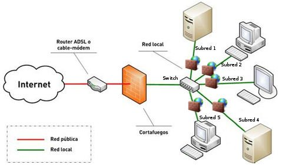
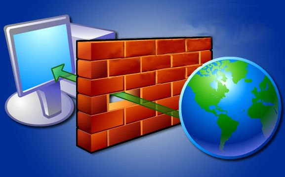
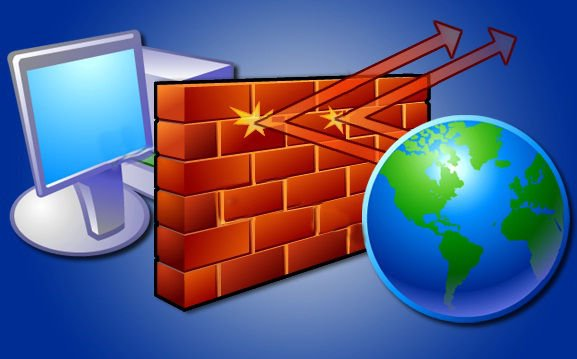
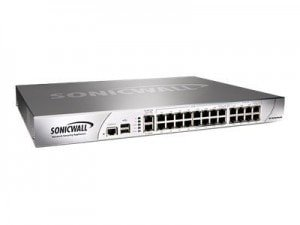

Creo sinceramente que saber que es y para que sirve un firewall es de vital importancia para la totalidad de usuarios que disponen de un ordenador personal en su casa. Para ello he decido crear una serie de dos post con la siguiente temática:

1. **Qué son y para que sirven los Firewall.**
2. [**Como configurar nuestro firewall adecuadamente.**]()

<!--more-->La verdad es que hay multitud de usuarios en Linux que piensan que no es necesario tomar medidas de seguridad usando Linux. Pues la verdad es que según mi humilde punto de vista están bastante equivocados.

Es cierto que en Linux prácticamente no existen Virus, por lo tanto si que podríamos afirmar que el uso de antivirus hoy en día prácticamente no es necesario, pero según mi punto de vista hay precauciones que se deben implementar en la totalidad de sistemas operativos que utilizamos. Una de estas precauciones es disponer de un firewall activado y debidamente configurado. Muchos de vosotros se pregunta que es un Firewall, Para que sirve? Lo necesito? Como lo puedo activar y configurar?

###### Nota: Hoy en día existen otros peligros mucho más graves que los antiguos virus. Algunos de estos peligro pueden ser las temidas redes zombies, malware, Pérdida de información debido a accesos dentro de nuestro ordenador, etc. Por lo tanto da igual el sistema que usemos. Ningún sistema es cien por cien seguro y siempre es aconsejable usar ciertas medidas de seguridad.

###### Nota: En la mayoría de distros linux el firewall está completamente desactivado. Por lo tanto activar y configurar el firewall debería ser una de las primeras cosas que realizamos al instalar una distro.

## QUE ES UN FIREWALL

Un firewall o cortafuegos es un dispositivo de hardware o un software que nos permite gestionar y filtrar la totalidad de trafico entrante y saliente que hay entre 2 redes u ordenadores de una misma red.

Si el tráfico entrante o saliente cumple con una serie de **Reglas** que nosotros podemos especificar, entonces el tráfico podrá acceder o salir de nuestra red u ordenador sin restricción alguna. En caso de no cumplir las reglas el tráfico entrante o saliente será bloqueado.

Por lo tanto a partir de la definición podemos asegurar que con un firewall bien configurado podemos evitar intrusiones no deseadas en nuestra red y ordenador así como también bloquear cierto tipo de tráfico saliente de nuestro ordenador o nuestra red.

###### Nota: En el caso que aú queden dudas pueden aclararlas leyendo el apartado de como funciona un firewall.

## PARA QUE SIRVE UN FIREWALL

Básicamente la función de un firewall es proteger los equipos individuales, servidores  o equipos conectados en red contra accesos no deseados de intrusos que nos pueden robar datos confidenciales, hacer perder información valiosa o incluso denegar servicios en nuestra red.

Así por lo tanto queda claro que es altamente recomendable que todo el mundo utilice un firewall por los siguientes motivos:

1. **Preservar nuestra seguridad y privacidad**.
2. Para **proteger nuestra red doméstica o empresarial**.
3. Para **tener a salvo la información almacenada** en nuestra red, servidores u ordenadores.
4. Para **evitar intrusiones de usuarios usuarios no deseados** en nuestra red y ordenador. Los usuarios no deseados tanto pueden ser hackers como usuarios pertenecientes a nuestra misma red.
5. Para **evitar** posibles **ataques de denegación de servicio**.

Así por lo tanto un firewall debidamente configurado nos podrá proteger por ejemplo contra ataques [**IP address Spoofing**](http://en.wikipedia.org/wiki/IP_address_spoofing "IP Spoofing"), [**Ataques Source Routing**,](http://en.wikipedia.org/wiki/Source_routing "Source Routing") etc.

###### Nota: De nada sirve disponer de un antivirus si no tenemos un firewall debidamente configurado. Si no tenemos un firewall estamos dejando la puerta abierta a un usuario para que pueda acceder a nuestro ordenador.

## COMO FUNCIONA UN FIREWALL

El firewall normalmente se encuentra en el punto de unión entre 2 redes. En el caso que podéis ver en la captura de pantalla se halla en el punto de unión de una red pública (internet) y una red privada.

Así mismo también vemos que cada una de las subredes dentro de nuestra red puede tener otro firewall, y cada uno de los equipos a la vez puede tener su propio firewall por software. De esta forma, en caso de ataques podemos limitar las consecuencias ya que podremos evitar que los daños de una subred se propaguen a la otra.

Lo primero que tenemos que saber para conocer el funcionamiento de un firewall es que la totalidad de información y tráfico que pasa por nuestro router y que se transmite entre redes es analizado por cada uno de los firewall presentes en nuestra red.

Si el tráfico cumple con las **reglas** que se han configurado en los firewall el trafico podrá entrar o salir de nuestra red.

Si el tráfico no cumple con las **reglas** que se han configurado en los firewall entonces el tráfico se bloqueará no pudiendo llegar a su destino.

## TIPOS DE REGLAS QUE SE PUEDEN IMPLEMENTAR EN UN FIREWALL

El tipo de reglas y funcionalidades que se pueden construir en un firewall son las siguientes:

1. **Administrar los accesos de los usuarios a los servicios** privados **de la red** como por ejemplo aplicaciones de un servidor.
2. **Registrar todos los intentos de entrada y salida** de una red. Los intentos de entrada y salida se almacenan en logs.
3. Filtrar paquetes en función de su origen, destino, y número de puerto. Esto se conoce como **filtro de direcciones**. Así por lo tanto con el filtro de direcciones podemos bloquear o aceptar el acceso a nuestro equipo de la IP 192.168.1.125 a través del puerto 22. Recordar solo que el puerto 22 acostumbra a ser el puerto de un servidor SSH.
4. Filtrar determinados tipos de tráfico en nuestra red u ordenador personal. Esto también se conoce como **filtrado de protocolo**. El filtro de protocolo permite aceptar o rechazar el tráfico en función del protocolo utilizado. Distintos tipos de protocolos que se pueden utilizar son **http, https, Telnet, TCP, UDP, SSH, FTP**, etc.
5. **Controlar el numero de conexiones que se están produciendo desde un mismo punto** y bloquearlas en el caso que superen un determinado límite. De este modo es posible evitar algunos ataques de denegación de servicio.
6. **Controlar las aplicaciones que pueden acceder a Internet**. Así por lo tanto podemos restringir el acceso a ciertas aplicaciones, como por ejemplo dropbox, a un determinado grupo de usuarios.
7. **Detección de puertos que están en escucha y en principio no deberían estarlo**. Así por lo tanto el firewall nos puede advertir que una aplicación quiere utilizar un puerto para esperar conexiones entrantes.

###### Nota: En el post de como configurar un firewall adecuadamente  veremos como crear algunas de las reglas que acabamos de ver que se pueden crear.

## LIMITACIONES DE LOS FIREWALL

Lógicamente un Firewall dispone de una serie de limitaciones. Las limitaciones principales de un firewall son las siguientes:

1. Un firewall en principio es probable que no nos pueda proteger contra ciertas vulnerabilidades internas. Por ejemplo cualquier usuario puede borrar el contenido de un ordenador sin que el firewall lo evite, introducir un USB en el ordenador y robar información, etc.
2. Los firewall solo nos protegen frente a los ataques que atraviesen el firewall. Por lo tanto no puede repeler la totalidad de ataques que puede recibir nuestra red o servidor.
3. Un firewall da una sensación de seguridad falsa. Siempre es bueno tener sistemas de seguridad redundantes por si el firewall falla. Además no sirve de nada realizar una gran inversión en un firewall descuidando otros aspectos de nuestra red ya que el atacante siempre intentará buscar el eslabón de seguridad más débil para poder acceder a nuestra red. De nada sirve poner una puerta blindada en nuestra casa si cuando nos marchamos dejamos la ventana abierta.

## TIPOS DE FIREWALL EXISTENTES

Como hemos visto en la definición existen 2 tipos de firewall. Existen **dispositivos de hardware firewall** como por ejemplo un firewall cisco o Routers que disponen de esta función.

Los dispositivos de hardware son una solución excelente en el caso de tengamos que proteger una red empresarial ya que el dispositivo protegerá a la totalidad de equipos de la red y además podremos realizar la totalidad de la configuración en un solo punto que será el mismo firewall.

Además los firewall por hardware acostumbran a implementar funcionalidades interesantes como pueden ser  CFS , ofrecer tecnologías SSL o VPN, antivirus integrados, antispam, control de carga, etc.

**Los firewall por software** son los más comunes y los que acostumbran a usar los usuarios domésticos en sus casas.

El firewall por software se instala directamente en los ordenadores o servidores que queremos proteger y solo protegen el ordenador o servidor en el que lo hemos instalado. Las funcionalidades que acostumbran a proporcionar los firewall por software son más limitadas que las anteriores, y además una vez instalado el software estará consumiendo recursos de nuestro ordenador.

###### Nota: Para incrementar al seguridad en la red se pueden combinar Firewalls por hadware y por software. De este modo conseguiremos incrementar la seguridad frente accesos no deseados. 

## INFORMACIÓN ADICIONAL

En el caso que deseen consultar información adicional de como configurar un firewall pueden consultar el siguiente post:

 [https://geeklandlinux.github.io/posts/configurar-el-firewall-gufw/]()
