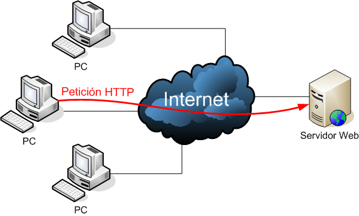
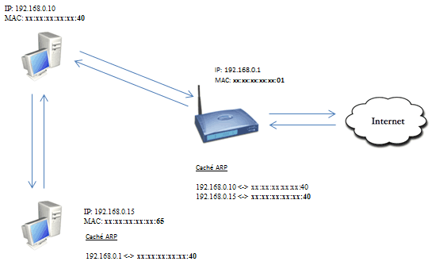
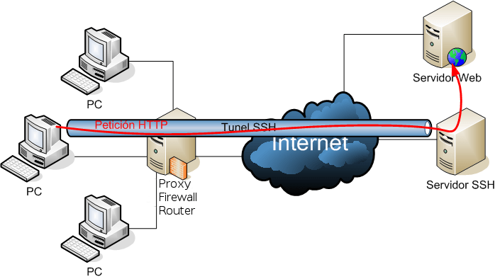

En el siguiente post averiguaremos que es  y para que sirve un túnel ssh. Además en las próximas semanas también publicaré una serie de post para solucionar los siguientes problemas:<!--more-->

1. **Como podemos montar y configurar nuestro propio servidor SSH.** 
2. [**Como podemos establecer un túnel SSH (Secure SHell) para poder navegar de forma segura cuando las circunstancias lo requieran.**]()

## PRINCIPAL UTILIDAD DE UN TÚNEL SSH

La principal utilidad que le podemos dar a un túnel SSH la detallamos a continuación:

Tan solo tenemos que imaginarnos que estamos en un lugar público, como por ejemplo puede ser la cafetería de un aeropuerto, y nos queremos a conectar a una página web a través de nuestro navegador.

En la cafetería del aeropuerto como podéis imaginar no estaremos solos. Como se puede ver en la imagen habrá multitud de usuarios conectados a la misma [red local (LAN)](http://es.wikipedia.org/wiki/Red_de_%C3%A1rea_local "¿Qué es una red de área Local?") que nosotros y como podéis imaginar esto es un problema de seguridad importante.

Básicamente es un problema de seguridad importante porqué somos susceptibles de recibir multitud de ataques que nos pueden lanzar cualquiera de los usuarios que están conectados a la misma red local que nosotros. Algunos de los ataques que podemos sufrir por parte de los integrantes de la red son por ejemplo:

#### 1- Esnifar el tráfico que estamos generando:

Como todos sabemos, hoy en día multitud de conexiones a Internet se realizan mediante el protocolo http. El protocolo http tiene la particular de transferir la información en texto plano sin cifrar.

Por lo tanto esto implica que cualquier integrante de la red local de la cafetería, mediante [Sniffers](http://es.wikipedia.org/wiki/Detecci%C3%B3n_de_sniffer "Sniffer") como [Wireshark](http://www.wireshark.org/ "Wireshark") o [Ettercap](http://ettercap.github.io/ettercap/ "Ettercap"), puede **interceptar nuestro tráfico fácilmente**. Por lo tanto con un simple sniffer el atacante podría averiguar contraseñas de servicios que tenemos contratados o usamos, como por ejemplo el servicio de **wordpress**, **servidores ftp**, **telnet**, etc. Además el atacante podrá averiguar fácilmente a los sitios a los que nos estamos conectando.

#### 2- Un ataque Man in the Middle (MitM):

Cualquier integrante de la red local puede de forma muy fácil realizarnos un ataque **Man in the middle**. Como se puede ver en el gráfico de este apartado, si un atacante lanza el ataque man in the Middle estará interceptando la totalidad de nuestro tráfico tanto de entrada como de salida. Una vez el atacante haya interceptado el tráfico tendrá la capacidad de leer y modificar a voluntad el tráfico que nosotros estamos generando o recibiendo.

Esto es posible porqué el **Host C** se coloca entre el **Host A** y el **Host B**. Cuando el **Host A** envíe tráfico al **Host B**, antes de pasar por el **Host B** pasará por el **Host C**. En el momento que el tráfico pase por el **Host C** el atacante podrá interceptar y modificar el tráfico.

#### 3- Un ataque de envenenamiento ARP o ARP Spoofing:

En el caso que estemos en una red local con un Switch, otro tipo de ataque que cualquiera de los usuarios de la red local nos podría lanzar es el **ARP Spoofing**.

Este ataque básicamente consiste en envenenar el cache ARP de la víctima (**192.168.0.15**) para hacerle creer que el atacante (**192.168.0.10**) es el router o [puerta de enlace](http://es.wikipedia.org/wiki/Puerta_de_enlace "Definición de Puerta de enlace").

###### Nota: Como se puede ver en la imagen el cache ARP de la máquina atacada (192.168.0.15), en vez de tener asociada la MAC address del router (xx:xx:xx:xx:xx:01), tiene asociada la MAC address del atacante (xx:xx:xx:xx:xx:40). Por lo tanto la máquina víctima creerá que el router es el ordenador del atacante y es allí donde enviará la totalidad del tráfico.

De este modo la totalidad de tráfico, tanto de entrada como de salida, generado por la víctima (192.168.0.15) estará pasando por el ordenador del atacante (192.168.0.10). En el momento que la información pase por el ordenador atacante se podrá alterar la información y nos podrán robar datos como por ejemplo contraseñas de servicios que usamos o tenemos contratados.

#### 4- Otros tipos de ataques:

Y la verdad es que la lista de ataques no se termina precisamente aquí. Hay multitud de ataques que nuestro atacante nos podría lanzar como por ejemplo [DNS Spoofing](http://es.wikipedia.org/wiki/Spoofing "Ataque DNS Spoofing"), etc.

## TÚNEL SSH PARA MITIGAR LOS ATAQUES QUE ACABAMOS DE DESCRIBIR

**Estableciendo un túnel SSH seremos capaces de prevenir la serie de ataques que acabamos de describir**.

Básicamente **prevendremos los ataques** **porqué** estableciendo nuestras comunicaciones mediante un túnel SSH **estaremos cifrando la totalidad de nuestro tráfico**.

Como se puede ver en el gráfico, **para establecer un túnel SSH necesitaremos un ordenador**, fuera de nuestra Red local en que la seguridad está comprometida, **que actúe como servidor SSH**.

Al establecer el túnel SSH lo primero que hará **el ordenador que está en la red local comprometida es establecer comunicación con el servidor SSH**.

Como se puede ver en la imagen, **en el momento que el cliente establezca comunicación** con el servidor SSH **se creará un Túnel de comunicación entre el cliente que está en la red local comprometida y el servidor SSH** que está fuera de la red local comprometida.

Un vez establecido el túnel el cliente solicitará por ejemplo visitar una página web como podría ser por ejemplo [https://geeklandlinux.github.io/]()

**Cuando el cliente introduzca la dirección en el navegador se enviará una petición http al servidor SSH con las siguientes particularidades**:

1. **La petición http viajará por el túnel SSH** que hemos establecido.
2. Nuestra petición, y l**a totalidad de tráfico entrante y saliente estará completamente cifrado**.

Por lo tanto aunque recibamos algunos de los ataques mencionados y se intercepte nuestro tráfico dentro de la red local comprometida, nadie podrá obtener nuestras credenciales, ni modificar el contenido de la petición ni robarnos información ya que la información que obtendrán estará completamente cifrada. Por lo tanto con el túnel SSH estamos garantizando la integridad y confidencialidad del tráfico entre nuestro ordenador y el servidor SSH que está fuera de nuestra red Local en una ubicación segura y no susceptible de ataques.

Una vez nuestra petición está en el servidor SSH tendrá que dirigirse al servidor web de la página que queremos conectarnos. En el último tramo la petición ya irá en texto plano y por lo tanto será susceptible de ser interceptada y modificada, pero cabe decir que la probabilidad de tener problemas de confidencialidad y de integridad de nuestros datos en este último tramos es muy baja.

###### Nota: La protección dentro de la red local comprometida es para la totalidad de tráfico entrante y para la totalidad de tráfico saliente.

## CONCLUSIONES SOBRE LA UTILIDAD DE  TÚNEL SSH

Vistas las posibles utilidades y el funcionamiento teórico de un túnel SSH podemos llegar a las siguientes conclusiones:

1. El túnel SSH **es una buena solución para navegar por internet en el caso que nos hallemos en Red local No segura**.
2. La navegación a través de un túnel SSH **garantiza nuestra confidencialidad** ya que nadie podrá conocer las páginas web que estamos visitando ni que estamos haciendo.
3. La navegación a través de un túnel SSH **garantiza la integridad de los datos transmitidos y recibidos** ya que la probabilidad que alguien pueda modificar las datos que enviamos o recibimos es muy baja.
4. Los túneles SSH nos pueden servir también **para vulnerar ciertas restricciones impuestas por nuestro ISP o por ejemplo también nos puede servir para vulnerar ciertas restricciones impuestas por proxies y firewall**.
5. Los túneles SSH **son una buena solución para asegurar la comunicación entre 2 máquinas y para fortificar protocolos débiles** como por ejemplo HTTP, SMTP. FTP, Telnet, etc.
6. **Montarse un servidor SSH propio es sumamente mucho más sencillo que montarse un servidor VPN o un servidor proxy**. En futuros post veremos como disponer un servidor SSH propio en apenas 10 minutos. Hoy en día las cosas hechas por uno mismo acaban siendo siempre más seguras. En Internet por supuesto que existen servicios gratuitos de VPN o proxies que se dedican a ofrecer servicios similares de forma gratuita. Con estos servicios gratuitos hay que ir con cuidado ya que para monetizar el servicio que están prestando nos pueden estar vendiendo a nosotros mismos recolectando información y vendiéndola a terceros.

###### Nota:  Existen muchas otras utilidades aparte de las comentadas. Las utilidades comentadas entiendo que son las más habituales para los usuarios comunes como somos nosotros.

## LIMITACIONES DE LOS TÚNELES SSH

Como todos saben la seguridad absoluta no existe. El hecho de aplicar está técnica u otras descritas lo único que hará es poner las cosas más difíciles a los posibles atacantes. Ya saben que para cualquier problema un atacante siempre puede encontrar una solución.

Las principales limitaciones de navegar o usar ciertas aplicaciones mediante túneles SSH son las siguientes:

1. En la comunicación entre cliente y servidor **existen tramos en el que la información viaja sin encriptar**. Concretamente hablo del tramo que va del servidor SSH al servidor Web y del servidor web al Servidor SSH. En este tramo un atacante podría comprometer la integridad y la confidencialidad de los datos transmitidos. No obstante la probabilidad que esto llegue a suceder es baja.
2. Para poder navegar a hacer peticiones a través del túnel SSH **hay que configurar aplicación por aplicación**. Así por ejemplo si queremos navegar de forma segura tendremos que configurar adecuadamente nuestro navegador. En el caso que queramos descargar torrents a través de nuestro túnel SSH también tendremos que configurar nuestro gestor de torrents adecuadamente y así sucesivamente.

Llegado a estas alturas quien quiera poner en práctica el uso de túneles SSH tan solo tiene que consultar el siguiente post:

[https://geeklandlinux.github.io/posts/establecer-un-tunel-ssh/]()
