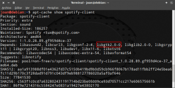

En algunas ocasiones cuando vamos a instalar un tema de escritorio en nuestra distribución Linux, nos preguntamos la versión de librerías GTK que tiene nuestro sistema operativo para ver si el tema que queremos instalar es compatible con nuestra distribución.<!--more-->

Si queremos tener una respuesta a esta pregunta tan solo tenemos que seguir las indicaciones de este post, pero antes de saber la versión de librerías GTK usadas por nuestro sistema operativo es interesante saber que son las librerías GTK.

## ¿QUÉ SON LAS LIBRERÍAS GTK?

Las librerías GTK son un **conjunto de ficheros creados por el equipo de GTK y Gnome que son usados por los programadores con el fin de crear las interfaces gráficas de los entornos de escritorio y** de la totalidad de **programas** que se ejecutan en sobre nuestro sistema operativo.

El conjunto de librerías que incluye GTK son GTL, Glib, GTK, GDK, ATK, Pango y Cairo. Cada una de estas librerías tienen las funciones que pueden ver detalladas en el siguiente [enlace](https://es.wikipedia.org/wiki/GTK%2B "Detalle de las funciones de cada una de las librerías").

Algunos de los entornos de escritorio que utilizan las librerías GTK para definir su aspecto gráfico son los siguientes:

1. XFCE
2. Gnome Shell
3. LXDE (Aunque LXDE)
4. Rox
5. Mate
6. Pantheon
7. Cinammon
8. etc

Algunos gestores de ventanas de utilizan GTK son los siguientes:

1. xfwm4
2. Metacity
3. Openbox
4. IceWM
5. etc

Finalmente algunos programas conocidos que utilizan las librerías GTK son los siguientes:

1. Chromium
2. Pidgin
3. Gimp
4. Inkscape
5. Midori
6. VMWare
7. etc

En el caso de requerir información adicional acerca de GTK pueden consultar el siguiente enlace de la [wikipedia](https://en.wikipedia.org/wiki/GTK%2B "Información adicional sobre las librerías GTK").

###### Nota: Las librerías GTK no son exclusivas de Linux. Las librerías GTK también se pueden usar en otros sistemas operativos como por ejemplo en Windows, Mac OS X o en dispositivos móviles.

## VERSIONES ACTUALES EXISTENTES DE LA LIBRERÍAS GTK

Las librerías GTK están en constante evolución y con el paso del tiempo van apareciendo nuevas versiones y nuevas actualizaciones.

Así de este modo **en la actualidad están conviviendo las versiones 2 y 3 y es necesario disponer de ambas versiones** para poder visualizar de forma correcta la totalidad de software en nuestro ordenador.

###### Nota: Con el paso del tiempo las aplicaciones basadas en GTK2 migrarán a GTK3 y la versión GTK2 quedará obsoleta.

###### Nota: Para ver el histórico de versiones existentes de GTK pueden consultar el siguiente [enlace](https://en.wikipedia.org/wiki/GTK%2B "Consultar el histórico de versiones de GTK").

## ¿QUÉ VERSIÓN DE LIBRERÍAS GTK TIENE NUESTRO SISTEMA OPERATIVO?

Una vez tenemos un conocimiento básico de lo que estamos hablando, podemos pasar a ver la versión de librerías GTK que tenemos instaladas en nuestro ordenador. Para ello tenemos como mínimo 2 opciones.

La primera de ellas es **abrir una terminal y ejecutar el siguiente comando**:

> ```
> apt-cache policy libgtk2.0-0 libgtk-3-0
> ```

Después de ejecutar el comando obtendremos la siguiente captura de pantalla:

[](images/Versión-de-librerias-GTK.png)

**Si leemos el contenido de la captura de pantalla vemos que tenemos instaladas 2 versiones de librerías GTK**:

1. **La primera de ellas corresponde a la versión 2.24.30-1.1** que nos será útil para visualizar correctamente todas las aplicaciones desarrolladas usando librerías GTK2 como por ejemplo Thunar, Gimp, Audacity, Filezilla, Spotify, Firefox, etc.
2. **La segunda versión corresponde a la versión 3.20.3-2** que nos será útil para visualizar correctamente todas las aplicaciones desarrolladas usando librerías GTK3 como por ejemplo Catfish, Transmission, Corebird, Evince, Synaptic, Nautilus, Parole, Handbrake, etc.

Después de ver los resultados obtenidos podemos afirmar que en Debian testing (Stretch) estoy usando las 2 versiones más actuales de librearías GTK.

**Otro comando alternativo** que podemos usar para comprobar la versión de las librerías GTK **es el siguiente**:

> ```
> dpkg -l libgtk2.0-0 libgtk-3-0
> ```

[](images/Versión-librerias-GTK-version-2.png)

Si observamos la captura de pantalla veremos que **los resultados obtenidos son exactamente los mismos** que con el comando anterior.

## SABER SI UN PROGRAMA DETERMINADO USA GTK2 O GTK3

En el algún caso en particular puede ser útil conocer la versión de librerías GTK que usa un programa determinado. Para ello tan solo tenemos que abrir una terminal y **teclear el comando apt-cache show seguido del nombre del programa**. Así por lo tanto **si queremos saber las librerías gtk usadas por transmission** tan solo tenemos que **abrir una terminal y ejecutar el siguiente comando**:

> ```
> apt-cache show transmission-gtk
> ```

[](images/Librerias-de-transmission.png)

Tal y como se puede ver en la captura de pantalla **en el apartado de dependencias vemos que** Transmission **depende de la librería libgtk-3-0. Por lo tanto Transmission utiliza librerías GTK3**.

###### Nota: El comando equivalente con el gestor de paquetes aptitude es aptitude show transmission-gtk

**En el caso que queramos comprobar las librerías GTK usadas por Spotify** tan solo tenemos que **abrir una terminal y ejecutar el siguiente comando**:

> ```
> apt-cache show spotify-client
> ```

[](images/Librerías-spotify.png)

Tal y como se puede ver en la captura de pantalla, en el apartado de dependencias vemos que **Spotify depende de la librería libgtk2-0-0. Por lo tanto Spotify utiliza librerías GTK2**.

###### Nota: El comando equivalente con el gestor de paquetes aptitude es aptitude show spotify-client

## OBTENER UN LISTADO DE PROGRAMAS QUE USAN LIBRERIAS GTK2

Si queremos obtener un listado de programas que funcionan con las librerías GTK2 **abrimos una terminal y ejecutamos siguiente comando**:

> ```
> apt-cache rdepends libgtk2.0-0
> ```

###### Nota: El comando equivalente con el gestor de paquetes aptitude es aptitude search '~i ~D libgtk2.0-0'

## OBTENER UN LISTADO DE PROGRAMAS QUE USAN LIBRERÍAS GTK3

En el caso que queramos obtener un listado de aplicaciones que utilizan librerías GTK3 **ejecutamos el siguiente comando en la terminal**:

> ```
> apt-cache rdepends libgtk-3-0
> ```

###### Nota: El comando equivalente con el gestor de paquetes aptitude es aptitude search '~i ~D libgtk-3-0'

## OBTENER UN LISTADO DE PROGRAMAS QUE USAN LIBRERÍAS QT

Es posible que en los listados obtenidos en los 2 últimos apartados no encontréis la totalidad de programas que usáis, o que veáis que un programa determinado no dependa de ninguna librería GTK. Esto es debido a que hay programas que en vez de las Librerías GTK utilizan librerías QT.

Para obtener un listado de los programas que utilizan librerías QT tan solo tenemos que **abrir una terminal y ejecutar el siguiente comando:**

> ```
> apt-cache rdepends libqtcore4
> ```

###### Nota: El comando equivalente con el gestor de paquetes aptitude es aptitude search '~i ~D libqtcore4'

## CONSEJO PARA OBTENER LOS LISTADOS DE PROGRAMAS

En los 3 últimos apartados obtendréis listados muy largos y es posible que no se puedan visualizar de forma completa en la terminal. Para solucionar este problema podemos volcar el contenido de la terminal en un fichero de texto.

Para ello, a modo de ejemplo, tan solo tenemos que abrir una terminal y ejecutar el siguiente comando:

> ```
> apt-cache rdepends libqtcore4 > ~/QT.txt
> ```

El comando que acabamos de ejecutar nos listará la totalidad de programas y paquetes que dependen de las librerías QT. El contenido listado lo encontraremos en un fichero de texto con nombre QT ubicado en nuestra home.
