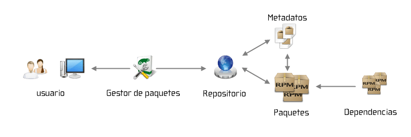

En el momento que un usuario novel empieza a usar Linux hay muchos conceptos que desconoce. Uno de estos conceptos son los repositorios y por este motivo en el siguiente artículo detallaré de la forma más clara posible los siguientes aspectos:

1. ¿Qué es un repositorio?
2. ¿Cómo funciona un repositorio?
3. ¿Qué ventajas nos proporciona instalar software a través de un repositorio?

<!--more-->

## ¿QUÉ SON LOS REPOSITORIOS EN LINUX?

Si hacemos referencia al ámbito de Linux, un repositorio es un servidor accesible mediante internet que almacena paquetes y programas para que nosotros los podamos descargar e instalar en nuestra distribución GNU-Linux.

Cada una de las distribuciones GNU-Linux dispone de sus propios repositorios en los que se hallan los programas que nosotros podemos instalar en nuestro equipo. Aparte de los repositorios propios de cada una de las distribuciones, también podemos añadir y usar repositorios de terceros que contendrán versiones más actuales del software que tenemos instalado o programas que no han incluido los creadores de la distro que usamos.

Los gestores de paquetes, como por ejemplo Apt, YaST o Pacman, son las herramientas que usaremos para descargar e instalar el software de un repositorio.

### Ejemplo de instalación de software a través de un repositorio

Si en nuestra distribución Linux queremos instalar el reproductor de vídeo VLC ejecutaremos el siguiente comando en la terminal:

> ```
> sudo apt-get install vlc
> ```

En el momento de ejecutar el comando sucederá lo siguiente:

1. Con el gestor de paquetes apt nos conectaremos al repositorio de internet que contiene los paquetes que queremos descargar. Antes de empezar la descarga, mediante un par de claves asimétricas, un sistema de firmas y una función hash se comprobará que los paquetes a descargar provienen de un repositorio seguro y no han sido modificados por nadie.
2. Una vez realizada la comprobación se descargaran los paquetes y dependencias necesarias para instalar VLC.
3. Una vez descargados los paquetes se procederá a la instalación de los mismos.

\[caption id="attachment\_8536" align="alignnone" width="569"\][](images/funcionamiento-instalacion-paquetes.png) Esquema ilustrativo del funcionamiento de un repositorio\[/caption\]

### Quien realiza el mantenimiento de los repositorios

Los repositorios de cada una de las distribuciones Linux son mantenidos, gestionados y actualizados por los siguientes actores:

1. El personal que creo y gestiona la distribución Linux
2. La comunidad del software Libre.

En el caso que usemos repositorios de terceros ajenos a nuestra distribución Linux, la gestión y el mantenimiento es realizado por:

1. El personal que gestiona el repositorio.

###### Nota: En el caso que usemos repositorios de terceros hay que asegurar que estén gestionados por personas confiables. En caso contrario podríamos estar instalando malware en nuestro sistema operativo.

## VENTAJAS QUE PROPORCIONAN LOS REPOSITORIOS

El uso de repositorios para instalar software proporciona las siguientes ventajas:

1. Instalar software a nuestro equipo de forma mucho más sencilla que en otros sistemas operativos. En Linux nunca tendremos la necesidad de buscar y descargar programas de Internet. Cabe recordar que muchas de las infecciones en Windows se producen al instalar software proveniente de sitios de dudosa reputación.
2. Tendremos la seguridad que el software instalado proviene de una fuente segura y esta libre de malware. Los repositorios de donde nos descargamos los programas disponen de las medidas de seguridad necesarias para asegurar que los programas descargados están libres de Virus y Malware.
3. El proceso de actualización del sistema operativo es mucho más sencillo. En el momento que se actualizan los repositorios podremos actualizar fácilmente nuestro sistema operativo mediante nuestro gestor de paquetes.

## DESVENTAJAS QUE PROPORCIONAN LOS REPOSITORIOS

El uso de repositorios únicamente presenta la siguiente desventaja frente otros sistemas operativos.

1. En el caso que queramos instalar un programa o actualizar el sistema operativo precisamos de una conexión de internet. Esto es así por que descargar la totalidad de dependencias de un programa de forma manual exige demasiado tiempo.

En lo particular para mi esto no es ningún tipo de desventaja porque hoy en dia todo el mundo dispone de conexión a Internet, pero lo cito porque para algunos se ve que si lo es un problema. No obstante, si algún día se generaliza el uso de los paquetes [Flatpak](https://es.wikipedia.org/wiki/Flatpak "Explicación de lo que es la paqueteria flatpak") o Snap este inconveniente desaparecería por completo.
