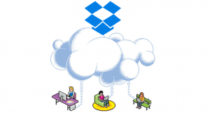

Hace ya varios años que se está hablando constantemente de la nube, de la computación en la nube, de los servicios en la nube, etc. A pesar de esto a día de hoy hay muchas personas que siguen sin entender estos conceptos. Por este motivo en el siguiente artículo intentaré explicar estos conceptos de forma que todo el mundo los pueda entender.<!--more-->

## ¿QUÉ ES LA NUBE?

**La nube es simplemente una metáfora para hacer referencia a los servicios que se usan a través de Internet**. El origen de esta metáfora es el siguiente:

Históricamente Internet siempre se ha representado como una nube en el momento de esquematizar el funcionamiento de infraestructuras de red y servicios. Así por ejemplo si estudiamos un esquema simplificado del funcionamiento de Dropbox podemos ver lo siguiente:

Para que la información fluya de Dropbox a los usuarios y viceversa precisamos de internet, y tal como se puede ver en el esquema, Internet es representado como una nube.

A raíz de estas representaciones esquemáticas y de la proliferación de servicios similares a Dropbox, nació el concepto nube para hacer referencia a los servicios que se usan a través de internet.

###### Nota: Técnicamente la representación gráfica de la nube en un esquema quiere decir que hay un proceso de comunicación entre 2 puntos, que no pertenecen a una misma red, que permite que los datos lleguen desde un punto a otro.

## ¿QUÉ SON LOS SERVICIOS EN LA NUBE O EL CLOUD COMPUTING?

Llamamos servicios en la nube a **todo aquel programa o servicio que usamos y no está físicamente instalado en nuestro ordenador o equipo**. La forma de acceder a estos servicios que no están instalados en nuestro ordenador es mediante internet.

Todo servicio en la nube normalmente consta de varios centros de procesamiento de datos que disponen de un software instalado para proporcionarnos un servicio. Nosotros con nuestros ordenadores, tablets o teléfono lo único que hacemos es conectarnos vía Internet a estos centros de datos para poder llevar a término la tarea que tenemos que realizar.

A modo de ejemplo, en el momento que accedemos a nuestra cuenta de Dropbox, lo único que estamos realizando es conectarnos vía internet a un centro de procesamientos de datos con ubicación desconocida que almacena nuestros datos. Una vez conectados al centro de procesamiento de datos, el software de Dropbox que corre sobre el centro de procesamiento de datos nos permitirá descargar y subir nuestros archivos.

## SERVICIOS EN LA NUBE QUE TODO EL MUNDO UTILIZA

Algunos ejemplos de servicios en la nube que todo el mundo acostumbra a utilizar son los siguientes:

1. **Tiendas de aplicaciones** como por ejemplo la de Google Play, la App Store, etc.
2. **Aplicaciones web** como por ejemplo la suite ofimática de google Gdrive, la suite Ofimática de Microsoft Office 365, el correo de gmail, etc.
3. **Servicios para almacenar nuestros datos** como por ejemplo Dropbox, [Owncloud](), Box, OneDrive, etc.
4. **Plataformas musicales o de videojuegos** como por ejemplo Spotify o Steam.
5. Etc.

## VENTAJAS DE LOS SERVICIOS EN LA NUBE

Obviamente la computación en la nube y los servicios en la nube tienen una serie de ventajas que son innegables. Algunas de las ventajas que nos ofrecen son las siguientes:

1. **Facilidad de acceso** ya que podemos acceder a un servicio o a nuestros datos desde cualquier equipo estemos donde estemos. Únicamente precisamos de una conexión a Internet.
2. Generalmente los servicios ubicados en la nube son muy **fáciles de usar** ya que están específicamente diseñados para que los usen usuarios no avanzados.
3. Si los servicios en la nube son gestionados por terceros **no nos tenemos que preocupar por nada**. Empresas especializadas ofrecen servicios de Cloud Computing y se encargarán de realizar la totalidad del mantenimiento, las actualizaciones de software, invertir en infraestructura, etc.
4. Obviando la privacidad, **nuestros datos están más seguros en la nube**. Prácticamente la totalidad de servicios en la nube disponen de replicas. Así en el hipotético caso que se estropeará o destruyera el centro de procesamientos de datos que almacena nuestros archivos de dropbox, no pasaría nada porque los mismos datos estarían ubicados en otros centros datos.
5. Los servicios **permiten un ahorro económico** en software, en hardware y en mantenimiento ya que podemos contratar específicamente los recursos que necesitamos, el coste del consumo eléctrico y la totalidad de costes fijos se dividen entre la totalidad de usuarios del servicio, etc.

## INCONVENIENTES DE LOS SERVICIOS EN LA NUBE

Obviamente la computación en la nube y los servicios en la nube también tienen inconvenientes y existen personas que son totalmente contrarias a su uso. Los motivos son los siguientes

1. Los servicios en la nube gestionados por terceros acostumbran a generar **problemas de privacidad** ya que en muchos casos están almacenando información personal sin que nosotros sepamos el uso que le pueden dar.
2. Subir información a una cierta plataforma puede generar **problemas de propiedad intelectual**. Es posible que existan servicios que en sus condiciones de servicio especifiquen que la totalidad de contenido almacenado en sus servidores pasa a ser de su propiedad.
3. Actualmente **existen vacíos legales** importantes sobre las leyes que aplican en determinados servicios en la nube. Un ejemplo sencillo es si una empresa Canadiense dispone de servidores en Alemania, ¿Qué ley debe aplicarse sobre la información almacenada en los servidores de Alemania? ¿La Canadiense o la Alemana?
4. Tenemos el **riesgo que el servicio pueda desaparecer**. En el momento que desaparezca un servicio podemos perder fácilmente la información almacenada en el servicio y el pago por avanzado que se haya realizado para usar el servicio. Imagino que sobre este punto todo el mundo recordará el caso Megaupload.
5. Para acceder al servicio en la nube **es necesario disponer de internet**. Si no tenemos Internet no lo podremos usar.

**Parte de los inconvenientes** que acabamos de citar **se pueden solucionar contratando la infraestructura necesaria para que nosotros mismos podamos montar nuestros propios servicios en la nube con Software libre**. Para ello les recomiendo leer el siguiente apartado.

## DISPONER DE NUESTROS PROPIOS SERVICIOS EN LA NUBE

Para evitar parte de los problemas que ofrecen los servicios en la nube gestionados por terceros, lo primero que necesitamos realizar es **contratar una infraestructura sobre la que nosotros podamos instalar servicios en la nube** basados en software libre.

Existen multitud de empresas ofrecen el hardware necesario para poder construir nuestros servicios en la nube, no obstante en mi caso recomiendo 1&1. Los motivos de mi recomendación son los siguientes:

1. El servicio ofrecido no tiene ningún tipo de permanencia. Por lo tanto en cualquier momento podemos cambiar de proveedor sin tener ningún tipo de penalización.
2. La relación calidad precio ofrecida es buena y está avalada por lo obtención del premio cloud spectator al servicio de cloud computing que ofrece mejor relación calidad precio.

###### Nota: Si quieren obtener mayor información sobre los resultados y participantes del [análisis realizado por Cloud Sptectator](http://connect.cloudspectator.com/cloud-vendor-benchmark-2016-pdf-download) pueden consultar el siguiente enlace.

**Una vez hayamos contratado y configurado el hardware** ya **podemos instalar los servicios en la nube** que necesitemos utilizar. **Para ello podemos contratar un administrador de sistemas o seguir tutoriales realizados por la comunidad que encontrarán en Internet**. En este mismo blog existen numerosos ejemplos de como instalar y configurar servicios en la nube como el tutorial para crear y configurar un servidor openvpn o sobre la instalación de un servidor Owncloud con SSL y Webdav.
