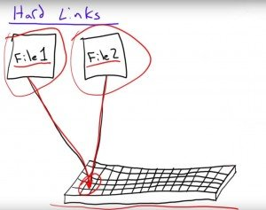
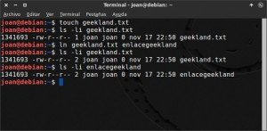
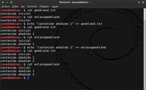
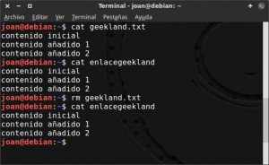
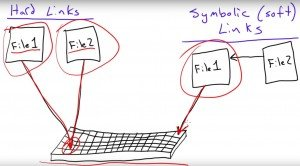
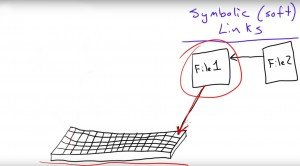
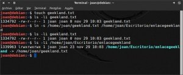
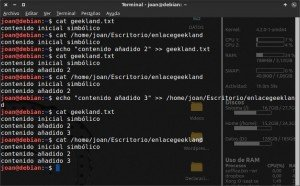
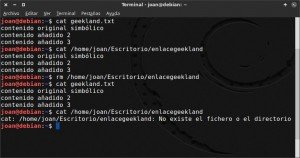

Multitud de personas que se inician en Linux se preguntan como crear lo que en Windows se denomina un acceso directo para poder acceder de forma rápida y cómoda a los programas o ubicaciones de uso más habitual. Con el fin de resolver esta duda, en este artículo explicaremos todo lo que un usuario de Gnu-Linux debería saber sobre los enlaces o accesos directos en Linux.<!--more-->

## ¿EXISTEN LOS ACCESOS DIRECTOS EN LINUX?

Lo primero que tenemos que saber es que **en Linux no existe lo que en Windows se llama acceso directo**. **En Linux los accesos directos se llaman enlaces**.

Además **existen dos tipos de enlaces**, **los enlaces duros y los enlaces simbólicos**. En los siguiente apartados explicaremos y veremos en detalle que son y para que podemos usar cada uno de los tipos de enlaces que acabamos de citar.

## ENLACES DUROS, FUERTES O HARD LINKS

### ¿Qué son los enlaces duros?

Para entender lo que es un enlace duro, lo primero que tenemos que saber es que en Linux cada fichero y cada carpeta del sistema operativo tienen asignado un número entero llamado inodo.

Este inodo es único para cada uno de los archivos y cada una de las carpetas. La información que almacena cada uno de los inodos de los distintos archivos y carpetas es la siguiente:

1. Los permisos del archivo o carpeta.
2. El propietario del fichero y carpeta.
3. **La posición/ubicación del archivo** o de la carpeta dentro de nuestro disco duro.
4. La fecha de creación del archivo o directorio.
5. Etc.

###### Nota: Para ver la totalidad de información almacenada en cada inodo pueden consultar el siguiente [enlace](https://es.wikipedia.org/wiki/Inodo "Explicación de la información que almacena un inodo").

Una vez comprendido esto, podemos decir que **un enlace duro es un archivo que apunta al mismo contenido almacenado en disco que el archivo original**.

Por lo tanto los archivos originales y los enlaces duros dispondrán del mismo inodo y consecuentemente ambos estarán apuntando hacia el mismo contenido almacenado en el disco duro. De este modo, tal y como se puede ver representado en la imagen, **un enlace duro no es más que una forma de identificar un contenido almacenado en el disco duro con un nombre distinto al del archivo original**.

[](images/Explicación-gráfica-del-enlace-duro.jpg)

**Se podrá realizar un enlace duro de un archivo siempre y cuando el archivo esté en la misma partición del disco duro que pretendemos crear el enlace**. Esto es forzosamente así porque cada partición de nuestro disco duro dispone de su propia tabla de inodos, y se tiene que evitar la posibilidad de que un mismo número de inodo esté apuntado a dos ubicaciones distintas de nuestro disco duro.

### ¿Cómo podemos crear un enlace duro?

Generando un enlace duro podremos asimilar mucho mejor lo que acabamos de explicar en el apartado anterior.

Para comprender bien lo que es un enlace duro crearemos un archivo de texto ejecutando el siguiente comando en la terminal:

> ```
> touch geekland.txt
> ```

Una vez creado el archivo vamos o consultar su número de inodo ejecutando el siguiente comando en la terminal:

> ```
> ls -li geekland.txt
> ```

El resultado obtenido en mi caso es el siguiente:

> ```
> 1341693 -rw-r--r-- 1 joan joan 0 nov 17 22:50 geekland.txt
> ```

Por lo tanto el inodo del archivo que acabamos de crear es el **1341693**. También vemos que actualmente solo hay **1** archivo/entrada en el sistema que esté apuntando al mismo inodo.

Una vez creado el archivo **crearemos un enlace duro** hacia el archivo que acabamos de crear **introduciendo el siguiente comando en la terminal**:

> ```
> ln geekland.txt enlacegeekland
> ```

Cada una de las partes del comando para crear el enlace duro tienen el siguiente significado:

**ln:** Es el comando encargado de realizar enlaces entre ficheros.

**geekland.txt:** Es la ruta o nombre del archivo original que tenemos en nuestro disco duro.

**enlacegeekland:** Corresponde a la ruta o nombre del enlace duro que vamos a crear.

**Una vez ejecutado el comando se habrá realizado el enlace** duro.

###### Nota: A quien no le guste usar la terminal para crear enlaces duros, tiene que saber que también se pueden crear usando el entorno gráfico de su entorno de escritorio.

Una vez creado el enlace volveremos a comprobar el número de inodo del archivo original ejecutando de nuevo el siguiente comando en la terminal:

> ```
> ls -li geekland.txt
> ```

Ahora el resultado obtenido es el siguiente:

> ```
> 1341693 -rw-r--r-- 2 joan joan 0 nov 17 22:50 geekland.txt
> ```

Como se puede ver el número de inodo sigue siendo el mismo que antes, pero ahora hay **2** archivos/entradas apuntando hacia el mismo inodo. Estos 2 archivos/entradas son el archivo original más el enlace duro que acabamos de crear.

Seguidamente comprobaremos el número de inodo del enlace duro que hemos creado ejecutando el siguiente comando en la terminal:

> ```
> ls -li enlacegeekland
> ```

El resultado obtenido es:

> ```
> 1341693 -rw-r--r-- 2 joan joan 0 nov 17 22:50 enlacegeekland
> ```

Por lo tanto se puede observar que tanto el enlace duro como el archivo que hemos creado apuntan al mismo inodo, y consecuentemente apuntan hacia la misma información almacenada en nuestro disco duro. Además tanto el enlace duro como el archivo original disponen de los mismos permisos, del mismo propietario y forman parte del mismo grupo.

En la siguiente captura de pantalla se puede visualizar la totalidad de operaciones realizadas hasta el momento:

[](images/Resumen-de-los-pasos-para-crear-un-enlace-duro.jpg)

### Crear enlaces duros recursivos de todo un directorio

Acabamos de ver como crear un enlace duro de un único archivo. **En el caso que queramos crear enlaces duros en masa de la totalidad de contenido almacenado en un directorio** **también lo podemos realizar** **muy fácilmente**.

Imaginemos que en la ubicación /home/joan/vacaciones dispongo de una serie de fotos y quiero crear un enlace duro de la totalidad de fotos de esta carpeta en mi escritorio. Para conseguir mi objetivo **tan solo hay que ejecutar el siguiente comando en la terminal**:

> ```
> cp -rl /home/joan/vacaciones /home/joan/Escritorio/vacaciones/
> ```

Cada una de las partes del comando usado para crear los enlaces duros recursivos tienen el siguiente significado:

**cp:** Se refiere al comando copy que es el que usamos para crear los enlaces duros de forma masiva.

**\-rl:** La letra r hace referencia a recursivo y la letra l hace referencia a enlace duro. Por lo tanto añadiendo estas 2 opciones hacemos que se copien la totalidad de archivos de una carpeta a otra mediante la creación de enlaces duros.

**/home/joan/vacaciones:** Es la ruta de la carpeta que contiene las fotos originales.

**/home/joan/Escritorio/vacaciones:** Es la ruta de la carpeta en la que queremos crear los enlaces duros.

**Una vez ejecutado este comando habremos creado de un plumazo multitud de enlaces duros** sin ningún tipo de esfuerzo.

### Propiedades y particularidades de los enlaces duros

Con lo visto en los apartados anteriores y usando nuestra capacidad de deducción, podemos afirmar que algunas de las propiedades y particularidades que tenemos que tener en cuenta de los enlaces duros son las siguientes:

**1-** **Cualquier cambio que se introduzca en el archivo original o en el enlace duro, afecta a los dos por igual**. Por lo tanto, tal y como se puede ver en la captura de pantalla, si en el archivo de texto **geekland.txt** añadimos texto, también se añade en el enlace duro **enlacegeekland**, y si añadimos texto en el enlace duro **enlacegeekland** también se añade en el archivo **geekland.txt**. Por lo tanto podemos considerar que **el enlace duro es una copia exacta del archivo original**.

[](images/cualquier-cambio-afecta-a-los-2-archivos.jpg)

**2-** Tal y como se puede ver en la captura de pantalla, **en el caso de borrar el archivo original** **geekland.txt** **aún podemos tener acceso al contenido** **a través de su enlace duro** **enlacegeekland**.

[](images/borrando-archivo-original.jpg)

Por lo tanto **el contenido no se borrará hasta que no se hayan eliminado por completo tanto el archivo original como la totalidad de enlaces duros**.

**3-** **No se pueden crear enlaces duros de carpetas**. Antiguamente era posible realizarlos y es posible que haya algún sistema operativo que aún lo permita, pero la mayoría de sistemas operativos actuales no lo permiten debido a que este hecho puede transformar la [estructura de directorios de Linux](). A quien le interese profundizar sobre este tema puede consultar la siguiente [página](https://unix.stackexchange.com/questions/22394/why-hard-links-not-allowed-to-directories-in-unix-linux/22406#22406 "Motivo por el que no se pueden crear enlaces duros de carpetas").

**4-** **Los enlaces duros ocupan menos tamaño en el disco duro que los enlaces simbólicos**. El tamaño que ocupará un enlace simbólico será proporcional al número de caracteres del nombre del archivo que apunta, mientras que el tamaño de un enlace duro siempre será el mismo ya que es simplemente es un puntero que nos lleva a una ubicación del disco duro.

**5-** **El acceso al contenido a través de un enlace duro es más rápido que en los enlaces simbólico**. Esto es así porque mientras el enlace duro apunta directamente a un contenido almacenado en nuestro disco duro, el enlace simbólico apunta al nombre de un archivo y posteriormente el archivo apunta a un contenido almacenado en nuestro disco duro. Por lo tanto en los enlaces simbólicos existe un paso adicional para acceder a la información que penaliza en tiempo.

[](images/Diferencia-entre-enlace-duro-y-enlace-simbólico.jpg)

**6-** Los enlaces duros **únicamente se pueden usar en la partición en la que los hemos creado**. Por lo tanto si creamos un enlace duro en la partición /home, no lo podremos usar en la partición /root.

**7-** **Si cambiamos de ubicación el archivo original el enlace duro no se rompe** y lo podemos usar sin ningún tipo de problema.

**8-** **Los permisos, el propietario y el grupo del enlace duro serán los mismos que el del archivo original**. Esto es así porque, como hemos visto anteriormente, el enlace duro y el archivo original tienen el mismo inodo, y por lo tanto forzosamente siempre tendrán las mismas propiedades. Un enlace duro no es más que una copia del archivo original.

### Utilidades y ventajas de los enlaces duros

Seguramente existen más utilidades en las que los enlaces duros son particularmente útiles. No obstante en mi caso se me ocurren las siguientes aplicaciones.

1. **Realizar copias de seguridad incrementales ahorrando espacio en disco duro y un tiempo considerable** ya que los enlaces duros permiten realizar una copia de seguridad de un archivo sin realmente realizar la copia. De hecho el archiconocido programa Time Machine utiliza hard links para realizar sus copias incrementales de seguridad. Para ver como funciona el programa Time Machine pueden consultar el siguiente [enlace](http://www.applesfera.com/os-x/como-funciona-time-machine "Explicación del funcionamiento de Time Machine").
2. **Cuando copiamos un archivo de gran tamaño** de un sitio a otro tardamos una cantidad importante de tiempo. Usando un enlace duro podemos evitar esta espera y de paso ahorraremos espacio en nuestro disco duro.
3. El enlace duro es una **muy buena opción para tener un archivo en varias ubicaciones. Usando enlaces duros para este fin evita que se generen enlaces simbólicos rotos**. Si usamos enlaces simbólicos para disponer de un archivo en varias ubicaciones, es posible que cuando se elimine el archivo original nos olvidemos que en el pasado generamos enlaces simbólicos hacia este archivo generándose enlaces rotos.
4. Los enlaces duros también nos pueden servidor **para clasificar información como por ejemplo fotografías**. Así por ejemplo podemos clasificar fotos por la gente que aparece en ellas, una vez organizadas las fotos podemos crear enlaces duros de las fotos, y una vez creados los enlaces podemos organizar los enlaces duros por otro tipo de clasificación diferente **sin consumir espacio adicional en nuestro disco duro**.

## ENLACES SIMBÓLICOS, BLANDOS O SOFT LINKS

### ¿Qué es un enlace simbólico o blando?

Los enlaces simbólicos **son parecidos a los accesos directos en Windows** y son los enlaces que todos los usuarios comunes acostumbran a usar de forma habitual.

Acabamos de ver que los enlaces duros apuntan a un archivo almacenado en nuestro disco duro. En contraposición, tal y como se puede ver representado en la imagen, **los enlaces simbólicos apuntan al nombre de un archivo y posteriormente el archivo apunta a un contenido almacenado en nuestro disco duro**.

[](images/Explicación-gráfica-del-enlace-simbólico.jpg)

A diferencia del caso anterior, **cada enlace simbólico dispone de su propio número de inodo y es diferente al del archivo original**. **Por lo tanto podremos crear enlaces simbólicos de archivos y de carpetas aunque estén en discos duros diferentes o en particiones diferentes**.

### ¿Cómo podemos crear un enlace simbólico o soft link?

Creando un enlace simbólico podremos ver y entender más fácilmente lo que acabamos de explicar en el apartado anterior.

Para comprender bien lo que es un enlace simbólico crearemos un archivo de texto ejecutando el siguiente comando en la terminal:

> ```
> touch geekland.txt
> ```

Una vez creado el archivo vamos o consultar su número de inodo ejecutando el siguiente comando en la terminal:

> ```
> ls -li geekland.txt
> ```

El resultado obtenido es:

> ```
> 1334792 -rw-r--r-- 1 joan joan 0 nov 29 10:03 geekland.txt
> ```

Por lo tanto el inodo del archivo que acabamos de crear es el **1334792**. También vemos que actualmente solo hay **1** archivo/entrada en el sistema que esté apuntando al mismo inodo.

Una vez creado el archivo **crearemos un enlace simbólico** hacia el archivo que acabamos de crear **ejecutando el siguiente comando en la terminal**:

> ```
> ln -s /home/joan/geekland.txt /home/joan/Escritorio/enlacegeekland
> ```

Cada una de las partes del comando usado para crear el enlace simbólico tienen el siguiente significado:

**ln:** Es el comando encargado de realizar enlaces entre ficheros o carpetas.

**\-s:** Es la parte del comando que indica que el tipo de enlace que queremos crear es un enlace simbólico.

**/home/joan/geekland.txt:** Es la ruta y nombre del archivo original que tenemos en nuestro disco duro.

**/home/joan/Escritorio/enlacegeekland:** Corresponde a la ruta y el nombre del enlace simbólico que vamos a crear.

**Una vez ejecutado el comando se habrá realizado el enlace simbólico**.

###### Nota: A quien no le guste usar la terminal para crear enlaces simbólicos tiene que saber que también se pueden crear usando el entorno gráfico de su entorno de escritorio.

Una vez creado el enlace simbólico volveremos a comprobar el número de inodo del archivo original ejecutando de nuevo el siguiente comando en la terminal:

> ```
> ls -li geekland.txt
> ```

Ahora el resultado obtenido es el siguiente:

> ```
> 1334792 -rw-r--r-- 1 joan joan 0 nov 29 10:03 geekland.txt
> ```

Como se puede ver, el número de inodo sigue siendo el mismo que antes pero, a diferencia del caso anterior, a pesar de crear el enlace simbólico sigue habiendo únicamente **1** archivo/entrada apuntando hacia el mismo inodo.

Seguidamente comprobaremos el número de inodo del enlace duro que hemos creado ejecutando el siguiente comando en la terminal:

> ```
> ls -li /home/joan/Escritorio/enlacegeekland
> ```

El resultado obtenido es el siguiente:

> ```
> 1339963 lrwxrwxrwx 1 joan joan 23 nov 29 10:03 /home/joan/Escritorio/enlacegeekland -> /home/joan/geekland.txt
> ```

Después de estudiar los resultados vemos que el archivo original y el enlace que hemos creado tienen un inodo diferente. Por lo tanto no están apuntando hacia el mismo contenido ya que el archivo original geekland.txt está apuntando hacia un contenido almacenado en nuestro disco duro, y el enlace simbólico está apuntado hacia el nombre del archivo original.

En la siguiente captura de pantalla se puede visualizar la totalidad de operaciones realizadas hasta el momento:

[](images/Resumen-de-los-pasos-para-crear-un-enlace-simbólico.jpg)

### Crear enlaces simbólicos recursivos de todo un directorio

Acabamos de ver como crear un enlace simbólico de un único archivo. **En el caso que queramos crear enlaces simbólicos en masa de la totalidad de contenido almacenado en un directorio también lo podemos realizar muy fácilmente**.

Imaginemos que en la ubicación /home/joan/vacaciones dispongo de una serie de fotos y quiero crear un enlace simbólico de la totalidad de fotos de esta carpeta en mi escritorio. Para conseguir mi objetivo **tan solo hay que ejecutar el siguiente comando en la terminal**:

> ```
> cp -rs /home/joan/vacaciones /home/joan/Escritorio/vacaciones/
> ```

Cada una de las partes del comando usado para crear los enlaces simbólicos recursivos tienen el siguiente significado:

**cp:** Se refiere al comando copy que es el que usaremos para crear los enlaces simbólicos de forma masiva.

**\-rs:** La letra r hace referencia a recursivo y la letra s hace referencia a enlace simbólico. Por lo tanto añadiendo estas 2 opciones hacemos que se copien la totalidad de archivos de una carpeta a otra mediante la creación de varios enlaces simbólicos.

**/home/joan/vacaciones:** Es la ruta de la carpeta que contiene las fotos originales.

**/home/joan/Escritorio/vacaciones:** Es la ruta de la carpeta en la que queremos crear los enlaces simbólicos.

**Una vez ejecutado este comando habremos creado de un plumazo multitud de enlaces simbólicos** sin ningún tipo de esfuerzo.

### Propiedades de los enlaces simbólicos

Con lo visto en los apartados anteriores y usando nuestra capacidad de deducción, podemos afirmar que algunas de las propiedades y particularidades que tenemos que tener en cuenta de los enlaces simbólicos son las siguientes:

**1-** **Cualquier cambio que se introduzca en el archivo original o en el enlace simbólico afecta a los dos por igual**. Por lo tanto, tal y como se puede ver en la captura de pantalla, si en el archivo de texto **geekland.txt** añadimos texto también se añade en el enlace duro **enlacegeekland**, y si añadimos texto en el enlace duro **enlacegeekland** también se añade en el archivo **geekland.txt**.

[](images/Cambios-en-enlaces-simbólicos-afectan-por-igual.jpg)

**2-** Tal y como se puede ver en la captura de pantalla, **en el caso de borrar el archivo original** **geekland.txt** **se borra completamente el archivo** y no podremos volver a acceder a él nunca más.

[](images/Resultado-de-borrar-el-archivo-original.jpg)

**3-** **Si** por lo contrario **borramos el enlace simbólico**, tal y como se puede ver en la captura de pantalla, **aun podremos seguir accediendo al contenido mediante el archivo original**.

**4-** En contraposición con los enlaces duros, **podemos crear enlaces simbólicos de carpetas** sin ningún tipo de problema. De esta forma podremos usar los enlaces simbólicos como un atajo para acceder a un directorio determinado.

**5-** Los enlaces simbólicos **se pueden usar en cualquier ubicación, partición y sistema de archivos de nuestro disco duro**. Por lo tanto a diferencia de los enlaces duros, los enlaces simbólicos funcionarán en todos los sistemas de archivos sea cual sea su ubicación.

**6-** **Si cambiamos de ubicación el archivo original se romperá el enlace** simbólico.

### ¿Qué utilidades podemos dar a los enlaces simbólicos?

La utilidad básica que todo el mundo acostumbra a dar a los enlaces simbólicos es la de **crear atajos para acceder a ciertos archivos o a ciertos directorios**, pero aparte de esta utilidad hay otras como por ejemplo las siguientes:

1. **Para expandir sistemas de archivos**. Así por ejemplo si estamos trabajando en un sistema de archivos ext4, podemos utilizar enlaces simbólicos para acceder a archivos o ubicaciones en otro sistema de archivos como por ejemplo NTFS. Esta operación únicamente se puede realizar mediante el uso de enlaces simbólicos y permite extender fácilmente nuestro sistema de archivos.
2. Creando un enlace simbólico conseguiremos que **un archivo esté disponible en 2 ubicaciones diferentes** de forma fácil y sencilla. Como hemos comentado en el apartado anterior, si realizamos esta operación con enlaces simbólicos tenemos que ir con cuidado que no se rompan los enlaces.
3. Cuando copiamos un archivo de gran tamaño de un sitio a otro tardamos una cantidad importante de tiempo. Usando un enlace simbólico podemos **evitar** esta **espera y de paso ahorraremos espacio en nuestro disco duro**.
4. Si queremos que Copy, Dropbox, o un software similar sincronice una carpeta o archivo de nuestro equipo, lo podemos hacer a través de un enlace simbólico. De este modo podemos **sincronizar archivos y carpetas en Dropbox sin que el archivo que queremos subir a Dropbox esté dentro de la carpeta de Dropbox**.

## ELIMINAR ENLACES DUROS Y ENLACES SIMBÓLICOS

**Si en algún momento precisamos eliminar alguno de los enlaces** que hemos hemos creado lo podemos hacer de forma muy fácil. Así por ejemplo si queremos eliminar el enlace simbólico que creamos anteriormente **tan solo tenemos que ejecutar el siguiente comando en la terminal:**

> ```
> unlink /home/joan/Escritorio/enlacegeekland
> ```

Cada una de las partes usadas en el comando para eliminar enlaces tiene el siguiente significado

**unlink:** Es la parte del comando encargada de eliminar el enlace.

**/home/joan/Escritorio/enlacegeekland:** Es la ruta y nombre del enlace que queremos eliminar.

###### Nota: El procedimiento para eliminar enlaces es el mismo independientemente del tipo de enlace a eliminar.

###### Nota: Quien lo prefiera también puede eliminar los enlaces de forma gráfica mediante su gestor de archivos.

## VÍDEO EXPLICATIVO

Les recomiendo ver el siguiente vídeo:

**[Clicar para ver el vídeo explicativo](https://www.youtube.com/watch?v=aO0OkNxDJ3c "Vídeo explicativo de los enlaces en Linux")**

Aunque el vídeo este en inglés, el autor hace una explicación clara, sencilla y concisa de lo que son los enlaces simbólicos y los enlaces duros.
