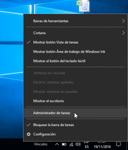
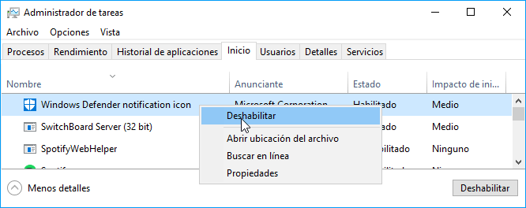
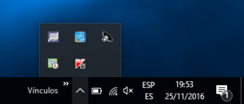
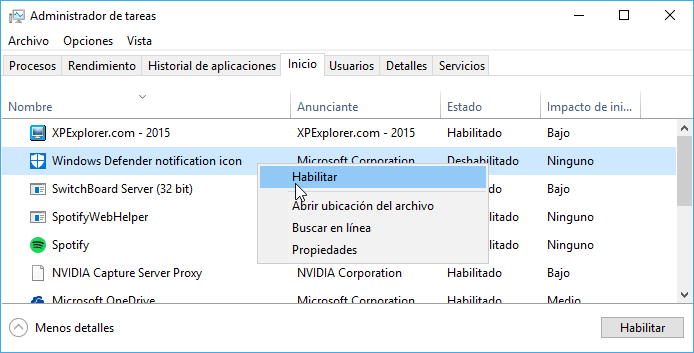

Quienes dispongan de Windows 10 observarán que en la barra de tareas les aparece el icono de Windows Defender. En el caso que les moleste, en este post veremos los pasos a seguir para quitar el icono de Windows Defender de la barra de tareas de Windows.<!--more-->

Antes de empezar es importante remarcar que eliminar el icono de Windows Defender no equivale a desactivar Windows Defender. Si únicamente eliminamos el icono, Windows Defender seguirá ejecutándose en segundo plano realizando su función.

###### Nota: Quien precise eliminar o desactivar Windows Defender debe seguir las instrucciones que se mencionan en el siguiente [enlace]().

## QUITAR EL ICONO DE WINDOWS DEFENDER DE LA BARRA DE TAREAS

Para quitar el icono de Windows Defender de la barra de Windows tenemos que acceder al administrador de tareas.

Para ello posicionamos el puntero del mouse encima de la barra de Windows, presionamos el botón derecho del mouse y cuando aparezca el menú desplegable clicamos encima de la opción **Administrador de tareas**.

En el administrador de tareas clicamos en la pestaña **Inicio**, buscamos y seleccionamos el proceso **Windows Defender notification icon**, presionamos el botón derecho del mouse y cuando aparezca el menú contextual clicamos encima de la opción **Deshabilitar**.

Una vez finalizado el proceso reiniciamos el ordenador y ya no nos aparecerá el icono de Windows Defender en la barra de tareas de Windows.

## HACER QUE VUELVA APARECER EL ICONO DE WINDOWS DEFENDER EN EL PANEL

Si algún día queremos volver a disponer del icono de Windows Defender tan solo tenemos que revertir los pasos realizados.

Para ello accedemos al administrador de tareas de Windows. Una vez dentro del administrador clicamos encima de la pestaña **Inicio**, buscamos y seleccionamos el proceso **Windows Defender notification icon**, presionamos el botón derecho del mouse y cuando aparezca el menú contextual clicamos encima de la opción **Habilitar**.

Después de habilitar el botón tan solo tenemos que reiniciar el ordenador. En el próximo arranque volveremos a disponer del icono de Windows Defender en la barra de tareas de Windows
