Skype es una herramienta que uso habitualmente en mi trabajo. Además todo el mundo coincidirá en que es una herramienta que utiliza un gran numero de personas en su trabajo. Por lo tanto bajo mi punto de visto tiene que ser una herramienta seria, fácil de usar, que funcione y que tenga un entorno gráfico que no distraiga al usuario. Pero tal es mi sorpresa que un buen día mientras estaba manteniendo una conversación importante con un proveedor tenía que estar constantemente viendo ads y publicidad como la que se muestra en la siguiente captura de pantalla:<!--more-->

[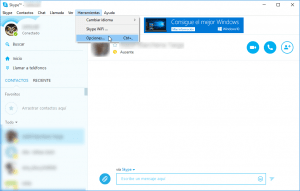](images/Publicidad-en-skype.png)

Sin duda me lleve una sorpresa negativa y me da realmente pena que Microsoft haya comprado una plataforma como skype para ir transformándola paulatinamente en algo parecido al antiguo Microsoft Messenger. Seguramente skype lleva tiempo introduciendo anuncios en su programa, pero en mi caso no me había dado cuenta hasta este momento.

Justo después de finalizar la conversación con el proveedor me puse manos a la obra para intentar deshacerme de la publicidad y finalmente lo conseguí. Los pasos a realizar para librarse de la publicad en Skype son los siguientes:

## PASO 1: DESACTIVAR LAS COOKIES Y LA PUBLICIDAD SEGMENTADA DE SKYPE

Skype es un software que vulnera la privacidad de sus usuarios de forma predeterminada por los siguientes motivos:

1. Skype utiliza los datos de nuestro perfil de skype para intentar ofrecernos publicidad adaptada a nuestros intereses.
2. Skype utiliza cookies para intentar obtener información de como los usuarios usan Skype, para reconocer nuestras preferencias y para en definitiva ayudarles a mejorar su servicio. Pero también utilizan estas cookies para intentar ofrecer publicidad adaptada a nuestros gustos y necesidades.

###### Nota: Quien quiera obtener información adicional de lo que son las cookies de Skype puede consultar el siguiente [enlace](https://support.skype.com/es/faq/FA1390/que-son-las-cookies-de-skype).

###### Nota: Quien quiera obtener información adicional acerca de la publicidad segmentada de Microsoft puede visitar el siguiente [enlace](https://support.skype.com/es/faq/FA12396/que-es-la-publicidad-segmentada-de-microsoft).

Para intentar solucionar el problema de privacidad que acabamos de mencionar desactivaremos las cookies y la publicidad segmentada de la siguiente forma:

Tal y como se puede ver en la captura de pantalla, **accedemos al menú** **Herramientas**. Dentro del menú Herramientas **clicamos encima de** **Opciones…**

[](images/Publicidad-en-skype.png)

Justo después de presionar sobre **opciones...** se abrirá la siguiente ventana de configuración:

[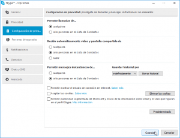](images/Desactivar-Cookies-y-publicidad-segmentada.png)

Tal y como se puede ver en la captura de pantalla, en la parte de la izquierda **clicamos encima de la opción** **Privacidad** y seguidamente **clicamos en la opción** **Configuración de privacidad**. Seguidamente, tal y como se puede ver en la captura de pantalla, **destildamos las siguientes opciones**:

**Aceptar Cookies**

**Permitir publicidad segmentada de Microsoft y el uso de la información sobre edad y el sexo que figuran en el perfil**

Una vez desactivadas estas opciones, tal y como se puede ver en la captura de pantalla, **presionamos el botón** **Guardar**. Después de realizar estos pasos Microsoft debería ser más respetuoso con nuestra privacidad.

###### Nota: El procedimiento de desactivación de cookies y publicidad segmentada mostrada en este apartado es para los usuarios de Microsoft Windows. Quien use Skype en plataformas móviles como Android e iOS, también le recomiendo que entre en la configuración de la App para desactivar estas opciones.

## PASO 2: BLOQUEAR LOS ANUNCIOS PUBLICITARIOS EN SKYPE

Una vez solucionado el tema de la privacidad toca solucionar el tema de los anuncios. El primer paso a seguir para quitar los anuncios en Skype es acceder al panel de control. Para acceder al panel de control **presionaremos la combinación de teclas** **Win+r**. Después de presionar esta combinación de teclas aparecerá la ventana de Ejecutar.

[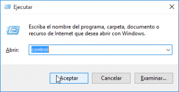](images/Abrir-el-panel-de-control.png)

En la ventana ejecutar, tal y como se puede ver en la captura de pantalla, tenemos que **escribir la palabra** **control** **y presionar el botón** **Aceptar**. Después de presionar el botón aceptar accederemos al panel de Control.

Una vez dentro del panel de control, tal y como se puede ver en la captura de pantalla, **clicamos encima de la opción** **Redes e Internet**.

[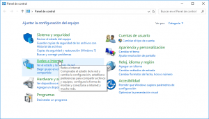](images/Acceso-Redes-e-Internet.png)

Seguidamente, tal y como se puede ver en la captura de pantalla, **clicamos encima de la opción** **Opciones de Internet**.

[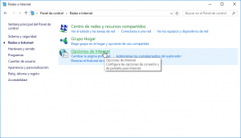](images/Acceso-opciones-de-internet.png)

Después de presionar encima de Opciones de internet aparecerá la ventana de Propiedades de Internet. Tal y como se puede ver en la captura de pantalla deberemos **seleccionar la pestaña** **Seguridad** y seguidamente **presionar encima de la opción** **Sitios restringidos**. Finalmente deberemos **presionar encima del botón Sitios**.

[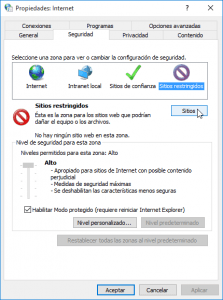](images/Acceso-a-sitios-restringidos.png)

Al presionar el botón **Sitios** se abrirá la siguiente ventana para configurar los sitios restringidos.

[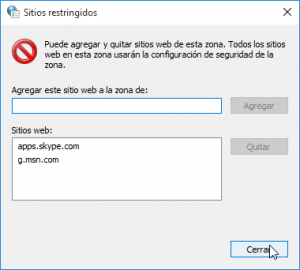](images/Restringir-sitios-para-bloquear-publicidad-en-Skype.png)

En esta ventana, tal y como se puede ver en la captura de pantalla, **tenemos que agregar los siguientes sitios restringidos**:

**apps.skype.com**

**g.msn.com**

**Para ello en el campo** **Agregar este sitio web a la zona de escribimos el primero de los sitios registringidos y presionamos el botón** **Agregar**. Seguidamente **repetimos la operación con el segundo de los sitios restringidos** y para finalizar **presionamos el botón** **Cerrar**.

A continuación, tal y como se puede ver en la captura de pantalla, tendremos que **presionar encima del botón** **Aplicar** y finalmente **presionaremos en el botón** **Aceptar**.

[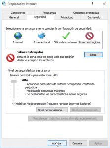](images/Guardar-los-sitios-bloqueados.png)

En estos momentos ya no debería ningún anunció en la aplicación de Skype.

## PASO 3: ELIMINAR EL RECUADRO DONDE APARECE LA PUBLICIDAD

Tal y como se puede ver en la captura de pantalla ya no aparecen anuncios en skype, pero vemos que en el sitio donde aparecían los anuncios ahora aparece un molesto cuadro de una tonalidad azul que nos está robando pantalla.

[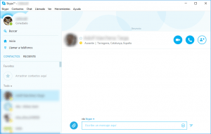](images/Cuadro-de-publicidad-en-Skype.png)

Para solucionar este problema tan solo tenemos que seguir los siguientes pasos. Tenemos que **abrir el explorador de archivos y navegar a la siguientes ubicación**:

**C:\\Usuarios\\nombreusuariopc\\AppData\\Roaming\\Skype\\nombreusuarioskype**

###### Nota: Las partes de la ruta que están en color color rojo se deben sustituir por el nombre de usuario de vuestro ordenador y por vuestro nombre de usuario de skype.

Una vez dentro de la ubicación, tal y como se puede ver en la captura de pantalla, **clicamos una vez encima del archivo** **config.xml** y **presionamos el botón derecho del mouse**. Seguidamente cuando aparezca el menú contextual **seleccionamos la opción** **Abrir con** y seguidamente **clicamos encima de la opción** **Bloc de Notas**.

[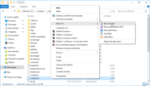](images/Ruta-del-fichero-config-xml.png)

Seguidamente se abrirá el Bloc de notas de Windows con el contenido del archivo config.xml.

[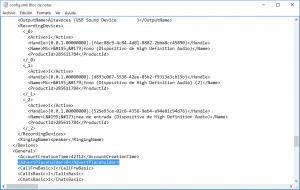](images/Quitar-la-zona-de-anuncios-en-Skype.png)

Una vez abierto el archivo, tal y como se puede ver en el captura de pantalla, **deberemos buscar la siguiente línea**:

> ```
> <AdvertPlaceholder>1<AdvertPlaceholder>
> ```

**Una vez encontrada la deberemos sustituir por la siguiente**:

> ```
> <AdvertPlaceholder>0<AdvertPlaceholder>
> ```

Una vez realizados las modificaciones tan solo tenemos que **guardar los cambios** y el proceso ha finalizado.

En estos momentos, tal y como se puede ver en la captura de pantalla, cuando arranquemos Skype no hay rastro de publicidad y además estaremos aprovechando la totalidad de la superficie de nuestra pantalla.

[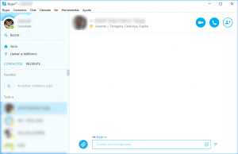](images/Skype-sin-anuncios.png)

Así de esta forma tan fácil y rápida podemos librarnos sin problemas de la publicidad que aparece en Skype.
