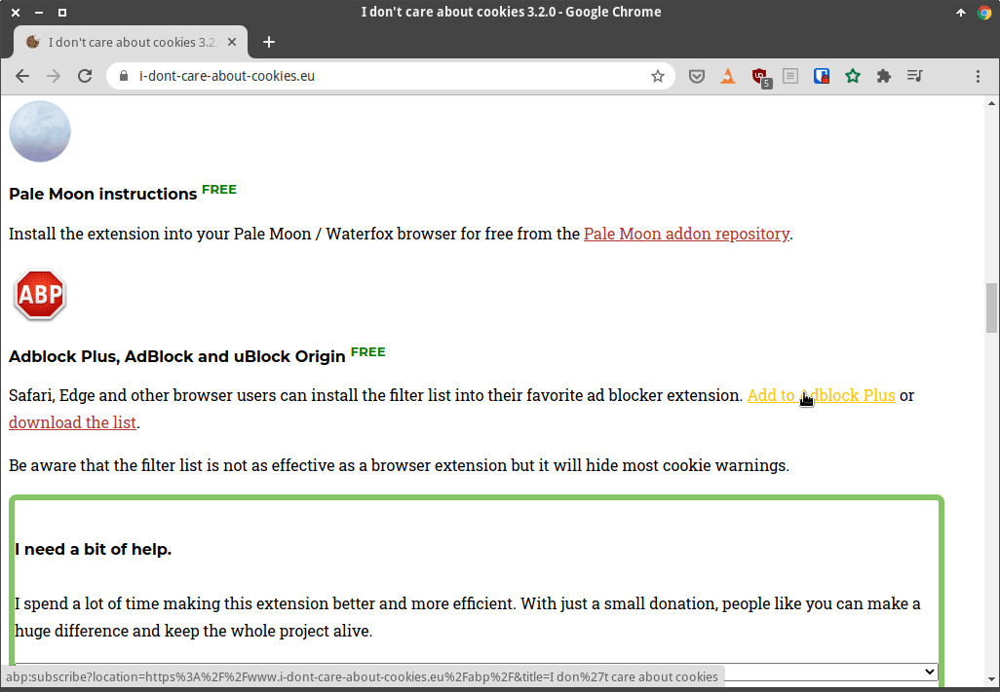
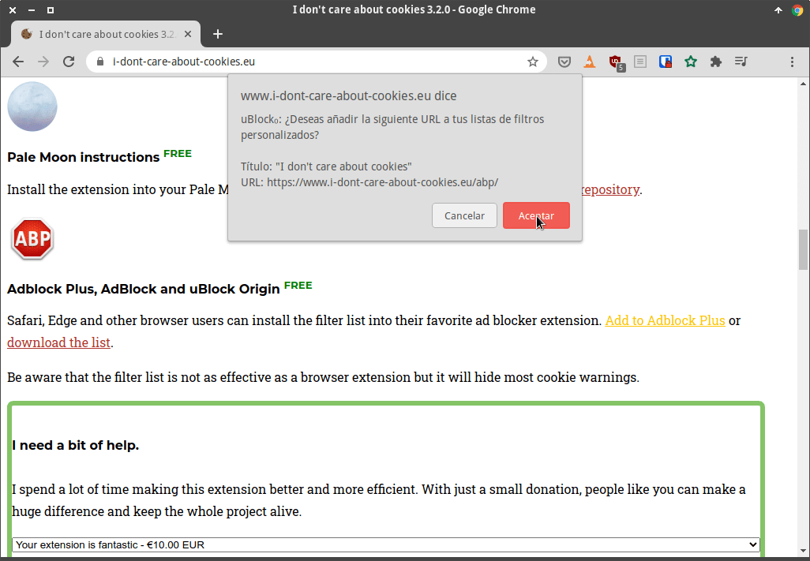
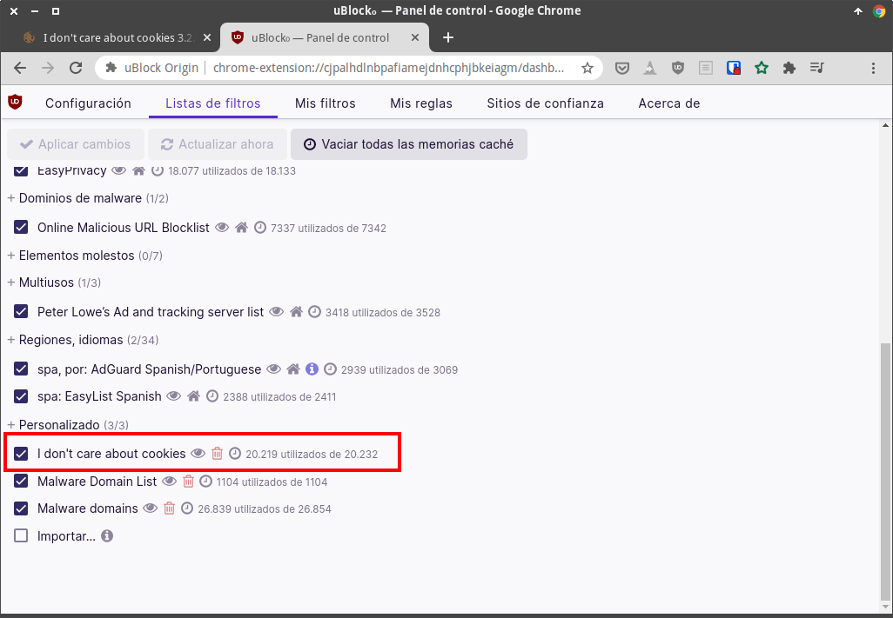
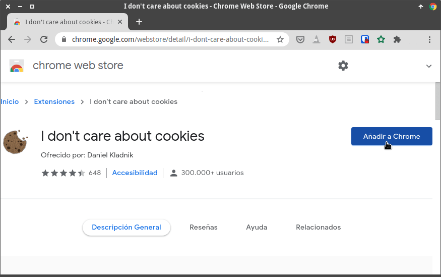
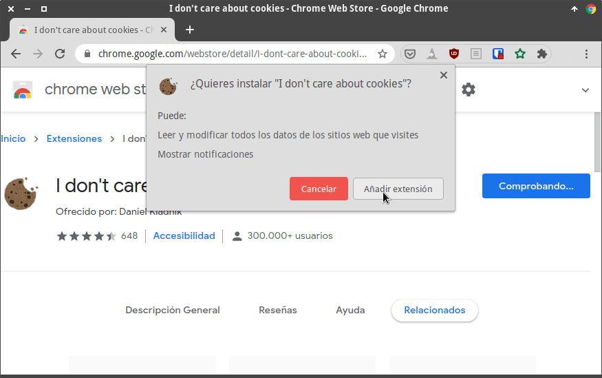
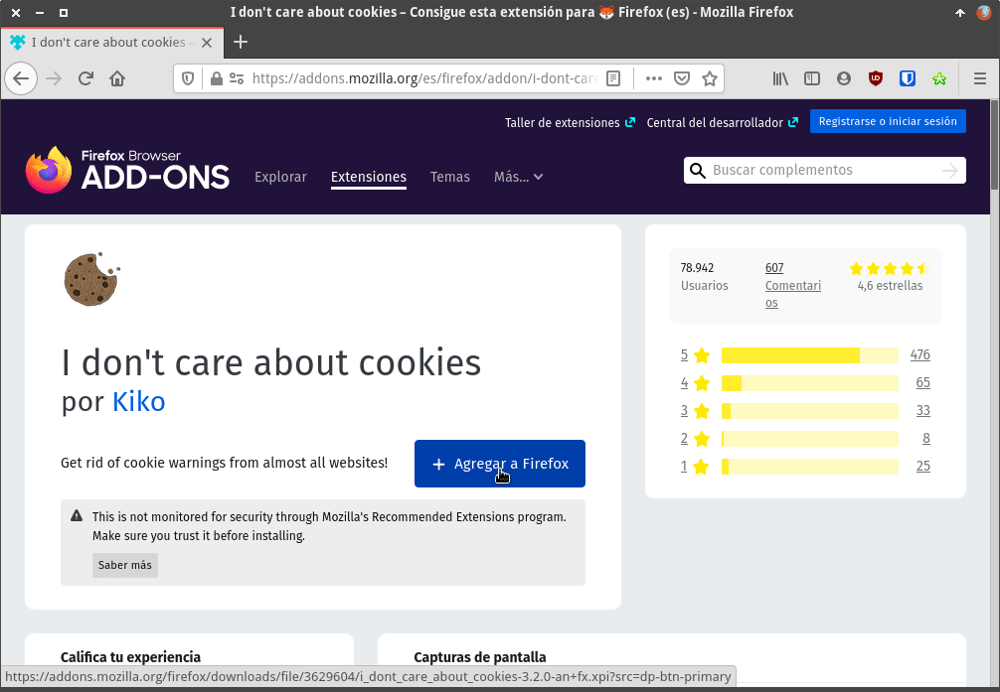
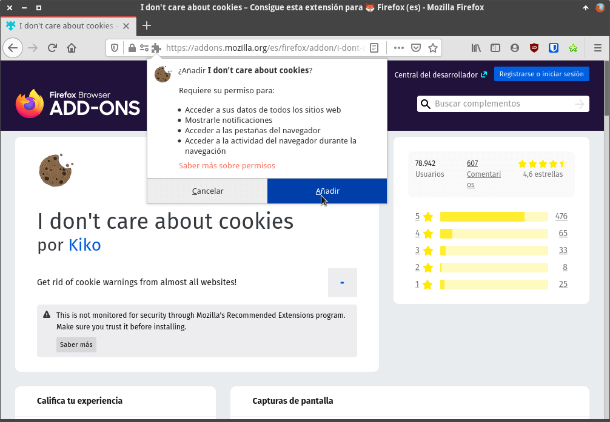

En todas y cada una de las nuevas web que visitamos recibimos notificaciones en pantalla informando que usan cookies. Además en algunas web nos preguntan explícitamente si las aceptamos o no. Por este motivo en el siguiente artículo veremos como podemos quitar las advertencias de cookies en las web que visitamos.<!--more-->

## ¿POR QUÉ LAS WEBS NOS INFORMAN SOBRE EL USO DE COOKIES?

En Europa según las leyes RGPD, LOPD y LSSI todos los propietarios de una página web que use cookies están obligados a informar a sus visitantes de:

1. Qué están usando cookies.
2. La utilidad de las cookies que instalan a los equipos de terceros.
3. Quien tendrá acceso a la información de las cookies instaladas.
4. El tiempo que dichas cookies estarán activas.
5. Preguntar explícitamente a los lectores si aceptan el uso e instalación de las cookies.

**Nota:** Todas las páginas web contienen cookies y además la gran mayoría de ellas no cumplen con las obligaciones citadas. Los motivos en la gran mayoría de veces es por falta de conocimiento de los webmaster.

Si entienden bien que son las cookies y como funcionan podrán llegar a comprender el motivo de dichas obligaciones.

## ¿SIRVEN PARA ALGO LAS MEDIDAS TOMADAS POR LA UNIÓN EUROPEA?

Cada vez que visitamos una web y vemos la molesta advertencia que la página web usa cookies la gente reacciona de la siguiente forma:

1. La ignoran. Su cerebro tiene la habilidad de omitir la información que no le interesa.
2. Hoy en día la gente tiene prisa. El tiempo es oro y por lo tanto aceptan las advertencias sin perder un solo segundo y empiezan la lectura de lo que realmente les interesa.
3. Solo un tanto por ciento muy reducido de usuarios lee y configura las preferencias de las cookies.

Por lo tanto a rasgos generales las medidas tomadas por la unión Europea son totalmente inútiles. Simplemente sirven para molestar a los lectores.

Si realmente quieren hacer algo útil **deberían actuar directamente sobre los navegadores que utilizamos**. Deberían implementar herramientas para que los usuarios puedan gestionar las cookies de forma trivial en el navegador.

**Los navegadores de forma nativa deberían tener herramientas para que cualquier usuario** pueda configurar y programar el borrado de cookies de forma trivial. Por ejemplo:

1. Un botón que cuando lo presiones borre todas las cookies.
2. Un botón que cuando lo presiones te permita programar la frecuencia con que borrarán las cookies de forma automática.
3. Etc.

## FRECUENCIA CON QUE TENEMOS QUE BORRAR LAS COOKIES

En términos de privacidad **lo ideal seria borrar las cookies cada vez que cerremos el navegador**.

No obstante hay que ser consciente que si estamos constantemente borrando las cookies tendremos otros inconvenientes como por ejemplo los siguientes:

1. Tendremos que loguearnos a nuestros servicios cada vez que queramos acceder a ellos. Para mitigar este inconveniente tenemos los gestores de contraseñas.
2. Cada vez que entremos en una página web veremos los molestos mensajes de aceptar las cookies. Para solucionar este inconveniente podemos usar extensiones en el navegador como por ejemplo I don’t care about cookies. De esta forma podremos quitar todas las advertencias de cookies.
3. Las preferencias de navegación en determinadas páginas web se perderán. Esto puede ocasionar que la experiencia de navegación en un determinado sitio web sea peor.
4. Etc.

Por lo tanto en mi caso lo que hago es lo siguiente:

1. A nivel de navegador configuro que se deben bloquear la totalidad de cookies de terceros.
2. Aproximadamente una vez al mes, o cuando me acuerdo, borro las cookies almacenadas en mi navegador.

**Nota:** En futuros artículos veremos como podemos configurar nuestro navegador para gestionar las cookies de forma adecuada.

## QUITAR LAS ADVERTENCIAS DE COOKIES CON LA EXTENSIÓN UBLOCK ORIGIN O ADBKLOCK PLUS

Obviamente lo primero que tienen que tener instalado es un bloqueador de anuncios en su navegador. Pueden usar tanto uBlock Origin como Adblock Plus. En mi caso les recomiendo el uso de uBlock Origin. Para instalar uBlock Origin en Firefox o en Chrome deberán seguir las siguientes instrucciones:

https://geekland.eu/instalar-ublock-origin-chrome-firefox/

Una vez instalada la extensión acceden a la siguiente página web.

[URL para obtener la lista de bloqueos en nuestro adblocker](https://www.i-dont-care-about-cookies.eu/ "Web creadores I don't care about cookies")

A continuación en el apartado de Adblock Plus cliquen sobre la opción **Add to Adblock Plus**.

Acto seguido les aparecerá un mensaje informando que se va añadir una lista de bloqueo en uBlock Origin. Presionan **Aceptar** y al finalizar la instalación el proceso habrá concluido.

Si quieren asegurarse que todo funciona correctamente pueden consultar las lista de bloqueo de uBlock origin y verán que efectivamente ahora tenemos una lista de bloqueo llamada **I don’t care about cookies**.

Además verán que cuando visiten una página web ya no recibirán las molestas advertencias que recibían con anterioridad.

## QUITAR LAS ADVERTENCIAS DE COOKIES CON LA EXTENSION I DON’T CARE ABOUT COOKIES

Otra opción menos eficiente, pero más efectiva que la que acabamos de ver es instalar la extensión I don’t care about cookies.

Para ello **si están usando Chrome o Chromium** cliquen en la siguiente URL:

[Acceder a la web para instalar I don't care about cookies en Chrome](https://chrome.google.com/webstore/detail/i-dont-care-about-cookies/fihnjjcciajhdojfnbdddfaoknhalnja "Web para instalar I don't care about cookies en Chrome")

Acto seguido tan solo tendrán que presionar sobre el botón **Añadir a Chrome**.

Y seguidamente confirmar la instalación presionando sobre el botón **Añadir extensión**.

**En el caso que sean usuarios de Firefox** deberán acceder a la siguiente URL:

[Acceder a la web para Instalar I don't care about cookies en Firefox](https://addons.mozilla.org/es/firefox/addon/i-dont-care-about-cookies/ "Web para instalar I don't care about cookies en Firefox")

Una vez dentro de la URL correspondiente instalan la extensión. En Firefox el proceso es tan simple como presionar el botón **Agregar a Firefox**.

Acto seguido tendremos que confirmar la instalación de la extensión presionando sobre el botón **Añadir**.

Una vez instalada la extensión desaparecerán las advertencias que las web que visitamos están usando cookies. A pesar de esto no se olviden de ir borrando periódicamente las cookies de su navegador.
