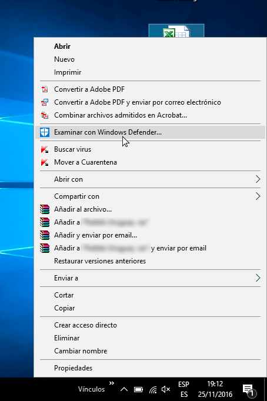
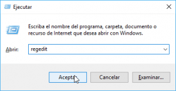
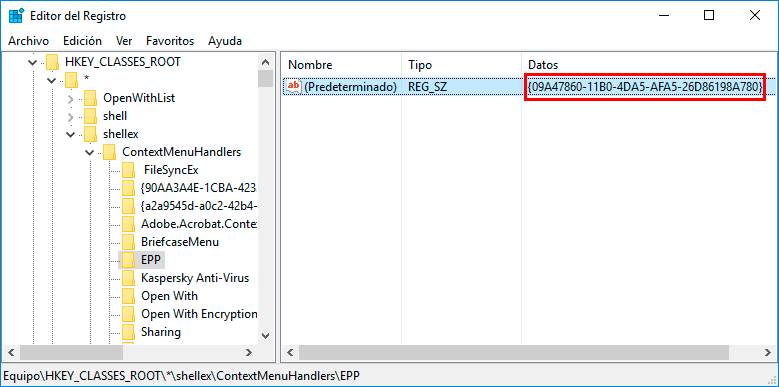
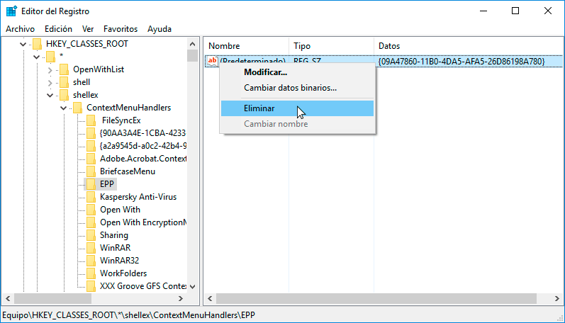
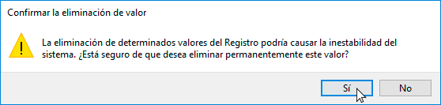
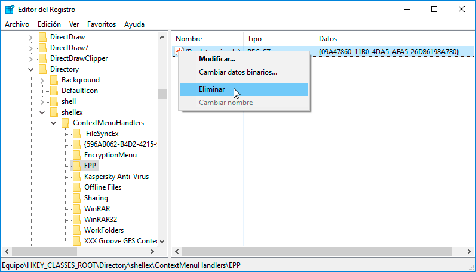
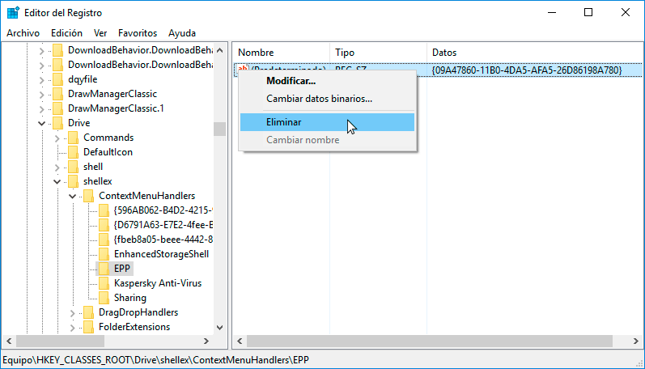
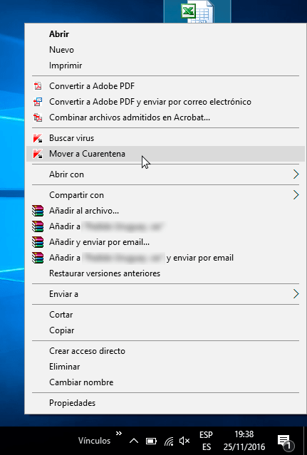
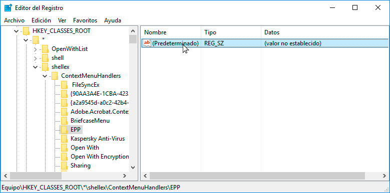
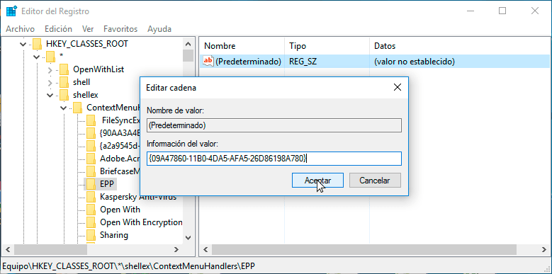

En el pasado vimos los pasos a seguir para [desactivar Windows Defender]() de nuestro sistema operativo. Después de desactivarlo nos seguirán apareciendo las opciones de Windows Defender en el menú contextual de Windows. Por este motivo en el siguiente artículo veremos los pasos a seguir para quitar Windows Defender del menú contextual de Windows. De esta forma evitaremos ver la entrada **Examinar con Windows Defender…** cada vez que consultemos las propiedades de un archivo o de una carpeta.<!--more--> [](images/Menu-contextual-con-Windows-Defender.png)

## QUITAR WINDOWS DEFENDER DEL MENÚ CONTEXTUAL

Para quitar Windows Defender del menú contextual presionamos la combinación de teclas **Win+R**. Al aparecer la ventana de Ejecutar teclean **regedit** y presionan el botón **Aceptar**.

[](images/Acceder-al-registro-de-Windows-1.png)

Seguidamente aparecerá una ventana que nos informará si queremos realizar cambios en el registro del sistema. En nuestro caso presionaremos encima del botón **Sí**.

A continuación aparecerá el menú de navegación del registro del sistema. Tal y como se puede ver en la captura de pantalla navegaremos dentro de la siguiente ruta:

> ```
> HKEY_CLASSES_ROOT\*\shellex\ContextMenuHandlers\EPP
> ```

### Anotar el valor de la clave EPP

Una vez dentro de la ruta lo primero que tenemos que realizar es anotar el valor de la clave EPP. El valor de la clave EPP lo encontrarán dentro del recuadro de color rojo indicado en la siguiente captura de pantalla.

[](images/clave-defender.png)

El valor anotado lo pueden almacenar dentro de un archivo de texto. El único propósito de almacenar este valor es deshacer los cambios que realizaremos a continuación.

### Eliminar los valores de las claves EPP del registro de Windows

Una vez anotada la la clave seleccionamos la clave **(Predeterminado)**, presionamos el botón derecho del ratón y cuando aparezca el menú contextual clicamos encima de **Eliminar**.

[](images/Eliminar-clave-EPP1.png)

Justo después de presionar sobre eliminar nos aparecerá la siguiente ventana de advertencia. Presionamos el botón **Sí** sin ningún miedo.

[](images/Advertencia-de-eliminación-registro.png)

A continuación nos dirigimos a la siguiente ruta dentro del registro de Windows:

> ```
> HKEY_CLASSES_ROOT\Directory\shellex\ContextMenuHandlers\EPP
> ```

Dentro de la ruta seleccionamos la clave **(Predeterminado)**, presionamos el botón derecho del ratón y cuando aparezca el menú contextual clicamos encima de **Eliminar**.

[](images/Eliminar-clave-EPP2.png)

Al presionar sobre la opción eliminar nos aparecerá una advertencia que nos preguntará si estamos seguros de borrar los valores del registro. Como estamos seguros presionamos el botón **Sí**.

[](images/Advertencia-de-eliminación-registro.png)

Finalmente eliminaremos la última clave dirigiéndonos a la siguiente ruta del registro de Windows:

> ```
> HKEY_CLASSES_ROOT\Drive\shellex\ContextMenuHandlers
> ```

Una vez dentro de la ubicación correspondiente seleccionamos la clave (Predeterminado), presionamos el botón derecho del ratón y cuando aparezca el menú contextual clicamos encima de **Eliminar**.

[](images/Eliminar-clave-EPP3.png)

Al presionar sobre la opción eliminar nos aparecerá una advertencia que nos preguntará si estamos seguros de borrar los valores del registro. Como estamos seguros presionamos el botón **Sí**.

Con tan solo seguir estos simples pasos verán que ya no se aparecen las opciones de Windows Defender en el menú contextual.

[](images/Sin-defender-en-el-menu-contextual.png)

## HACER QUE VUELVAN A APARECER LAS ENTRADAS DE WINDOWS DEFENDER EN EL MENÚ CONTEXTUAL

Si llega el día que queremos que revertir los cambios realizados, tan solo tenemos que restablecer los valores de las claves que hemos borrado. Para ello nos dirigimos a la siguiente ruta del registro de Windows:

> ```
> HKEY_CLASSES_ROOT\*\shellex\ContextMenuHandlers\EPP
> ```

Una vez dentro de la ruta hacemos doble click sobre la clave **(Predeterminado)**.

[](images/Acceder-a-los-valores-de-la-clave.png)

En la celda **Información del valor** escribimos el valor del registro que anotamos en la parte inicial del post y presionamos el botón **Aceptar**.

[](images/Restablecer-Claves-borradas.png)

Para finalizar el proceso tan solo tienen que repetir el mismo proceso que acabamos de realizar en las siguientes rutas:

> ```
> HKEY_CLASSES_ROOT\Directory\shellex\ContextMenuHandlers\EPP
> 
> HKEY_CLASSES_ROOT\Drive\shellex\ContextMenuHandlers
> 
> ```

Justo después de finalizar el proceso las entradas de Windows Defender volverán a aparecer en el menú contextual.

[](images/Menu-contextual-con-Windows-Defender.png)
