En el siguiente artículo veremos como usar Raspicast para **convertir nuestra Raspberry Pi en un Chromecast**. De esta forma **podremos visualizar la totalidad de contenido multimedia de nuestro teléfono o nuestra Raspberry Pi en un televisor**.<!--more-->

## MATERIAL QUE NECESITAMOS PARA TRANSFORMAR LA RASPBERRY PI EN UN CHROMECAST

Los requisitos para usar Raspicast en una Raspberry Pi son los que se mencionan a continuación

1. Disponer de una Raspberry Pi.
2. Disponer de conexión a Internet.
3. Tener disponible un dispositivo Android.
4. El dispositivo Android y la Raspberry Pi tienen que estar conectados a la misma red local.

Si cumplimos con los requisitos mencionados podemos seguir adelante sin problema alguno.

## CONFIGURAR LA RASPBERRY PI PARA QUE FUNCIONE COMO UN CHROMECAST

A continuación aseguraremos que nuestra Raspberry Pi tenga instalados OMXPlayer y OMX Image Viewer. Lo haremos de la siguiente forma:

### Instalar OMXPlayer

El sistema operativo Raspbian ya trae OMXPlayer instalado por defecto. No obstante ejecuten el siguiente comando en la terminal para asegurar que OMXPlayer está instalado:

> ```
> sudo apt-get install omxplayer
> ```

OMXPlayer es un reproductor de vídeo especialmente diseñado para funcionar en la Raspberry Pi. **Instalando OMXPlayer garantizamos que dispondremos de aceleración gráfica por hardware**. De este modo, el rendimiento de la Raspberry PI será perfecto cuando reproduzcamos vídeos en alta resolución.

### Instalar OpenMax Image Viewer

Con OMXplayer tenemos asegurada la aceleración gráfica por GPU. Por lo tanto, la Raspberry Pi podrá reproducir audio y vídeo en alta calidad sin problema alguno.

Si además queremos disponer de aceleración gráfica en la visualización de imágenes es recomendable que **instalemos OpenMax image viewer. De este modo dispondremos de aceleración gráfica en la visualización de los siguientes formatos de imagen**:

1. JPEGs
2. PNGs
3. BMPs
4. GIFs
5. TIFFs

Para iniciar el proceso de instalación ejecutaremos el siguiente comando para acceder a la partición home.

> ```
> cd ~
> ```

A continuación instalaremos la totalidad de paquetes necesarios para compilar e instalar OpenMax Image viewer. Para ello ejecutaremos el siguiente comando en la terminal:

> ```
> sudo apt-get install git make checkinstall libjpeg8-dev libpng12-dev
> ```

Seguidamente descargaremos OpenMax Image Viewer ejecutando el siguiente comando en la terminal.

> ```
> git clone https://github.com/HaarigerHarald/omxiv.git
> ```

El siguiente paso consiste en acceder a la carpeta omxiv que acabamos de descargar. Para ello ejecutamos el siguiente comando en la terminal:

> ```
> cd ~/omxiv
> ```

Acto seguido iniciaremos el proceso de compilación ejecutando el siguiente comando en la terminal:

> ```
> make ilclient
> ```

Seguidamente finalizaremos el proceso de compilación ejecutando el siguiente comando:

> ```
> make
> ```

Una vez finalizada la compilación crearemos un paquete .deb. Para ello ejecutaremos el siguiente comando en la terminal:

> ```
> sudo checkinstall
> ```

Durante el proceso de creación del paquete .deb se nos preguntará si queremos crear archivos que contienen información para documentar el paquete. En nuestro caso respondemos Yes \[**y**\] y presionamos Enter.

| checkinstall 1.6.2, Copyright 2009 Felipe Eduardo Sanchez Diaz Duran Este software es distribuído de acuerdo a la GNU GPLThe package documentation directory ./doc-pak does not exist. Should I create a default set of package docs? \[y\]: y |
| :-- |

A continuación nos pedirán que introduzcamos una descripción para el paquete .deb que estamos creando. En mi caso uso la descripción OMX\_image\_viewer y presiono Enter.

| Preparando la documentación del paquete...OK  Por favor escribe una descripción para el paquete. Termina tu descripcion con una linea vacia o con EOF. >> OMX\_image\_viewer \>> |
| :-- |

Finalmente se nos mostrarán los valores con que se generará el paquete. Como en mi caso estoy de acuerdo con los valores predeterminados presiono la tecla Enter.

| \*\*\*\*\*\*\*\*\*\*\*\*\*\*\*\*\*\*\*\*\*\*\*\*\*\*\*\*\*\*\*\*\*\*\*\*\*\*\*\*\* \*\*\*\* Debian package creation selected \*\*\* \*\*\*\*\*\*\*\*\*\*\*\*\*\*\*\*\*\*\*\*\*\*\*\*\*\*\*\*\*\*\*\*\*\*\*\*\*\*\*\*\*Este paquete será creado de acuerdo a estos valores:0 - Maintainer: \[ root@raspberrypi \] 1 - Summary: \[ OMX\_image\_viewer \] 2 - Name: \[ omxiv \] 3 - Version: \[ 20180901 \] 4 - Release: \[ 1 \] 5 - License: \[ GPL \] 6 - Group: \[ checkinstall \] 7 - Architecture: \[ armhf \] 8 - Source location: \[ omxiv \] 9 - Alternate source location: \[ \] 10 - Requires: \[ \] 11 - Provides: \[ omxiv \] 12 - Conflicts: \[ \] 13 - Replaces: \[ \]Introduce un número para cambiar algún dato u oprime ENTER para continuar: |
| :-- |

Acto seguido se generará el paquete .deb para que a posteriori podamos instalar OpenMax image viewer.

| Installing with make install...  \====================== Resultados de la instalación ==== install omxiv.bin /usr/bin/omxiv  \========================== Instalación exitosa ========  Copying documentation directory... ./ ./README.md ./LICENSE  Copiando los archivos al directorio temporal...OK  Stripping ELF binaries and libraries...OK  Comprimiendo las páginas de manual...OK  Creando la lista de archivos...OK  Creando el paquete Debian...OK  Instalando el paquete Debian...OK  Borrando directorios temporales...OK  Escribiendo el paquete de respaldoOK OK  Borrando el directorio temporal...OK  \*\*\*\*\*\*\*\*\*\*\*\*\*\*\*\*\*\*\*\*\*\*\*\*\*\*\*\*\*\*\*\*\*\*\*\*\*\*\*\*\*\*\*\*\*\*\*\*\*\*\*\*\*\*\*\*\*\*\*\*\*\*\*\*\*\*\*\*\*\*  Done. The new package has been installed and saved to  /home/pi/omxiv/omxiv\_20180901-1\_armhf.deb  You can remove it from your system anytime using:  dpkg -r omxiv |
| :-- |

Para comprobar que el paquete .deb se ha generado ejecutamos el siguiente comando:

> ```
> ls -l
> ```

[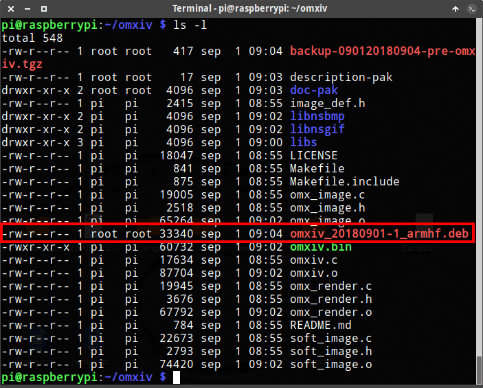](images/nombre-paquete-deb-generado.png)

Tal y como se puede observar en la captura de pantalla se ha generado un paquete con el nombre omxiv\_20180901-1\_armhf.deb. Para instalarlo tan solo tenemos que ejecutar el siguiente comando en la terminal:

> ```
> sudo dpkg -i omxiv_20180901-1_armhf.deb
> ```

Una vez ejecutado el comando tan solo hay que esperar unos segundos para que finalice el proceso de instalación.

Si alguna vez quisieran desinstalar OMX Image Viewer, tan solo tendrían que ejecutar alguno de los siguiente comandos:

> ```
> dpkg -r omxiv
> ```

**o**

> ```
> sudo apt-get remove omxiv
> ```

## INSTALAR RASPICAST EN UN DISPOSITIVO ANDROID

A continuación tenemos que instalar la aplicación Raspicast en nuestro dispositivo Android. Para ello pueden clicar en el siguiente enlace.

[https://play.google.com/store/apps/details?id=at.huber.raspicast&hl=es](https://play.google.com/store/apps/details?id=at.huber.raspicast&hl=es "Enlace para descargar Raspicast")

Seguidamente tan solo tenemos que presionar en el botón INSTALAR. Acto seguido se instalará Raspicast.

[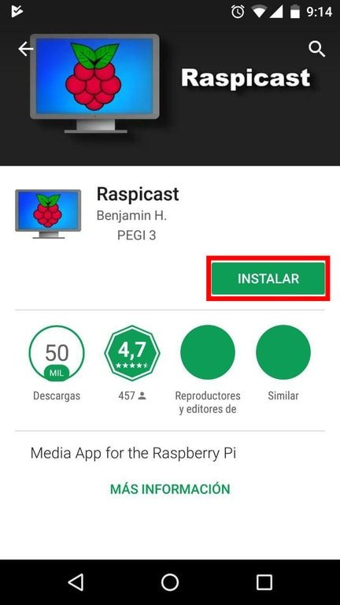](images/instalar-raspicast.jpg)

## CONFIGURACIÓN DE LA APLICACIÓN RASPICAST

La aplicación Raspicast requiere de una sencilla configuración inicial. Los pasos a seguir son los que se muestran a continuación.

### Averiguar la IP de nuestra raspberry Pi

Para empezar tenemos que averiguar la IP local de nuestra Raspberry Pi. Para ello ejecutamos el comando hostname -I en la terminal de nuestra Raspberry Pi. El resultado obtenido en mi caso es el siguiente:

> ```
> pi@raspberrypi:~ $ hostname -I
> 192.168.1.100
> ```

La salida del comando nos mostrará la IP local de nuestra Raspberry. Por lo tanto en mi caso tengo la IP 192.168.1.100.

###### Nota: Es altamente recomendable que la Raspberry Pi tenga una [IP Fija]().

### Habilitar SSH en la Raspberry Pi

Si tienen un servidor SSH habilitado no hace falta que hagáis lo que se menciona en este apartado.

En el caso que no tengan un servidor SSH habilitado ejecuten el siguiente comando en la terminal:

> ```
> sudo raspi-config
> ```

A continuación accedemos a la opción 5 Interfacing Options

[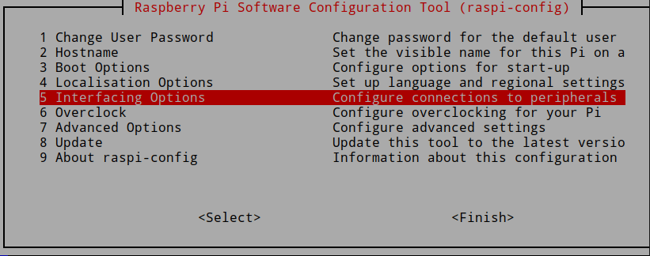](images/configuracion-raspberry-pi.png)

Seguidamente seleccionen la opción P2 SSH.

[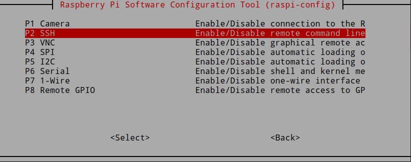](images/configuracion-ssh.png)

Finalmente seleccionen la Opción Sí. De este modo habilitemos el servidor SSH.

[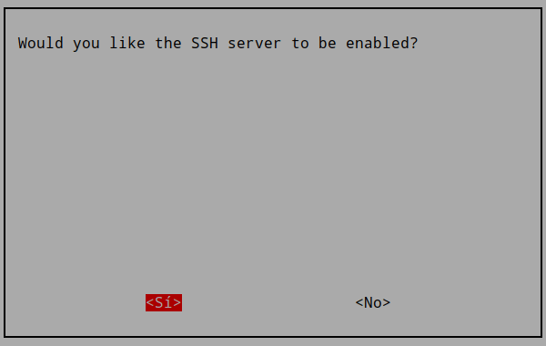](images/habilitar-servidor-ssh.png)

### Averiguar el puerto SSH en que está escuchando nuestra Raspberry Pi

Para averiguar el puerto en que está escuchando el servidor SSH tan solo tenemos que ejecutar el siguiente comando en la terminal:

> ```
> pi@raspberrypi:~ $ grep Port /etc/ssh/sshd_config
> Port 22
> ```

Por lo tanto en mi caso el servidor SSH está escuchando en el puerto 22.

### Abrir y configurar la aplicación Raspicast

La primera vez que abramos Raspicast tendremos que clicar en el apartado de opciones.

[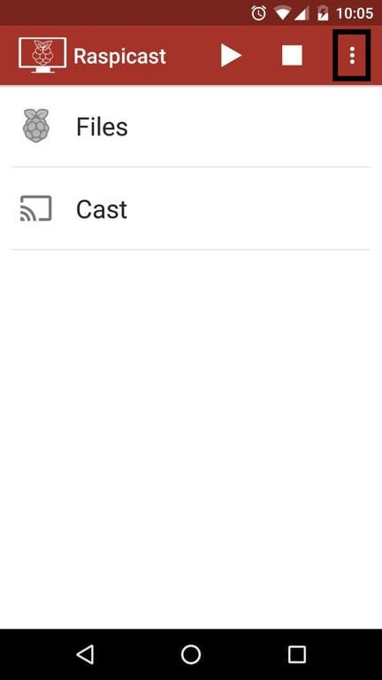](images/acceder-configuracion-raspicast.jpg)

Cuando se despliegue el menú tendremos que clicar en la opción SSH settings.

[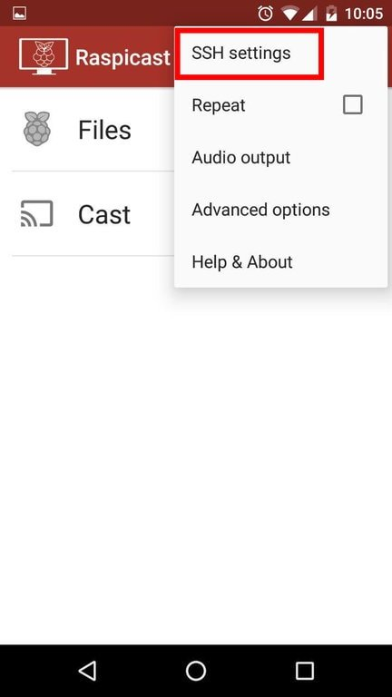](images/acceder-configuracion-SSH-raspicast.jpg)

A continuación tendremos que rellenar las opciones que aparecen en la siguiente captura de pantalla:

[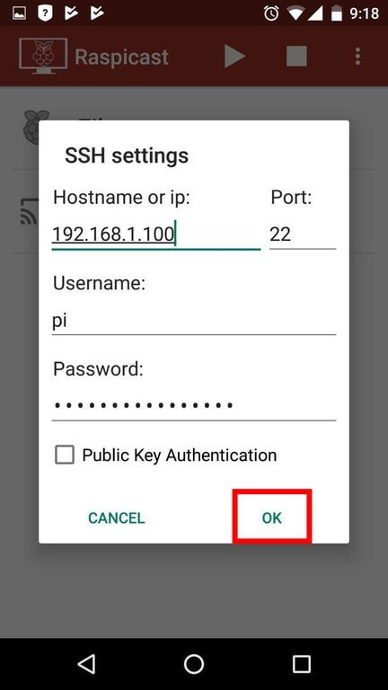](images/configuracion-realizada-raspicast.jpg)

En cada uno de los campos deberemos introducir la siguiente información

- **Hostname or ip:** Tenemos que escribir la IP de nuestra Raspberry Pi. En apartados anteriores vimos que en mi caso es la 192.168.1.100.
- **Port:** Introduciremos el puerto en que está escuchando el servidor SSH. Como hemos visto en apartados anteriores, en mi caso el servidor SSH está escuchando en el puerto 22.
- **Usarname:** Introduzcan el nombre de usuario que acostumbren a utilizar en su Raspberry Pi. En mi caso uso el usuario Pi.
- **Password:** Hay que introducir la contraseña establecida para conectarnos a nuestro servidor SSH. Si es la primera vez que habilitan y/o usan el servidor SSH la contraseña será raspberry.

Una vez introducidos los datos presionamos el botón OK. En estos momento la configuración ha finalizado.

## EMPEZAR A REPRODUCIR VÍDEOS, AUDIO E IMAGEN CON RASPICAST

A continuación veremos gran parte de las opciones que ofrece Raspicast.

### Reproducir vídeos, audio e imágenes de nuestro teléfono al televisor

Para reproducir vídeos almacenados en nuestro dispositivo Android tan solo tenemos que presionar encima de la opción Cast.

[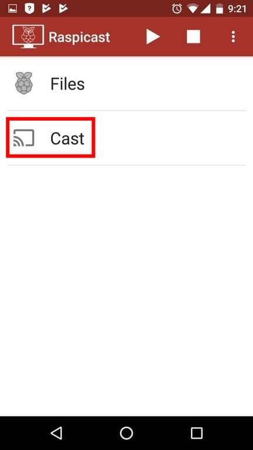](images/ver-multimedia-telefono.jpg)

Seguidamente clicamos encima del contenido que queremos visualizar. Acto seguido empezará a reproducirse el vídeo, imagen o sonido en el televisor que conectamos la Raspberry Pi.

[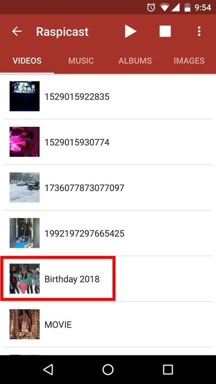](images/seleccionar-archivo-telefono-reproducir.jpg)

###### Nota: El contenido se envía de nuestro dispositivo móvil a la Raspberry Pi vía SSH. Por lo tanto el contenido se transmite de un dispositivo a otro de forma cifrada y segura.

### Reproducir vídeos, audio e imágenes almacenadas en la Raspberry Pi

Si por lo contrario queremos reproducir contenido almacenado en nuestra Raspberry Pi tenemos que clicar encima de la opción Files.

[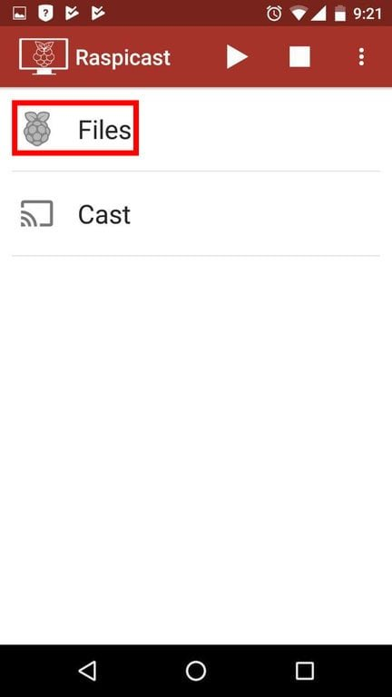](images/ver-multimedia-raspberry-pi.jpg)

Acto seguido navegamos en la ubicación donde tenemos guardado el contenido multimedia. A continuación tan solo tenemos que clicar encima del vídeo, audio o imagen que queremos visualizar.

[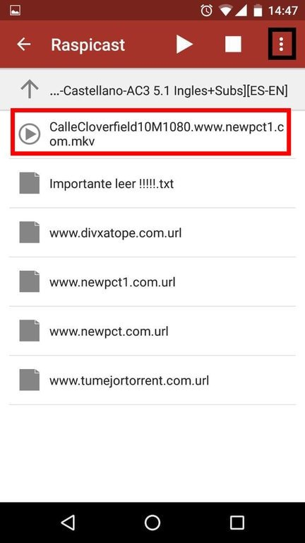](images/presionar-archivo-reproducir.jpg)

Si reproducimos archivos de vídeo con múltiples idiomas y con subtítulos no hay problema. Raspicast nos ofrece la posibilidad de seleccionar el idioma y los subtítulos que queramos.

[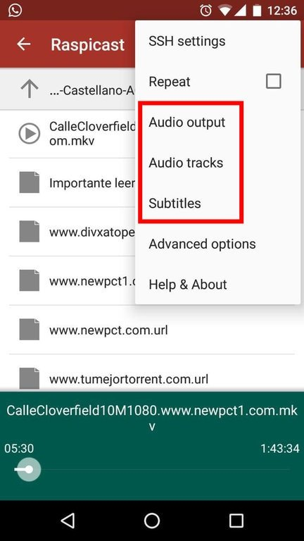](images/seleccionar-audio-y-subtitulos.jpg)

Raspicast también nos permitirá pausar, avanzar o retroceder en el momento del vídeo que nosotros queramos.

### Ver vídeos de Youtube con Raspicast

Raspicast también nos permite reproducir vídeos de Youtube a nuestro televisor. Para ello cuando estamos visualizando un vídeo presionamos encima del icono Compartir.

[](images/compartir-video-youtube.jpg)

Seguidamente presionamos encima de la opción Cast (Raspicast). Entonces de forma inmediata podremos visualizar el vídeo de Youtube en nuestro televisor.

[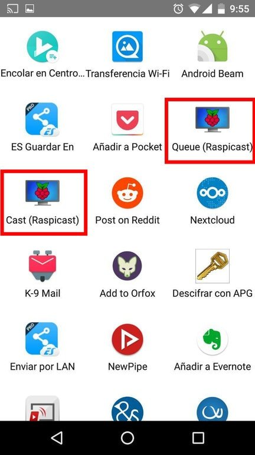](images/compartir-con-raspicast.jpg)

En el caso que ya estemos visualizando un vídeo podemos clicar encima de la opción Queue (Raspicast). De este modo el vídeo se agregará a la cola de reproducción. Por lo tanto seguiremos viendo el vídeo actual y cuando se termine empezará el siguiente vídeo de la cola de reproducción.

## UTILIDADES Y LIMITACIONES DE RASPICAST

Raspicast tiene claramente las siguientes utilidades.

1. **Ver y/o escuchar en nuestro televisor los audios, vídeos y fotos** almacenados en nuestro dispositivo Android o en la Raspberry Pi.
2. **Lanzar vídeos y listas de vídeos de YouTube** de nuestro teléfono móvil al televisor.
3. Abrir y **reproducir** el contenido de **listas de reproducción como .m3u y .pls**.

Con Raspicast y una Raspberry Pi podremos **ver vídeos a 1080 sin ningún tipo de problema**. En ningún momento tendréis problemas de codecs, por lo tanto seréis capaces de **reproducir prácticamente la totalidad de formatos de vídeo  y sonido existentes**.

Algunas limitaciones que tenéis que tener en mente son las siguientes:

1. No podremos visualizar enlaces de streaming alojados en servidores como por ejemplo streamcloud o Powvideo. Para ello existen otras alternativas como por ejemplo usar la combinación Kodi + Yatse.
2. Gran parte de las aplicaciones Android no podrán compartir contenido con la Raspberry Pi. A modo de ejemplo no podremos transferir el audio de Spotify de nuestro teléfono a nuestro televisor.

## ANÁLISIS DE LA CARGA QUE LE SUPONE A LA RASPBERRY PI REPRODUCIR VÍDEOS EN HD

El consumo de recursos al reproducir un vídeo a 1080p es ridículo.

Antes de iniciar la reproducción mi Raspberry Pi tiene los siguientes parámetros de carga:

- Temperatura del procesador: **50,5 ºC**
- Nivel de carga de la CPU: **0,07**
- Consumo de RAM: **24,3%**

Después de 15 Minutos de ver un vídeo a 1080p almacenado en mi Raspberry los valores de carga son los siguientes:

- Temperatura del procesador: **54,8 ºC**
- Nivel de carga de la CPU: **0,19**
- Consumo de RAM: **26,5%**

Por lo tanto el consumo de recursos es más que aceptable y menor que si usáramos Kodi para reproducir nuestros vídeos.

## CONCLUSIONES

Como se ha visto en el artículo Raspicast no cubre la totalidad de funcionalidades de un Chromecast. Flaquea en el momento de reproducir contenidos en streaming de servidores como por ejemplo streamcloud y Powvideo. Tampoco se integra con la mayoría de aplicaciones Android.

No obstante es una opción a tener en cuenta y que en mi caso uso y seguiré usando por lo siguientes motivos:

1. Para ver contenido almacenado en la Raspberry Pi me resulta mucho **más práctico usar Raspicast que no Kodi**.
2. El **consumo de recursos es mínimo**. Difícilmente encontraréis una opción que consuma menos recursos.
3. Es una opción **extremadamente rápida y sencilla para ver el contenido multimedia almacenado en nuestro dispositivo móvil**.
