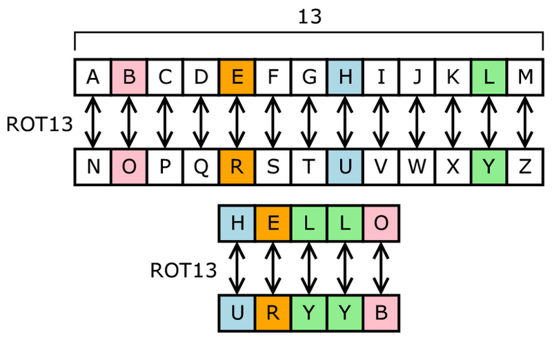
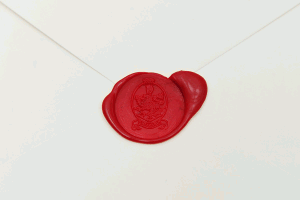
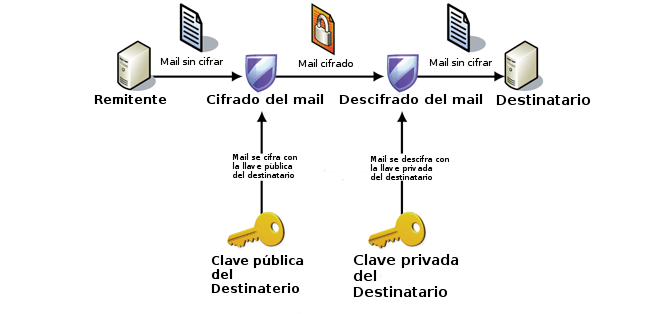
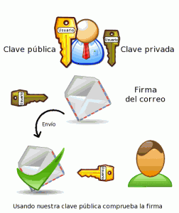

Vista la situación actual en que la privacidad de Internet está más que en entredicho y en que entes poderosos hacen lo imposible para controlar la red es bueno que la gente empiece a tomar precauciones. Por este motivo he escrito una serie de post para que todo el mundo pueda aprender cifrar y firmar nuestro correo electrónico. Los post son los siguientes:<!--more-->

1. **Motivos principales por los que deberíamos cifrar y firmar nuestro correo electrónico.**
2. **[Cifrar y firmar nuestro correos electrónicos con enigmal]().**

###### Nota: No es excusa no cifrar y firmar los correos electrónicos por tener conocimientos informáticos limitados. Si leen los post que he realizado verán que es sumamente fácil cifrar y firmar nuestros correos. Una vez lo tenemos todo configurado el proceso se hace de forma prácticamente automática.

## ¿POR QUÉ ES IMPORTANTE CIFRAR Y FIRMAR NUESTROS MAILS?

**El cifrado es importante ya que nos asegurará que solo la persona a que va destinado el correo pueda leerlo**. Si ciframos nuestro correo con el método que mostraré en posteriores post podemos afirmar que es prácticamente imposible que terceras personas puedan leer nuestro correo. Ni tan siquiera Google lo podrá leer. Por lo tanto **el cifrado garantizará la privacidad de nuestro correo electrónico**.

Ya que Google no garantiza nuestra privacidad en los correos que tenemos almacenados en sus servidores tendremos que ser nosotros mismos quienes nos la garanticemos. A saber el uso que Google da al contenido de nuestros mails. Pero no hay que preocuparse ya que cifrando los correos es posible seguir disfrutando de los servicios de Google y otros servicios de mail sin tener los problemas de privacidad existentes en la actualidad.

Además de cifrar nuestros mails también es importante que usemos una firma digital. El hecho de introducir **una firma digital hará que la persona que reciba nuestro correo electrónico tenga la total seguridad que el mensaje proviene de la persona que ellos piensan y que durante el envío nadie haya interceptado y modificado el contenido original del mail**.

Es verdad que hoy en día **la mayoría de servicios de correo electrónico ofrecen cifrado SSL**. A pesar de esto **algunos de estos servicios aún permiten el acceso a sus usuarios a través de conexiones inseguras http**. Además hay que tener en cuenta que **hasta que nuestro correo llega a su destinatario final habrá pasado por multitud de servidores y no es descartable que la conexión entre algunos de estos servidores no sea fiable** dando la posibilidad a que una tercera persona intercepte, lea y modifique el contenido de nuestro mail. Por lo tanto el cifrar y firmar nuestros correos básicamente garantiza:

1. **La integridad de los datos transmitidos.**
2. **Nuestra privacidad.**
3. **Proteger nuestra identidad y que nuestra información no pueda ser vendida a terceros**

## ¿QUÉ ES EL CIFRADO?

Muchos de vosotros se preguntará que es esto de cifrar los mails. **Cifrar los mails es alterar el contenido que escribimos y adjuntamos de tal forma que si alguien lo intercepta sea totalmente irreconocible e ilegible para el interceptor**. Un ejemplo muy básico de cifrado puede ser el siguiente:

En la figura, extraída de la [wikipedia](http://es.wikipedia.org/wiki/Cifrado_por_sustituci%C3%B3n "Cifrado Sustitución ROT13"), se muestra el cifrado [ROT 13](http://es.wikipedia.org/wiki/ROT13 "Cifrado ROT13"). Se llama [ROT 13](http://es.wikipedia.org/wiki/ROT13 "Cifrado ROT13") porqué Rota 13 posiciones las letras del alfabeto.

Así por ejemplo si tenemos el siguiente texto sin cifrar: **Este ordenador**

Una vez aplicado el algoritmo de cifrado ROT13, mostrado en la figura anterior, tendremos el siguiente texto: **Rfgr bwqranqbw**

En este momento nosotros podríamos enviar tranquilamente el mensaje cifrado al destinatario. Una vez el destinatario reciba el mensaje lo deberá descifrar. Obviamente el destinatario tendrá los medios para descifrar nuestro mensaje. En caso de que una tercera persona interceptará el correo no pasaría nada ya que para el seria imposible entender el contenido que tiene el mail.

###### Nota: El ejemplo mostrado es un ejemplo de cifrado muy básico. El algoritmo de cifrado que nosotros aplicaremos para enviar mails es prácticamente imposible de romper a día de hoy.

## ¿QUÉ ES FIRMAR UN UN CORREO?

**Firmar un correo electrónico significa que estamos introduciendo una marca o fragmentos de código adicional a nuestro mensaje con el fin de validar nuestra identidad.**

Entonces **cuando el destinatario reciba el mensaje podrá confirmar** los siguientes aspectos del mensaje recibido:

1. **Que el mensaje recibido proviene de quien realmente dice ser.**
2. **Que el mensaje proviene de una fuente segura.**
3. **Que el mensaje no ha sido interceptado y modificado por una tercera persona.**

En apartados posteriores veremos con más detalle el funcionamiento del proceso de la firma. No obstante el proceso de la firma se puede explicar fácilmente usando el siguiente símil:

**La firma de un correo es similar a enviar un sobre lacrado en el cual el lacrado tenga un distintivo único en el mundo** **y que solamente una persona pueda emitir**. Por lo tanto en el momento que alguien intercepte el sobre, para modificar el contenido tendrá que sacar el lacrado. Una vez haya sacado el lacrado será imposible para esta persona volver a reproducir el mismo lacrado y por lo tanto cuando el destinatario final reciba el sobre verá que el lacrado no es el correcto y la información que hay en el mensaje es de dudosa fiabilidad.

## EXPLICACIÓN DEL FUNCIONAMIENTO DEL CIFRADO ASIMÉTRICO

Existen diversos tipos de cifrado. Entre ellos podemos citar el [cifrado tradicional](http://es.wikipedia.org/wiki/Cifrado_cl%C3%A1sico "Cifrado tradicional"), el [cifrado simétrico](http://es.wikipedia.org/wiki/Cifrado_sim%C3%A9trico "Cifrado simétrico") o el [cifrado asimétrico](http://es.wikipedia.org/wiki/Cifrado_asimetrico "Cifrado Asimétrico").

El funcionamiento de [Enigmail](https://www.enigmail.net/home/index.php "Enigmail") y de [OpenPGP](http://www.openpgp.org/ "OpenPGP") se basa en el [cifrado asimétrico](http://es.wikipedia.org/wiki/Cifrado_asimetrico "Cifrado asimétrico") y esto es muy buena noticia porqué **el cifrado asimétrico es de los cifrados más seguros existentes en la actualidad**. El cifrado asimétrico consiste en lo siguiente:

1. El **remitente tendrá un par de claves únicas** disponibles. **Una de las claves será pública y la otra será privada**.
2. Igualmente **el destinatario también dispondrá de 2 claves únicas** disponibles. Al igual que el remitente **una será una clave pública y la otra una clave privada**.
3. Bajo ningún concepto **ni el destinatario ni el remitente proporcionarán a terceros su clave privada**. Es de vital importancia que solamente nosotros tengamos acceso a la clave privada.
4. **Tanto el destinatario como el remitente distribuirán públicamente su clave pública**. Las pueden subir a un servidor de claves, enviarla vía mail, pasarla con un pendrive, etc.
5. Ahora suponemos que **el remitente dispone de la clave pública del destinatario** porqué como explicaba en el punto 4 este se la ha pasado vía mail, por ejemplo.
6. **El remitente redactará el mensaje al destinatario**. **Una vez haya escrito el mensaje lo cifrará con la pública del destinatario**.
7. **El destinatario recibirá el correo** **cifrado** del remitente. En principio no podrá leer el correo porqué el contenido está cifrado.
8. **Para descifrar el mensaje el destinatario usará su clave privada**. La única forma de descifrar este mensaje será mediante la clave privada del destinatario.

Gráficamente el proceso lo podemos representar de la siguiente forma:

###### Nota: Es importante que no se pierda la clave privada. En el caso de perder nuestra clave privada no podremos descifrar ninguno de los mensaje que estén cifrados. Además si alguien se apodera de nuestra clave privada podrá enviar correos haciéndose pasar por nosotros mismos. De aquí la importancia de no perder nunca nuestra clave privada. En caso de perder la clave privada tendremos que proceder a la revocación de la clave privada.

###### Nota: En el caso que el remitente no disponga de la clave pública del destinatario entonces no se podrá cifrar el mail. Recordamos que el remitente usa la clave pública del destinatario para cifrar el mail de tal forma que solo la clave privada del destinatario podrá descifrar este mail.

###### Nota: Es posible que en el futuro se publique algún post adicional para explicar el funcionamiento de PGP de una forma más teórica.

## EXPLICACIÓN DEL FUNCIONAMIENTO DE LA FIRMA DIGITAL

El proceso de la firma del correo electrónico funciona de la siguiente forma:

1. En estos momentos ya sabemos que **tanto el remitente como el destinatario disponen de un par de claves, una pública y otra privada**.
2. **El remitente dispone de la clave pública del destinatario y viceversa**.
3. **El remitente ahora procederá a firmar el correo** que quiere enviar al destinatario.
4. **Para firmar el correo el remitente usará su propia clave privada**. **Con su clave privada introducirá código oculto en el mail que enviará**. Esto código será primordial para validad nuestra identidad.
5. **El destinatario recibirá el correo firmado.**
6. **El destinatario usará la clave pública del remitente para comprobar la validez de la firma o código oculto que el remitente ha introducido en el interior del mail**. En el caso que la firma sea valida quiere decir que el mail proviene del remitente que esperamos, ya que solamente el remitente es capaz de generar la firma que llevará el mail.

Gráficamente el procedimiento descrito lo podemos representar de la siguiente forma:

## OPCIONES QUE TENEMOS PARA CIFRAR Y FIRMAR LOS MAILS DE FORMA AUTOMATICA

Existen varias opciones para cifrar y firmar nuestro correo electrónico. Algunas de ellas son:

1. **En el caso de usar Android** podemos usar la aplicación de correo [k9mail](https://play.google.com/store/apps/details?id=com.fsck.k9&hl=es "K9mail") y el programa [APG](https://play.google.com/store/apps/details?id=org.thialfihar.android.apg&hl=es "APG"). El proceso de cifrar y firmar los mails es prácticamente automático y apenas genera molestias ni tener que realizar pasos adicionales.
2. **Existen varias extensiones para los navegadores** [Chrome](https://www.google.com/intl/es/chrome/browser/ "Chrome"), [Chromium](http://www.chromium.org/ "Chromium") y [Firefox](http://www.mozilla.org/es-ES/firefox/new/ "Firefox") para poder cifrar y firmar los mensajes que enviamos y recibimos. Alguna de estas extensiones con las que podremos cifrar y firmar los correos de nuestras cuentas de [Gmail](http://gmail.com "Gmail"), [Yahoo](http://es.mail.yahoo.com/ "Yahoo") o [Hotmail](http://www.hotmail.com/ "Hotmail") son [Mailvelope](https://chrome.google.com/webstore/detail/mailvelope/kajibbejlbohfaggdiogboambcijhkke "Mailvelope") o [Secure Gmail](https://chrome.google.com/webstore/detail/secure-gmail-by-streak/jngdnjdobadbdemillgljnnbpomnfokn?hl=es "Secure Gmail"). **Como pueden ver esta solución tiene la ventaja que no necesitamos instalar clientes de correo en nuestro ordenador y además es multiplataforma**.
3. En el caso de usar [Microsoft Outlook](http://office.microsoft.com/es-es/outlook/ "Microsoft Outlook") también podemos usar ciertas extensiones. Algunas de ellas son [GP4Win](http://www.gpg4win.org/ "GP4Win") y [Outlook Privacy plugin](https://code.google.com/p/outlook-privacy-plugin/ "Outlook Privacy Plugin"). También cabe destacar que Outlook de forma nativa permite cifrar y firmar mensajes.
4. Finalmente otra opción interesante y muy recomendable es usar [Thunderbird](http://www.mozilla.org/es-ES/thunderbird/ "Thunderbird") con la extensión [Enigmail](https://addons.mozilla.org/es/thunderbird/addon/enigmail/ "Enigmail") o [WebPG for Mozilla](https://addons.mozilla.org/es/thunderbird/addon/webpg-firefox/?src=search "WebPG"). La opción de Thunderbird y Enigmail es la que estoy usando en la actualidad. Solo quiero remarcar que con esta opción **el proceso de cifrar y firmar es prácticamente automático y tiene la ventaja que el software que usamos es open source y multiplataforma**. Cabe destacar que Thunderbird también permite de forma nativa cifrar y firmar mails con S/MIME. No obstante prefiero usar enigmail ya que me permitirá de forma sencilla usar OpenPGP para cifrar mis mails. Recordad que OpenPGP es un protocolo no propietario.

Una vez vista la parte teórica abordaremos la parte práctica. Para quien quiera abordar la parte práctica tan solo tiene que visitar el siguiente link:

[https://geeklandlinux.github.io/posts/cifrar-mails-con-enigmal/]()

Veréis como de forma fácil y simple podemos cifrar y firmar nuestros mails.

###### Nota: En este post quiero destacar el gestor de correo [k9mail](https://play.google.com/store/apps/details?id=com.fsck.k9&hl=es "k9mail"). Quien todavía no lo haya probado que lo instale en su teléfono Android. Da mil vueltas a cualquier gestor de correo que existente en Android e iOS. Además K9mail es Open Source.

###### FUENTES DE INFORMACIÓN

[https://www.mozilla-hispano.org/documentacion/Firma\_y\_cifrado\_de\_correos\_electr%C3%B3nicos](https://www.mozilla-hispano.org/documentacion/Firma_y_cifrado_de_correos_electr%C3%B3nicos "Firma y cifrado de correo Electrónico")
