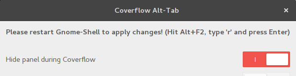
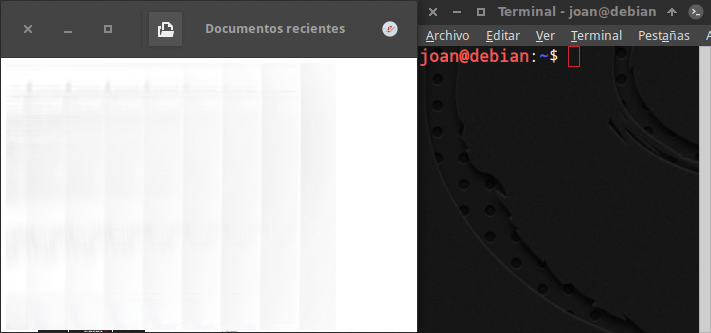
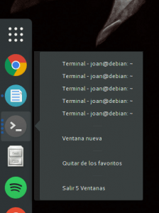

Con la llegada de Gnome Shell deje de usar el escritorio de Gnome. En algunas ocasiones he intentado usarlo de nuevo pero no puedo con él. Quizás seria cuestión de darle más tiempo del que le doy. ¿Pero para que dárselo si estoy más que contento con mi escritorio actual?<!--more-->

Aunque la gente hable y diga que este entorno de escritorio ha mejorado mucho, en mi caso sigo viendo varias cosas que hacen que Gnome Shell no sea de mi agrado. Algunas de ellas son las siguientes:

## NO APROVECHA BIEN EL TAMAÑO DE PANTALLA

Gnome Shell dispone de unos bordes de ventana exageradamente enormes.

¿Alguien me puede explicar porque son tan exageradamente grandes?

Estos bordes me parecen estéticamente feos. Además hacen que estemos desaprovechando pulgadas de nuestro monitor.

Mi opinión es que Gnome Shell está pensado para que sus usuarios trabajen con un únicamente un programa a pantalla maximizada. Esta forma de pensar me parece correcta en una tablet o un teléfono porque tienen una pantalla pequeña.

En un ordenador me parece mal porque hoy en día se disponen de pantallas grandes en las que tener varias ventanas abiertas de forma simultanea permite aprovechar mejor el tamaño de la pantalla y ser más productivos.

## LA ESTÉTICA DE GNOME SHELL ES EXCELENTE PERO NO PERFECTA

Insisto otra vez con los bordes de ventana. En Gnome Shell nos encontraremos programas con bordes de ventana enormes y bordes de ventana normales.

Un ejemplo de lo que estoy mencionando es esto:

Estoy seguro que a nadie le gusta lo que muestro en la captura de pantalla.

Por lo tanto en Gnome Shell no se integran bien los bordes de ventanas de las aplicaciones de Gnome con los bordes de ventana de los aplicaciones tradicionales.

Otra cosa que no me gusta de Gnome es que en sus aplicaciones han eliminado los menús tradicionales para introducir iconos tipo Smartphone que no encuentro para nada intuitivos.

Gnome Shell es un entorno estéticamente bonito, elegante y que luce excelente, pero el resto de entornos de escritorios también son o pueden ser bonitos.

## ENTORNO DE ESCRITORIO POCO PERSONALIZABLE

En Gnome Shell todo está encorsetado y no tienes mucho margen de maniobra para dejar el escritorio a tu gusto. Incluso Windows es más personalizable que Gnome Shell.

Es cierto que existen las extensiones, pero a mi modo de ver las extensiones tienen ciertos problemas como por ejemplo los siguientes:

1. Las extensiones deberían estar más integradas con el sistema operativo. Acostumbran a ir a destiempo y cuando se actualiza el sistema operativo existe la posibilidad que alguna de las extensiones deje de funcionar.
2. Las extensiones están realizadas por desarrolladores que no forman parte de Gnome. Pienso que la experiencia con las extensiones seria mejor si fuera Gnome quien las creará y lanzará al mismo tiempo que las nuevas versiones de su escritorio.
3. No me parece bien que la forma más adecuada para instalar una extensión sea a través del navegador. Algunas distros, como Fedora, disponen de un paquete de extensiones en sus repositorios, pero acostumbran a dar problemas y es mejor instalarlas de la web porque se actualizan con mayor frecuencia.
4. En demasiadas ocasiones las extensiones que instalas no funcionan o de repente dejan de funcionar. Los motivos pueden ser varios como por ejemplo que el desarrollador ha abandonado la extensión, la extensión no es compatible con tu versión de Gnome shell. Etc.
5. Puede darse el caso que  haya alguna extenxión que añada inestabilidad al sistema operativo.

## NO DISPONE DE UNA BARRA DE TAREAS

Este entorno de escritorio no dispone de una panel de tareas y esto me dificulta en exceso cambiar de un programa a otro.

Si tienes 4 programas abiertos y quieres pasar de un programa a otro, lo puedes realizar fácilmente con una barra de tareas. En cambio en Gnome:

1. Tienes que ir al menú Actividades y allí seleccionar el programa que quieres ver en pantalla. Este sistema es muy lento y además en algunas ocasiones mi ordenador se congela antes de entrar en el menú Actividades. Si alguien conoce una extensión para deshabilitar las animaciones de Gnome Shell que la deje en los comentarios del blog.
2. También se puede cambiar de programa mediante atajos de teclado. Aunque es más rápido no merece la pena comentarlo porque esta funcionalidad la tienen todos los entornos de escritorio.

###### Nota: También me disgusta el hot corner para acceder al menú de Activadades. En ocasiones paso el ratón por la esquina superior izquierda y sin querer acabo entrando en el menú de Actividades.

### Dash to dock no es de mi agrado

Hay gente que para solucionar estos problemas usa extensiones como Dash to Dock. En mi caso estas extensiones las encuentro poco prácticas por los siguientes motivos:

1. Cuando minimizas una ventana en el Dock solo queda un simple punto debajo del icono del dock. Por lo tanto mirando al Dock cuesta ver si tenemos alguna ventana minimizada.
2. Al minimizar más de una ventana de un mismo programa tenemos graves problemas para conocer de forma rápida la ventana que tenemos que maximizar. Encontrar la ventana a maximizar requiere demasiado tiempo y demasiados clics de ratón.

### Las barras de tareas de las extensiones no me convencen

Soy consciente que existen extensiones, como por ejemplo Window list, que añaden un panel de tareas, pero ninguna de las extensiones probadas me convence por los siguientes motivos:

1. Son poco personalizables. Normalmente son una barra que va si o si en la parte inferior del monitor y no permite añadir ningún otro elemento.
2. No puedo elegir si la posiciono arriba o abajo, ni la altura que debe tener, etc.

###### Nota: Si alguien conoce un extensión que permite instalar una barra de tareas en la panel superior de Gnome al estilo de Gnome 2 o XFCE que lo comente en los comentarios. Este es uno de los puntos que más me desagrada de Gnome.

### Los atajos de teclado y los escritorios virtuales quizás son la solución

Nunca he aplicado esta solución, pero a priori la única forma que veo bien para cambiar de aplicaciones es con los escritorios virtuales y con los atajos de teclado.

De esta forma pienso que es posible cambiar de una aplicación a otra de forma rápida, sencilla y efectiva.

Aplicar lo que acabo de comentar no es trivial. Muchos de los atajos de teclado necesarios vienen desactivados y por lo tanto hay que entrar en la configuración de atajos de teclado y realizar la configuración pertinente.

Además estoy seguro que debe existir algún tipo de extensión que te abre los programas en el escritorio virtual que selecciones.

###### Nota: La próxima vez que me dedique a probar Gnome Shell lo haré usando atajos de teclado y si alguien lo pide puedo escribir un post en el que explicaré mi experiencia.

## NO ME APORTA NADA EL LANZADOR DE APLICACIONES DE GNOME SHELL

La forma predeterminada para abrir programas en Gnome Shell no es de mi agrado ni me aporta nada nuevo.

La forma más rápida para abrir un programa es presionar la tecla de “Super” para acceder al menú de Aplicaciones y empezar a teclear el nombre del programa. Una vez encontrado el programa presionamos “Enter”.

Con mi ordenador no consigo acceder de forma fluida al menú de Aplicaciones. Cuando consigo entrar estoy en un entorno separado del escritorio y lo único que veo son un montón de iconos enormes que encuentro poco adecuados para un ordenador.

Sin duda me parece mejor lanzar aplicaciones con Whisker Menu, con el menú de Cinammon o KDE.

## ES DEMASIADO MINIMALISTA Y CON APLICACIONES CON FUNCIONES LIMITADAS

Mi opinión es que el entorno de Gnome Shell es demasiado minimalista. Este tipo de entornos los veo adecuados para una tablet o un dispositivo móvil, pero no para un ordenador.

Algunos piensan que un entorno minimalista ayuda que Gnome sea más fácil de usar, pero yo no lo veo así. Lo único que Gnome consigue con el minimalismo es hacer un sistema estéticamente simple, pero funcionalmente lo están haciendo más complicado.

Esconder opciones de un programa puede resultar útil en términos de productividad, pero cuando escondes funciones que tienes que utilizar a menudo entonces consigues el efecto opuesto.

Además muchas de las aplicaciones de Gnome, como por ejemplo el gestor de archivos, involucionan. En vez de añadir funcionalidades para conseguir que se asemeje a Dolphin van quitando funcionalidades para que sea más limitado.

## SU REQUERIMIENTO DE HARDWARE NO ES BÁSICO

Gnome Shell no es un entorno de escritorio para ordenadores antiguos. Seria bueno que fuera más liviano.

En mi caso uso Gnome Shell en un ordenador viejo y aunque es perfectamente usable, la experiencia que tengo  no es fluida por los siguientes motivos:

1. Existen ocasiones en que noto que se congela la pantalla del ordenador durante instantes.
2. A la que tengo abiertos 3 o 4 programas de forma simultánea noto lentitud y poca fluidez.
3. Hay veces que cuando le doy al botón de apagar el ordenador tengo que esperar entre 20 y 30 segundos para que me aparezca la ventana en la que tengo que clicar el botón de Cerrar.

Además su consumo de memoria RAM es elevado si lo comparamos con otros escritorios.

## CAMBIO DEMASIADO DRÁSTICO SIN NINGUNA JUSTIFICACIÓN

Tanto Gnome Shell como Unity optaron por un cambio drástico en sus entornos de escritorio.

Esto implica un cambio en el modo de interactuar con el escritorio que obviamente mucha gente no acepto.

Además… ¿Por que la gente tiene que realizar un cambio tan drástico a la hora de usar un escritorio si la nueva forma de trabajar no aporta una ventaja significativa?

Es más… a día de hoy el nuevo escritorio sigue siendo menos funcional que el antiguo.

Cualquier cambio que se introduce tiene que aportar una ventaja significativa respecto lo que hay y si no lo hace entonces mejor no cambiar. Por este motivo pienso que Gnome Shell fue un error.

Gnome estoy seguro que ha perdido muchos usuarios y dudo que los vuelva a recuperar.

Sacaron un escritorio completamente nuevo con menos funcionalidades que el anterior. Además generando molestias a sus usuarios con la lógica aparición de bugs que ayudaron a empeorar una experiencia de usuario que ya era mala de por si.

## A TENER EN CUENTA

En este artículo únicamente describo mi experiencia personal. Aunque en principio puede sonar un tanto negativa pienso que gran parte de mis quejas se pueden solucionar de una forma u otra. Por lo tanto si alguien conoce un método para solucionar algunos de los puntos que menciono agradecería que lo explicará en los comentarios del blog.

Como habéis visto Gnome no es mi entorno de escritorio preferido, pero deseo que más pronto que tarde pueda recuperar gran parte de sus antiguos usuarios ya que pienso que para Linux seria positivo ya que Gnome es uno de los grandes.
