En el siguiente post detallaré como realizar un mailing o envío de correos masivos con el gestor de correo Thunderbird. El proceso que veremos no es el mas extendido para realizar un mailing en un entorno profesional, pero aplicando la metodología descrita en este post conseguiremos realizar un mailing sin tener que depender de aplicaciones/servicios de terceros como por ejemplo el archiconocido [Mailchimp](http://mailchimp.com/ "Servicio Web para hacer mailings"), [Max Bull mailer](http://www.maxprog.com/site/software/internet-marketing/mass-bulk-emailer_sheet_es.php "Software para el envío de mailings"), etc.<!--more-->

**Después de implementar los pasos descritos en este artículo**, dispondremos de un sistema de mailing capaz de realizar las siguientes acciones:

1. **Enviar un mail personalizado, con texto e imágenes** a la totalidad de contactos de nuestra base de datos.
2. **Programar el envío de mails** para incrementar la tasa de apertura de los mails, y evitar que nuestro servidor de correo electrónico nos bloquee la cuenta de correo por Spam.
3. **Hacer un seguimiento** de la tasa de apertura de nuestro mails, si los destinatarios han realizado click en alguno de los links del email, saber que han realizado los usuarios después de entrar en los links que se proporcionan en el email, etc.

###### Nota: En los entornos profesionales, la gran mayoría de empresas que precisan realizar un mailing utilizan una herramienta llamada Mailchimp.

###### Nota: Quien tenga un blog y envíe boletines e información a sus lectores, le aconsejaría utilizar un plugin de wordpress llamado [mailpoet](https://www.mailpoet.com/ "web de los desarrolladores del plugin de wordpress") para hacer la distribución de sus newsletters a los lectores.

###### Nota: El hecho de no utilizar servicios de terceros como mailchimp o mailpoet tiene grandes ventajas en el campo de la privacidad. De este modo nadie podrá analizar el contenido de nuestro emails, ni disponer de nuestra base de datos, ni cortarnos el servicio por considerar que estamos violando sus términos de uso, etc.

## INSTALAR LAS EXTENSIONES MAIL MERGE Y ENVIAR MAS TARDE

**El primer paso a realizar es instalar las extensiones Mail merge y Enviar más tarde** para poder realizar el envío masivo de mails.

La extensión [mail merge](https://addons.mozilla.org/es/thunderbird/addon/mail-merge/ "Web de la extensión de Mozilla Mail Merge") es la que nos permitirá realizar el envío masivo de mails. Para poder instalarla **accedéis al menú Herramientas** de vuestro gestor de correo Thunberbird. Una vez abierto el menú Herramientas se desplegará un submenú en el que tendréis que **seleccionar la opción Complementos**.

Seguidamente se abrirá una pestaña para administrar los complementos. Para instalar mail merge, tal y como se puede ver en la captura de pantalla, **accedemos al cuadro de búsqueda, escribimos el nombre del complemento**, que en nuestro caso es mail merge, y **presionamos la tecla Enter**.

Después de presionar Enter se realizará la búsqueda de la extensión. Una vez encontrada, tal y como se muestra en la captura de pantalla **presionamos el botón Instalar y la extensión se instalará.**

[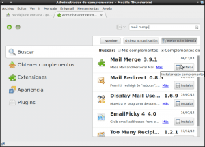](images/2-Instalar-mail-Merge.png)

Una vez instalada la extensión mail merge instalaremos la extensión Enviar más tarde. La extensión Enviar más tarde es la que nos permitirá programar el envío de nuestros mails.

Para instalar [Enviar más tarde](https://addons.mozilla.org/es/thunderbird/addon/send-later-3/?src=search "Web de la extensión de Mozilla Enviar más tarde"), tal y como se puede ver en la captura de pantalla, **accedemos al cuadro de búsqueda, escribimos el nombre del complemento**, que en nuestro caso es enviar más tarde, y **presionamos la tecla Enter**.

Después de presionar Enter se realizará la búsqueda de la extensión. Una vez encontrada, tal y como se muestra en la captura de pantalla **presionamos el botón Instalar** y la extensión se instalará.

Una vez instaladas estas dos extensiones, **cerramos Thunderbird y lo volvemos a abrir**.

## ELABORAR LA PLANTILLA PARA PODER REALIZAR EL MAILING

Una vez tenemos todo el software necesario disponible, ya podemos empezar a redactar nuestro correo. Imaginemos que tenemos una empresa y queremos invitar a la totalidad de nuestros clientes a una convención comercial.

###### Nota: Obviamente tenemos muchos clientes y es interesante poder realizar un envío masivo de correos y que además estén personalizados para quedar bien con ellos.

Para invitar a los clientes, tal y como se puede ver en la captura de pantalla, **empezamos a redactar el mail de invitación con la particularidad que las partes a personalizar las tendremos que escribir entre corchetes**. Así **a modo de ejemplo** si en el asunto del mail queremos poner:

Comunicado a la empresa Bobinados Alonso

Queda claro que la parte a personalizar es el nombre del cliente. Por lo tanto nosotros **deberemos sustituir Bobinados Alonso por una referencia cualquiera entre corchetes tal y como se muestra a continuación**:

Comunicado a la empresa {{empresa}}

**Siguiendo este patrón el mensaje quedará tal y como se muestra en la siguiente captura de pantalla**:

[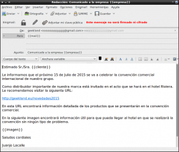](images/4-Plantilla-del-mail-finalizada.png)

Tal y como se puede ver en la captura de pantalla, **las partes/campos a personalizar son los siguientes**:

**{{mail}} :** El campo {{mail}} ubicado en la parte donde ponemos nuestra dirección de email, obviamente es variable ya que cada mail que enviemos irá dirigido a una dirección de email diferente. **{{cliente}} :** Como hemos comentado antes, el campo {{cliente}} es variable ya que en cada una de las invitaciones que enviemos a nuestros clientes esta parte será diferente. **{{imagen}} :** El campo {{imagen}} también es variable, ya que cada cliente o cada persona a la que enviemos la invitación, le aparecerá una imagen diferente que será un mapa con instrucciones para llegar a nuestra oficina.

###### Nota: Si os fijáis bien, el mail contiene una dirección a una URL que contiene las novedades que se presentarán en la convención comercial. Este link se puede generar con el [creador de URL de Google](https://support.google.com/analytics/answer/1033867?hl=es "Web para crear URL de seguimiento"). De esta forma, mediante google analytics, podremos analizar cuales son las novedades que más interesan a nuestro equipo comercial.

**Una vez completada la plantilla la tenemos que guardar**. Para ello **accedemos al menú Archivo**. Una vez hayamos accedido al menú se desplegará un submenú en el que tendremos que **seleccionar la opción Guardar como**. Finalmente aparecerá otro menú desplegable en el que **seleccionaremos Plantilla**.

###### Nota: Si se hubiera personalizado aún más el envío del mail, se podrían haber preparado 2 mailings. Uno dirigido a nuestros clientes mujeres y otro dirigido a nuestros clientes hombres. Esta segmentación podría ser importante para analizar que novedades de nuestra convención comercial interesan más a los hombres y cuales interesan más a las mujeres. Para ello es importante tener una buena base de datos de nuestro clientes.

###### Nota: Tal y como se puede ver en la última captura de pantalla, el mail tiene un fondo completamente blanco. No obstante si quisiéramos podríamos haber insertado una plantilla html en Thunderbird para modificar el look de nuestro mail de invitación y dar una imagen más corporativa o más publicitaria a nuestro mail. Si quieren saber como pueden realizar lo que acabo de citar pueden visitar el siguiente [enlace]().

## PREPARAR UNA BASE DE DATOS PARA EL ENVÍO DEL MAILING

Una vez tenemos preparada y guardada la plantilla, ya podemos empezar a preparar la base de datos que nos servirá para enviar enviar los mailings a nuestros clientes. Para ello **abrimos Excel, Libreoffice o cualquier otra hoja de cálculo**.

Una vez abierta la hoja de cálculo, tal y como se puede ver en la captura de pantalla, **en la primera fila de cada una de las columnas tenemos que escribir el nombre de los campos que queremos modificar**, que si miramos en el apartado anterior veremos que son **mail**, **empresa**, **cliente** e **imagen**:

[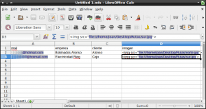](images/5-Hacer-base-de-datos-csv.png)

Seguidamente tal y como se puede ver en la captura de pantalla, tenemos que **rellenar las filas de cada uno de los campos a personalizar**. Así por lo tanto:

**En la columna A**, que contiene el campo mail, iremos poniendo **la totalidad de mails a los que queremos enviar nuestra invitación**.

**En la columna B**, que contiene el campo empresa, tendremos que **poner** **el nombre de la empresas de cada uno de los clientes**.

**En la columna C**, que contiene el campo cliente, tendremos que **poner el nombre de cada nuestro clientes**.

Finalmente **en la columna D**, que contiene el campo imagen, tenemos que **indicar la URL o dirección de las imágenes que queremos ir adjuntando** a cada uno de nuestros clientes. Para ver como indicar la URL pueden ver la captura de pantalla.

###### Nota: Los datos de la columna A, B, C y D tendrán que tener una correlación. Por lo tanto la fila 2 contendrá la totalidad de datos del primero de los clientes, la fila 3 contendrá la totalidad de datos del segundo de los clientes, etc.

Una vez terminada la base de datos ya la podemos guardar. Para ello **accedemos al menú Archivo**. Al desplegarse el submenú **seleccionamos la opción Guardar como**. Seguidamente aparecerá la siguiente ventana:

[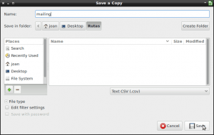](images/6-Guardar-base-de-datos-csv.png)

Tal y como se puede ver en la captura de pantalla, en la ventana Guardar como tenemos que **seleccionar el formato** en el que queremos guardar el archivo que en mi caso es **.csv**.

Una vez seleccionado el formato tan solo tenemos que **poner un nombre a nuestro archivo, seleccionar la ubicación donde lo queremos guardar** y finalmente tan solo falta **presionar el botón Guardar**.

Una vez hayamos presionado encima del botón guardar nos aparecerá otra ventana:

[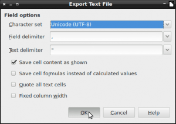](images/7-Exportar-a-csv.png)

En esta ventana tendremos que **seleccionar el tipo de codificación de nuestro archivo así como los delimitadores de campo y de texto junto** con otras opciones de configuración.

**Les aconsejo que se use la configuración que se muestra en la captura de pantalla** ya que es plenamente funcional y no da ningún tipo de problema. En el hipotético caso que tengan problemas en la visualización de los caracteres cuando se envíe el mailing, pueden probar de reemplazar la codificación Unicode (UTF-8) por la Windows-1252.

###### Nota: Las codificación UTF-8 y la Windows-1252, son las 2 únicas codificaciones a probar, ya que estas 2 son las únicas plenamente soportadas por Thunderbird y Mail Merge.

Una vez seleccionadas las opciones pertinentes tan solo falta **presionar el botón Aceptar**. Después de presionar el botón aceptar se generará nuestro archivo .csv que contiene toda la información necesaria para realizar el envío masivo de mails.

## TRACKEAR SI SE ACCEDEN A LOS LINKS DEL MAILING

Obviamente si realizamos un mailing o enviamos un mail de forma masiva, es importante conocer los resultados obtenidos del envío. Para ello, mediante el uso de google analytics podemos analizar multitud de parámetros, como por ejemplo la tasa de apertura de nuestros mails, los clicks que realizan los receptores del mail en los links que contiene nuestro mail, que acciones realizan los usuarios que acceden a una web a través del mailing que hemos realizado, etc.

Como es un tema complejo y largo de explicar, en un futuro escribiré una serie de post que detallarán como realizar cada una de las acciones que acabo de citar.

## ENVIAR EL MAILING

Una vez realizados la totalidad de los pasos tan solo nos falta enviar el mailing. Para enviar el mail **abrimos el gestor de correo Thunberbird** y **recuperaremos la plantilla que generamos para enviar el mail**. Para ello, tal y como se puede ver en la captura de pantalla, nos vamos a la carpeta Plantillas, buscamos nuestra plantilla y hacemos doble click encima de ella para que se abra.

[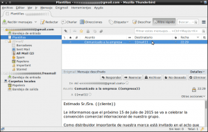](images/8-Abrir-la-plantilla-para-enviar-el-mail.png)

Una vez abierta la plantilla, tal y como se puede ver en la captura de pantalla, **abrimos el menú Archivo y a posteriori ejecutamos la opción Mail Merge**:

[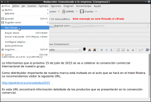](images/9-Iniciar-el-envio-del-mailing.png)

Seguidamente **aparecerá la siguiente ventana:**

[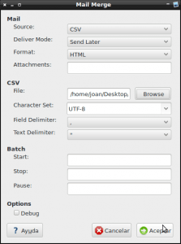](images/10-Ventana-de-configuración-de-mail-merge.png)

En esta ventana es donde deberemos indicar a mail merge, cual el fichero .csv que rellenamos en uno de los apartados de este artículo, y además podremos programar el envío de nuestros emails. **En cada una de las distintos campos de esta ventana podemos seleccionar las siguientes opciones:**

**Campo Source:** En este campo deberemos seleccionar la opción **CSV** ya que la información para personalizar los emails está contenida en un archivo .csv.

**Campo Deliver Mode:** En este campo tenemos que considerar 3 opciones. **Send Now**, **Send Later** y **Send as a draft**.

La opción **Send Now** nos permite enviar de forma inmediata un correo cada x segundos seleccionando porqué número de cliente de la base de datos queremos empezar y porqué número queremos terminar.

La opción **Send Later**: Cada x segundos guarda uno de los email que queremos enviar en la bandeja de salida de nuestro mail. Una vez que la bandeja de salida contenga todos los emails, y una vez hayamos comprobado que los mails se visualizan correctamente, nos tenemos que ir al menú Archivo y una vez dentro del menú tenemos que seleccionar la opción Procesar mensajes no enviados. Una vez seleccionada la opción se enviaran la totalidad de correos a sus destinatarios.

La opción **Send as a Draft**: Permite programar envíos a un ahora determinada y con una periodicidad determinada. Una vez enviado el correo los mensajes quedarán en la carpeta borradores esperando que llegue la hora del envío que hemos determinado.

**Campo Format:** En este campo podemos elegir entre las opciones Plain Text, **HTML** o Both. Si elegimos la opción Plain text nuestros emails se enviaran en texto plano y por lo tanto no se podrán mostrar las imágenes incrustadas o lincadas en él. Si elegimos el modo HTML, el mail se enviará en formato HTML y entonces el personal que reciba el email si que podrá ver las imágenes incrustados y el resto de código html.

**Campo Attachment:** En un envío de mails masivo, o mailing, no es muy aconsejable incluir archivos adjuntos, ya que lo que nos interesa son mails ligeros para no saturar el servidor y para que no nos consideren spammers. No obstante en este campo si queremos podemos añadir la dirección del archivo que queremos adjuntar en el mail. De este modo todos los mails enviados contendrán un archivo adjunto. Si esta forma no nos gusta podemos añadir el archivo que queremos enviar directamente en la plantilla que hemos preparado.

**Campo File:** En este campo tenemos que clicar la opción Browse. Al clicar aparecerá el navegador de archivos. En el navegador de archivos deberemos indicar la ruta de nuestro fichero .csv.

**Campo Character set:** Como la base de datos / fichero csv, lo codificamos en formato **Unicoide (UTF-8)** en este campo también deberemos indicar que la codificación es del tipo UTF-8. Si la base de datos la codificamos en formato Windows-1252, en este apartado deberemos seleccionar la opción Windows-1252.

**Campo Field Delimeter:** En el fichero .csv definimos que el campo delimitador era una coma (**,**). Por lo tanto en esta campo deberemos seleccionar **,** como campo delimitador.

**Campo Text Delimeter:** En el fichero .csv definimos que el texto delimitador eran dos comillas (**”**). Por lo tanto en esta campo deberemos seleccionar **”** como texto delimitador.

**Campo Start:** En este campo tenemos que indicar el número de fila de nuestra base de datos por la que queremos que nuestro cliente de correo electrónico empiece a enviar los mails.

**Campo Stop:** En este campo tenemos que indicar el número de fila de nuestra base de datos por la que queremos que nuestro cliente de correo electrónico termine de enviar los mails.

**Campo Pause:** En este campo tenemos que indicar cada cuantos segundos queremos que se envíe un email. Este campo es útil ya que si enviamos muchos mails en un periodo de tiempo corte, es posible que nuestra cuenta de correo pueda ser considerada spam.

**Campo At (solo activo cuando seleccionamos la opción Send as a Draft):** En este campo podemos indicar la hora y el día en que queremos que se envíe el mailing.

**Campo Recur (solo activo cuando seleccionamos la opción Send as a Draft):** En este campo podemos seleccionar las opciones **Daily**, **Weekly**, **Monthly** e **Yearly**. De este modo podemos indicar la periodicidad con que queremos que se repita el envío del mailing.

**Campo Every (solo activo cuando seleccionamos la opción Send as a Draft):** En este campo tenemos que indicar cada cuantos días, semanas, meses o años queremos que se repita el mailing.

Una vez vistas la totalidad de opciones de forma teórica, ha llegado el momento de ver unos ejemplos prácticos para ver que es mucho más fácil de lo que parece.

### Ejemplo de envío con el modo Send Now

[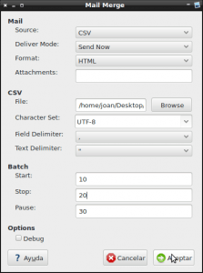](images/11-Enviar-mailing-con-la-opción-send-now.png)

Si **seleccionamos las opciones que se muestran en la captura de pantalla**, en el momento que **presionemos el botón Aceptar** se enviarán 10 mails. Los emails se enviarán cada 30 segundos, y los usuarios a los que se enviará el mail serán aquellos que están entre la posición 10 y 20 de nuestra base de datos.

### Ejemplo de envío con el modo Send Later

[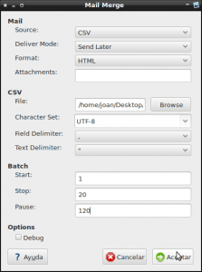](images/12-Configuración-para-enviar-un-mailing-con-la-opción-send-later.png)

Si **seleccionamos las opciones que se muestran en la captura de pantalla**, en el momento que **presionemos el botón Aceptar** cada 120 segundos aparecerá un mail nuevo en la bandeja de salida listo para salir.

**Una vez tengamos la bandeja de salida llena** con los 20 emails que queremos enviar a los 20 primeros usuarios de nuestra base de datos, tal y como se puede ver en la captura de pantalla, deberemos **acceder al menú Archivo** y a posteriori **clicar en** la opción **Procesar mensajes no enviados**.

[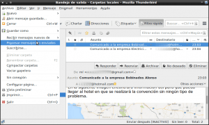](images/13-Enviar-un-mailing-con-la-opción-Send-Later.png)

Una vez seleccionada esta opción se enviarán la totalidad de mails a sus destinatarios.

###### Nota: Esta opción resulta útil para asegurarnos que el mail preparado se puede visualizar de forma correcta por parte de los destinatarios, ya que permite visualizar el mail que enviaremos antes de enviarlo.

### Ejemplo de envío con el modo Send as a Draft

[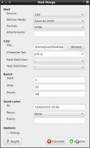](images/14-Programar-el-envío-del-mailing-a-una-fecha-y-hora.png)

Si **seleccionamos las opciones que se muestran en la captura de pantalla**, en el momento que **presionemos el botón Aceptar** cada 30 segundos aparecerá un mail nuevo en la carpeta borradores de nuestro correo electrónico.

Una vez tengamos la carpeta borradores llena con los 20 emails que queremos enviar a los 20 primeros usuarios de nuestra base de datos, tan solo tenemos que esperar hasta que lleguen las 15:40 horas del día 15/04/2015. En el momento que sean las 15:40 horas de la tarde del mencionado día, los 20 primeros usuarios de nuestra base de datos recibirán un mail.

### Ejemplo de envío con el modo Send as a Draft indicando una periodicidad de envío

[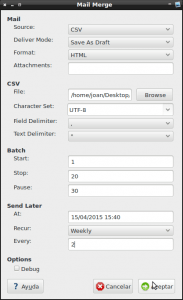](images/15-Enviar-un-mailing-de-forma-periodica.png)

Si **seleccionamos las opciones que se muestran en la captura de pantalla**, en el momento que **presionemos el botón Aceptar** cada 30 segundos aparecerá un mail nuevo en la carpeta borradores de nuestro correo electrónico.

Una vez tengamos la carpeta borradores llena con los 20 emails que queremos enviar a los 20 primeros usuarios de nuestra base de datos, tan solo tenemos que esperar hasta que lleguen las 15:40 horas del día 15/04/2015. En el momento que sean las 15:40 horas de la tarde del mencionado día, los 20 primeros usuarios de nuestra base de datos recibirán un mail. Además cada 2 semanas a partir de la fecha 15/04/2015 a las 15:40 se repetirá el envío de mails a los 20 primeros usuarios de nuestra base de datos.

## RESULTADO OBTENIDO

Una vez enviados los correos tan solo falta comprobar que están recibiendo los los receptores del mail. Así por lo tanto supongamos uno de los clientes recibe el mail. Justo en el momento de abrirlo verá el siguiente contenido:

[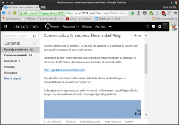](images/16-Recepción-del-mailing-por-los-destinatarios.png)

Por lo tanto podemos estar tranquilos porqué el mailing ha sido completamente satisfactorio.

## PRECAUCIONES QUE HAY QUE TENER

Las precauciones que debemos tener usando el sistema detallado en este artículo son obvias y son las siguientes:

1. **No es aconsejable realizar un envío masivo de correos electrónicos usando cuentas gratuitas de gmail, yahoo, hotmail, etc**. Las cuentas gratuitas poseen limitaciones, y una de estas limitaciones es el número de mails que se pueden enviar por día. Si superamos los límites establecidos de nuestra cuenta de correo se bloqueará. A modo de ejemplo, las limitaciones de las cuentas de correo de gmail son las podéis consultar en el siguiente [enlace](https://support.google.com/a/answer/166852?hl=es "Limitaciones de las cuentas de correo gratuitas de gmail"). En el caso de querer realizar los mailing uno mismo lo mejor es contratar un servicio de smtp dedicado.
2. La linea que separa el envío masivo de emails y el spam es fina. Por lo tanto conviene **no abusar del envío de mailings y hacer el envío de forma progresiva**. Nuestro servidor lo agradecerá y además el peligro que nuestra cuenta de correo sea considerada spammer será mucho menor.
3. En el caso de realizar un mailing comercial, o envío de correos de correos masivos, **hay que informar debidamente a los destinatarios del mail, aunque sea en letra pequeña**. Además **al usuario hay que darle herramientas para que en caso que lo desee pueda solicitar no recibir más correos** de forma masiva.
4. Cada mailing que se haga **hay que analizar y ver los correos que han llegado a su destinatario y cuales no**. De esta forma podremos detectar que direcciones de nuestra base de datos son incorrectas. Las direcciones incorrectas hay que borrarlas de nuestra base de datos ya que si enviamos muchos mails a direcciones inexistentes corremos el peligro que nuestra cuenta de correo sea detectada como Spam.
5. **Los correos que se envíen deben contener una cantidad importante de texto y hay que evitar poner archivos adjuntos e incrustar imágenes**. Si la relación entre texto/imagen es baja es posible que nuestro correo electrónico sea considerado spam.
