Hoy estaba buscando dos archivos en una carpeta determinada y sorprendentemente no estaban. Mi conclusión es que sin querer los borré por accidente hace unos días. Las primeras cosas que me han pasado por la cabeza para intentar recuperar archivos borrados han sido las siguientes:<!--more-->

1. Intentar rescatar los archivos de una copia de seguridad antigua. Desafortunadamente en mi caso no disponía de ninguna copia de seguridad.
2. Mirar si los archivos estaban disponibles en algún email. Después de realizar la comprobación pertinente he visto que nunca había enviado estos archivos a un tercero.
3. Usar un software para recuperar archivos borrados como por ejemplo Recuva. Esta opción precisa gran cantidad de tiempo y en ocasiones los resultados obtenidos no son satisfactorios.
4. Mirar la papelera de Reciclaje para ver si aún estaba allí. Obviamente no estaba.

A raíz de esta situación la solución más fácil y efectiva para recuperar los archivos en cuestión ha sido usar las versiones anteriores de Windows. De esta forma en menos de 10 segundos y sin programas de terceros he podido recuperar los archivos que borré sin problemas.

## ¿QUÉ SON LAS VERSIONES ANTERIORES DE WINDOWS?

Windows guarda copias de seguridad de nuestros archivos y carpetas de forma periódica y automática como partes de un punto de restauración. A estas copias de seguridad las llamamos versiones anteriores de Windows. Las versiones anteriores de Windows nos proporcionan las siguientes funcionalidades:

1. En el caso de que hayamos borrado un archivo o una carpeta los podemos recuperar de forma sencilla, rápida y efectiva.
2. En el caso que hayamos modificado el contenido de un documento y queramos volver a recuperar una versión antigua del documento lo podemos hacer sin problema.

###### Nota: Está funcionalidad se incluyó por primera vez en Windows Vista. Por lo tanto la totalidad de versiones de Windows actuales poseen esta funcionalidad.

## RECUPERAR ARCHIVOS BORRADOS CON LAS VERSIONES ANTERIORES DE WINDOWS

Supongamos que entro en la carpeta Usar la consola de Bash en Ubuntu y veo que no está presente el archivo de Word que estaba editando.

[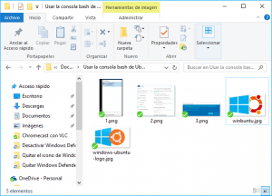](images/Archivo-borrado-por-accidente.png)

Para intentar recuperarlo podemos consultar las versiones anteriores de la carpeta en cuestión. Para ello dentro de un espacio en blanco del gestor de archivos presionamos el botón derecho del mouse y cuando aparezca el menú contextual clicamos sobre Propiedades

[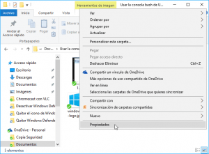](images/Consultar-versiones-anteriores-disponibles.png)

A continuación clicamos sobre la pestaña Versiones anteriores y dentro del recuadro de color rojo verán la totalidad de copias de seguridad que tenemos disponibles. Hacemos doble click sobre una de las copias de seguridad disponibles.

[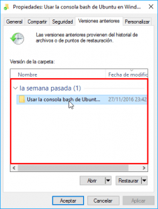](images/Clicar-sobre-la-copia-de-seguridad.png)

###### Nota: En mi caso únicamente tengo disponible una copia de seguridad del día 27/11/2016

Después de clicar encima se abrirá una ventana en el que podremos ver el contenido de la carpeta Usar la consola de Bash en Ubuntu del día 27/11/2016.

[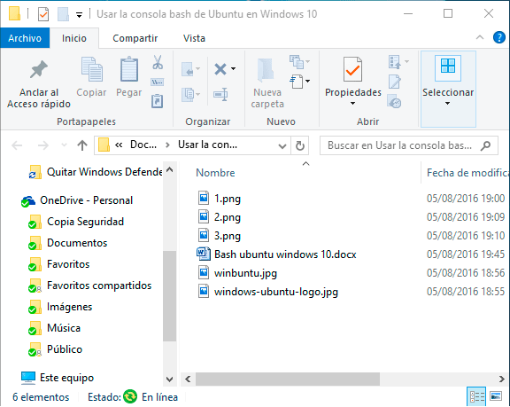](images/Contenido-copia-de-seguridad.png)

Obviamente en la copia de seguridad del 27/11/2016 si aparece el archivo Word que había borrado por accidente. Para recuperarlo tan solo tengo que copiarlo y pegarlo a la carpeta que yo considere oportuna.

[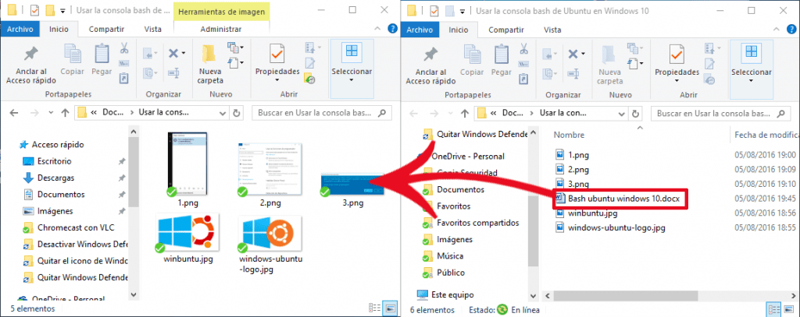](images/Recuperar-archivos-borrados-puntos-restauración.png)

Una vez copiado el archivo ya vuelvo a disponer de la totalidad de los archivos y he solucionado el problema.

[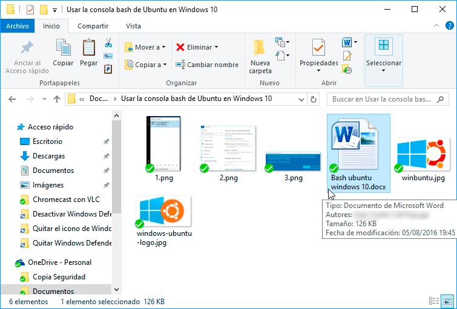](images/Archivos-borrados-recuperados.png)

De esta forma tan fácil y tan rápida podemos recuperar archivos borrados sin problema alguno.

## RECUPERAR LA VERSIÓN ANTIGUA DE UN DOCUMENTO

Si por lo contrario lo único que pretenden es recuperar o consultar la versión antigua de un archivo que editamos de forma habitual lo podemos hacer de la siguiente forma.

Seleccionamos el archivo en cuestión, presionamos el botón derecho del ratón y cuando aparezca el menú contextual clicamos sobre la opción Restaurar versiones anteriores.

[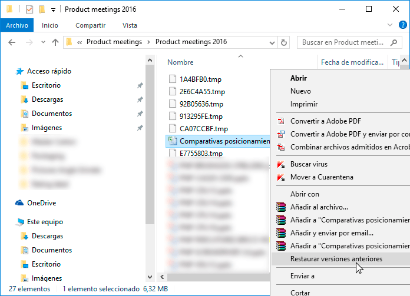](images/Consultar-versiones-anteriores-archivo.png)

A continuación dentro del recuadro rojo aparecerán las versiones del archivo disponibles. Seleccionamos la versión del archivo que queremos consultar y presionamos el botón Abrir.

[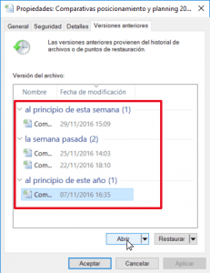](images/Abrir-version-anterior-archivo.png)

###### Nota: No elijo la opción restaurar por 2 motivos. El primero es que quiero ver que hay en la copia de seguridad del archivo que estoy abriendo. El segundo es que si restauro el archivo de la copia de seguridad sobreescribiré la versión actual del archivo.

Seguidamente se abrirá el archivo tal y como era el día 07/11/2016. Si les interesa recuperar esta versión del archivo tan solo tienen que realizar un Guardar Como y guardarlo en la ubicación que crean pertinente.

[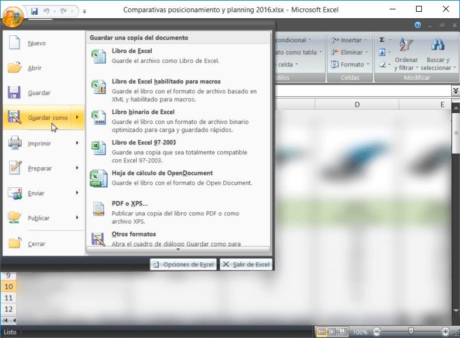](images/Guardar-como-la-copia-de-seguridad.png)

## CONFIGURACIÓN DE LAS VERSIONES ANTERIORES DE WINDOWS

Esta funcionalidad acostumbra a venir activada de serie en todas las versiones de Windows.

En caso que quieran asegurarse de ello, o configurar esta funcionalidad según sus necesidades, deben seguir los siguientes pasos.

En el menú de búsqueda de Windows teclean la palabra punto de restauración. Una vez realizada la búsqueda clicamos encima de la opción Crear un punto de restauración.

[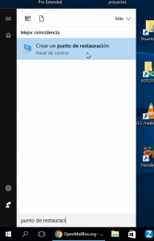](images/Acceder-configuración-puntos-restauración.png)

A continuación seleccionamos el disco duro en el que queremos activar las versiones anteriores o puntos restauración y presionamos el botón Configurar...

[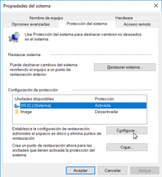](images/Configuración-puntos-restauración.png)

Finalmente verán la siguiente ventana en la que podrán realizar toda la configuración de los puntos de restauración.

[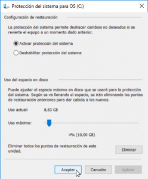](images/Opciones-configuración-puntos-restauracion.png)

En la sección Configuración de restauración veremos las opciones Activar protección de sistema y Deshabilitar protección de sistema.

1. Si seleccionamos la opción Activar protección del sistema se activa la funcionalidad de crear puntos de restauración y podremos utilizar las versiones anteriores.
2. En el caso que seleccionemos la opción Deshabilitar protección del sistema desactivaremos los puntos de restauración de Windows y por lo tanto no podremos usar las versiones anteriores de Windows. Por lo tanto si activamos esta opción no podremos recuperar archivos borrados por accidente, pero por contrapartida ahorraremos espacio en nuestro disco duro.

Si elegimos la opción Activar protección de sistema, en la sección Uso del espacio en disco tenemos que asignar el espacio del disco duro que queremos dedicar a crear puntos de restauración. En mi caso seleccionado un espacio de 10GB.

### Consideración sobre las versiones anteriores de Windows

En principio Windows es el encargado de gestionar las versiones que existen de cada uno de los archivos y carpetas.

El número de versiones disponibles para poder recuperar archivos y carpetas dependerá de varios factores:

1. De la configuración realizada en los puntos de restauración del sistema. Si asignamos poco espacio para realizar puntos de restauración, el número de versiones anteriores almacenadas será menor.
2. De la antigüedad de los ficheros que queremos recuperar. Cuanto más antiguos sean los ficheros a recuperar, mayor serán el número de versiones anteriores disponibles.
3. Cuantas más modificaciones y actividad haya sufrido el fichero, mayor será el número de versiones anteriores almacenadas.

## CONCLUSIONES SOBRE LOS PUNTOS DE RESTAURACIÓN DE WINDOWS

Como han visto las versiones anteriores son tremendamente efectivas para recuperar archivos borrados.

Con las versiones anteriores de Windows no nos tenemos que preocupar de realizar copias de seguridad ya que en todo momento podremos restaurar nuestro sistema o nuestros archivos de forma extremadamente fácil.

A pesar de esto es altamente recomendable que sigamos realizando copias de seguridad ya que en el caso que se dañe el disco duro de nuestro ordenador o en caso de robo, las versiones anteriores de Windows serán completamente inútiles.

Esta herramienta es sumamente práctica. No obstante hay que tener en cuenta que reducirá la capacidad de almacenamiento de nuestro disco duro. Por lo tanto a los usuarios que dispongan de una capacidad de disco duro pequeña les puede resultar interesante prescindir de esta característica.

Para finalizar solo comentar que si algún lector del post conoce una solución similar para el sistema operativo GNU Linux la deje en los comentarios.
