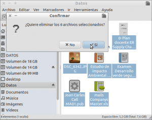
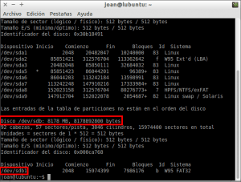
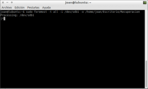
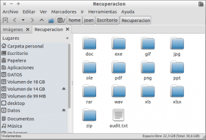

No acostumbra a pasar casi nunca pero en alguna ocasión todos hemos acabando borrando un archivo o una foto de nuestro ordenador, de nuestro teléfono o de nuestra cámara de fotos que no queríamos borrar.<!--more-->

En el caso de encontrarnos en esta situación tenemos varias herramientas para recuperar los archivos que hemos borrado. En este post veremos una herramienta para recuperar archivos borrados que se llama Foremost.

## INSTALAR FOREMOST

Instalar Foremost es sumamente fácil ya que está presente en los repositorios de prácticamente la totalidad de distros Linux. Por lo tanto tan solo tenemos que **abrir una terminal y ejecutar el siguiente comando**:

> ```
> sudo apt-get install foremost
> ```

Una vez ejecutado el comando se instalará el programa Foremost que es el que utilizaremos para recuperar nuestros archivos.

## ¿CÓMO FUNCIONA FOREMOST?

Primero de todo tenemos que partir de la base que cuando borramos un archivo de un disco duro, una tarjeta SD o cualquier dispositivo de almacenamiento no lo estamos borrando realmente, sino que lo que estamos haciendo es borrar una serie de metadatos de la tabla maestra de archivos (MFT) para que el sistema operativo considere que la ubicación que contenía el archivo borrado está vacía y por lo tanto está de nuevo disponible para guardar contenido.

Por lo tanto aunque borremos un archivo, este archivo seguirá estando en nuestro dispositivo de almacenamiento hasta que los sectores del dispositivo de almacenamiento que contienen la información sobre este archivo no sean rescritos con contenido nuevo.

Partiendo de esta base, Foremost **intenta recuperar los datos borrados aplicando una técnica llamada** [file carving](https://en.wikipedia.org/wiki/File_carving "Explicación de la técnica File Carving"). La técnica del file carving consiste en recuperar archivos y datos del disco duro sin disponer de la serie de metadatos que hemos borrado de la tabla maestra de archivos (MFT). Para ello **Foremost escaneará la totalidad de contenido de nuestro dispositivo de almacenamiento intentando identificar si el contenido escaneado contiene las estructuras hexadecimales típicas de inicio y fin de un determinado tipo de archivo**. **En el momento que Foremost localice una de estas estructuras** (inicio-fin), **extraerá la información contenida entre el inicio y el fin recuperando así un archivo** que previamente habíamos borrado.

## FORMATOS DE ARCHIVO QUE PUEDE RECUPERAR CON FOREMOST

Por el modo de recuperación de archivos descrito en el apartado anterior es imposible que Foremost recupere el 100% de información almacenada en un disco duro. De forma estándar **Foremost puede recuperar los siguientes formatos de archivo**:

**jpg, gif, png, bmp, avi, tiff, mp4, exe, mpg, wav, asf, wma, mp3, fws, riff, wmv, mov, pdf, ole, doc, docx, xls, xlsx. ppt, pptx, zip, rar, html, cpp, java, art, pst, ost, dbx, idx, mbx, wpc, pgp, txt, rpm, dat, etc.**

Por lo tanto podemos recuperar una gran cantidad de formatos de archivo, pero sin duda **existen formatos de archivo importantes** para los usuarios de linux **que no están presentes en la lista** **como por ejemplo** la extensiones de los documentos de Libreoffice (**.odt**), **o** los archivos de almacenamiento de mails del gestor de correo Thunderbird (**.msf**). **Si queremos que Foremost también busque estos formatos de archivos podemos modificar el archivo de configuración** /etc/foremost.conf **ejecutando el siguiente comando en la terminal**:

> ```
> sudo nano /etc/foremost.conf
> ```

Una vez abierto el editor de texto nano, **al final del archivo de configuración de Foremost pegamos el siguiente código**:

> ```
>  #---------------------------------------------------------------------
>  # LIBREOFFICE AND OPENOFFICE FILES
>  #---------------------------------------------------------------------
>  odt y 20000000 PK????????????????????????????mimetypeapplication/vnd.oasis.opendocument.textPK META-INF/manifest.xmlPK????????????????????
>  ods y 10000000 PK????????????????????????????mimetypeapplication/vnd.oasis.opendocument.spreadsheetPK META-INF/manifest.xmlPK????????????????????
>  odp y 10000000 PK????????????????????????????mimetypeapplication/vnd.oasis.opendocument.presentationPK META-INF/manifest.xmlPK????????????????????
>  # odg y 10000000 PK????????????????????????????mimetypeapplication/vnd.oasis.opendocument.graphicsPK META-INF/manifest.xmlPK????????????????????
>  # odc y 10000000 PK????????????????????????????mimetypeapplication/vnd.oasis.opendocument.chartPK META-INF/manifest.xmlPK????????????????????
>  # odf y 10000000 PK????????????????????????????mimetypeapplication/vnd.oasis.opendocument.formulaPK META-INF/manifest.xmlPK????????????????????
>  # odi y 10000000 PK????????????????????????????mimetypeapplication/vnd.oasis.opendocument.imagePK META-INF/manifest.xmlPK????????????????????
>  # odm y 10000000 PK????????????????????????????mimetypeapplication/vnd.oasis.opendocument.text-masterPK META-INF/manifest.xmlPK????????????????????
>  # sxw y 10000000 PK????????????????????????????mimetypeapplication/vnd.sun.xml.writerPK META-INF/manifest.xmlPK????????????????????
>  #---------------------------------------------------------------------
>  # THUNDERBIRD FILES
>  #---------------------------------------------------------------------
>  # msf y 10000000 //\s<!--\s<mdb:mork:z\sv="1.4"/>\s-->?\s//\s(f=iso-8859-1) //\s<!--\s<mdb:mork:z\sv="1.4"/>\s-->?\s//\s(f=iso-8859-1) NEXT
>  # actual Local Folder data files, no way to tell end so grab 100MB
>  NONE y 100000000 From????????????????????????????X-Mozilla-Status:\s?????X-Mozilla-Status2: NEXT
> ```

Una vez pegado el código **guardamos los cambios y cerramos el archivo**. En estos momentos Foremost también buscará archivos borrados de Libreoffice (.odt) y archivos de Thunderbird (.msf).

## CONSEJOS PARA USAR FOREMOST

Quien pretenda usar Foremost, u otra herramienta similar, para recuperar archivos borrados tiene que tener precaución en los siguientes aspectos:

1. **No es recomendable que los archivos recuperados se ubiquen en la misma partición en la que estamos intentando recuperar los archivos**. Lo más recomendable es que los archivos recuperados se ubiquen en un disco duro externo, una memoria USB o en la partición raíz en el caso que estemos intentado recuperar archivos borrados de nuestra partición home. De este modo las posibilidades de recuperación serán más altas.
2. **Cuanto antes intentemos recuperar los archivos borrados, más altas serán las posibilidades de recuperación**.
3. **En el caso de borrar archivos que sean extremadamente importantes lo mejor que podemos realizar es apagar el ordenador y conectar el disco duro como esclavo a otro ordenador para intentar recuperar la información**. Otra opción es apagar el ordenador y arrancarlo con un LiveCD o LiveUSB para intentar intentar rescatar los datos borrados.
4. Foremost permite recuperar archivos borrados a partir de imágenes de disco creadas con las utilidades DD, Safeback, encase, etc. Por lo tanto complementando el punto número 3, **otra solución para maximizar las posibilidades de éxito es crear una imagen de nuestro disco duro con el comando DD e intentar recuperar los archivos borrados a partir de la imagen que hemos creado**.

## USAR FOREMOST PARA RECUPERAR ARCHIVOS BORRADOS

**Lo primero que haremos es borrar una serie de archivos a propósito de una memoria USB**. Una vez borrados los archivos nuestra memoria USB intentaremos recuperarlos.

Por lo tanto, tal y como se puede ver en la captura de pantalla, borramos una serie de archivos que a posteriori recuperaremos:

[](images/Eliminando-archivos-por-accidente.png)

###### Nota: Estoy borrando diversos formatos de archivo para comprobar que Foremost es capaz de recuperar los formatos de archivo que la gente utiliza habitualmente. Los distintos formatos que he borrado son .pdf, .jpg, .ppt, .doc, y .xls. De esta forma al final del procedimiento comprobaremos si Foremast es capaz de recuperar todos estos tipos de archivo.

### Crear carpeta en la que se ubicará el contenido recuperado

Para recuperar archivos borrados de nuestra memoria USB, el primer paso es crear una carpeta donde se ubicará el contenido recuperado.

En mi caso quiero que el contenido recuperado se ubique en una carpeta llamada Recuperación ubicada en mi escritorio. Por lo tanto **ejecutaré el siguiente comando en la terminal**:

> ```
> mkdir /home/joan/Escritorio/Recuperacion
> ```

Una vez creada la carpeta Recuperación, ya podemos pasar al siguiente paso.

### Averiguar el nombre de la dispositivo del que hay que recuperar los archivos

En nuestro caso queremos recuperar una serie de archivos que hemos borrado de nuestra memoria USB. Por lo tanto tenemos que averiguar el nombre con el que se reconoce nuestro dispositivo USB. Para ello en la terminal **ejecutamos el siguiente comando**:

> ```
> sudo fdisk -l
> ```

La salida del comando que acabamos de ejecutar en mi caso es la siguiente:

[](images/Nombre-del-dispositivo-que-recuperamos-archivos.png)

Si estudiamos el contenido de la captura de pantalla, **vemos que mi memoria USB se reconoce como /dev/sdb1**. Una vez tenemos esto dato ya podemos intentar recuperar los datos borrados de nuestra memoria USB.

###### Nota: Si en vez de recuperar los datos de una memoria USB quisiéramos recuperar archivos borrados de nuestro disco duro o de una memoria flash, tan solo tendríamos que reemplazar /dev/sdb1 por el nombre de la unidad de nuestro disco duro o memoria flash. Así de esta forma con Foremost podemos recuperar datos de una memoria USB, de un teléfono móvil, una cámara de fotos, etc.

### Recuperar archivos borrados con Foremost

Para recuperar los archivos borrados ahora tan solo tenemos que **abrir una terminal y ejecutar el siguiente comando**:

> ```
> sudo foremost -t all -i /dev/sdb1 -o /home/joan/Escritorio/Recuperacion
> ```

El significado de cada uno de los parámetros del comando es el siguiente:

**sudo foremost:** Parte del comando para ejecutar Foremost. Foremost es el programa que usaremos para recuperar archivos borrados.

**\-t all:** Para indicar el tipo de archivos que queremos recuperar. Como en mi caso quiero recuperar varios tipos de archivos diremos que queremos recuperar todos los tipos de archivos con la opción -t all. Si en nuestro caso solo quisiéramos recuperar archivos de fotografía del tipo .jpg podríamos sustituir -t all por -t jpg.

**\-i /dev/sdb1:** En esta parte del comando tenemos que indicar el dispositivo en que queremos recuperar los archivos borrados. En mi caso, tal y como hemos visto en el paso anterior, como quiero recuperar los archivos de mi memoria USB indico /dev/sdb1.

**\-o /home/joan/Escritorio/Recuperacion:** Finalmente en la última parte del comando estamos indicando la ruta donde se ubicará el contenido recuperado.

###### Nota: En el caso que precisen información adicional para usar foremost puedan abrir una terminal y ejecutar el comando man foremost.

Una vez ejecutado el comando, tal y como se puede ver en la captura de pantalla, tan solo tenemos que esperar a que termine el proceso.

[](images/Foremost-recuperando-archivos-borrados.png)

Una vez terminado el proceso ya podemos pasar al siguiente apartado.

### Visualización del contenido recuperado

El contenido recuperado se halla ubicado en la carpeta **/home/joan/Escritorio/Recuperacion**. El propietario de la totalidad de contenido ubicado en esta carpeta es el usuario root. Por lo tanto para que nosotros podamos visualizar el contenido recuperado sin problemas **tenemos que modificar el propietario de los archivos recuperados. Para ello ejecutamos el siguiente comando en la terminal:**

> ```
> sudo chown -R joan /home/joan/Escritorio/Recuperacion
> ```

###### Nota: En el comando anterior debéis reemplazar joan por vuestro nombre de usuario. También debéis reemplazar la ubicación /home/joan/Escritorio/Recuperacion por la ubicación que vosotros hayas definido para recuperar los archivos borrados.

Una vez modificado el propietario de los archivos, tal y como se puede ver en la captura de pantalla, **si** **accedemos a** **/home/joan/Escritorio/Recuperacion** **podemos ver varias carpetas que tienen como nombre diversos formatos de archivo**:

[](images/Archivos-recuperados-con-Foremost.png)

**En cada una de las carpetas que podemos ver en la captura de pantalla están disponibles los archivos recuperados clasificados por su extensión**. Así por ejemplo si queremos ver los archivos de powerpoint que hemos recuperado, tal y como se puede ver en la captura de pantalla, tan solo tenemos que abrir la carpeta .ppt e ir comprobando el contenido de cada uno de los archivos.

[](images/Archivos-con-extensión-powerpoint-recuperados.png)

De esta forma tan sencilla podremos recuperar gran parte de los archivos que hayamos borrado por equivocación. En mi caso sin mucho problema he conseguido recuperar la totalidad de archivos que borre inicialmente.

###### Nota: Acabamos de recuperar una gran cantidad de archivos y es posible que una vez recuperados sea difícil encontrar el archivo que estamos buscando. En el caso que el sistema de archivos del medio de almacenamiento en el que borramos el archivo sea ext2, ext3 o ext4, podemos usar debugfs para averiguar el bloque concreto que contiene el archivo borrado y de esta forma recuperar únicamente el archivo que estamos buscando. En mi caso como la memoria USB está formateada en FAT32 no puedo usar este sistema.

## OPCIONES ALTERNATIVAS PARA RECUPERAR ARCHIVOS BORRADOS

A quien no le convenza Foremost tiene que saber que en Linux **existen otras alternativas para intentar recuperar información y archivos** que hemos eliminado por accidente. **Algunas de las opciones alternativas que se pueden usar son Scalpel, Photorec, Autopsy, extundelete, magicrescue, etc**.

Obviamente no he probado todas las alternativas. Solamente he probado Scalpel y Photorec. **Entre todas las opciones que he probado en mi caso he decidido usar Foremost** porque es la opción que más me satisface **por los siguientes motivos**:

1. Foremost es realmente **simple de usar**. Según mi forma de ver es muchísimo más fácil de usar que Photorec y ligeramente más fácil que Scalpel.
2. Las veces que he usado Foremost **siempre me ha funcionado** recuperando los archivos que quería recuperar.
3. Con Foremost **puedo indicar tranquilamente los tipos de archivos que quiero recuperar sin tener que acceder a ficheros de configuración**. Con Scalpel el proceso de seleccionar el tipo de archivos que queremos recuperar es un poco más farragoso porque tenemos que acceder a los archivos de configuración del programa.
4. **Foremost me recupera los archivos y los reconoce de forma adecuada**. En cambio Scalpel me hace cosas raras como por ejemplo que todos los documentos de microsoft office me les reconce como .doc independientemente si se tratan de archivos de Micrsoft Excel, Microsoft Powerpoint, etc.
5. Foremost, al igual que Scalpel y otras herramientas **puede trabajar con multitud de sistemas de archivos**. Por lo tanto podremos recuperar archivos de sistemas de archivos NTFS, ext2, ext3, ext4, exFAT, FAT, FAT32, etc.
