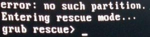
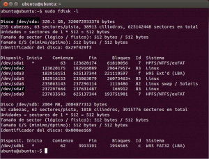
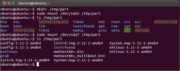
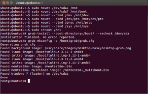
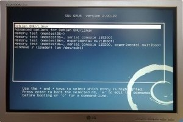

La verdad es que hoy me proponía escribir un post relacionado con el uso de Openvpn en iOS pero antes de hacer el post he tenido un pequeño accidente. Resulta que mi partición de Datos se estaba quedando sin espacio y he decidido darle más capacidad. He conseguido darle más capacidad sin problema alguno pero cuando he reiniciado el ordenador me ha aparecido la siguiente pantalla:<!--more-->

[](images/0-Error.jpg)

Por lo tanto podemos ver claramente que he dado más capacidad a mi partición de Datos pero también he roto el gestor de arranque del sistema ([GRUB](https://es.wikipedia.org/wiki/GNU_GRUB "Explicación de lo que es el Grub")). Para solucionar este problema tan solo tienen que seguir las instrucciones que detallo a continuación.

## SITUACIONES EN QUE SE ACOSTUMBRA A ROMPER EL GRUB

Las situaciones en las que acostumbramos a tener problemas con el gestor de arranque Grub, según mi experiencia son las siguientes:

1. **Si tienes un sistema GNU Linux instalado y posteriormente instalas Windows** es posible que Windows sobrescriba el sector de arranque [MBR](https://es.wikipedia.org/wiki/Registro_de_arranque_principal "Explicación de lo que es el MBR"). Como consecuencia nuestro grub desaparecerá y no podremos seleccionar con el sistema operativo que queremos arrancar
2. **Cuando estáis modificando y jugando con las particiones de vuestro ordenador** también es posible que rompáis el gestor de arranque. De hecho este ha sido mi caso. Al darle más espacio a una de las particiones he roto el gestor de arranque.
3. No es habitual. Pero podría darse el caso que el gestor de arranque también se corrompiese **tras una actualización del sistema operativo**.

## SISTEMAS OPERATIVOS EN QUE PUEDO APLICAR EL MÉTODO DE ESTE POST

Las instrucciones que se detallan a continuación se pueden aplicar en cualquier sistema operativo que derive de Debian y tenga el gestor de arranque Grub dañado. Por lo tanto el método descrito como mínimo se puede aplicar en [Debian](https://www.debian.org/index.es.html "Web de Debian"), [Ubuntu](http://www.ubuntu.com/ "Web de Ubuntu"), [Linux Mint](http://www.linuxmint.com/ "Web de Linux Mint"), [Xubuntu](http://xubuntu.org/ "Web de Xubuntu"), [Lubuntu](http://lubuntu.net/ "Web de Lubuntu"), [Kubuntu](http://www.kubuntu.org/ "Web de Kubuntu"), [Crunchbang](http://crunchbang.org/ "Web de Crunchbang"), [Edubuntu](https://edubuntu.org/ "Web de Edubuntu"), [Backtrack](http://www.backtrack-linux.org/ "Web de Backtrack"), [Kali Linux](http://www.kali.org/ "Web de Kali Linux"), [Knoppix](http://www.knoppix.org/ "Web de knoppix"), etc.

###### Nota: En mi caso he aplicado este procedimiento a mi sistema operativo actual que es Debian Jessie (en la versión testing). Después de aplicar este procedimiento mi Debian ha vuelto arrancarse con total normalidad.

## PASOS PARA REPARAR EL GESTOR DE ARRANQUE GRUB

El modo que se usa para reparar el gestor de arranque es reinstalar el gestor de arranque Grub. **Para reinstalar Grub los pasos a seguir son los siguientes**:

### Paso 1: Realizar un LiveCD o un LiveUSB

Para realizar un LiveCD o LiveUSB tan solo tienen que seguir los pasos que se detallan en este [enlace](). En mi caso para realizar el liveUSB he usado la ISO de Ubuntu 13.10. En vuestro caso podéis seleccionar la distro que más os apetezca siempre y cuando use grub2 como gestor de arranque.

###### Nota: Si vuestro sistema dañado es amd64 tenéis que descargar la ISO de ubuntu amd64. Si es i386 entonces tenéis que descargar la ISO i386. Si no lo hacéis de este modo tendréis problemas cuando apliquéis el comando chroot para poder reinstalar el Grub.

### Paso 2: Arrancar vuestro ordenador con un LiveCD o un LiveUSB

Una vez realizado el liveUSB, lo insertamos en nuestro ordenador que tiene el sistema de arranque dañado. Arrancamos el ordenador y hacemos que se inicie por medio del LiveUSB. Para quien tenga dudas de como realizar este paso puede consultar el siguiente [enlace]().

### Paso 3: Identificar la partición root, la partición boot (en el caso que la tengáis), y la denominación que recibe nuestro disco duro

Una vez tenemos arrancado nuestro ordenador **abrimos una terminal y tecleamos el comando**:

> ```
> sudo fdisk -l
> ```

Una vez teclado el comando, tal y como se puede ver en la captura de pantalla, aparecerá el detalle de las particiones de nuestro sistema operativo dañado:

[](images/1-Averiguar-Root-y-boot.png)

En mi caso se puede ver que tengo 7 particiones. **Entre estas 7 particiones tengo que averiguar cuales son la root, la boot y con que nomenclatura es reconocido mi disco duro**.

Como yo mismo instale el sistema operativo se perfectamente que **mi partición root es la /dev/sda2 y la boot es la /dev/sda7**. Por lo tanto tomo noto de estas 2 particiones.

Además en la parte superior de la captura de pantalla vemos que hay la frase Disco /dev/sda. También tenemos que tomar nota de /dev/sda ya que **/dev/sda es el nombre con el que se reconoce nuestro disco duro**. En el caso poco probable de tener un disco duro IDE es probable que vuestro disco duro se reconozca con el nombre /dev/hda.

**En el caso de tener algún tipo de duda para reconocer las particiones una solución que podemos adoptar es montarlas y ver lo que hay dentro de cada una**. **Para montarlas y ver el contenido podéis aplicar los comandos mostrados en la siguiente captura de pantalla:**

[](images/2-Comprobacion-particiones.png)

Si observamos la captura de pantalla vemos que **dentro de la partición /dev/sda2 se encuentran los archivos y carpetas típicos que acostumbran a estar dentro de la partición root** como **por ejemplo bin, boot, root, etc**... Por lo tanto /dev/sda2 en mi caso sin duda es la partición root.

En lo que se refiere a **la partición /dev/sda7 vemos que contiene archivos y carpetas como por ejemplo grub, extlinux, system.map**, etc. **Por lo tanto** sin duda alguna **la partición dev/sda7 se trata de nuestra partición boot**. Repito que es probable que muchos de vosotros no crearan la partición boot en instalar el sistema operativo. Si es este el caso tienen que omitir todos los pasos que realice con la partición boot.

###### Nota: Es posible que en vuestro caso no tengáis realizada la partición boot. En caso de ser así tenéis que seguir adelante omitiendo todos los pasos relaciones con la partación boot /dev/sda7.

### Paso 4 : Montar la partición root y la partición boot

El paso número 4 es montar las particiones root y boot que acabamos de identificar. Para ello **en la terminal** de Linux **escribimos** los siguientes comandos.

**Para montar la partición root**:

> ```
>  sudo mount /dev/sda2 /mnt
> ```

###### Nota: En esta caso estamos montando la partición root /dev/sda2 del sistema operativo dañado en el punto de montaje /mnt del liveCD o liveUSB. Es posible que vuestra partición sea distinta a la /dev/sda2.

**Para montar la partición boot**:

> ```
>  sudo mount /dev/sda7 /mnt/boot
> ```

###### Nota: En este caso estamos montando la partición boot /dev/sda7 del sistema operativo dañado en el punto de montaje /mnt/boot del liveCD o liveUSB. Es posible que vuestra partición boot sea distinta a la /dev/sda7.

###### Nota: En el caso de no tener partición boot entonces tenemos que omitir el paso de montar la partición boot /dev/sda7.

### Paso 5: Montar el resto de directorios necesarios para reinstalar el Grub

Seguidamente montaremos el resto de dispositivos y directorios necesarios para reinstalar el grub.

Para montar el directorio que contiene la información acerca de los dispositivos del sistema introducimos el siguiente comando en la terminal:

> ```
>  sudo mount --bind /dev /mnt/dev
> ```

Para montar el directorio que contiene la totalidad de información acerca de las pseudoterminales introducimos el siguiente comando en la terminal:

> ```
>  sudo mount --bind /dev/pts /mnt/dev/pts
> ```

Para montar el directorio que contiene un sistema de archivos virtual con información acerca de partes del sistema como la cpu, la memoria, los discos duros, etc. Introducimos el siguiente comando en la terminal:

> ```
>  sudo mount --bind /proc /mnt/proc
> ```

Para montar el directorio que contiene parámetros de la configuración del sistema, como por ejemplo los distintos dispositivos, el kernel, el bus etc. Introducimos el siguiente comando en la terminal:

> ```
>  sudo mount --bind /sys /mnt/sys
> ```

### Paso 6: Acceder al sistema de archivos de Debian para poder reinstalar el Grub

Tenemos que reinstalar el grub en un sistema de archivos que no es el que estamos usando actualmente. Para solucionar este problema vamos a usar el comando [chroot](https://es.wikipedia.org/wiki/Chroot "Explicación de lo que es chroot") conocido también como changeroot. Este comando nos permite cambiar la raíz del sistema sobre el que estamos trabajando.

Por lo tanto aplicamos el siguiente comando en la totalidad de directorios que montamos en la ubicación **/mnt**. Para hacer esto **tecleamos el siguiente comando en al terminal**:

> ```
> sudo chroot /mnt
> ```

**Después de aplicar este comando la totalidad de cambios y comandos que aplicamos no se aplicarán en el LiveCD o LiveUSB de Ubuntu sino que se aplicarán al sistema operativo Debian que es el que tiene el grub dañado**.

### Paso 7: Reinstalar el Grub

Finalmente el últimos paso es reinstalar y reconfigurar el Grub. **Para reinstalar el grub** lo que haremos es cargar de nuevo el Grub en el MBR. Por lo tanto en la terminal tenemos que introducir el siguiente comando:

> ```
> grub-install --boot-directory=/boot/ --recheck /dev/sda
> ```

###### Nota: /dev/sda se deberá sustituir por la denominación con que es reconocido vuestro disco duro. En el paso 3 hemos visto como identificar este punto.

Ya **para** finalizar solo falta **actualizar la configuración del grub**. Para actualizar la configuración **teclean el siguiente comando**:

> ```
> grub-mkconfig -o /boot/grub/grub.cfg
> ```

Una vez hemos llegado a este punto, la próxima vez que arranquemos el ordenador el grub tiene que volver a aparecer. Por si a alguien le sirve de ayuda les dejo la captura de pantalla en la que se puede seguir la totalidad de pasos que hemos realizado para reparar el grub:

[](images/3-Comando-utiluzados.png)

### Paso 8: Reiniciar el sistema operativo

Para reiniciar el sistema operativo primero tenemos que salir de chroot. Para salir de chroot tecleamos el siguiente comando en la terminal:

> ```
> exit
> ```

Una vez hemos salido de chroot introducimos el siguiente comando en la terminal para reiniciar el ordenador:

> ```
> sudo reboot
> ```

Nuestro ordenador se reiniciará, y como se puede ver en la foto nuestro grub o gestor de arranque volverá a funcionar con total normalidad.

[](images/4-Sistema-recuperado.jpg)

###### Nota:  El paso 8 si queréis os lo podéis saltar. Simplemente con reiniciar vuestro ordenador a lo bruto vuestro GRUB debería volver a aparecer.
