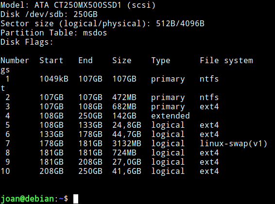
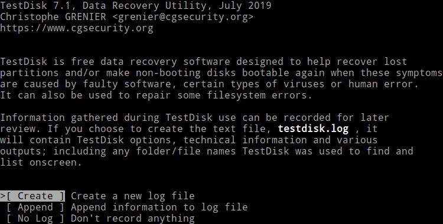
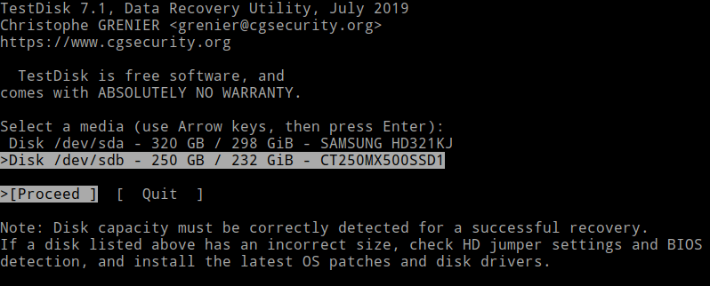
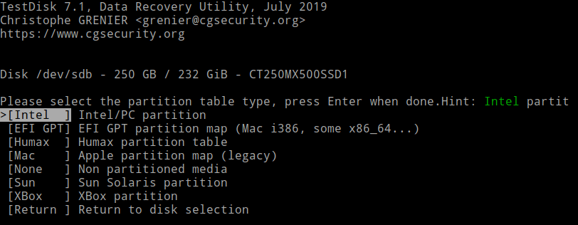
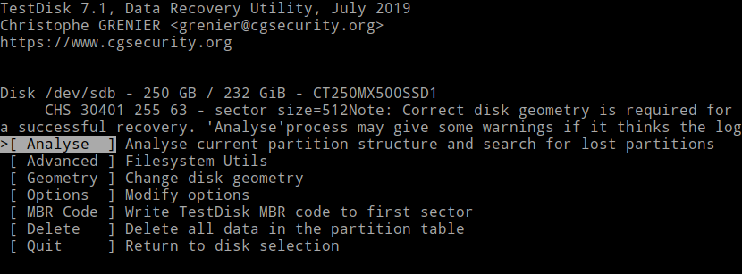
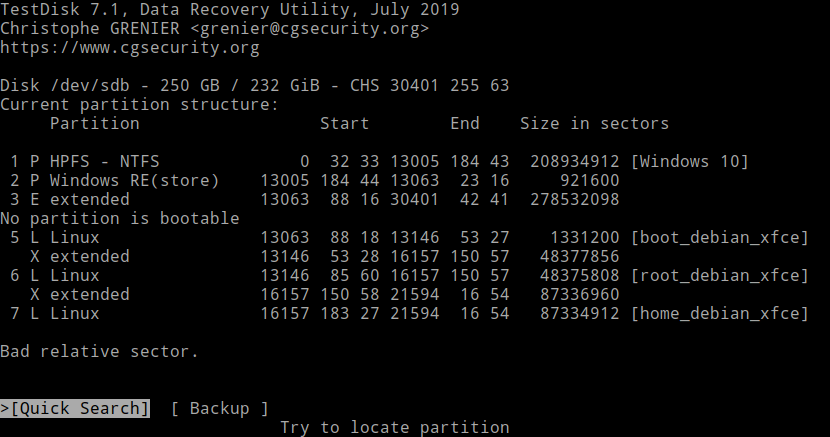
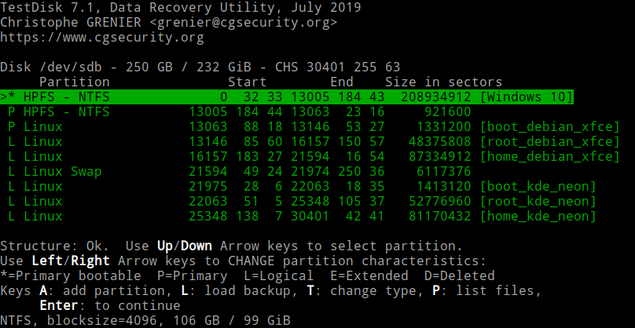
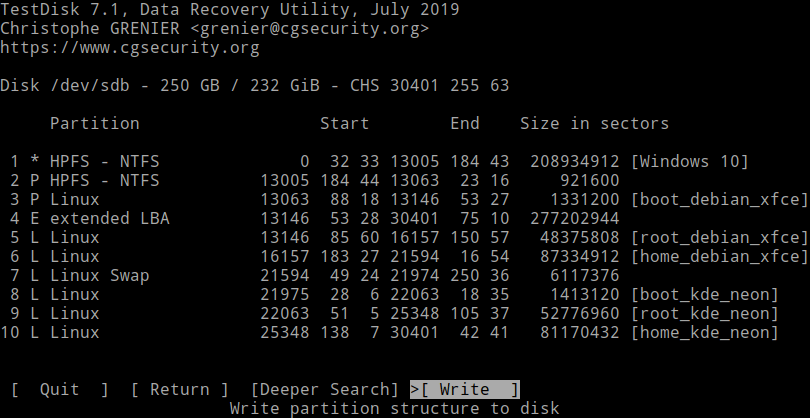
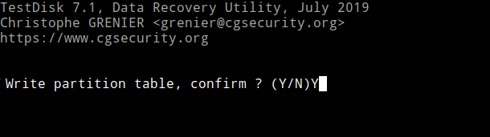

En ordenadores que tienen un dual-boot con Windows y Linux acostumbran a presentarse problemas cuando se actualiza Windows. Los principales son los siguientes:<!--more-->

1. Windows sobrescribe la partición de arranque y perdemos el gestor de arranque Grub. Si se encuentran con esta situación pueden leer el siguiente artículo para [recuperar el Grub]().
2. Se activa el arranque rápido de Windows de forma predeterminada creando problemas con las particiones que tiene que montar Linux. Si este es el caso pueden seguir la siguientes instrucciones para [deshabilitar el arranque rápido de Windows]().
3. Windows borra las particiones que contienen los sistemas operativos Linux. Sin duda está es la opción más grave de las tres.

En el caso que os encontréis con la tercera opción no desesperéis. En la mayoría de casos podréis recuperar la totalidad de la información y no será necesario reinstalar ningún sistema operativo. Para recuperar las particiones que han sido borradas tan solo tendremos que usar una herramienta como Testdisk. Testdisk es una herramienta libre especialmente diseñada para la recuperación de particiones perdidas. Testdisk tiene la capacidad de recuperar tablas de particiones Apple partition map, GUID (gpt), PC/Intel (msdos), Solaris, Xbox, etc. También es capaz de trabajar en prácticamente la totalidad de [sistemas de archivos](https://www.cgsecurity.org/wiki/TestDisk "Ver los sistemas de archivos con los que puede trabajar testdisk") existentes.

**Nota:** Testdisk puede recuperar particiones que han sido borradas de forma accidental, borradas por un virus, borradas de forma premeditada, etc.

## INSTALAR TESTDISK

Os recomiendo arrancar el ordenador con uno de los sistemas operativos que funcione. Da igual el sistema operativo que uséis porque testdisk está disponible en Windows, Linux y MacOS.

En mi caso lo he instalado en un sistema operativo Debian. Para ello tan solo he tenido que ejecutar el siguiente comando en la terminal:

> ```
> sudo apt-get install testdisk
> ```

Si por lo contrario usáis Windows o Mac tendréis que acceder a la siguiente [página web](https://www.cgsecurity.org/wiki/TestDisk_Download "URL para descargar testdisk"). Una vez dentro de la página tendréis que descargar el binario correspondiente e instalar Testdisk en su equipo.

Nota: Si tenéis que recuperar las particiones de un disco duro que no arranca ningún sistema operativo tendrán que extraer el disco duro y conectarlo a un equipo que funcione. Otra opción sería [arrancar el ordenador con un LiveCD o LiveUSB]() y a posteriori ejecutar testdisk para recuperar las particiones.

## AVERIGUAR EL FORMATO DE LA TABLA DE PARTICIONES A RECUPERAR

Testdisk autodetectará el formato de la tabla de particiones a recuperar. No obstante es bueno que nosotros lo sepamos de antemano.

En mi caso se que tenia una tabla de particiones del tipo msdos. Para confirmarlo ejecuto el siguiente comando en la terminal:

> ```
> sudo parted -l
> ```

Verán que el resultado del parámetro Partition Table es msdos.

[](images/ver-tabla-de-particiones.png)

**Nota:** Otro tipo de tabla de particiones muy común en la actualidad es la gpt.

**Nota:** En caso de las particiones estuvieran totalmente borradas no me habría servidor este método. No obstante, como he dicho anteriormente Testdisk debería ser capaz de autodetectar el tipo de tabla de particiones.

## RECUPERAR LAS PARTICIONES BORRADAS CON TESTDISK

Una vez instalado el programa podemos iniciar la recuperación de las particiones pérdidas o borradas. Para ello ejecutaremos testdisk del siguiente modo:

 
|   **Windows**   |   Accedemos a la carpeta del programa y hacemos doble click sobre el archivo testdisk\_win   |
| --- | --- |
|   **GNU Linux**   |   Ejecutamos el comando sudo testdisk en la terminal   |

**Nota:** Tanto en Linux como en Windows testdisk se debe ejecutar con permisos de administrador.

Acto seguido se iniciará el proceso de recuperación. Inicialmente tendremos que responder si queremos guardar un log de todo lo que pase en el proceso de recuperación. Es altamente recomendable que lo hagáis, por lo tanto seleccionad la opción \[ Create \] y presionad Enter.

[](images/aceptar-la-creacion-de-un-log.png)

A continuación seleccionamos el disco duro en que se han borrado las particiones. En mi caso es el CR250MX500SSD1. Seguidamente presionamos sobre la opción Proceed.

[](images/seleccionar-disco-recuperar-particiones-borradas.png)

El siguiente paso consistirá en seleccionar el tipo de tabla de particiones que tiene o tenia nuestro dispositivo de almacenamiento. Las 2 más habituales son la \[ Intel o msdos \] y la \[ EFI GPT \]. En mi caso uso un equipo antiguo que aun usa una tabla de particiones msdos, por lo tanto en mi caso selecciono la opción \[ Intel \] y presiono Enter.

**Nota:** Normalmente Testdisk autodectará el tipo de tabla de particiones. Por lo tanto, en principio solo tendrían que presionar la tecla Enter.

[](images/seleccionar-tabla-de-particiones-recuperar.png)

**Nota:** En el inicio del articulo hemos visto como determinar el tipo de tabla de particiones que tenia nuestro dispositivo de almacenamiento.

A continuación seleccionamos la opción \[ Analyze \] y presionamos Enter. De esta forma testdisk nos mostrará el estado actual de la tabla de particiones.

[](images/buscar-las-particiones-perdidas.png)

Las particiones que podemos ver en la captura de pantalla no están completas. Concretamente me faltan todas las particiones de KDE Neon. Para intentar detectarlas seleccionaremos la opción \[ Quick Search \] y presionamos Enter.

[](images/particiones-antes-del-analisis.png)

Después de finalizar la búsqueda obtengo los resultados que podrán ver en la siguiente captura de pantalla. En estos momentos ya aparecen las particiones de KDE Neon y la estructura de la tabla de particiones es correcta. Por lo tanto presionaremos la tecla Enter.

[](images/particiones-despues-del-analisis.png)

A continuación seguiremos viendo la estructura final de la tabla de particiones. Como la tabla de particiones es correcta seleccionamos la opción \[ Write \] y presionamos Enter.

**Nota:** En caso que la tabla de particiones detectada no fuera correcta deberíamos usar la opción \[ Deeper Search \]

[](images/escribir-las-particiones-borradas.png)

Acto seguido se nos preguntará si queremos reescribir la tabla de particiones de nuestro dispositivo de almacenamiento. Respondemos que Y y presionamos Enter.

[](images/recuperar-la-particiones-borradas.png)

Finalmente se nos pide que reiniciemos el ordenador para que los cambios tengan efecto.

Si todo funciona de forma adecuada, la próxima vez que iniciemos el ordenador se deberían detectar todas las particiones y arrancar la totalidad de sistemas operativos presentes en nuestro equipo. En otras palabras, todo debería estar exactamente igual que antes de perder las particiones.

## OTRAS FUNCIONALIDADES DE TESTDISK

Testdisk no es únicamente para recuperar particiones borradas. Puede realizar otras funciones como por ejemplo:

1. Recuperar el sector de arranque.
2. Recuperar ficheros perdidos.

Únicamente he tenido que usar TestDisk en 3 ocasiones. El resultado siempre ha sido satisfactorio. Así que si tenéis el sector de arranque dañado o han desaparecido las particiones la primera opción que deberías tener en cuenta es Testdisk

###### FUENTES

[https://www.cgsecurity.org/wiki/TestDisk\_Step\_By\_Step](https://www.cgsecurity.org/wiki/TestDisk_Step_By_Step)
