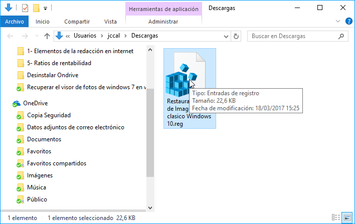
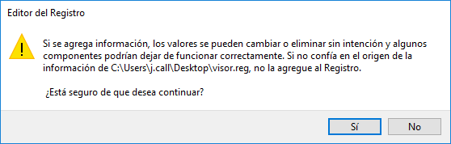
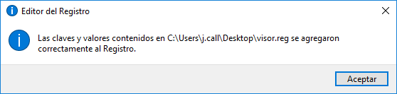
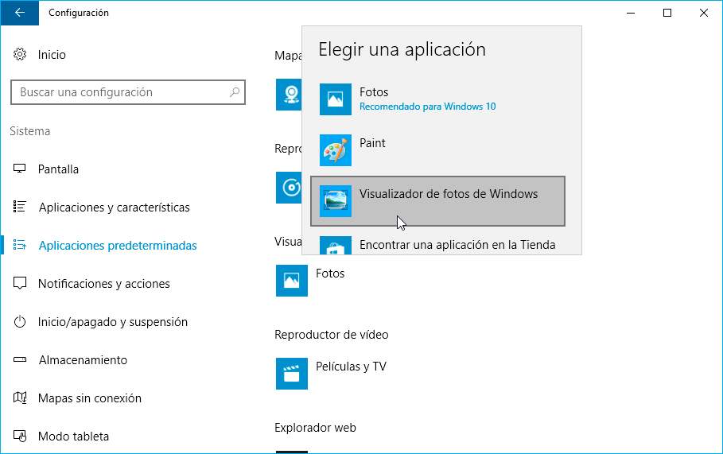
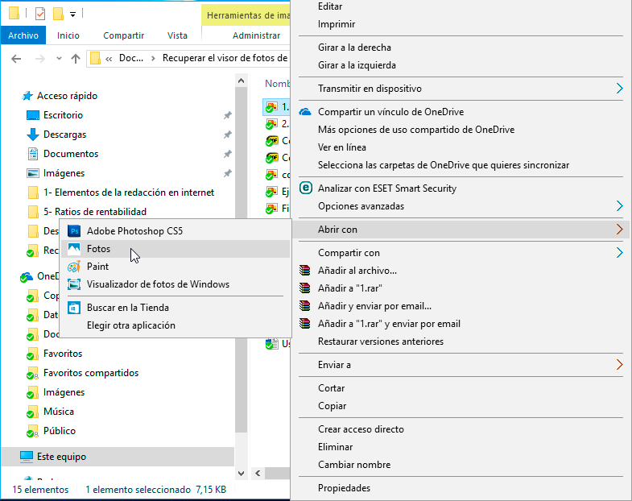

En mi caso me gusta Windows 10, pero hay puntos que no me acaban de convencer. Uno de estos puntos es su visor de fotos. Por esto motivo en el siguiente artículo veremos cómo podemos volver a usar el visor de fotos clásico de Windows 7 u 8 en Windows 10.<!--more-->

## MOTIVOS POR LOS QUE NO ME GUSTA EL VISOR DE FOTOS DE WINDOWS 10

Los motivos que hacen que no quiera usar el visor de fotos de Windows 10 son los siguientes:

1. El fondo transparente de las fotografías es negro. Esto es un problema cuando trabajamos en archivos .png con fondo transparente porque cuando copio y pego una foto con la herramienta recortes me queda el fondo de color negro.
2. En mi caso el visor de fotos en Windows 10 es extremadamente lento. Desde el momento que clico sobre el archivo hasta que puedo ver la imagen pasa demasiado tiempo.
3. En mi caso quiero un visor de fotos simple, rápido y que únicamente me permita ver fotos. No me interesan las opciones de edición de fotos y de gestor de colecciones de fotos porque al parecer ralentizan el visor de fotos.
4. Durante muchos años he usado el visor clásico de imágenes en Windows. El hombre es un animal de costumbres.
5. Es un programa que está diseñado para usarse en pantallas táctiles.

A pesar de que no uso el visor de fotos de Windows 10 hay que reconocer que puliéndolo será mucho mejor que el visor de fotos clásico de Windows.

## RECUPERAR EL VISOR DE FOTOS CLÁSICO EN WINDOWS 10

El procedimiento para recuperar el visor de fotos clásico en Windows 10 es extremadamente rápido. El proceso consiste en 2 pasos:

### Modificar el registro de Windows para recuperar el visor de fotos clásico

Añadiremos las entradas pertinentes en el registro de Windows para poder volver a usar el visor de fotos clásico en Windows.

Para ello clicamos en la siguiente URL para descargar el fichero que nos permitirá modificar el registro:

[Descargar el fichero para modificar el registro de windows](https://drive.google.com/uc?export=download&id=0Bzt4WYx9Sj_XbzdjQ0tWUHVNYzg "Link de descarga para modificar el registro del sistema")

Una vez descargado el archivo lo buscamos y hacemos doble click sobre él.

A continuación, aparecerá la siguiente advertencia de seguridad en la que deberemos clicar Ejecutar.

###### Nota: No se preocupen. Les puedo asegurar que el proceso es 100% seguro.

Seguidamente aparecerá la siguiente ventana en la que presionaremos sobre el botón Sí.

Luego aparecerá la siguiente ventana que nos informa que se han añadido las claves del registro de forma correcta. Para finalizar el proceso tan solo tendremos que presionar el botón Aceptar.

En estos momentos ya estamos en disposición de poder visualizar nuestras fotos con el visor de archivos clásico de Windows.

### Seleccionar el tipo de imágenes que queremos ver con el visor clásico de Windows

En estos momentos ya podemos usar el visor clásico de Windows, pero aún nos falta configurar el visor de fotos clásico como predeterminado.

Para ello presionamos la combinación de teclas Win+I. Al abrirse la ventana de configuración de Windows presionamos encima de la opción Aplicaciones:

Seguidamente en el panel de la izquierda clicamos encima de la opción Aplicaciones predeterminadas, a continuación, en el apartado de visualizador de fotos clicamos encima del icono del visor de fotos de Windows 10 y cuando aparezca la ventana de elegir una aplicación clicamos encima de Visualizador de fotos de Windows.

En estos momentos, cualquier foto que abramos en nuestro ordenador se abrirá con el visor de fotos clásico de Windows.

En el caso que de forma puntual queramos abrir una imagen con un programa distinto al visor de fotos clásico podemos hacer lo siguiente:

1. Posicionamos el puntero del ratón encima de la imagen que queremos visualizar.
2. Presionamos el botón derecho del ratón.
3. Cuando aparezca el menú contextual acceden a la opción Abrir con.
4. Finalmente clican encima de la aplicación que quieran usar para visualizar la imagen.

Si lo prefieren también pueden [usar un programa predeterminado en función de la extensión]() de la imagen a visualizar.

## PUNTOS QUE DEBE MEJORAR EL VISOR DE FOTOS DE WINDOWS 10

Mi opinión es que el visor actual de fotos de Windows 10 necesita mejorar los siguientes aspectos:

1. Está muy bien enfocado para usarse en un entorno táctil, pero no en un dispositivo que no disponga de pantalla táctil. Simplemente añadiendo algunas características y funcionalidades en el programa podrían solucionar este punto.
2. Se debería poder elegir el color de fondo que queremos que tenga el visor.
3. Debería permitir introducir texto mediante teclado en la imagen. Además, sería muy interesante que pudiéramos insertar formas  predefinidas en las imágenes como por ejemplo flechas, líneas, rectángulos, cuadros de texto, etc.
4. El programa debería ser más rápido.

Únicamente modificando los puntos que cito, el visor de fotos de Windows 10 sería la herramienta perfecta para cualquier persona que trabaja en una oficina.
