A raíz de una necesidad que he tenido esta semana ha nacido el post de como redimensionar el disco duro en Virtualbox. Mientras estaba usando Backtrack en mi máquina virtual me di cuenta que tan solo me quedaban 894 MiB libres. Por lo tanto se puede afirmar rotundamente que en el momento de instalar Backtrack en Virtualbox asigne un espacio insuficiente en mi disco duro.<!--more-->

El hecho que acabo de describir se puede ver en la siguiente captura de pantalla:

[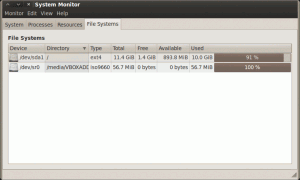](images/0-Estado-inicial.png)

###### Nota: En la captura de pantalla podemos ver que de los 11,4 GiB que asigne en el disco solo me quedan 893,8 MiB libres.

Para solucionar este problema podemos optar por borrar nuestra máquina virtual e instalar de nuevo Backtack dándole más espacio, pero la verdad es que esta solución demanda de muchas horas de trabajo.

Por lo tanto opté por una solución alternativa que en apenas 10 minutos me permitió redimensionar el disco duro de la partición donde tengo instalado Bactrack. Los pasos para conseguir redimensionar el disco en Virtualbox son los siguientes:

## HACER UNA COPIA DE SEGURIDAD DE NUESTRO DURO VIRTUAL

Antes de empezar a realizar nada lo primero que tenemos que hacer es prevenir. Por lo tanto lo primero que haremos es dirigirnos a la ubicación donde tenemos guardado el archivo .vdi, que representa el disco de duro nuestra máquina virtual, y haremos una copia de seguridad.

En mi caso el archivo .vdi lo tengo en la ubicación:

> ```
>  /media/DATOS/OS/HD
> ```

El nombre de mis disco duro se llama:

> ```
>  Backtack_5.vdi
> ```

Por lo tanto para hacer una copia de seguridad tan solo tenemos que teclear el siguiente comando:

> ```
> cp /media/DATOS/OS/HD/Backtrack_5.vdi /media/DATOS/OS/HD/Backtack_5.vdi.bak
> ```

###### Nota: Si queréis esta paso lo podéis realizar mediante vuestro gestor de ventanas. Gráficamente tan solo teneis que copiar el disco duro original y pegarlo en la ubicación que vosotros queráis.

###### Nota: El proceso de realizar la copia de seguridad se debe realizar con la máquina virtual apagada.

###### Nota: La parte del comando en color rojo se debe variar en función de la ubicación y del nombre de vuestro disco duro Virtual.

## REDIMENSIONAR EL DISCO DURO

Una vez tenemos realizada la copia de seguridad ya podemos pasar a incrementar la capacidad de nuestro disco duro virtual. Actualmente su capacidad hemos visto que era de 11.4 GiB. Considero que si lo amplio a 15 GiB, para el uso que doy a Backtrack, será más que suficiente.

Para redimensionar el disco virtual hasta 15 GiB abro una terminal y tecleo el siguiente comando:

> ```
> VBoxManage modifyhd "/media/DATOS/OS/HD/Backtack_5.vdi" --resize 15000
> ```

###### Nota: El texto de color Rojo se debe modificar en función de la ruta y el nombre del disco duro que queremos ampliar.

###### Nota: El texto de color verde se debe modificar en función de cual queremos que sea el espacio final de nuestro disco duro. En el ejemplo he puesto 15000 lo que quiere decir que el disco que tenemos actualmente se ampliará hasta 15 Gib. Si quisiéramos que el disco se ampliará hasta 50 GiB tan solo tendríamos que sustituir el 15000 por el 50000.

Una vez realizado este paso ya hemos incrementado el espacio de nuestro disco duro.

## COMPROBACIÓN QUE HEMOS REDIMENSIONADO EL DISCO DURO

Para comprobar que el comando que acabamos de ejecutar ha funcionado tan solo tenemos que arrancar la máquina virtual con Backtrack. Una vez arrancada abrimos una terminal e instalamos gparted.

Para instalar gparted tan tenemos que escribir el siguiente comando en la terminal:

> ```
> sudo apt-get install gparted
> ```

Una vez instalado gparted lo arrancamos. Para arrancarlo tecleamos el siguiente comando en la terminal:

> ```
> sudo gparted
> ```

Una vez se haya ejecutado veréis la siguiente pantalla:

[](images/2-Estado-después-de-ampliar-el-tamaño-del-disco.png)

Lo primero que vemos es que se ha creado un espacio adicional de 2,65 GiB para llegar a los 15 GiB que nos habíamos fijado como objetivo. Por lo tanto podemos afirmar que el proceso para redimensionar el disco duro a funcionado. También observamos que no podemos usar este nuevo espacio adicional ya que no se definido ninguna tabla de particiones ni tampoco se ha formateado.

Otro aspecto que podemos observar es que disponemos de una partición primaria de 11,45 Gb que es la **sda1**. En esta partición primaria es donde tenemos instalado Backtrack y por lo tanto es la partición que necesitamos ampliar.

Finalmente vemos una segunda partición **sda2**. Esta partición se trata de una partición extendida. Dentro de esta partición extendida tenemos una partición lógica (**sda5**) que es donde está la partición de de memoria Swap.

###### Nota:  A partir de ahora en adelante el procedimiento puede diferir ya que los pasos que se realizan a continuación son en función de las particiones que tengáis en vuestro disco duro. Por lo tanto llegado a este paso tendréis que adaptar el proceso en función de vuestra situación.

## PREPARACIÓN PREVIA PARA PODER REDIMENSIONAR EL DISCO DURO

Como hemos dicho en el apartado anterior nuestro objetivo es poder asignar los 2,65 GiB adicionales a la partición **sda1** que es dónde tenemos instalado Backtrack. Pero para hacer esto disponemos de dos obstáculos importantes:

**Obstáculo 1:** Una condición sine qua non para poder ampliar la partición **sda1** es tener espacio libre contiguo. Como se puede verse en la captura de pantalla del apartado anterior la partición contigua es una partición extendida que además no dispone de espacio libre. Por lo tanto tenemos que mover la partición extendida al final del disco duro. Por lo tanto lo que tendremos que hacer es pasar de la siguiente situación:

[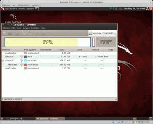](images/2-Estado-después-de-ampliar-el-tamaño-del-disco1.png)

A la siguiente situación:

[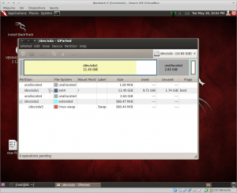](images/12-Estructura-finalizada.png)

###### Nota: Nota: Como se puede ver en la imagen lo que tenemos que hacer es desplazar la partición extendida sda2 justo al final del disco. Si obtenemos una condición similar a la que podemos ver en la captura de pantalla entonces podremos redimensionar la partición sda1

**Obstáculo 2:** El segundo obstáculo es que la partición **sda1**, que es la que tenemos que ampliar y la que tiene instalada Backtrack, esta montada. Por lo tanto esto hace imposible redimensionar el disco duro. La solución a este problema como se verá más adelante es arrancar nuestra máquina virtual con un live-USB.

Una vez hayamos solucionado los 2 obstáculos podremos redimensionar el disco duro sin problemas. Para poder solventar los obstáculos tenemos que proceder de la siguiente forma:

### Solución al Obstáculo 1: Mover la partición extendida al final del disco

Para mover la partición extendida **sda2** al final del disco Los pasos a realizar son los siguientes:

**El Primero:**

Tenemos desmontar la swap. Para desmontar la swap, como se puede ver en la captura de pantalla, damos click con el botón derecho del mouse sobre la partición **sda5** y seleccionamos la opción **desmontar swap**.

[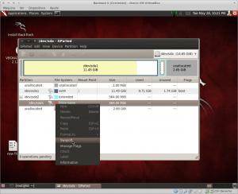](images/3-Desativar-Swap.png)

**El Segundo:**

Tenemos que eliminar la partición lógica que contiene la memoria Swap. Para hacerlo hacemos click con el botón derecho del mouse encima de la partición que contiene la memoria Swap. Cuando nos aparezcan las opciones, como se puede ver en la captura de pantalla, elegimos **borrar**.

[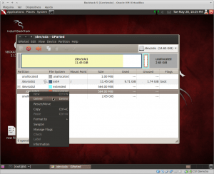](images/4-Eliminar-la-memoria-Swap.png)

**El Tercero:**

Acto seguido como se puede ver en la captura de pantalla apretamos al botón de **aplicar todas las operaciones**.

[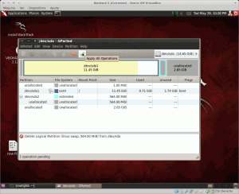](images/5-Aplicar-las-operaciones.png)

**El Cuarto:**

Una vez eliminada la partición lógica el siguiente paso es eliminar la partición extendida. Para eliminar la partición extendida lo hacemos del mismo modo que lo hemos realizado con la lógica. Por lo tanto hacemos click con el botón derecho de mouse encima de la partición extendida, que en mi caso es la **/dev/sda2**, y seleccionamos la opción **eliminar**. Seguidamente presionamos el botón de **aplicar cambios**. Si se han realizado los pasos correctamente gparted presentará el siguiente estado:

[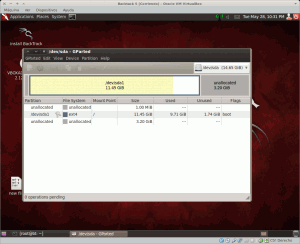](images/7-Espacio-contiguo.png)

###### Nota: En la captura de pantalla se puede ver que ahora que el espacio contiguo de la partición sda1 y es espacio sin asignar. Por lo tanto podremos proceder a ampliar el tamaño de la partición sda1.

**El Quinto:**

En los pasos anteriores hemos eliminado una partición extendida y una partición lógica que contenía nuestra memoria Swap. Por lo tanto ahora volveremos a crearlas pero justo al final de nuestro disco duro.

Para crear la partición extendida, como se puede ver en la captura de pantalla, clicamos con el botón derecho del mouse sobre el espacio sin asignar y cuando nos aparezcan las opciones seleccionamos **Nueva**:

[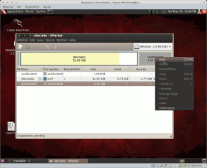](images/8-Creación-de-la-swap.png)

Seguidamente aparecerá una ventana. Las opciones de la ventana que aparecerá las dejamos tal y como se muestra en la siguiente captura de pantalla y hacemos click con el mouse sobre botón **añadir**:

[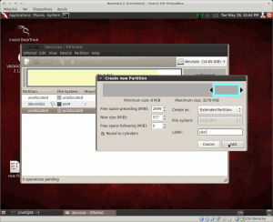](images/9-Creación-partición-extendida.png)

###### Nota: Como se puede ver en la imagen la partición extendida la ubico al final del disco duro. En mi caso solo le asigno 577 MiB ya que, la partición extendida, solo debe contener una partición lógica con la swap.

**El Sexto:**

Una vez creada la partición extendida ahora hay que crear la partición lógica con la swap.

Para ello presionamos el botón derecho derecho del mouse sobre sobre la partición extendida que acabamos de crear y seleccionamos la opción **new**.

[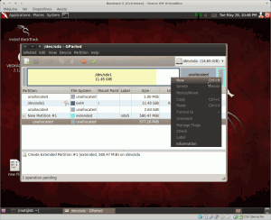](images/10-Creación-Lógica-swap.png)

Seguidamente nos aparecerá una ventana de opciones. Las opciones para crear la partición swap son las que se muestran muestran a continuación:

[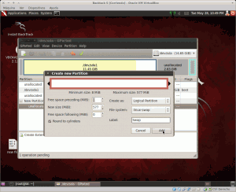](images/11-Creacion-swap-2.png)

Una vez seleccionadas las opciones correctas apretamos el botón **Add o Añadir** y seguidamente el botón de **aplicar cambios**. Si lo hacemos correctamente nuestra swap se habrá creado y tendremos una situación similar a la siguiente:

[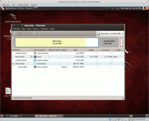](images/12-Estructura-finalizada1.png)

**El Séptimo:**

El séptimo paso es hacer que la memoria swap se monte automáticamente cuando arranquemos nuestro sistema operativo en la máquina virtual. Este paso lo tenemos que realizar ya que el punto de montaje de la nueva Swap que acabamos de crear es distinto al de la swap que hemos eliminado.

Para averiguar el punto de montaje nuevo primero tenemos que averiguar en que partición tenemos montada la nueva swap. Para ello abrimos un terminal y tecleamos el siguiente comando:

> ```
> sudo  fdisk -l
> ```

El resultado obtenido será el siguiente:

[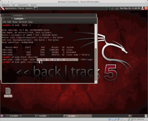](images/13-Punto-montaje-swap.png)

###### Nota: Si leemos el texto de la captura de pantalla veremos claramente que mi partición swap es la sda5.

Una vez sabemos que nuestra partición swap es la sda5 en la misma terminal introducimos el siguiente comando:

> ```
> sudo blkid /dev/sda5
> ```

###### Nota: La parte del comando de color rojo se debe modificar en función de cual sea vuestra partición Swap.

Una vez ejecutado el comando, el resultado será el nuevo punto de montaje de la memoria swap. En la siguiente captura de pantalla podéis ver el punto de montaje de la swap que acabamos de crear:

[](images/13-Punto-montaje-swap.png)

###### Nota: El punto de montaje de la memoria swap es la parte seleccionada con el mouse.

Para introducir el nuevo punto de montaje tenemos que editar el fichero fstab. Por lo tanto en la terminal ejecutamos el siguiente comando:

> ```
> sudo gedit /etc/fstab
> ```

Cuando se abra el editor de texto tenemos buscar la linea cuya sintaxis se asemeje a la siguiente:

> ```
> UUID=405a09a5-c4a9-4d6b-b719-33fc87f7c0fc none swap sw 0 0
> ```

###### Nota: La parte de color rojo es el punto de montaje de la antigua swap

Una vez localizada la linea debemos sustituir el punto de montaje antiguo por el nuevo punto de montaje. En mi caso por lo tanto la linea a modificar quedaría de la siguiente forma:

> ```
> UUID=01d7d9e8-f9d1-4e4d-925d-46d9b56ea319 none swap sw 0 0
> ```

Una vez modificada guardamos el fichero y en principio ya hemos solucionado el primero de los obstáculos que teníamos para poder redimensionar el disco duro.

### Solución al Obstáculo 2: Arrancar la máquina virtual con un Live-USB

Como hemos dicho antes aunque tengamos espacio contiguo libre en la partición **sda1** no la podremos ampliar y que para hacer esto tenemos que tener la partición **sda1** desmontada. Si intentáis desmontarla no podréis ya que en esta partición tenéis instalado el sistema operativo que estáis ejecutando.

Para solucionar este problema es muy simple. Tan solo tenemos que arrancar la máquina virtual en modo live-USB. Para realizar esto los pasos a seguir son los siguientes:

**Primero:**

Lo primero que tenemos que hacer es descargarnos una ISO de cualquier distribución que se pueda ejecutar en modo Live-USB. En mi caso he elegido Kubuntu 13.04. Podéis elegir cualquier distro. Si queréis elegir Kubuntu os la podéis descargar de la siguiente página:

[https://kubuntu.org/getkubuntu/](https://kubuntu.org/getkubuntu/ "Descargar Kubuntu")

**Segundo:**

Lo segundo que tenemos que hacer es configurar la máquina Virtual de backtrack para que arranque en modo Live-USB a partir de la imagen ISO que acabamos de descargar. Para hacer esto necesitamos crear una unidad de CD/DVD Virtual que apunte a la ISO que acabamos de descargar.

Por lo tanto abrimos Virtualbox. Como se puede ver en la captura de pantalla seleccionamos la máquina Virtual Backtack 5 y a posteriori apretamos el botón de **configuración**:

[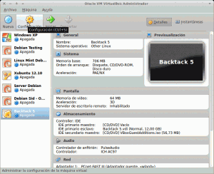](images/16-Acceder-a-las-opciones-de-virtualbox.png)

Una vez abierta la pantalla de configuración seleccionamos la opción **almacenamiento**. Dentro de la opción **almacenamiento**, como podemos ver en la captura de pantalla, presionamos el icono del disco duro con el símbolo + y cuando aparezcan las opciones seleccionamos **Agregar dispositivo CD/DVD**.

[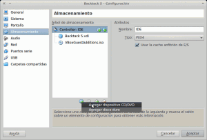](images/17-Agregar-Unidad-de-CD-Virtual.png)

Seguidamente nos aparecerá una ventana con tres opciones. Las tres opciones son **cancelar, dejar vacío y seleccionar disco**. En nuestro caso apretamos el botón **seleccionar disco**.

Seguidamente se abrirá otra ventana en la que tenemos que seleccionar el contenido que queremos que ejecuta nuestra unidad de CD/DVD virtual. En nuestro caso, como se puede ver en la captura de pantalla, seleccionamos la ISO de Kubuntu que hemos descargado en el primero paso y presionamos el botón **abrir**.

[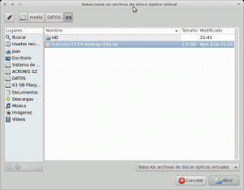](images/19-Seleccionar-la-imagen-ISO.png)

Seguidamente tenemos modificar el orden de arranque de nuestra máquina virtual. Tenemos que hacer que el orden predeterminado de arranque sea primero el CV/DVD y a posteri el disco duro. Para realizar este paso, en la opción almacenamiento de la configuración de nuestra máquina virtual, seleccionamos nuestro disco duro y lo configuramos en modo esclavo tal y como se muestra en la siguiente captura de pantalla:

[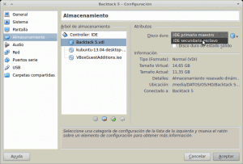](images/20-Cambiar-el-orden-de-arranque.png)

Ya para finalizar tenemos que hacer lo mismo que acabamos de hacer con nuestro disco duro pero ahora con nuestro dispositivo de CD/DVD virtual. Tenemos que asegurar que nuestra unidad de CD/DVD virtual esté configurada como IDE primario maestro. Una vez solucionados los dos obstáculos ya podemos pasar a redimensionar la partición **sda1**.

## REDIMENSIONAR LA PARTICIÓN DONDE TENEMOS INSTALADO BACKTACK

Una vez solucionados los 2 obstáculos que teníamos tan solo tenemos que arrancar nuestra máquina virtual. Como podéis ver en la captura de pantalla nuestra máquina virtual está arrancando Kubuntu en modo Live-USB.

[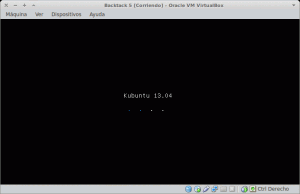](images/21-Arrancando-kubuntu.png)

Una vez arrancado el sistema en modo Live-USB abrimos una terminal e instalamos Gparted. Para instalar gparted tecleamos

> ```
> sudo apt-get install gparted
> ```

Seguidamente arrancamos Gparted con el mando:

> ```
> sudo gparted
> ```

Una vez arrancado Gparted podemos visualizar las mismas particiones que visualizábamos en backtrack pero ahora la partición **sda1** está desmontada y por lo tanto podremos redimensionarla.

Para redimensionarla, tal y como podemos ver en la captura de imagen, seleccionamos la partición **sda1** y apretamos el botón derecho del mouse. Cuando aparezcan las opciones seleccionamos la que pone **Redimensionar/Mover**.

[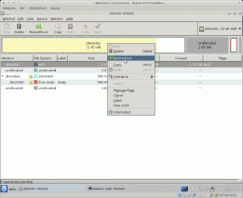](images/22-Redimensionar-Backtack.png)

Una vez seleccionada la opción Resize/Move aparecerá la siguiente pantalla:

[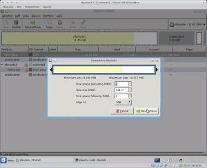](images/23-Opciones-para-redimensinar-el-Disco.png)

Ahora ya podremos asignar los tranquilamente 2,63 Gib de Disco duro libre a la partición **sd1**. Una vez asignado el espacio libre a la partición **sda1** apretamos el botón de **Redimensionar/Mover** y a posteriori apretamos el botón de **aplicar cambios**.

En estos momento ya hemos terminado todo el proceso. Tan solo nos falta arrancar de nuevo la máquina virtual y como se puede observar en la siguiente captura de pantalla el espacio disponible en la unidad **sda1** se ha incrementado de 11,45 GiB a 14,08 Gb.

[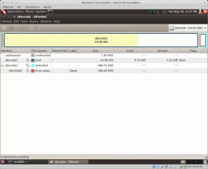](images/24-Comprobación-final.png)

Por lo tanto misión cumplida. No tendré que volver a reinstalar Backtrack de cero.
