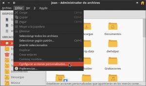
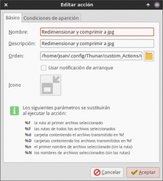
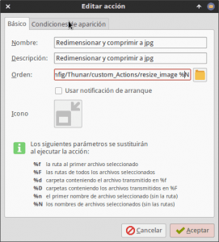
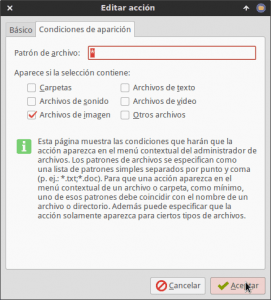
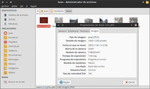
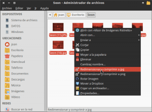
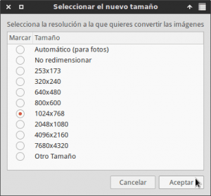
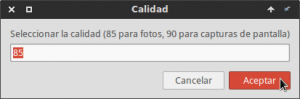
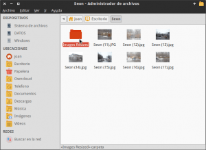

En mi caso hay ciertas ocasiones en que necesito redimensionar y comprimir una gran cantidad de imágenes. Algunas de estas ocasiones son las siguientes:

1. Preparar las capturas de pantalla de los post que escribo para el blog.
2. Reducir el peso de fotografías y/o imágenes que necesito enviar por email.
3. Redimensionar una fotografía para subirla a un formulario online, a las redes sociales, a un servicio web,  etc.
4. Etc.

<!--more-->

Para redimensionar y comprimir imágenes por lotes existen múltiples alternativas, pero obviamente lo interesante es una solución rápida, sencilla, efectiva, que consuma pocos recursos y que además no precise de conexión a internet. En mi caso siendo usuario del entorno de escritorio XFCE, he llegado a la conclusión que la mejor opción para redimensionar y comprimir imágenes es usar las acciones personalizadas de Thunar. Para ello tan solo tenemos que seguir los pasos que se muestran en el siguiente artículo.

###### Nota: Los usuarios del gestor de archivos Nautilus disponen de un plugin interesante para redimensionar y comprimir imágenes. Este Plugin se llama Nautilus image converter y para instalarlo tan solo tienen que abrir una terminal y teclear el comando sudo apt-get install nautilus-image-converter

## INSTALAR EL SOFTWARE NECESARIO PARA PODER REDIMENSIONAR Y COMPRIMIR LAS IMÁGENES

Necesitamos **disponer del gestor de archivos Thunar**. Todo usuario del entorno Xfce dispone del gestor de archivos Thunar instalado de forma predeterminada. En el caso que no lo tuvieran instalado tendrían que abrir una terminal y ejecutar el siguiente comando:

> ```
> sudo apt-get install thunar
> ```

Una vez disponemos de Thunar tenemos que **instalar los paquetes imagemagick y zenity** para que podamos ejecutar la acción personalizada que nos permitirá redimensionar y comprimir las imágenes. Para ello en una terminal ejecutamos el siguiente comando:

> ```
> sudo apt-get install imagemagick zenity
> ```

Una vez instalado todo lo necesario tenemos que generar el script que será el encargado de realizar todo el proceso de redimensionado y compresión.

## CREAR EL SCRIPT PARA REDIMENSIONAR Y COMPRIMIR IMÁGENES

Para crear el script que nos permitirá conseguir nuestro objetivo tenemos que seguir unos pasos muy simples.

Primero generaremos la carpeta custom\_Actions que será la que almacenará nuestro script. Para ello en la terminal **tecleamos y ejecutamos el siguiente comando:**

> ```
> mkdir ~/.config/Thunar/custom_Actions
> ```

Seguidamente creamos el archivo de texto que contendrá el código del script. Para ello **ejecutamos el siguiente comando en la terminal:**

> ```
> touch ~/.config/Thunar/custom_Actions/resize_image
> ```

Una vez creado el archivo lo abrimos con cualquier editor de texto. En mi caso como uso el editor de textos nano **abro el archivo ejecutando el siguiente comando en la terminal**:

> ```
> nano ~/.config/Thunar/custom_Actions/resize_image
> ```

Una vez abierto el archivo tenemos **pegar el código que nos permitirá redimensionar y comprimir las imágenes**. El código a pegar es el siguiente:

> ```
> #!/bin/bash
> guitool=zenity
> ```
> 
> ```
> exit_me(){
>  rm -rf ${tempdir}
>  exit 1
> }
> ```
> 
> ```
> trap "exit_me 0" 0 1 2 5 15
> ```
> 
> ```
> LOCKFILE="/tmp/.${USER}-$(basename $0).lock"
> [[ -r $LOCKFILE ]] && PROCESS=$(cat $LOCKFILE) || PROCESS=" "
> ```
> 
> ```
> if (ps -p $PROCESS) >/dev/null 2>&1
> then
>  echo "E: $(basename $0) is already running"
>  $guitool --error --text="$(basename $0) is already running"
>  exit 1
> else
>  rm -f $LOCKFILE
>  echo $$ > $LOCKFILE
> fi
> ```
> 
> ```
> # Dialog box to choose thumb's size
> SIZE="$( $guitool --list --height=340 --title="Seleccionar el nuevo tamaño" --text="Selecciona la resolución a la que quieres convertir las imágenes" --radiolist --column=$"Marcar" --column=$"Tamaño" "" "Automático (para fotos)" "" "No redimensionar" "" "253x173" "" "320x240" "" "640x480" "" "800x600" "" "1024x768" "" "2048x1080" "" "4096x2160" "" "7680x4320" "" "Otro Tamaño" || echo cancel )"
> [[ "$SIZE" = "cancel" ]] && exit
> ```
> 
> ```
> if [[ "$SIZE" = "Otro Tamaño" ]]; then
> SIZE="$( $guitool --entry --title="Entrar el tamaño de forma manual" --text="Tecela la resolución a la que quieres convertir las imágenes" --entry-text "1600x1200" || echo cancel )"
> [[ "$SIZE" = "cancel" ]] && exit
> fi
> ```
> 
> ```
> if [[ "$SIZE" = "" ]]; then
>  $guitool --error --text="Tamaño no especificado. Selecciona el tamaño deseado. "
>  exit 1
> fi
> ```
> 
> ```
> QUALITY="$( $guitool --entry --entry-text="85" --title="Calidad" --text="Seleccionar la calidad (85 para fotos, 90 para capturas de pantalla)" || echo cancel )"
> ```
> 
> ```
> [[ "$QUALITY" = "cancel" ]] && exit
> [[ -z "$QUALITY" ]] && QUALITY=85
> ```
> 
> ```
> # precache
> PROGRESS=0
> NUMBER_OF_FILES="$#"
> let "INCREMENT=100/$NUMBER_OF_FILES"
> ```
> 
> ```
> ( for i in "$@"
> do
>  echo "$PROGRESS"
>  file="$i"
> ```
> 
> ```
> # precache
>  dd if="$file" of=/dev/null 2>/dev/null
> ```
> 
> ```
> # increment progress
>  let "PROGRESS+=$INCREMENT"
> done
> ) | $guitool --progress --title "Precaching..." --percentage=0 --auto-close --auto-kill
> ```
> 
> ```
> # Creating thumbnails. Specific work on picture should be add there as convert's option
> ```
> 
> ```
> # How many files to make the progress bar
> PROGRESS=0
> NUMBER_OF_FILES="$#"
> let "INCREMENT=100/$NUMBER_OF_FILES"
> ```
> 
> ```
> mkdir -p "Images Resized"
> ```
> 
> ```
> ( for i in "$@"
>  do
>  echo "$PROGRESS"
>  file="$i"
>  filename="${file##*/}"
>  filenameraw="${filename%.*}"
>  echo -e "# Transformando: \t ${filename}"
> ```
> 
> ```
> if [[ "$SIZE" = "No redimensionar" ]] ; then
>  convert -quality $QUALITY "${file}" "Images Resized/${filename%\.*}.jpg"
>  else
>  if [[ "$SIZE" = "Automático (para fotos)" ]] ; then
>  size_horiz="$( identify "$file" | tr ' ' '\n' | grep -E "[[:digit:]]+x[[:digit:]]+" | head -1 | sed -e 's|x.*$||g' )"
>  if [[ "$size_horiz" -lt 2400 ]] ; then
>  # no need to resize images smaller than 2400
>  convert -quality $QUALITY "${file}" "Images Resized/${filename%\.*}.jpg"
>  else
>  # 2 / 3 of the original size
>  size_horiz_resized="$( echo "( $size_horiz / 3 ) * 2" | bc -l | sed -e 's|\.*$||g' )"
>  convert -resize ${size_horiz_resized}x${size_horiz_resized} -quality $QUALITY "${file}" "Images Resized/${filename%\.*}.jpg"
>  fi
>  else
>  convert -resize $SIZE -quality $QUALITY "${file}" "Images Resized/${filename%\.*}.jpg"
>  fi
>  fi
> ```
> 
> ```
>  let "PROGRESS+=$INCREMENT"
>  done
>  ) | $guitool --progress --title "Transformando imagen..." --percentage=0 --auto-close --auto-kill
> ```
> 
> ```
> $guitool --info --text="Finalizado, Puedes encontrar las imágenes en el directorio 'Images Resized'"
> ```

**Script prestado y modificado de la siguiente [Fuente](https://github.com/Elive/thunar-image-resizer/blob/master/tree/usr/libexec/thunar/image-resizer/resizer "Fuente del script que he modificado")**

Una vez copiado el código **guardamos los cambios y cerramos el fichero**.

Finalmente tan solo tenemos que hacer ejecutable el script que acabamos de crear. Para ello **ejecutamos el siguiente comando en la terminal**.

> ```
> chmod +x ~/.config/Thunar/custom_Actions/resize_image
> ```

## CREAR UNA ACCIÓN PERSONALIZADA PARA REDIMENSIONAR Y COMPRIMIR IMÁGENES

El siguiente paso es crear una acción personalizada que nos permita ejecutar el script que acabamos de crear. Para ello tenemos que seguir los siguientes pasos.

**Abrimos Thunar**, una vez abierto Thunar, tal y como se puede ver en la captura de pantalla, nos **vamos al menú Editar** y seguidamente **clicamos encima del submenu Configurar acciones personalizadas…**

[](images/Configurar-Acciones-personalizadas.png)

A continuación, tal y como se puede ver en la captura de pantalla, hay que **presionar el botón +** para poder añadir la acción personalizada.

[](images/Añadir-una-acción-personalizada.png)

Después de presionar el botón + aparecerá la ventana en la que tenemos que configurar la acción personalizada.

[](images/Edición-de-la-acción-personalizada.png)

Para rellenar los campos de esta ventana, tal y como se puede ver en la anterior captura de pantalla, tenemos que proceder de la siguiente forma:

**Campo Nombre**: Introducir el nombre que nos saldrá una vez le damos al botón derecho del ratón para poder aplicar la acción personalizada que acabamos de crear. En mi caso quiero que aparezca el siguiente nombre:

**Redimensionar y comprimir a jpg**

**Campo Descripción**: Introducir una descripción de lo que hará nuestra acción personalizada. En mi caso la descripción que le doy a mi acción personalizada es la siguiente:

**Redimensionar y comprimir a jpg**

**Campo Orden**: Introducir la ruta del script que queremos ejecutar seguido de %N. Por lo tanto en mi caso en el campo Orden tengo que introducir el siguiente texto:

**~/.config/Thunar/custom\_Actions/resize\_image %N**

###### Nota: La ruta del script tiene que finalizar con %N para que podamos ejecutar el script en múltiples imágenes de forma simultánea.

**Campo Icono**: Si queremos podemos **clicar encima del botón Sin icono**. Seguidamente se abrirá una ventana en la que la que podremos seleccionar el icono que queremos que tenga nuestra acción personalizada.

Una vez cumplimentados todos los campos, tal y como se puede ver en la captura de pantalla, **clicamos encima de la pestaña Condiciones de aparición**.

[](images/Configurar-las-condiciones-de-aparición.png)

Finalmente, tal y como se puede ver en la captura de pantalla, **destildamos la opción Archivos de texto, tildamos la opción Archivos de imagen y presionamos el botón Aceptar**.

[](images/Edición-de-las-condiciones-de-aparación-de-las-acciones-personalizadas.png)

A estas alturas ya hemos finalizado todo el proceso de configuración y podemos empezar con la acción.

## COMO REDIMENSIONAR Y COMPRIMIR IMÁGENES EN LOTES

Una vez realizados todos los pasos ya podemos empezar a trabajar. Tal y como se puede ver en la captura de pantalla, dispongo de 8 fotografías con una resolución de 1600x1200 pixels.

[](images/Lote-de-fotografías-inicial.png)

**Para redimensionar la fotografías a la calidad deseada**, tal y como se puede ver en la captura de pantalla, **las tenemos que seleccionar y presionar el botón derecho del ratón**. Una vez aparezca el menú contextual **clicamos encima de la opción Redimensionar y comprimir a jpg**.

[](images/Redimensionar-Imágenes-por-lote.png)

Seguidamente, tal y como se puede ver en la captura de pantalla, aparecerá una ventana en la que **deberemos seleccionar la resolución o tamaño que queremos tengan las fotos. En mi caso selecciono 1024x768 y presiono el botón Aceptar**.

[](images/Seleccionar-la-nueva-resolución.png)

###### Nota: Si queréis entrar un tamaño que no está especificado de forma predeterminada tenemos que seleccionar la opción Otro tamaño. Después de seleccionar esta opción aparecerá una ventana en la que tenemos entrar el tamaño/resolución que necesitamos de forma manual y presionar el botón Aceptar.

**A continuación** aparecerá la ventana en la que **debemos** indicar un valor entre el 0 y el 100 para **indicar el nivel de compresión** que queremos que tengan nuestras fotos. En mi caso, tal y como se puede ver en la captura de pantalla, **selecciono el valor por defecto en fotografía, que es 85**, y **presiono el botón Aceptar**.

[](images/Seleccionar-la-compresión.png)

###### Nota: Cuanto más alto sea el número que elijamos la fotografías se verán mejor, pero su tamaño en disco también será superior.

Después de presionar el botón Aceptar se iniciará el proceso para redimensionar y comprimir las imágenes. Una vez finalizado, tal y como se puede ver en la captura de pantalla, **aparecerá una carpeta nueva con nombre Images Resized que contendrá la totalidad de fotos que han sido procesadas**.

[](images/Nueva-carpeta-creada.png)

Finalmente, tal y como se puede ver en la captura de pantalla, si accedemos a la carpeta Images Resized podemos ver que las fotos se han redimensionado y comprimido tal y como queríamos.

## NOTAS SOBRE EL FUNCIONAMIENTO DEL SCRIPT

El método citado en este post funciona a la perfección y se puede decir que orfrece las mismas funciones que el plugin de Nautilus nautilus-image-converter. Algunas consideraciones a realizar sobre el funcionamiento de este script son las siguientes:

1. El script **se puede usar** sin ningún tipo de problema **en cualquier formato de imagen**. Por lo tanto lo podemos usar tanto en imágenes .png, .bmp, .tiff, .miff, .jpg, .raw, .gif, .raw, etc.
2. **Las imágenes redimensionadas y comprimidas tendrán el formato de archivo .jpg**. Si queremos podemos cambiar el formato de salida modificando el código del script. En un futuro publicaré otros post modificando el script actual para obtener diferentes formatos de archivo de salida como por ejemplo el .png.
3. El script **no borra ni sobreescribe los archivos originales**. Los archivos originales se mantienen intactos, y las imágenes redimensionadas y/o comprimidas se crean en una carpeta aparte.
