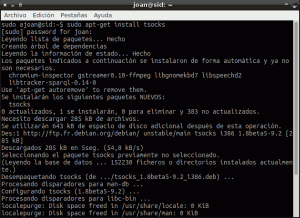
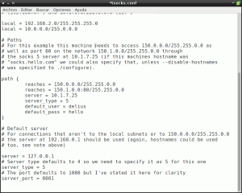
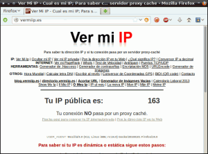
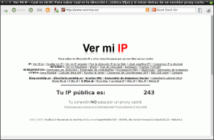
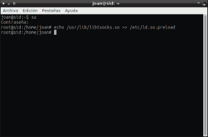
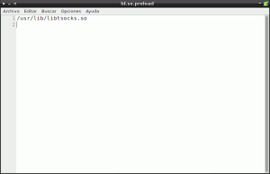
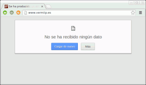

En pasados post vimos como crear un túnel SSH y mediante un proxy socks local enviar la totalidad del tráfico de forma cifrada a través del túnel SSH que hemos creado, para de esta forma poder navegar de forma segura.

Pero también vimos que hay **ciertos programas que no tienen la opción de poderlos configurar para que funcionen a través de un proxy socks** y por lo tanto no es posible redirigir nuestro tráfico a través del túnel SSH.<!--more-->

**Por ejemplo en el caso de querer usar [Midori](http://midori-browser.org/ "Navegador Midori") vemos que es totalmente imposible redirigir el tráfico a nuestro túnel SSH**. **Una posible solución a este problema es utilizar tsocks**.

###### Nota: Para las personas interesadas en consultar los post en que se explica como establecer un túnel SSH para poder navegar de forma segura pueden consultar los siguientes links:

[https://geekland.eu/que-es-y-para-que-sirve-un-tunel-ssh/]() [https://geekland.eu/establecer-un-tunel-ssh/]()

## INSTALAR TSOCKS

Para instalar tsocks tan solo tenemos que abrir la terminal y teclear el siguiente comando:

> ```
> sudo apt-get install tsocks
> ```

[](images/1-instalar-tsocks.png)

###### Nota:  Prácticamente la totalidad de distros linux disponen del paquete tsocks. Por lo tanto no deberían tener ningún problema para instalarlo.

## CONFIGURAR TSOCKS

Una vez hemos instalado tsocks tenemos que configurarlo. Para acceder al fichero de configuración introducimos el siguiente comando en la terminal:

> ```
> sudo leafpad /etc/tsocks.conf
> ```

La totalidad de parámetros que tenemos que configurar dentro del archivo de configuración son los siguientes:

**local =** En este campo tenemos que **poner la dirección de nuestra red local y de la máscara de subred**. De esta forma estamos configurando que el acceso a los equipos de nuestra red local se hagan directamente sin la intervención del servidor proxy. En mi caso este campo tendrá el valor **192.168.2.0/255.255.255.0**. En vuestro caso es posible que el valor tengáis que poner sea 192.168.1.0/255.255.255.0

**server =** Tenemos que **introducir la IP del servidor proxy socks**. Como el servidor proxy socks lo tenemos en nuestra propia máquina tendremos que usar la IP **127.0.0.1**

**server\_type =** el túnel SSH que crearemos admite tanto el protocolo socks 4 como el protocolo socks 5. Como socks 5 es mucho más moderno y seguro que el socks 4 en este campo **elegiremos el valor 5**.

**server\_port =** En este apartado tenemos que **introducir el puerto por el que abriremos el túnel SSH** y por el que el servidor socks recibirá las peticiones. **En nuestro** caso lo haremos por el puerto **8081**.

Seguidamente les muestro una captura de pantalla del trabajo realizado hasta el momento:

[](images/2-Archivo-de-configuración-tsocks.png)

Con la configuración introducida es más que suficiente para nuestos propositos. En el caso que alguien precise profundizar más sobre la configuración de tsocks puede consultar el siguiente enlace:

[https://linux.die.net/man/5/tsocks.conf](https://linux.die.net/man/5/tsocks.conf "Configuración de Tsocks Adicional")

## COMPROBACIÓN DEL FUNCIONAMIENTO DE TSOCKS

A estas alturas ya hemos terminado el trabajo. Ahora solo nos falta comprobar que todo funciona a la perfección.

Lo primero que tenemos que hacer es abrir nuestro navegador. En este caso abriremos el navegador Firefox y comprobaremos cual es nuestra IP Pública. Para ello **accedemos a la siguiente página web**:

[http://www.vermiip.es/](http://www.vermiip.es/ "Averiguar IP Pública")

Una vez hemos accedido a la página web vemos que nuestra IP es la siguiente:

[](images/3-Ip-sin-proxy-socks.png)

En la captura de pantalla **vemos que nuestra nuestra IP Pública real termina en 163**.

**Seguidamente lo que tenemos que realizar es establecer el túnel SSH por el puerto 8081** que es el que hemos elegido en el archivo de configuración de tsocks. Para establecer el túnel usamos el siguiente comando en la terminal:

> ```
> ssh -p 22 -N -D 8081 joan@geekland.sytes.net
> ```

###### Nota: Quien necesite información sobre el comando que acabo de introducir puede consultar el siguiente post: [https://geekland.eu/establecer-un-tunel-ssh/]()

Como podemos ver en la captura de pantalla el túnel se ha establecido:

[](images/4-Establecer-conexion-con-el-servidor-SSH.png)

**Seguidamente tenemos ejecutar el programa que queremos que trabaje con nuestro proxy socks** y nuestro túnel SSH. **Para ejecutar un programa tenemos que abrir una terminal y usar la siguiente sintaxis**:

> ```
> tsocks + el nombre del programa que queremos arrancar
> ```

Así por lo tanto si queremos ejecutar midori de tal forma que todo su tráfico se redirija a través del túnel SSH tenemos que introducir el siguiente comando en la terminal:

> ```
> tsocks midori
> ```

**Una vez introducido el comando** se arrancara midori. Seguidamente **comprobaremos nuestra IP pública accediendo a la siguiente página web**:

[http://www.vermiip.es/](http://www.vermiip.es/ "Averiguar IP Pública")

El resultado obtenido es el siguiente:

[](images/5-Comprobar-que-la-conexion-es-con-tsocks.png)

**Como podemos ver ahora nuestra IP Pública termina en 243**. **Antes terminaba en 163**. Por lo tanto podemos afirmar que **la totalidad del tráfico de nuestro navegador está pasando a través de nuestro proxy socks** y nuestro túnel SSH.

## FORZAR QUE LA TOTALIDAD DEL TRÁFICO PASE A TRAVÉS DEL PROXY SOCKS

Una vez comprobado que tsocks funciona seguramente muchos de vosotros considerarán tedioso tener que arrancar aplicación por aplicación desde la terminal. Si este es vuestro caso **pueden utilizar el siguiente método para forzar que la totalidad del tráfico de nuestro equipo pase por nuestro túnel SSH**. Para conseguir esto tenemos que realizar los siguientes pasos:

**Lo primero que tenemos que realizar es abrir el túnel SSH desde nuestra máquina al servidor**. Para esto abrimos una terminal y tecleamos el siguiente comando:

> ```
> sudo ssh -p 22 -N -D 8081 joan@geekland.sytes.net
> ```

En la siguiente captura de pantalla se puede ver que el túnel ha sido creado:

[](images/4-Establecer-conexion-con-el-servidor-SSH.png)

Una vez establecido el túnel abrimos otra terminal y **activamos el usuario root.** Para activar el usuario root tenemos que usar el siguiente comando:

> ```
> su
> ```

###### Nota: Si el comando “su” les da algún problema de permisos usen “sudo su” en vez de su.

**Una vez introducido el comando su introduciremos un nuevo comando en la terminal. El comando es el siguiente:**

> ```
> echo /usr/lib/libtsocks.so >> /etc/ld.so.preload
> ```

###### Nota: Lo que hace este comando es crear el archivo /etc/ld.so.preload y dentro de este archivo introduce como texto /usr/lib/libtsocks.so. De esta manera estaremos forzando que la totalidad del tráfico circule por nuestro túnel SSH.

En la siguiente captura de pantalla se pueden ver los pasos realizados hasta el momento:

[](images/6-Redireccionar-el-tráfico-al-proxy.png)

**Una vez realizados todos estos pasos cualquiera de las aplicaciones que ejecutemos, ya sea en modo gráfico o desde la terminal, se hará a través de nuestro proxy socks y desde nuestro túnel SSH**. Si queréis hacer la comprobación tan solo tenemos que abrir nuestro navegador y comprobar la IP pública de nuevo.

[](images/5-Comprobar-que-la-conexion-es-con-tsocks.png)

Como se puede ver en la captura de pantalla **la IP pública no termina en 163**. **Termina en 243**. **Por lo tanto el tráfico circula a través del túnel SSH**.

###### Nota: Usando este método garantizamos que la totalidad de trafico entrante y saliente de nuestro ordenador se recibe y transmite por el servidor proxy socks y el túnel SSH. En otras palabras estamos redireccionando la totalidad de tráfico TCP por nuestro túnel SSH. Usemos la aplicación que usemos nuestro tráfico pasará a través del servidor Proxy Socks.

**Una vez ya no necesitamos navegar a través de nuestro servidor proxy socks es indispensable realizar los siguientes pasos**:

###### Nota: En caso de no realizar estos pasos cuando arranquen el ordenador no dispondrán de conectividad a Internet ya que el tráfico se redirigirá al proxy socks y no habrá ningún túnel SSH abierto para para poder enviar la petición.

**Abren una terminal y teclean el siguiente comando**:

> ```
> sudo leadpad /etc/ld.so.preload
> ```

Como se puede ver en la captura de imagen se abrirá un editor de texto que contiene la siguiente linea de texto “**/usr/lib/libtsocks.so**”:

[](images/7-Deshacer-el-redireccionamiento-de-tráfico.png)

**Lo que tienen que hacer es borrar la linea** **/usr/lib/libtsocks.so**. **Una vez la han borrado completamente guardan el fichero**.

Una vez guardado el fichero el tráfico entrante y saliente ya no se redirigirá al servidor proxy socks. Como he dicho anteriormente, si no realizamos este paso, en el momento que se cierre el túnel o en el caso que reiniciemos el ordenador no tendremos Internet.

## LIMITACIONES DE TSOCKS

**Tsocks no es perfecto y tiene ciertas limitaciones**. Tsocks no puede redirigir el tráfico a través del túnel SSH en la totalidad de aplicaciones.

**Tsocks no podrá redirigir el tráfico por el túnel SSH como mínimo en los siguientes casos**:

1. En el caso que aplicaciones que hagan uso de [setuid](http://es.wikipedia.org/wiki/Setuid "Que es setuid").
2. En el caso que las **aplicaciones a utilizar no hagan uso de la función connect()** de las funciones de red ya que el funcionamiento de tsocks se basa en sobreescribir la función connect(). Así por lo tanto cuando establecemos una conexión con el protocolo TCP, se sobreescribe la función connect() para que tsocks pueda determinar si la conexión se tiene que hacer a través del servidor proxy o no. La elección de si pasa por el proxy o no la hace en función de la configuración que hemos introducido en el fichero tsocks.conf.
3. **En el caso que alguna aplicación o servicio este usando el protocolo UDP**. Tsocks solo puede redirigir tráfico con el protocolo TCP.

Así por ejemplo en el caso que intentemos usar Chrome con tsocks el resultado que obtendremos es el siguiente:

[](images/8-Limitaciones-de-Tsocks.png)

Como pueden ver no se puede establecer ninguna conexión.

Para solucionar estos problema en futuros post detallaremos una opción alternativa a tsocks que es un poco más complicada de configurar pero que no presenta los inconvenientes mencionados. Esta opción alternativa se llama [Redsocks](https://github.com/darkk/redsocks "Redsocks") y funciona de forma similar a un proxy transparente.

Con [redsocks](https://github.com/darkk/redsocks "Redsocks") conseguiremos que la totalidad del tráfico con el protocolo TCP de nuestro ordenador vaya por el túnel SSH y no tengamos las limitaciones de Tsocks.
