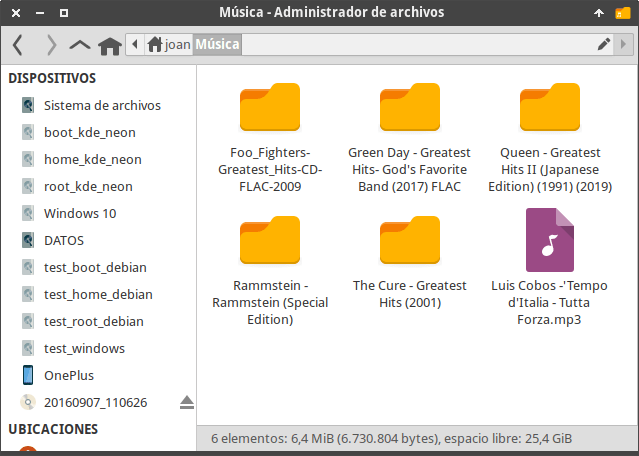
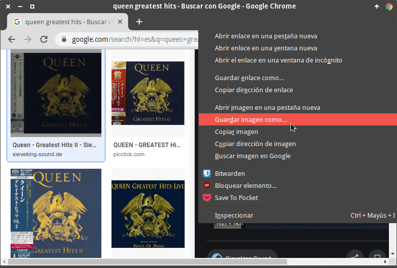
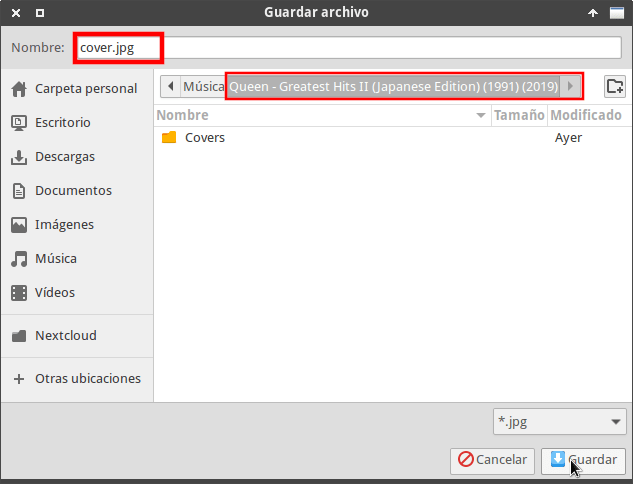
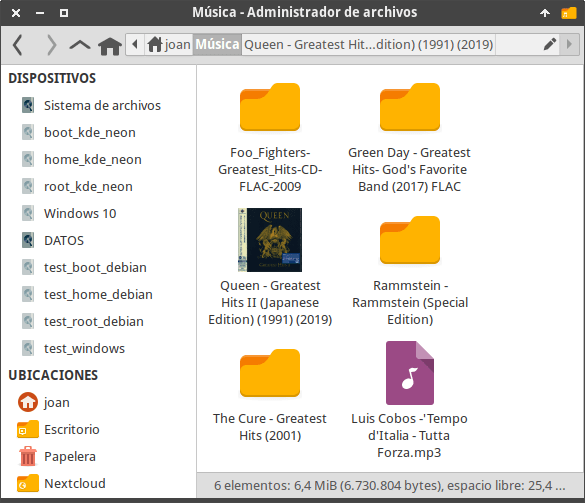
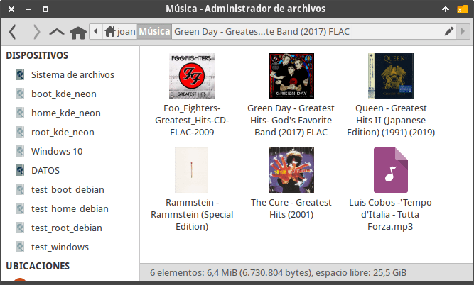
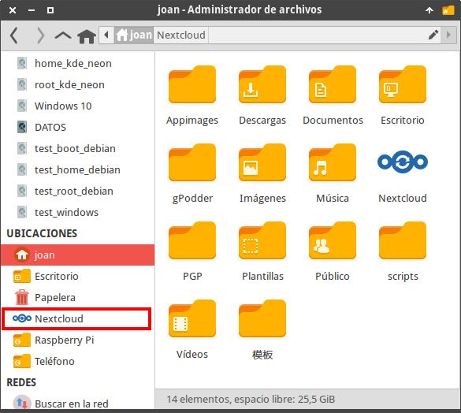

Seguro que existe un elevado número de lectores a los que les resultará útil reemplazar el icono de una carpeta por imágenes miniatura o thumbnails personalizados en XFCE.<!--more-->

## UTILIDADES DE REEMPLAZAR EL ICONO DE UNA CARPETA POR IMÁGENES MINIATURA

En mi caso uso la funcionalidad que acabamos de mencionar para las siguientes situaciones:

1. Reconocer fácilmente y de forma visual las colecciones de música, películas y series que tengo almacenadas en mi equipo.
2. Ver claramente y rápidamente el directorio que está sincronizado con mi nube Nextcloud.
3. Identificar de forma rápida y visual el contenido que almacena un directorio.

Seguramente existen más utilidades de las que menciono. Por lo tanto les animo a que dejen sus aportaciones en los comentarios de este artículo.

## REQUISITOS PARA PODER REEMPLAZAR EL ICONO DE UNA CARPETA POR UNA IMAGEN MINIATURA EN XFCE

Los únicos requisitos que tienen que cumplir para seguir las indicaciones de este tutorial son los siguientes:

1. La versión del gestor de archivos Thunar tiene que ser igual o superior a la 1.8.2.
2. Tener instalada la utilidad Imagemagick. XFCE usa Imagemagick para crear las imágenes miniatura que indican el contenido que almacena cada uno de nuestro directorios.

Por lo tanto, si disponen de la versión 4.14 de XFCE no tendrán ningún problema para aplicar las instrucciones de este tutorial.

## ACTIVAR LAS IMÁGENES MINIATURA EN LAS CARPETAS DE XFCE

Las imágenes miniatura (o thumbnails) no están configuradas de forma predeterminada en XFCE. Por lo tanto, para que Thunar reemplace el icono de una carpeta por una imagen miniatura procederemos del siguiente modo:

Inicialmente aseguraremos que la utilidad Imagemagick está instalada. Para ello ejecutaremos el siguiente comando en la terminal:

> ```
> sudo apt install imagemagick
> ```

###### Nota: Los usuarios de arch deberán reemplazar el comando anterior por sudo pacman -S imagemagick

###### Nota: Los usuarios de fedora deberán reemplazar el comando anterior por sudo yum install ImageMagick

Acto seguido ejecutaremos el siguiente comando en la terminal:

> ```
> sudo nano /usr/share/thumbnailers/folder.thumbnailer
> ```

Una vez se abra el editor de texto nano pegaremos el siguiente código:

> ```
> [Thumbnailer Entry]
> Version=1.0
> Encoding=UTF-8
> Type=X-Thumbnailer
> Name=Folder Thumbnailer
> MimeType=inode/directory;
> Exec=/usr/bin/folder-thumbnailer %s %i %o %u
> ```

A continuación guardaremos los cambios y cerraremos el fichero. El siguiente paso consistirá en crear el script que generará las imágenes miniatura. Para ello ejecutamos el siguiente comando en la terminal:

> ```
> sudo nano /usr/bin/folder-thumbnailer
> ```

Una vez se abra el editor de textos pegamos el siguiente código:

> ```
> #!/bin/bash
> 
> convert -thumbnail "$1" "$2/folder.jpg" "$3" 1>/dev/null 2>&1 ||\
> convert -thumbnail "$1" "$2/.folder.jpg" "$3" 1>/dev/null 2>&1 ||\
> convert -thumbnail "$1" "$2/folder.png" "$3" 1>/dev/null 2>&1 ||\
> convert -thumbnail "$1" "$2/cover.jpg" "$3" 1>/dev/null 2>&1 ||\
> convert -thumbnail "$1" "$2/.cover.jpg" "$3" 1>/dev/null 2>&1 ||\
> convert -thumbnail "$1" "$2/cover.png" "$3" 1>/dev/null 2>&1 ||\
> rm -f "$HOME/.cache/thumbnails/normal/$(echo -n "$4" | md5sum | cut -d " " -f1).png" ||\
> rm -f "$HOME/.thumbnails/normal/$(echo -n "$4" | md5sum | cut -d " " -f1).png" ||\
> rm -f "$HOME/.cache/thumbnails/large/$(echo -n "$4" | md5sum | cut -d " " -f1).png" ||\
> rm -f "$HOME/.thumbnails/large/$(echo -n "$4" | md5sum | cut -d " " -f1).png" ||\
> exit 1
> ```

Una vez pegado el código guardamos los cambios y cerramos el fichero.

Finalmente otorgamos permisos de ejecución al script que acabamos de crear ejecutando el siguiente comando en la terminal:

> ```
> sudo chmod a+x /usr/bin/folder-thumbnailer
> ```

## REEMPLAZAR EL ICONO DE UNA CARPETA POR IMÁGENES MINIATURA PERSONALIZADAS QUE NOS DEN UNA IDEA DEL CONTENIDO DEL DIRECTORIO

El aspecto inicial de mi librería musical es la que se muestra a continuación.

[](images/coleccion-musica-inicial.png)

Para añadir / personalizar una imagen miniatura procederemos del siguiente modo:

Buscaremos una imagen **en formato .jpg o .png** que represente el contenido de los archivos que hay dentro del directorio. En mi caso al tratarse de álbumes musicales me descargaré la cubierta del álbum del grupo en cuestión.

[](images/conseguir-imagen-a-usar-como-thumbnail.png)

Acto seguido renombramos la cubierta del álbum que acabamos de descargar. Según el código definido en el script /usr/bin/folder-thumbnailer podemos renombrar el archivo con los siguientes nombres:

1. folder.jpg
2. .folder.jpg
3. folder.png
4. cover.jpg
5. .cover.jpg
6. cover.png

###### Nota: Si lo creen conveniente pueden modificar el contenido del script /usr/bin/folder-thumbnailer para ampliar/modificar los nombres admitidos.

Una vez renombrado el fichero lo guardamos dentro del directorio que contiene los audios de la cubierta del álbum.

[](images/renombrar-imagen-miniatura-o-thumbnail.png)

A partir de estos momentos, el directorio que contiene los audios de Queen no se mostrará con el típico icono de la carpeta. El icono de la carpeta será reemplazado por la caratula del álbum.

[](images/carpeta-reemplaza-por-imagen-miniatura.png)

Si repetimos lo que acabamos de ver para cada uno de los álbumes obtendremos el siguiente resultado:

[](images/coleccion-musica-con-imagenes-miniatura.png)

Si observan verán que las imágenes miniatura también se aplican a los directorios que aparecen en el apartado de Ubicaciones de Thunar.

[](images/imagenes-miniatura-en-ubicaciones.png)

###### Nota: XFCE permite descargar imágenes miniatura de forma automática de las películas almacenadas en nuestro equipo. No obstante, por temas de privacidad esta característica viene desactivada.

**FUENTES**

[https://docs.xfce.org/xfce/thunar/tumbler](https://docs.xfce.org/xfce/thunar/tumbler "Fuente principal de la información")
