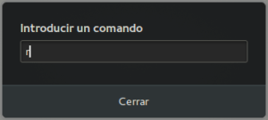

Existen ocasiones en que es necesario reiniciar el entorno de escritorio. Algunas de ellas son las siguientes:

1. Para que ciertas configuraciones que acabamos de realizar se apliquen.
2. Alguna parte del entorno gráfico no funciona o deja de responder.
3. En el momento que instalamos una extensión de Gnome Shell.
4. Etc.

<!--more-->

Obviamente una solución para reiniciar el entorno de escritorio es apagar y encender el ordenador. No obstante esto ocasionará ciertas molestias como por ejemplo las siguientes:

1. Pérdida de tiempo.
2. Interrupción de un servicio en el caso que nuestro equipo actúe como servidor.
3. Pérdida de información en el caso que nos olvidemos guardar los cambios de programas que tenemos abiertos.
4. Al apagar y abrir el ordenador tendremos que reabrir la totalidad de programas y servicios que estábamos usando.

Para evitar estas molestias, a continuación veremos el procedimiento a seguir para reiniciar el entorno de escritorio sin tener que apagar y abrir el ordenador ni cerrar ningún programa.

## REINICIAR EL ENTORNO DE ESCRITORIO EN LINUX

El procedimiento para reiniciar el entorno de escritorio variará en función del escritorio que usemos. En función del entorno de escritorio que usen deberán ejecutar los siguientes comandos en la terminal:

 
|   **Entorno de escritorio**   |   **Comando**   |
| --- | --- |
|   XFCE   |   ``` xfce4-panel -r && xfwm4 --replace  ```   |
|   Gnome Shell   |   ``` gnome-shell --replace & disown ```   |
|   Plasma 5   |   ``` kbuildsycoca5 && kquitapp5 plasmashell && kstart5 plasmashell ```   |
|   LXDE   |   ``` lxpanelctl restart && openbox --restart  ```   |
|   Unity   |   ``` unity --replace & ```   |
|   Budgie   |   ``` budgie-panel --replace && budgie-wm --replace  ```   |
|   MATE   |   ``` mate-panel --replace  ```   |
|   Cinnamon   |   ``` gnome-shell --replace  ```   |

Algunos de los comandos que he puesto en la tabla también reinician el gestor de ventanas.

###### Nota: En la tabla faltan entornos de escritorio como por ejemplo LXQt, Pantheon, etc. Agradecería que los lectores del artículo hicieran sus aportaciones en los comentarios del artículo para añadir más escritorios.

## OTRAS FORMAS DE REINICIAR EL ENTORNO DE ESCRITORIO

En algunos escritorios, como Gnome Shell o Cinnamon, tenemos métodos alternativos para reiniciar el escritorio. Los métodos son los siguientes:

### Reiniciar el escritorio en Gnome Shell y/o Cinnamon

En el caso de Gnome Shell o Cinnamon podemos reiniciar el entorno de escritorio de forma sencilla siguiendo las siguientes instrucciones.

1. Inicialmente tenemos que presionar la combinación de teclas **ALT+F2**.
2. Cuando aparezca el cuadro de dialogo tenemos que escribir la letra **r** y presionar la tecla **Enter**.

[](images/reiniciar-el-escritorio-gnome-shell.png)

Acto seguido se reiniciará nuestro entorno de escritorio. Probablemente este sea un método más rápido y más sencillo de recordar que los comandos mostrados en el primer apartado.

Para no tener que recordar los comandos citados en el primer apartado pueden usar alias de la forma que se detalla en el siguiente apartado.

## ALIAS PARA REINICIAR EL ENTORNO DE ESCRITORIO DE FORMA FÁCIL

Si lo prefieren pueden [crear atajos de teclado]() o alias para reiniciar el escritorio de forma más rápida y fácil. Para ello tan solo tenemos que seguir las siguientes instrucciones.

Abrimos una terminal y ejecutamos el siguiente comando:

> ```
> nano ~/.bashrc
> ```

A continuación añadiremos un comando que siga la siguiente estructura:

> ```
> alias texto_para_ejecutar_alias='comando_a_ejecutar'
> ```

Como en mi caso quiero reiniciar el entorno de escritorio XFCE cada vez que ejecute el comando **refrescar** añadiré la siguiente línea:

> ```
> alias refrescar='xfce4-panel -r && xfwm4 --replace'
> ```

Una vez realizadas las modificaciones guardamos los cambios. En estos momentos cada vez que ejecutemos el comando **refrescar** se reiniciará nuestro entorno de escritorio XFCE.
