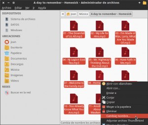
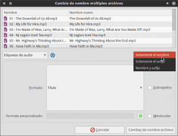
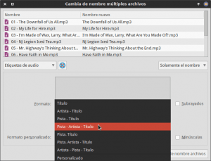
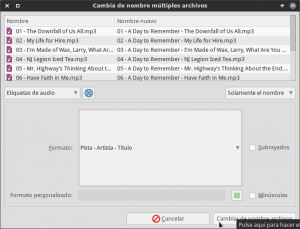
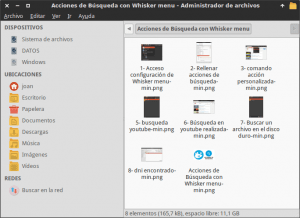
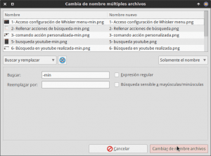
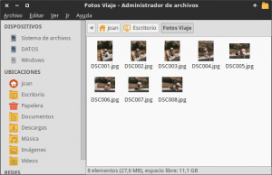
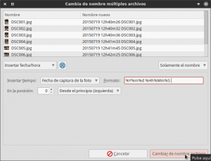

La verdad es que en Linux existen multitud de opciones para renombrar archivos de forma masiva. Algunas de las muchas opciones que existen son las siguientes:<!--more-->

1. Pyrenamer
2. Gprename
3. Krename
4. Usando el comando rename en la terminal Linux
5. Gnome Commander
6. etc

###### Nota: La totalidad de opciones mencionadas están en los repositorios de Debian, y consecuentemente imagino que en la gran mayoría de distribuciones Linux.

A pesar de todas las opciones mencionadas y existentes me voy a centrar en en el [gestor de archivos Thunar](http://docs.xfce.org/xfce/thunar/bulk-renamer/start "Información sobre Thunar Bulk Renamer") que trae incorporada esta funcionalidad de serie. Me centro en esta opción básicamente por 3 motivos:

1. Es una solución muy completa que cumple con todas mis necesidades.
2. Thunar es el gestor de archivos que utilizo habitualmente y tiene integrada esta funcionalidad.
3. Su uso es muy sencillo e intuitivo.

###### Nota: La utilidad para renombrar archivos que usaremos esta integrada en Thunar, pero en el caso de usar Nautilus también se podrá integrar sin ningún tipo de problema gracias a las nautilus actions. En futuros post veremos como realizar lo que acabo de comentar.

## FUNCIÓN DEL RENOMBRADOR DE ARCHIVOS EN MASA

La función del renombrador de archivos en masa es fácil de entender. Su función es la de cambiar el nombre o renombrar un conjunto de archivos de forma simultanea. O dicho vulgarmente **cambiar muchos nombres a la vez**.

Por lo tanto **las ventajas que nos proporciona** renombrar archivos de forma masiva **son** básicamente un **ahorro de tiempo** y una **mejor clasificación de nuestro archivos** y nuestras carpetas.

## OPCIONES DE LA UTILIDAD PARA RENOMBRAR ARCHIVOS DE THUNAR

Como he comentado anteriormente, el renombrador de archivos en masa de Thunar (Thunar Bulk renamer) es una opción muy completa que ofrece multitud de posibilidades. Algunas de las opciones que ofrece son las siguientes:

1. Agregar prefijos o sufijos a los nombres actuales.
2. Insertar la fecha y hora en los nombres de los archivos y carpetas con el formato que nosotros queramos.
3. Buscar y reemplazar un determinado texto que aparece en los nombres de los archivos o carpetas.
4. Transformar todo el texto de mayúsculas a minúsculas y viceversa.
5. Hacer que la primera letra de cada una de las palabras que conforma el nombre del archivo o carpeta sea en mayúsculas.
6. Numerar archivos y carpetas en el formato que deseamos.
7. Poner nombre a nuestras canciones y vídeos a partir de las etiquetas (metadatos) ID3 que contiene los archivos de audio y de vídeo. En el caso que los archivos de audio y de vídeo no contengan metaetiquetas las podemos añadir fácilmente con Puddletag u otro software similar.
8. Borrar determinados caracteres o palabras que aparecen en el nombre de los archivos o carpetas.
9. Insertar determinadas palabras en la posición que nosotros necesitamos.
10. Cambiar las extensiones de un conjunto de archivos.

## USOS QUE PODEMOS DAR A RENOMBRAR ARCHIVOS EN MASA

Algunas de las utilidades que acostumbro a dar al renombrador de archivos en masa son las siguientes:

1. En el caso de realizar descargas de series en Internet es sumamente útil para que todas se denominen de un forma coherente. Cabe recordar que la mayoría de archivos que se descargan tienen unos nombres muy largos y que carecen de sentido para clasificar la información.
2. En el caso de realizar gran cantidad de fotografías es útil para clasificarlas de forma adecuada.
3. En el caso de disponer de grandes cantidades de archivos de música también resulta extremadamente útil para renombrarlos y clasificarlos de forma adecuada.
4. En ocasiones uso ciertos servicios web, por ejemplo para reducir el tamaño de algunas imágenes, que añaden sufijos o prefijos a los nombres de los archivos de salida. Con la utilidad de Thunar para renombrar archivos podremos eliminar estos prefijos o sufijos de un plumazo.

###### Nota: Sin duda existirán muchas más utilidades que las que acabo de nombrar. No obstante, como he comentado anteriormente, solo he citado las que yo personalmente acostumbro a utilizar.

## INSTALACIÓN DE THUNAR PARA RENOMBRAR ARCHIVOS

Para poder renombrar archivos y carpetas de forma masiva con Thunar, el primero y único requisito necesario es instalar el gestor de archivos Thunar y el paquete thunar-media-tags-plugin.

Para ello **abrimos una terminal y tecleamos el siguiente comando**:

> ```
> sudo apt-get install thunar thunar-media-tags-plugin
> ```

En el caso que ya tengáis estos paquetes instalados no pasará absolutamente nada. En el caso que no estén instalados entonces se instalarán en vuestro sistema operativo.

###### Nota: Con la instalación de estos 2 paquetes estáis instalando un gestor de archivos adicional en vuestro sistema operativo. Si el nuevo gestor de archivos os gusta y queréis usarlo como predeterminado, tendréis que buscar información de como poner el gestor de archivos Thunar como predeterminado en vuestra distribución Linux.

## RENOMBRAR ARCHIVOS Y CARPETAS CON THUNAR

### Abrir el renombrador de archivos en masa

Para iniciar el renombrador de archivos en masa tenemos varias opciones.

**La primera de ellas** es abrir una terminal. Una vez abierta la terminal introducimos el siguiente comando y presionamos Enter:

> ```
> thunar -B
> ```

**Otra forma de iniciar la utilidad para renombrar archivos es** abrir Thunar. Una vez abierto Thunar seleccionamos los archivos que queremos renombrar, una vez seleccionados los archivos presionamos la tecla **F2** o, tal y como se puede ver en la captura de pantalla, presionamos el botón derecho del mouse y clicamos sobre la opción **Cambiar Nombre** del menú contextual:

[](images/1-Abrir-la-utilidad-para-renombrar-archivos.png)

### Fijar las reglas para renombrar archivos y carpetas

Fijar las reglas es fácil, tan solo hay que ir probando las opciones que nos ofrece el programa. Para que podáis ver el funcionamiento veremos unos cuantos ejemplos de como podemos usar Thunar para renombrar archivos.

#### Renombrar archivos de audio

Una hemos abierto Thunar y hemos seleccionado los archivos a renombrar, tenemos que fijar las reglas para poder cambiar el nombre de los archivos o carpetas.

El primer paso para fijar las reglas es seleccionar el **tipo de cambio de nombre** que queremos realizar. Como en mi caso quiero aprovechar las metaetiquetas ID3 para renombrar los archivos mp3, tal y como se puede ver en la captura de pantalla, selecciono la opción **Etiquetas de audio**:

[](images/2-Seleccionar-el-cambio-a-realizar.png)

Seguidamente tenemos que seleccionar la **parte del nombre que queremos modificar**. Como en mi caso tan solo quiero modificar el nombre, tal y como se puede ver en la captura de pantalla, selecciono la opción **Solamente nombre**.

[](images/3-Seleccionar-parte-del-nombre-a-sustituir.png)

###### Nota: Si en vez de cambiar el nombre hubiera querido cambiar el tipo de archivo, tendría que haber seleccionado la opción Solamente el sufijo. De este modo podríamos transformar la extensión mp3 a otra extensión.

Finalmente solo nos falta seleccionar el **tipo de formato** que queremos que tenga el nuevo nombre. En mi caso, tal y como se puede ver en la captura de pantalla, he seleccionado la opción **Pista – Artista – Título**:

[](images/4-Seleccionar-el-tipo-de-formato.png)

Justo después de seleccionar esta opción, tal y como se puede ver en la siguiente captura de pantalla, en la parte superior derecha veremos una simulación del resultado final del renombramiento de los archivos:

[](images/5-Renombrar-archivos-de-audio.png)

Si estamos conforme con el resultado obtenido, tal y como se puede ver en la captura de pantalla, tan solo tenemos que **presionar el botón** **Cambiar de nombre Archivos**. Justo después de presionar este botón se renombrarán todos los archivos de un plumazo.

#### Suprimir textos que aparecen en los nombres de archivos y carpetas

Si tenemos un conjunto de archivos que contienen una palabra que queremos eliminar o reemplazar lo podemos realizar de una forma muy fácil.

En la siguiente captura de pantalla vemos que la totalidad de archivos contienen la palabra **\-min**.

[](images/6-Suprimir-palabras-de-los-nombres.png)

**Para borrar la palabra -min seleccionamos las siguientes opciones** en el renombrador de archivos:

[](images/7-Opciones-a-elegir-para-suprimir-palabras.png)

En el **tipo de transformación** seleccionamos **Buscar y reemplazar**, porque lo que queremos hacer es buscar la palabra **\-min** y borrarla o sustituirla por otra.

En la **parte del nombre a modificar** seleccionamos la opción **Solamente nombre**. Seleccionamos esta opción porqué lo único que quiero modificar es el nombre de los archivos y en ningún momento pretendo modificar la extensión de los archivos.

En el campo **Buscar** escribimos **\-min** porque -min es la palabra que quiero reemplazar.

El campo **Reemplazar por** lo dejo **en blanco** porque lo que realmente quiero es borrar la palabra -min.

Una vez seleccionadas estas opciones tan solo tenemos que **presionar el botón** **Cambiar de nombre Archivos**. Justo después de presionar este botón se eliminará la palabra -min de la totalidad de archivos que seleccionamos inicialmente.

#### Renombrar un conjunto de fotografías para su almacenamiento

Imaginemos que tenemos un conjunto de fotografías y queremos renombrarlas para su posterior clasificación:

[](images/8-Insertar-fecha-y-hora-en-fotografias.png)

En mi caso el modo de renombrar y clasificar las fotos es indicar la fecha y hora de la captura de la foto. Para realizar lo que acabo de comentar **en el renombrador** de archivos tengo que **seleccionar las siguientes opciones**:

[](images/9-Opciones-para-insertar-fecha-y-hora.png)

En **tipo de transformación** seleccionamos **Insertar fecha/hora**, porque lo que queremos es insertar la fecha y la hora en el nombre de nuestras fotografías.

En la **parte del nombre a modificar** seleccionamos la opción **Solamente nombre**. Seleccionamos esta opción porque lo único que quiero modificar es el nombre de los archivos y en ningún momento pretendo modificar la extensión de los archivos.

En **Insertar tiempo** selecciono la opción **Fecha de captura de la foto**. Selecciono esta opción porque quiero que el nombre de la foto contenga la fecha y la hora de la captura de la foto. Si queremos en el campo Insertar tiempo podemos seleccionar otras opciones como la fecha actual, la fecha de último acceso la foto, etc.

En **formato** hay que indicar el formato en que queremos que aparezca la fecha y la hora. En mi caso selecciono el siguiente formato:

> ```
> %Y- %m- %d %Hh%Mm%Ss
> ```

Finalmente en el campo **Posición** hay que seleccionar en que posición del nombre queremos que se inserte la fecha y la hora. En mi caso quiero que la fecha y la hora sea lo primero que se lea, por lo tanto selecciono la posición **0 Desde el principio (Izquierda)**.

Una vez seleccionadas estas opciones tan solo tenemos que **presionar el botón** **Cambiar de nombre Archivos**. Justo después de presionar este botón se insertará la fecha y la hora de captura de la fotografía en todas las fotografías.

## CONCLUSIONES FINALES

Como se ha podido ver a lo largo del post, la utilidad para renombrar archivos y carpetas de Thunar es una opción muy completa y muy sencilla de usar.

Aparte de los ejemplos vistos en este post Thunar ofrece muchas mas opciones para renombrar archivos y carpetas, pero con lo visto hasta el momento es más que suficiente para tener la base para poder realizar otro tipo de trabajos.

Para finalizar solo decir que si no os convence la opción que propongo, siempre pueden usar cualquiera de las otras alternativas mencionadas en el inicio de este post.
