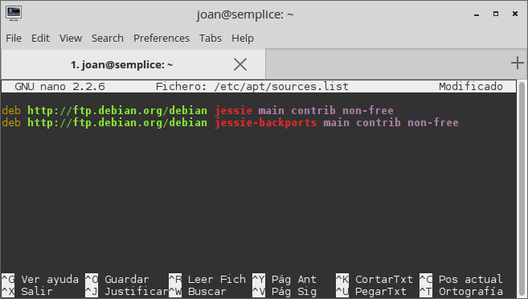
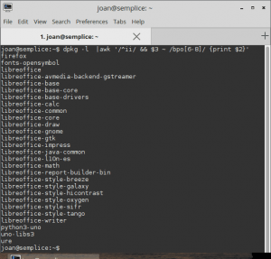

En el caso de ser usuarios de la rama estable de Debian observaréis que a medida que va pasando el tiempo las versiones software de los programas y paquetes que usamos van quedando obsoletas en comparación con otras distros. Para hallar una solución a este hecho podemos usar el repositorio Backports de Debian.<!--more-->

###### Nota: Que las versiones de software queden obsoletas no quiere decir que sean inseguras. En Debian estable no aparecerán versiones nuevas de los paquetes, pero si nos llegaran las actualizaciones de seguridad. Hay que tener en mente que Debian estable es un sistema operativo diseñado para ser estable y seguro.

###### Nota: A mucha gente, incluido yo mismo, les da igual el hecho de no poder usar las últimas versiones de software. No obstante puede existir algún caso particular que exija disponer de una versión de software más actual.

## QUE SON LOS BACKPORTS DE DEBIAN

Lo que denominamos como backports de Debian no es más que **un** simple **repositorio que añadimos a nuestro sistema operativo**.

**Este repositorio contiene paquetes y programas que provienen de la rama testing de Debian** y que han sido recompilados y adaptados para poderse instalar y usar en la rama estable.

###### Nota: En algunos casos particulares, como por ejemplo las actualizaciones de seguridad, el repositorio de Backports también dispone de paquetes provenientes de la rama inestable de Debian.

###### Nota: El repositorio Backports de Debian está pensado para usarse en la rama estable de Debian. No se recomienda, y además no tienen ningún sentido, su uso en las ramas testing e inestable.

## AÑADIR EL REPOSITORIO BACKPORTS EN DEBIAN

Añadir el repositorio de Backports en nuestra distribución Debian es sumamente fácil. Tan solo tenemos que **abrir una terminal y ejecutar el siguiente comando**:

> ```
> sudo nano /etc/apt/sources.list
> ```

Una vez se abra el editor de textos nano tenemos que **añadir la siguiente línea dentro del archivo sources.list**:

**En el caso de estar usando Debian Jessie**, o una distribución derivada de Debian Jessie deberemos añadir la siguiente línea:

> ```
> deb http://ftp.debian.org/debian jessie-backports main contrib non-free
> ```

**En el caso que estemos usando Debian Whezzy**, o una distribución derivada de Debian Whezzy deberemos añadir la siguiente línea:

> ```
> deb http://ftp.debian.org/debian wheezy-backports main contrib non-free
> ```

[](images/Repositorio-backports-añadido.png)

###### Nota: No os guiéis por la captura de pantalla. En vuestro fichero sources.list aparecerán más repositorios que en el mío. En mi caso solo aparecen los que veis porque estoy usando la distro derivada de Debian Semplice.

**Para versiones de Debian posteriores** a Jessie pueden **consultar el siguiente [enlace](http://backports.debian.org/Instructions/ "Web en la que se detallan los repositorios Backports")**.

Una vez introducida la línea **guardamos los cambios y cerramos el fichero sources.list**. Seguidamente tenemos que abrir una terminal y comprobar que tengamos instalados los paquetes necesarios para añadir la clave pública del nuevo repositorio. Para ello **abrimos una terminal y ejecutamos el siguiente comando**:

> ```
> sudo apt-get install debian-keyring debian-archive-keyring
> ```

Finalmente tan solo tenemos que **actualizar nuestra lista de repositorios ejecutando el siguiente comando en la terminal**:

> ```
> sudo apt-get update
> ```

## INSTALAR PROGRAMAS MÁS ACTUALES CON LA AYUDA DEL REPOSITORIO BACKPORTS

El repositorio Backports que acabamos de añadir tiene un Pin-Priority de 100. Por lo tanto los paquetes que están en el repositorio de Backports únicamente se instalarán cuando no estén disponible en rama estable de Debian.

###### Nota: No es para nada aconsejable ni útil cambiar el Pin-Priority del repositorio de Backports. No obstante quien lo quiera realizar encontrará la información necesaria en el siguiente [enlace]().

Esto implica que **si queremos instalar un programa** que está presente en los repositorio de backports **deberemos forzar su instalación usando el siguiente sintaxis**:

> ```
> sudo apt-get -t rama-backports install nombre_del_paquete
> ```

Donde:

**rama:** Se deberá sustituir por la rama de Debian estable que estamos usando.

**nombre\_del\_paquete:** Se deberá sustituir por el nombre de los paquetes que queremos instalar.

Así por ejemplo **si queremos instalar la última versión de Libreoffice**, el primer paso a realizar será **desinstalar la versión actual de Libreoffice ejecutando el siguiente comando en la terminal**:

> ```
> sudo apt-get remove libreoffice*
> ```

Una vez desinstalado Libreoffice podremos **instalar su versión más actual de ejecutando el siguiente comando en la terminal**:

**En el caso de estar usando Debian Jessie**, o una distribución derivada de Debian Jessie deberemos ejecutar el siguiente comando:

> ```
> sudo apt-get -t jessie-backports install libreoffice libreoffice-l10n-es libreoffice-gtk
> ```

**En el caso que estemos usando Debian Whezzy**, o una distribución derivada de Debian Whezzy deberemos ejecutar el siguiente comando:

> ```
> sudo apt-get -t wheezy-backports install libreoffice libreoffice-l10n-es libreoffice-gtk
> ```

Una vez ejecutado el comando se procederá a la instalación de la versión más actual de Libreoffice. Así de este modo tan sencillo podemos usar la versión 5.1.2.3 en vez de la versión 4.3.3.2.

## ACTUALIZAR LOS PROGRAMAS INSTALADOS A PARTIR DE LOS BACKPORTS DE DEBIAN

Para actualizar los programas instalados del repositorio backports **no hay que realizar nada en especial**. Cuando salgan versiones nuevas de **los programas instalados se actualizarán de forma automática ejecutando los comandos habituales** para actualizar nuestro sistema. Los comandos que en mi caso acostumbro a usar son los siguientes:

> ```
> sudo apt-get update ; sudo apt-get upgrade
> ```

o en el caso de aplicar actualizaciones más agresivas:

> ```
> sudo apt-get update ; sudo apt-get dist-upgrade
> ```

## INSTRUCCIONES PARA DESINSTALAR PROGRAMAS

**El proceso** para desinstalar un programa instalado a partir del repositorio backports **es exactamente el mismo que el de un paquete normal**. Por lo tanto si queremos desinstalar el programa Libreoffice que acabamos de instalar, tan solo tenemos que abrir la terminal y ejecutar con toda normalidad el siguiente comando:

> ```
> sudo apt-get remove libreoffice*
> ```

Después de ejecutar el comando se procederá a la desinstalación de Libreoffice.

## CONSULTAR LOS PAQUETES QUE ACTUALMENTE ESTAN EN LOS BACKPORTS

En el caso de queramos saber la totalidad de paquetes que contiene el repositorio backports tan solo tenemos que **visitar el siguiente enlace**:

[http://backport.debian.org/Packages/](http://backports.debian.org/Packages/ "Consultar los paquetes que hay en el repositorio backports")

Navegando dentro del enlace podremos ver la totalidad de paquetes existentes en las ramas Wheezy, Wheezy-sloppy y Jessie.

**En el caso que tengamos el repositorio Backports agregado en nuestro sistema operativo**, podemos consultar muy fácilmente si un programa o paquete está presente en el repositorio backports Para ello tan solo **tenemos que abrir una terminal y ejecutar el siguiente comando:**

> ```
> sudo apt-cache policy nombre_del_paquete
> ```

Donde:

**nombre\_del\_paquete:** Se deberá sustituir por el nombre del paquete que queremos comprobar si tiene versión en el repositorio backports.

Después de ejecutar el comando obtendremos la totalidad de versiones disponibles del paquete que estamos analizando.

## PRECAUCIONES QUE DEBEMOS TENER AL USAR EL REPOSITORIO BACKPORTS

**El repositorio backports no debe ser usado a la ligera y solo se recomienda usar en casos puntuales**. El motivo de tal afirmación es el siguiente:

Los paquetes que están en el repositorio backports no han sido testeados en profundidad. Por lo tanto es posible que el hecho de instalar paquetes procedentes del repositorio backports acabe produciendo incompatibilidades con otros componentes del sistema operativo Debian estable.

Por lo tanto el repositorio backports **se debe usar para casos concretos y solamente para cubrir una necesidad o un capricho en particular**. En el caso que tengamos versionitis, lo más recomendable es instalar la rama testing de Debian.

## CONSULTAR LOS PAQUETES QUE TENEMOS INSTALADOS DE LOS BACKPORTS

Si queremos saber los paquetes del repositorio backports instalados en nuestro sistema operativo lo podemos hacer de forma muy fácil. Tan solo tenemos que **abrir una terminal y ejecutar el siguiente comando**:

> ```
> dpkg -l |awk '/^ii/ && $3 ~ /bpo[6-8]/ {print $2}'
> ```

Después de ejecutar el comando, tal y como se puede ver en la captura de pantalla, obtendremos la respuestas que estamos buscando:

[](images/Paquetes-instalados-del-repositorio-backports.png)

## OTROS REPOSITORIOS PARA DISPONER DE SOFTWARE MÁS ACTUALIZADO EN DEBIAN ESTABLE

Dentro del repositorio de Backports hay ausencias importantes como por ejemplo todos los programas pertenecientes a Mozilla. Esto es debido a que programas como Firefox exigen dependencias y paquetes que no están disponibles en el repositorios backports de Debian.

Para solucionar este problema **Debian dispone de un repositorio de backports especial para Firefox**.

###### Nota: No es necesario ningún repositorio especial para disponer de la última versión de Icedove. Para tener la última versión de Icedove es suficiente con asegurar que tenemos disponible el repositorio que contiene las actualizaciones de seguridad de Debian. El repositorio es el siguiente deb http://security.debian.org/ jessie/updates main contrib non-free y obviamente viene activado por defecto.

**Para añadir este repositorio** en nuestro sistema operativo tan solo tenemos que **abrir una terminal y ejecutar el siguiente comando**:

> ```
> sudo nano /etc/apt/sources.list
> ```

Una vez se abra el editor de textos nano tenemos que **añadir la siguiente línea dentro del archivo sources.list**:

**En el caso de estar usando Debian Jessie**, o una distribución derivada de Debian Jessie deberemos añadir la siguiente línea:

> ```
> deb http://mozilla.debian.net/ jessie-backports firefox-release
> ```

**En el caso que estemos usando Debian Whezzy**, o una distribución derivada de Debian Whezzy deberemos añadir la siguiente línea:

> ```
> deb http://mozilla.debian.net/ whezzy-backports firefox-release
> ```

###### Nota: Para conocer el código a introducir para añadir el repositorio de mozilla he consultando la siguiente web [http://mozilla.debian.net/](http://mozilla.debian.net/ "Web para consultar los repositorios de Mozilla para Debian")

Una vez introducida la línea **guardamos los cambios y cerramos el fichero sources.list**.

Ahora tenemos que asegurar que disponemos de los paquetes necesarios para que se añada la clave pública del nuevo repositorio en nuestro sistema operativo. Para ello **abrimos una terminal y ejecutamos el siguiente comando:**

> ```
> sudo apt-get install pkg-mozilla-archive-keyring debian-keyring debian-archive-keyring
> ```

Seguidamente tan solo tenemos que **actualizar nuestra lista de repositorios ejecutando el siguiente comando en la terminal**:

> ```
> sudo apt-get update
> ```

Finalmente ya podemos instalar Firefox de la misma forma que instalamos Libreoffice en el apartado anterior. Para ello **desinstalamos la versión actual de Firefox ejecutando el siguiente comando en la terminal**:

> ```
> sudo apt-get remove firefox*
> ```

Una vez desinstalado Firefox pasaremos a **instalar la última versión disponible ejecutando el siguiente comando en la terminal**:

> ```
> sudo apt-get install -t jessie-backports firefox firefox-esr-l10n-es-es
> ```

De esta forma tan fácil podemos disponer de la última versión de Firefox en nuestro Debian Estable.

Para finalizar y cerrar este post **les dejo un enlace en el que encontrarán otros repositorios que les permitirán usar Software más actual en Debian estable**.

[https://wiki.debian.org/UnofficialRepositories](https://wiki.debian.org/UnofficialRepositories "Recopilatorio de repositorios no oficiales para Debian")

Como ya he mencionado anteriormente utilicen estos repositorios con cuidado y cuando sea necesario.
