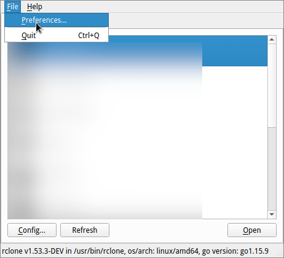
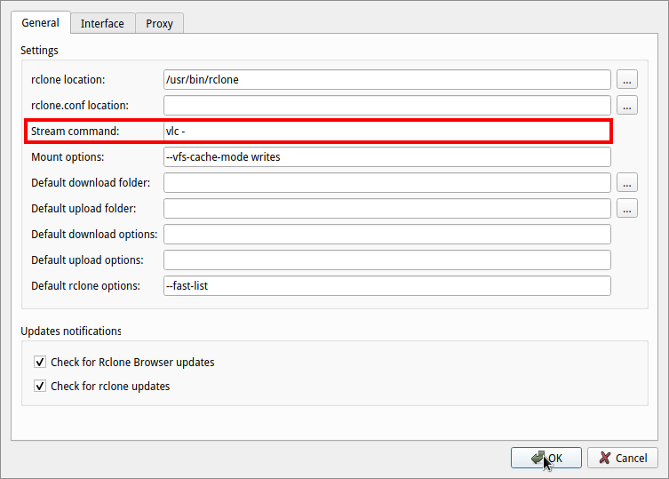
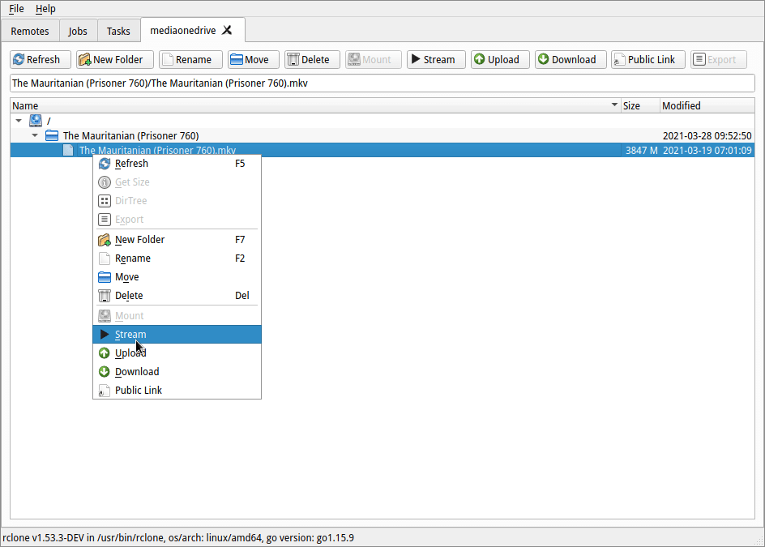
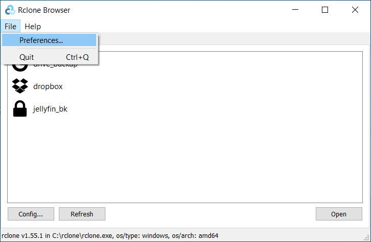
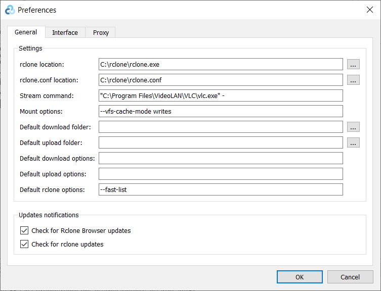
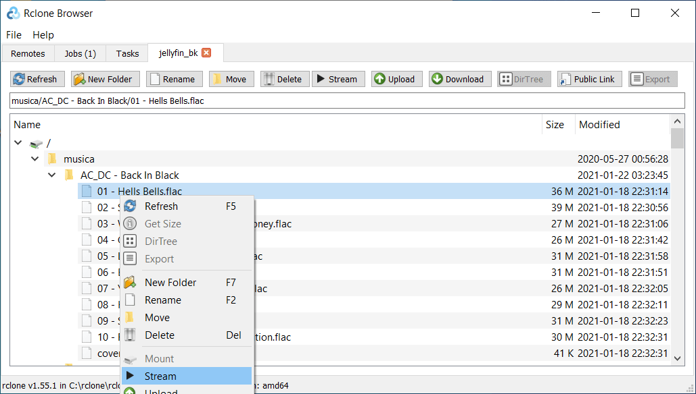
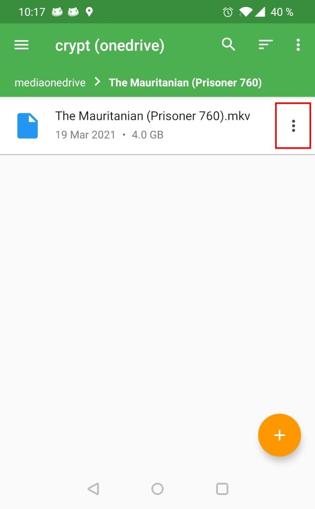
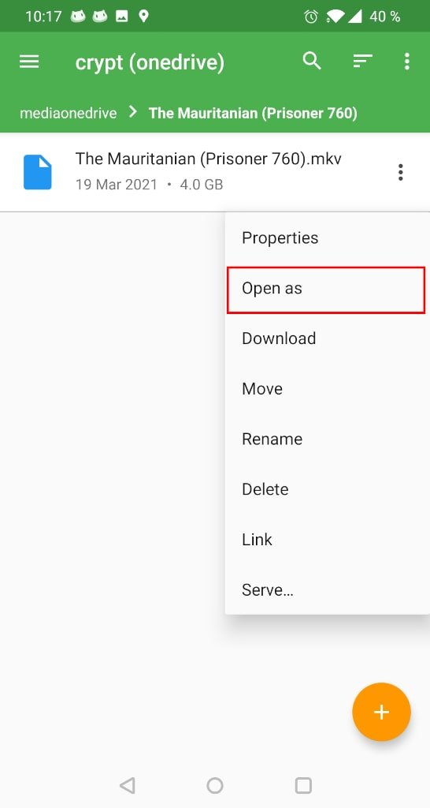
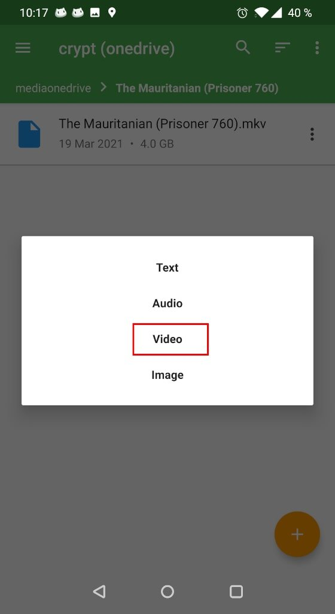
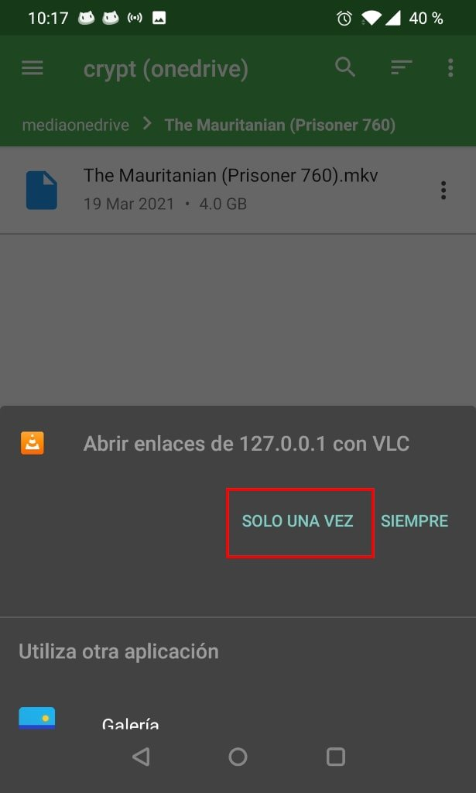

Si tenéis contenido multimedia, como vídeo o audio, almacenado en en una nube pública o privada mediante Rclone lo podéis reproducir en streaming de forma práctica y cómoda mediante Rclone Browser. Para ello tan solo tenéis que acceder a la configuración de Rclone Browser y modificar los siguientes parámetros.<!--more-->

## REPRODUCIR VÍDEO Y AUDIO EN STREAMING CON RCLONE BROWSER EN LINUX

Obviamente el primer requisito es tener instalado Rclone, Rclone Browser y un reproductor de vídeo. En mi caso recomiendo instalar y usar VLC o MPV. Una vez instalados alguno de estos 2 reproductores tienen que acceder dentro de la configuración de Rclone Browser.

Dentro de la configuración de Rclone Browser tendréis que modificar el contenido del campo `Stream command`. Dentro del campo `Stream command` deberéis introducir los siguientes parámetros:

| Reproductor que queremos usar | Stream command a introducir |
| --- | --- |
| VLC | `vlc -` |
| MPV | `mpv -` |

En mi caso uso el reproductor VLC. Por lo tanto la configuración de Rclone Browser queda del siguiente modo:

Una vez tengamos la configuración correcta navegamos dentro del fichero que queramos reproducir. Lo seleccionamos, presionamos el botón derecho del ratón y cuando aparezca el menú contextual clicamos sobre la opción `Stream`. Acto seguido empezará la reproducción del vídeo o audio que hayan seleccionado.

## REPRODUCIR VÍDEO Y AUDIO EN STREAMING CON RCLONE BROWSER EN WINDOWS

El procedimiento para Windows es muy similar al de Linux. Al igual que Linux tienen que tener instalar Rclone, Rclone Browser y un reproductor de vídeo como MPV o VLC. Una vez cumplidos los requisitos previos abren Rclone Browser y acceden a su configuración.

En la configuración tendréis que modificar el contenido del campo `Stream command`. Dentro del campo `Stream command` deberéis introducir la ruta del fichero ejecutable del reproductor de vídeo que queremos usar:

| Reproductor que queremos usar | Stream command a introducir |
| --- | --- |
| VLC | `"C:\Program Files\VideoLAN\VLC\vlc.exe" -` |
| MPV | `"C:\Program Files\mpv\mpv.exe" -` |

**Nota**: Las comillas y guiones son indispensables para que el funcionamiento sea correcto.

**Nota:** No detallo el procedimiento para MPV. El motivo es que MPV no está soportado de forma oficial en Windows. No obstante funciona.

En mi caso uso el reproductor VLC. Por lo tanto la configuración de Rclone Browser queda del siguiente modo:

Una vez realizada la configuración el proceso es fácil. Tan solo tienen que navegar hacia el contenido que quieran reproducir. Una vez encontrado lo seleccionan, presionan el botón derecho del ratón y cuando aparezca el menú contextual clican sobre la opción `Stream`.

## OPCIONES PARA REPRODUCIR VÍDEO EN ANDROID

Si lo desean también es posible reproducir el contenido almacenado mediante Rclone en Android. Para ello necesitan la aplicación RCX. La aplicación se puede instalar accediendo al siguiente [enlace](https://play.google.com/store/apps/details?id=io.github.x0b.rcx&hl=es&gl=US).

Una vez instalada y configurada tendrán que instalar un reproductor de vídeo como VLC en su dispositivo Android. Finalmente tan solo tendrán que navegar dentro de su nube publica o privada. Una vez vean el contenido a reproducir clican sobre los 3 puntos que pueden ver en la captura de pantalla.

Cuando aparezca el submenu clican sobre la opción `Open as`

A continuación seleccionan el tipo de contenido que queremos reproducir. En mi caso es vídeo. Por lo tanto clico sobre la opción `Video`.

Finalmente tan solo tenemos que seleccionar el reproductor de vídeo con el que queremos reproducir el contenido. En mi caso uso VLC.

Una vez realizados todos los pasos empezará la reproducción del vídeo.
