En mi caso reproducir vídeos a través del navegador web me genera problemas de rendimiento. La única solución efectiva para solucionar los problemas de rendimiento ha sido usar VLC para reproducir prácticamente la totalidad de vídeos que encuentro en webs como Youtube, Vimeo, DailyMotion, Twitch, etc. Por esto motivo a continuación detallaré la forma que utilizo para reproducir los vídeos del navegador a VLC.<!--more-->

## ¿POR QUÉ RECOMIENDO USAR VLC PARA REPRODUCIR VÍDEOS QUE ENCONTRAMOS EN LA WEB?

En mi caso ningún navegador se comporta bien con mi vieja tarjeta gráfica Nvidia. Esto hace que en el momento de reproducir un vídeo el consumo de CPU de mi ordenador se dispare al 100%.

Para solucionar este problema he probado muchas soluciones extensiones y configuraciones, pero la única solución que me ha funcionado es reproducir vídeos con VLC.

Con VLC mi tarjeta gráfica funciona de forma adecuada y por lo tanto el consumo de CPU es extremadamente bajo siendo siempre inferior al 10%. Esto me proporciona las siguientes ventajas:

1. Mi ordenador sufre menos para reproducir un vídeo. No se sobrecalienta el procesador y por lo tanto la vida útil del ordenador se incrementa.
2. El consumo de energía y batería para reproducir un vídeo es mucho menor.
3. Además reproduciendo los vídeos con VLC evitaremos la molesta publicidad que nos ofrecen servicios como Youtube.

Por lo tanto en mi caso tengo una buena razón para usar el reproductor VLC.

###### Nota: Como curiosidad, en mi caso el único navegador que tiene un rendimiento adecuado reproduciendo vídeos de Internet es Microsoft Edge.

## ¿CÓMO REPRODUCIR VÍDEOS DEL NAVEGADOR WEB EN VLC?

Reproducir vídeos de Youtube, Vimeo o Dailymotion en VLC es extremadamente fácil.

Tan solo tenemos que abrir el navegador en la URL que contiene el vídeo que queremos visualizar. Seguidamente, tal y como se puede ver en la captura de pantalla, copiamos la URL en la que está el vídeo que queremos visualizar.

[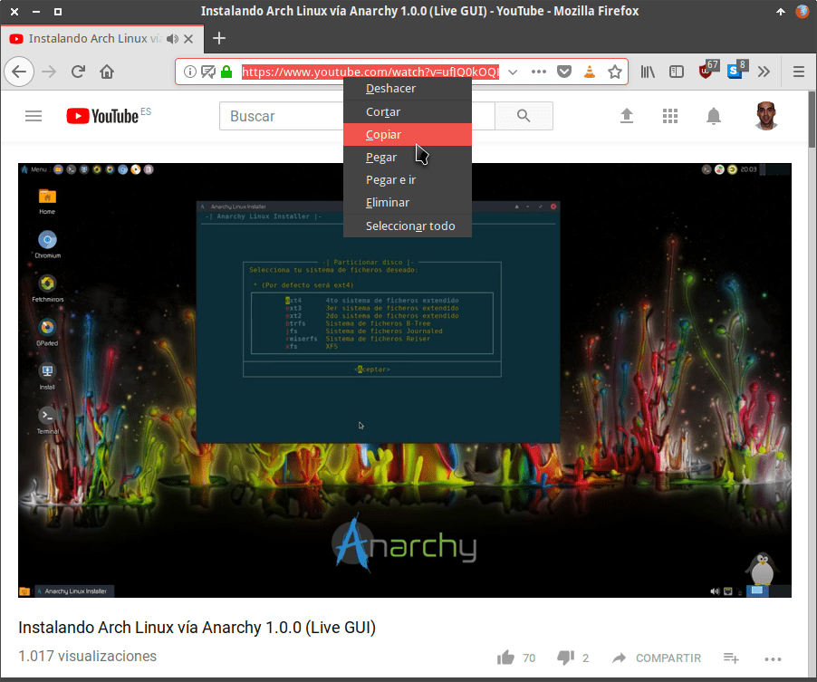](images/copiar-url-pagina-contiene-video.png)

A continuación abrimos VLC y presionamos la combinación de teclas **Ctrl+N**. Seguidamente en la ventana **Abrir medio** pegamos la URL que acabamos de copiar y presionamos el botón **Reproducir**.

[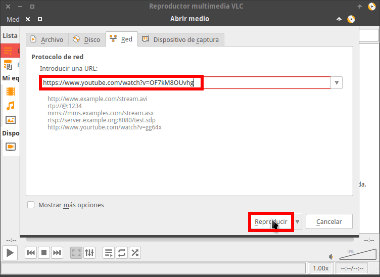](images/reproducir-video-de-youtube-en-VLC.png)

Acto seguido empezará la reproducción del vídeo en VLC.

[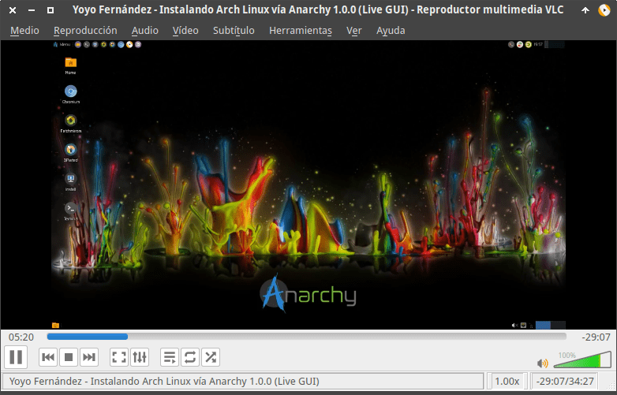](images/visualizando-video-navegador-en-VLC.png)

Si el proceso de este apartado os parece lento o pesado, a continuación veremos como podemos automatizarlo. Una vez automatizado el proceso podremos reproducir vídeos en VLC de forma extremadamente sencilla y rápida.

## ¿CÓMO REPRODUCIR VÍDEOS DEL NAVEGADOR WEB EN VLC CON OPEN IN VLC?

Para facilitar el proceso de reproducción de los vídeos que visualizamos en el navegador en VLC podemos usar la extensión Open in VLC.

Esta extensión está disponible para los navegadores web más usados. La podremos instalar en navegadores como Chrome, Firefox y Opera.

### Instalar la extensión Open in VLC para reproducir vídeos de nuestro navegador con el reproductor VLC

El primer paso para instalar la extensión Open in VLC es acceder a la URL de instalación de la extensión. Las URL para instalar la extensión son las siguientes:

**Opera:** [URL para la instalación de Open in VLC en Opera](https://addons.opera.com/es-419/extensions/details/open-in-vlc-media-player/ "Instalar Open in VLC en Opera")

**Google Chrome:** [Web para la instalación de Open in VLC en Chrome](https://chrome.google.com/webstore/detail/open-in-vlc-media-player/ihpiinojhnfhpdmmacgmpoonphhimkaj "Instalar Open in VLC en Chrome")

**Firefox:** [URL para la instalación de Open in VLC en Firefox](https://addons.mozilla.org/es/firefox/addon/open-in-vlc/ "Instalar Open in VLC en Firefox")

Como en mi caso utilizo Firefox accedo a la siguiente URL:

[https://addons.mozilla.org/es/firefox/addon/open-in-vlc/](https://addons.mozilla.org/es/firefox/addon/open-in-vlc/ "Instalar Open in VLC en Firefox")

Para instalar la extensión clicamos sobre el botón **Agregar a Firefox**:

[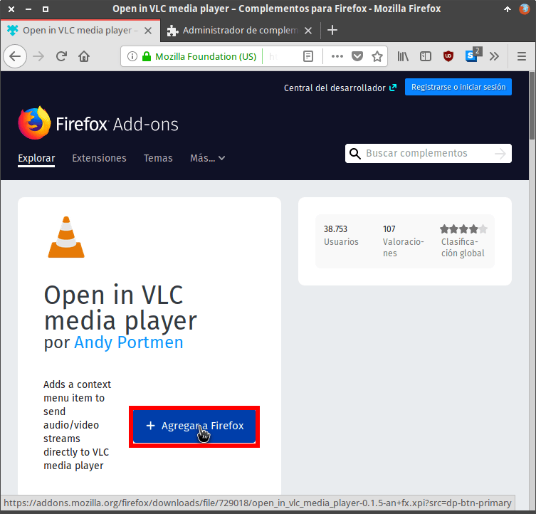](images/instalar-open-in-vlc-firefox.png)

Seguidamente concedemos los permisos necesarios para que Open in VLC pueda funcionar de forma adecuada pulsando sobre el botón **Añadir**.

[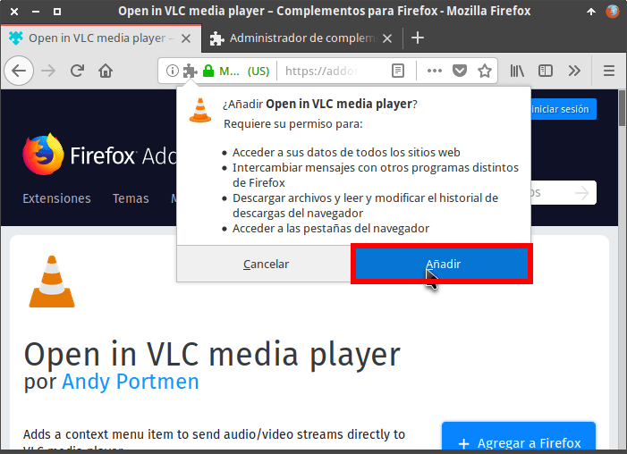](images/conceder-permisos-open-in-vlc.png)

A continuación, accedemos a la página de Youtube y realizamos las siguientes acciones:

1. Posicionamos el puntero del mouse encima del link que clicariamos para acceder dentro del vídeo.
2. Presionamos el botón derecho del mouse y cuando aparezca el menú contextual clicamos encima de la opción **Open in VLC**.

[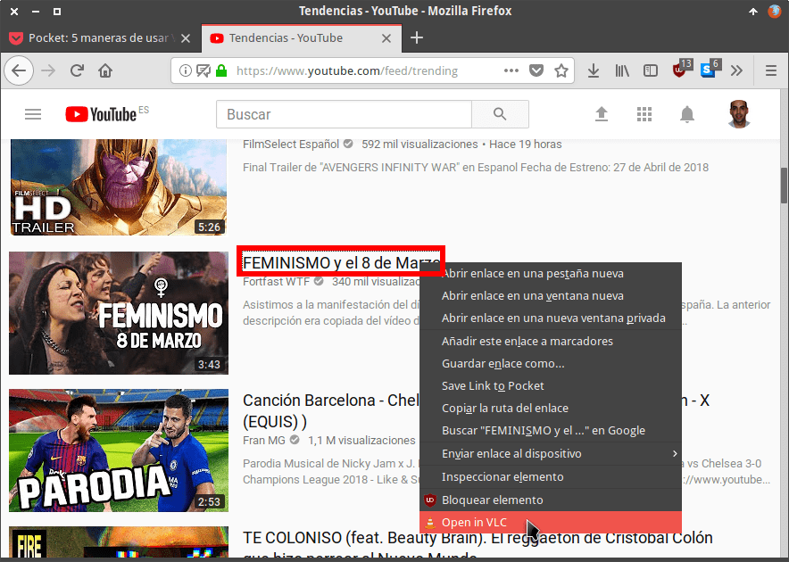](images/intentar-visualizar-video-youtube.png)

Seguidamente aparecerá la siguiente pantalla en la que deberemos continuar con la instalación de la extensión. Para ello, tal y como se puede ver en la captura de pantalla, clicaremos en el link **here**. Acto seguido se descargarán los archivos restantes para finalizar con la instalación de la extensión.

[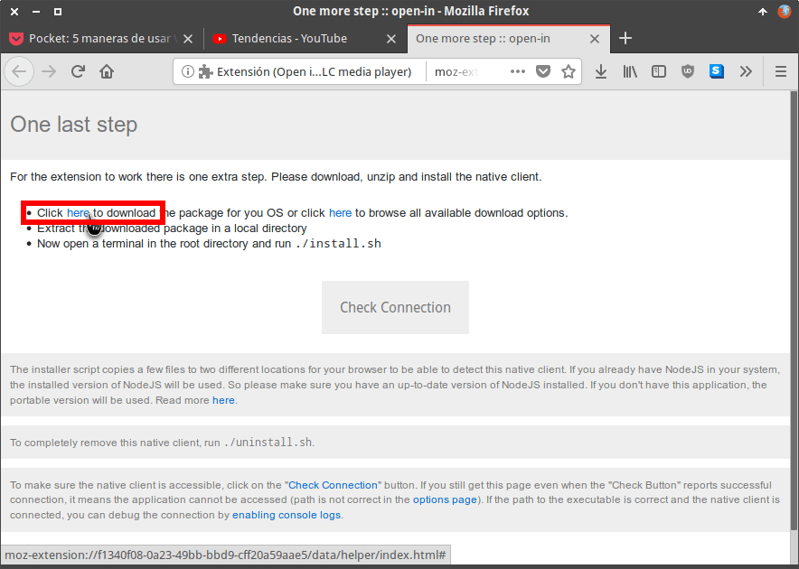](images/descargar-archivos-open-in-vlc.png)

El siguiente paso consiste en descomprimir el archivo que acabamos de descargar dentro de una carpeta que en mi caso nombraré **playonVLC**.

Una vez descomprimido el archivo accedemos dentro de la carpeta. **En el caso que estemos usando el sistema operativo GNU-Linux** finalizaremos la instalación ejecutando el siguiente comando en la terminal:

> ```
> ./install.sh
> ```

El procedimiento descrito se puede ver en la siguiente captura de pantalla.

[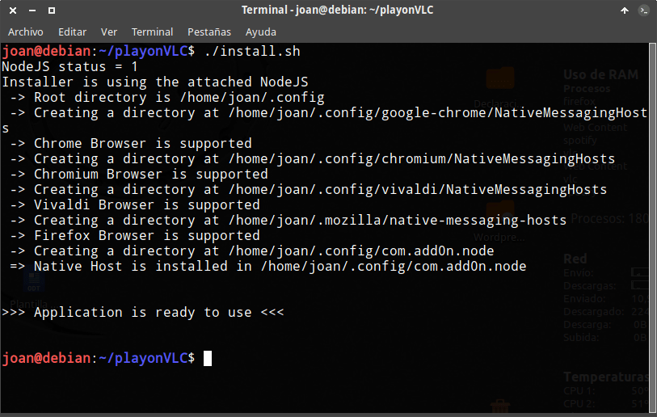](images/extension-open-in-vlc-instalada.png)

**En el caso que estemos usando Microsoft Windows** clicaremos sobre el archivo ejecutable **install.bat** para finalizar la instalación.

[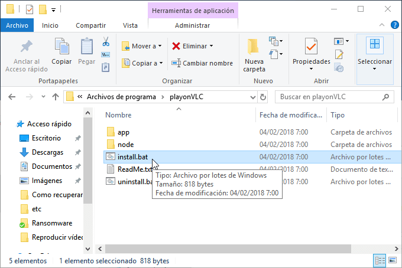](images/instalar-open-in-vlc-windows.png)

###### Nota: Al finalizar la instalación no borréis la carpeta playonVLC. El contenido de esta carpeta será necesario para deshacer la instalación de la extensión.

Con estos simples pasos ya tendremos instalada la extensión Open in VLC.

### Como reproducir vídeos del navegador web en VLC con Open in VLC

A partir de estos momentos visualizar un vídeo en VLC es extremadamente fácil. Tan solo tenemos que ir a la URL que contiene el vídeo. Una vez estemos visualizando el vídeo tan solo tendremos que clicar encima del icono de Open in VLC media player.

[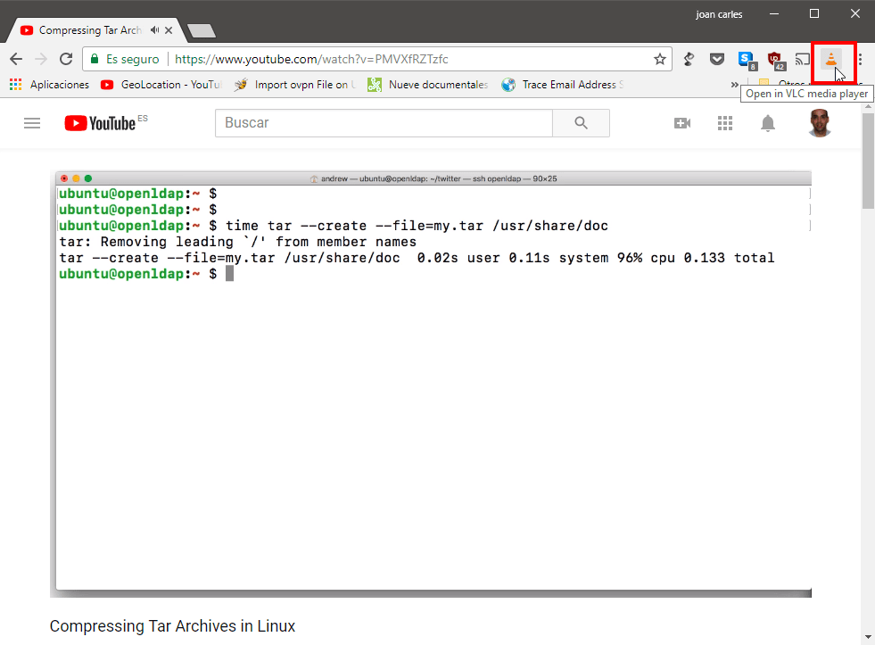](images/ver-video-web-open-in-vlc-chrome.png)

Acto seguido empezará la reproducción del vídeo en VLC.

[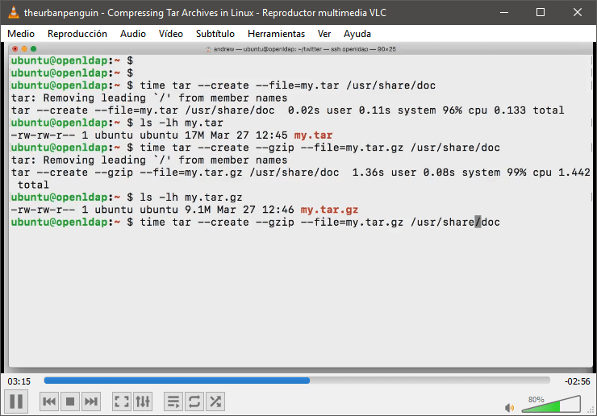](images/viendo-video-navegador-vlc.png)

Aparte de clicar encima del icono disponemos de formas adicionales para **reproducir vídeos del navegador con VLC**. Una de estas formas puede ser la siguiente:

1. Posicionamos el puntero del mouse encima del link que clicaríamos para acceder dentro del vídeo.
2. Presionamos el botón derecho del mouse y cuando aparezca el menú contextual clicamos encima de la opción **Open in VLC**.

[](images/intentar-visualizar-video-youtube.png)

Justo después de clicar empezará la reproducción del vídeo en VLC.

###### Nota: La extensión solo funcionará en las webs que Open in VLC sea capaz de reconocer los enlaces del streaming.

## RESOLUCIÓN DE PROBLEMAS

Existe la posibilidad que la extensión Open in VLC no funcione porque no es capaz de detectar/ubicar el archivo binario para ejecutar VLC. Si es este el caso lo pueden solucionar del siguiente modo:

El primer paso consiste en acceder a la configuración de la extensión Open in VLC.

[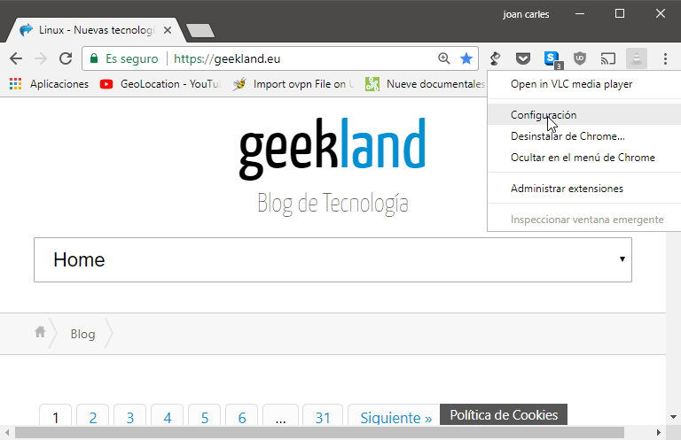](images/acceder-configuracion-open-in-vlc.png)

Justo después de acceder a la configuración verán la ruta preestablecida del archivo binario para iniciar VLC. En mi caso, tal y como se puede ver en la captura de pantalla, la ruta es incorrecta.

[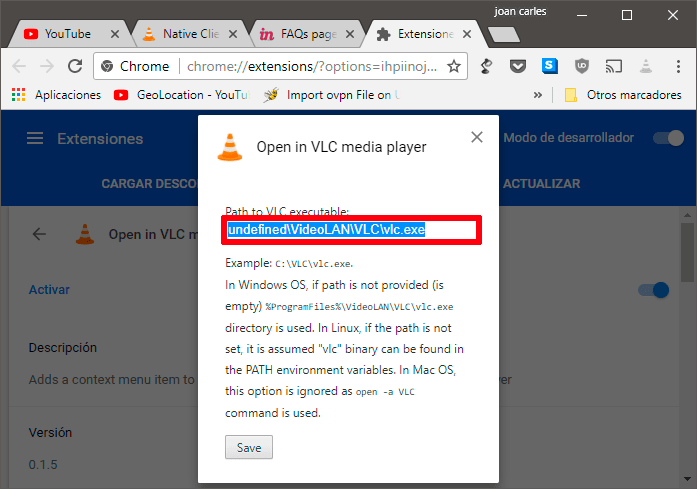](images/ruta-opn-in-vlc-incorrecta.png)

Como es incorrecta introduciré la ruta correcta y acto seguido presionaré el botón **Save**.

[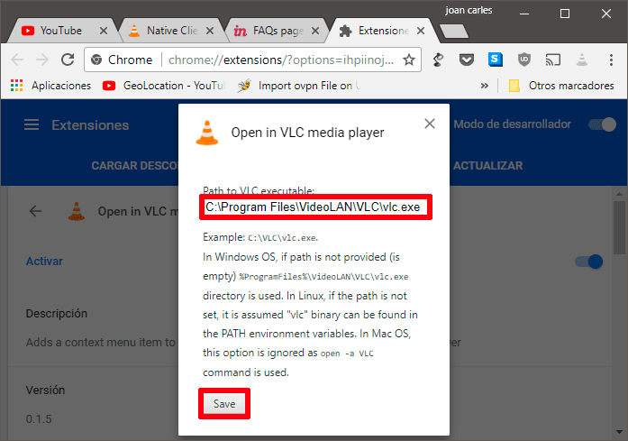](images/ruta-open-in-vlc-correcta.png)

Con estos simples pasos ahora deferían poder reproducir vídeos del navegador web al reproductor VLC sin ningún tipo de problema.

## DESINSTALAR LA EXTENSIÓN OPEN IN VLC

Si algún día precisan desinstalar la extensión Open in VLC deberán deshacer los pasos realizados del siguiente modo.

### Desinstalar Open in VLC en GNU Linux

Mediante la terminal de Linux accederemos dentro de la carpeta playonVLC. Seguidamente ejecutaremos el siguiente comando en la terminal:

> ```
> ./uninstall.sh
> ```

Una vez ejecutado el comando tan solo tendremos que desinstalar la extensión que instalamos en el navegador. De esta forma tan simple podremos deshacer la totalidad de acciones que hemos realizado en el caso que lo necesitemos.

### Desinstalar Open in VLC en Windows

Desinstalar Open in VLC en Windows es tan o más fácil que en Linux. Tan solo tienen que acceder a la carpeta playonVLC que contiene los archivos de instalación. Una vez dentro de la carpeta tan solo tendremos que hacer doble click sobre el archivo:

> ```
> uninstall.bat
> ```

Acto seguido tan solo tendremos que desinstalar la extensión que instalamos en el navegador.
