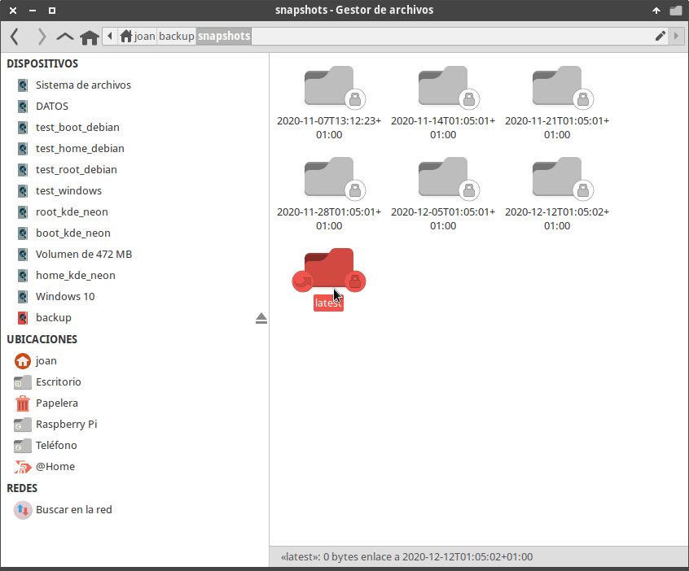
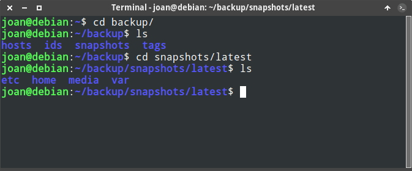
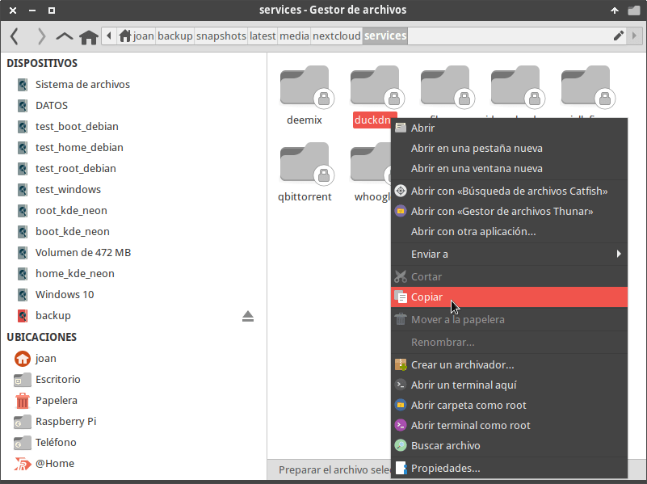
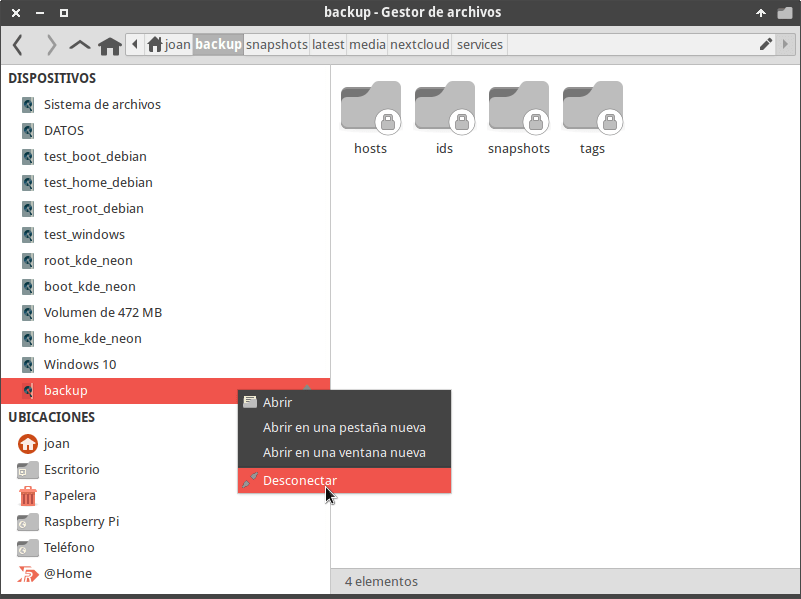
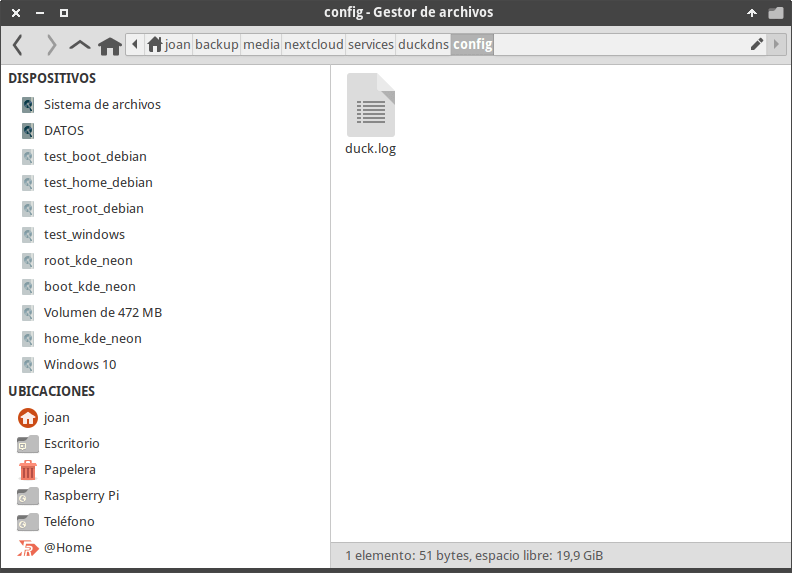

En su día vimos como realizar [copias de seguridad cifradas en Restic](). Hoy veremos un par de métodos para restaurar la copia de seguridad que realizamos en su día. A modo de ejemplo restauraré unos volúmenes de Docker que en su día fueron borrados de forma accidental.<!--more-->

## VISUALIZAR Y RESTAURAR NUESTRA COPIA DE SEGURIDAD DESDE NUESTRO GESTOR DE FICHEROS

En Linux, MacOS y FreeBSD Restic permite montar nuestro backup en un sistema de ficheros. Esto es interesante porque podemos ver y gestionar los ficheros y directorios de la copia de seguridad como si estuvieran en nuestro disco duro. Por lo tanto será sumamente fácil encontrar y restaurar el contenido que tenemos respaldado. Para montar la copia de seguridad en un sistema de archivos procederemos del siguiente modo.

### Montar la copia de seguridad en un sistema de archivos fuse

Inicialmente creamos un directorio llamado `backup` sobre el que montaremos la copia de seguridad. Para ello ejecutaremos los siguientes comandos en la terminal:

> ```shell
> joan@debian:~$ cd
> joan@debian:~$ mkdir backup
> ```

A continuación montaremos el contenido de la copia de seguridad en el directorio que acabamos de crear. Para ello ejecutaremos el siguiente comando:

> ```shell
> joan@debian:~$ restic -r sftp:vps2:/home/ubuntu/rpi4_bk mount ~/backup
> subprocess ssh: Host key fingerprint is SHA256:r5BjrC6MEkFFFhONSeJKiTYQIWJjLiu1AnCUW6XeCaA
> subprocess ssh: +---[ECDSA 256]---+
> subprocess ssh: |%RA=.5           |
> subprocess ssh: |@#*.45..         |
> subprocess ssh: |EA o o+o         |
> subprocess ssh: |* o  o-- |
> subprocess ssh: |=e  .   A        |
> subprocess ssh: |o- + f   .       |
> subprocess ssh: |= 2 - |
> subprocess ssh: |2. .             |
> subprocess ssh: | . .             |
> subprocess ssh: +----[SHA256]-----+
> enter password for repository: 
> repository ee979ca4 opened successfully, password is correct
> ```

Cada una de las partes del comando ejecutado para montar la copia de seguridad significa lo siguiente:

- `restic`: Para llamar al binario de Restic.
- `-r sftp:vps2:/home/ubuntu/rpi4_bk`: Indicamos el repositorio que queremos montar.
- `mount`: Damos la orden que queremos montar la copia de seguridad en un sistema de archivos Fuse.
- `~/backup`: Indicamos la ruta del directorio en que queremos montar la copia de seguridad.

### Restaurar el contenido que tenemos respaldado

Una vez ejecutado el comando, tanto en la terminal como en nuestro gestor de ficheros podremos visualizar el contenido de nuestra copia de seguridad.

[](images/visualizar-contenido-de-la-copia-de-seguridad-montada.png)

[](images/ver-contenido-copia-seguridad-terminal.png)

Podremos navegar de forma fácil y sencilla para observar el contenido de todas y cada una de nuestras copias de seguridad. Si navegando dentro de la copia de seguridad ven un fichero o directorio que quieren restaurar tan solo tienen que copiarlo y pegarlo en la ubicación que lo quieren restaurar. En mi caso tal y como hemos citado al inicio del artículo restauraré uno de los volúmenes de persistencia de Docker.

[](images/restaurar-un-directorio-copia-seguridad.png)

**Nota**: Mediante comandos de terminal como por ejemplo el `cp` también podemos restaurar de forma sencilla los ficheros y directorios de nuestra copia de seguridad.

Por lo tanto Restic permite visualizar muy fácilmente el contenido de las copias de seguridad y además permite realizar una restauración selectiva.

### Desmontar la copia de seguridad

Para desmontar la copia de seguridad tan solo tenemos que ir al emulador de terminal donde montamos la copia de seguridad y presionar la combinación de teclas `Ctrl+c`. Acto seguido la copia de seguridad se desmontará.

> ```shell
> joan@debian:~$ restic -r sftp:vps2:/home/ubuntu/rpi4_bk mount ~/backup
> subprocess ssh: Host key fingerprint is SHA256:r5BjrC6MEkFFFhONSeJKiTYQIWJjLiu1AnCUW6XeCaA
> subprocess ssh: +---[ECDSA 256]---+
> subprocess ssh: |%RA=.5           |
> subprocess ssh: |@#*.45..         |
> subprocess ssh: |EA o o+o         |
> subprocess ssh: |* o  o-- |
> subprocess ssh: |=e  .   A        |
> subprocess ssh: |o- + f   .       |
> subprocess ssh: |= 2 - |
> subprocess ssh: |2. .             |
> subprocess ssh: | . .             |
> subprocess ssh: +----[SHA256]-----+
> enter password for repository: 
> repository ee979ca4 opened successfully, password is correct
> Now serving the repository at /home/joan/backup
> When finished, quit with Ctrl-c or umount the mountpoint.
>   signal interrupt received, cleaning up
> unable to umount (maybe already umounted or still in use?): exit status 1: fusermount: failed to unmount /home/joan/backup: Device or resource bus
> ```

Si lo preferimos también podemos desmontar la copia de seguridad mediante la interfaz gráfica de nuestro gestor de ficheros.

[](images/desmontar-copia-de-seguridad.png)

## RESTAURAR LA COPIA DE SEGURIDAD DESDE NUESTRA TERMINAL

Si no disponemos de entorno gráfico podemos usar exclusivamente la terminal para restaurar nuestra copia de seguridad. Para ello procederemos del siguiente modo.

### Listar las copias de seguridad almacenadas en el repositorio de Restic

Primero tenemos que listar los snapshot presentes en el repositorio de restic. Para ello ejecutaremos el siguiente comando y obtendremos un resultado parecido al siguiente:

> **`joan@debian:~$ restic -r sftp:vps2:/home/ubuntu/rpi4_bk snapshots subprocess ssh: Host key fingerprint is SHA256:r5BjrC6MEkFFFhONSeJKiTYQIWJjLiu1AnCUW6XeCaA subprocess ssh: +---[ECDSA 256]---+ subprocess ssh: |%RA=.5           | subprocess ssh: |@#*.45..         | subprocess ssh: |EA o o+o         | subprocess ssh: |* o  o-- | subprocess ssh: |=e  .   A        | subprocess ssh: |o- + f   .       | subprocess ssh: |= 2 - | subprocess ssh: |2. .             | subprocess ssh: | . .             | subprocess ssh: +----[SHA256]-----+ enter password for repository:  repository ee979ca4 opened successfully, password is correct ID        Time                 Host         Tags        Paths --------------------------------------------------------------------------------------------- fc75a0e8  2020-11-07 13:12:23  raspberrypi  raspberry   /etc/rc.local                                                         /home/pi                                                         /home/restic/restic                                                         /media/nextcloud/podcast                                                         /media/nextcloud/services/deemix                                                         /media/nextcloud/services/duckdns                                                         /media/nextcloud/services/filerun                                                         /media/nextcloud/services/jdownloader                                                         /media/nextcloud/services/jellyfin                                                         /media/nextcloud/services/qbittorrent                                                         /media/nextcloud/services/whoogle                                                         /media/nextcloud/services/wireguard                                                         /media/nextcloud/twitter                                                         /var/spool/cron/crontabs/pi  530c9fe6  2020-11-14 01:05:01  raspberrypi  raspberry   /etc/rc.local                                                         /home/pi                                                         /home/restic/restic                                                         /media/nextcloud/podcast                                                         /media/nextcloud/services/deemix                                                         /media/nextcloud/services/duckdns                                                         /media/nextcloud/services/filerun                                                         /media/nextcloud/services/jdownloader                                                         /media/nextcloud/services/jellyfin                                                         /media/nextcloud/services/qbittorrent                                                         /media/nextcloud/services/whoogle                                                         /media/nextcloud/services/wireguard                                                         /media/nextcloud/twitter                                                         /var/spool/cron/crontabs/pi --------------------------------------------------------------------------------------------- 2 snapshots`**

### Restaurar la copia de seguridad con la ayuda de la terminal

En el apartado anterior hemos obtenido la siguiente información de las copias de seguridad que tenemos almacenadas en el repositorio:

1. El ID o número identificador de cada una de las 2 copias de seguridad que tengo disponible.
2. Cada uno de los directorios respaldados en cada una de las copias de seguridad.

Para restaurar la totalidad de nuestra copia de seguridad en el directorio `~/backup` ejecutaremos el siguiente comando:

> ```shell
> restic -r sftp:vps2:/home/ubuntu/rpi4_bk restore fc75a0e8 --target ~/backup
> ```

Cada uno de los parámetros del comando propuesto tienen el siguiente significado:

- `restic`: Para llamar al binario de Restic.
- `sftp:vps2:/home/ubuntu/rpi4_bk`: Indicamos el repositorio que contiene la copia de seguridad que queremos restaurar. Obviamente en su caso tendrán remplazar esta parte del parámetro.
- `restore`: Damos la orden que queremos restaurar una copia de seguridad o snapshot.
- `fc75a0e8`: Indicamos la copia de seguridad que queremos restaurar. En nuestro caso es la `fc75a0e8`. Otros parámetros que podemos usar para indicar la copia de seguridad que queremos restaurar son `latest`, `--path` y `--host`.
- `--target ~/backup`: Mediante el parámetro `--target` indicamos la ruta en que queremos restaurar la copia de seguridad.

Justo al ejecutar el comando se iniciará la restauración de la copia de seguridad.

### Restaurar únicamente un directorio de la copia de seguridad de Restic

Si únicamente quisiéramos se restaurar el directorio `/media/nextcloud/services/duckdns` en la ubicación `~/backup` deberíamos ejecutar el siguiente comando:

> ```shell
> joan@debian:~$ restic -r sftp:vps2:/home/ubuntu/rpi4_bk restore fc75a0e8 --target ~/backup --include /media/nextcloud/services/duckdns
> subprocess ssh: Host key fingerprint is SHA256:r5BjrC6MEkFFFhONSeJKiTYQIWJjLiu1AnCUW6XeCaA
> subprocess ssh: +---[ECDSA 256]---+
> subprocess ssh: |%RA=.5           |
> subprocess ssh: |@#*.45..         |
> subprocess ssh: |EA o o+o         |
> subprocess ssh: |* o  o-- |
> subprocess ssh: |=e  .   A        |
> subprocess ssh: |o- + f   .       |
> subprocess ssh: |= 2 - |
> subprocess ssh: |2. .             |
> subprocess ssh: | . .             |
> subprocess ssh: +----[SHA256]-----+
> enter password for repository: 
> repository ee979ca4 opened successfully, password is correct
> restoring <Snapshot fc75a0e8 of [/home/pi /media/nextcloud/twitter /media/nextcloud/podcast /media/nextcloud/services/duckdns /media/nextcloud/services/filerun /media/nextcloud/services/jellyfin /media/nextcloud/services/jdownloader /media/nextcloud/services/deemix /media/nextcloud/services/whoogle /media/nextcloud/services/wireguard /media/nextcloud/services/qbittorrent /etc/rc.local /var/spool/cron/crontabs/pi /home/restic/restic] at 2020-11-07 13:12:23.068129862 +0100 CET by restic@raspberrypi> to /home/joan/backup
> ```

**Nota**: El comando ejecutado es igual que el anterior. La única diferencia es que añadimos el parámetro `--include`. El parámetro `--include` sirve para definir los directorios o ficheros que queremos restaurar.

Si ahora nos dirigimos al directorio en que se ha restaurado la copia de seguridad veremos que todo ha funcionado a la perfección:

[](images/copia-de-seguridad-restaurada-correctamente.png)

### Restaurar de varios directorios de forma simultánea

Si quisiéramos restaurar todo el contenido de la copia de seguridad excepto `/media/nextcloud/services/duckdns`, `/media/nextcloud/services/jellyfin` y `/media/nextcloud/services/filerun` ejecutaríamos el siguiente comando:

> ```shell
> joan@debian:~$ restic -r sftp:vps2:/home/ubuntu/rpi4_bk restore fc75a0e8 --target ~/backup --exclude /media/nextcloud/services/duckdns --exclude /media/nextcloud/services/jellyfin --exclude /media/nextcloud/services/filerun
> subprocess ssh: Host key fingerprint is SHA256:r5BjrC6MEkFFFhONSeJKiTYQIWJjLiu1AnCUW6XeCaA
> subprocess ssh: +---[ECDSA 256]---+
> subprocess ssh: |%RA=.5           |
> subprocess ssh: |@#*.45..         |
> subprocess ssh: |EA o o+o         |
> subprocess ssh: |* o  o-- |
> subprocess ssh: |=e  .   A        |
> subprocess ssh: |o- + f   .       |
> subprocess ssh: |= 2 - |
> subprocess ssh: |2. .             |
> subprocess ssh: | . .             |
> subprocess ssh: +----[SHA256]-----+
> enter password for repository: 
> repository ee979ca4 opened successfully, password is correct
> restoring <Snapshot fc75a0e8 of [/home/pi /media/nextcloud/twitter /media/nextcloud/podcast /media/nextcloud/services/duckdns /media/nextcloud/services/filerun /media/nextcloud/services/jellyfin /media/nextcloud/services/jdownloader /media/nextcloud/services/deemix /media/nextcloud/services/whoogle /media/nextcloud/services/wireguard /media/nextcloud/services/qbittorrent /etc/rc.local /var/spool/cron/crontabs/pi /home/restic/restic] at 2020-11-07 13:12:23.068129862 +0100 CET by restic@raspberrypi> to /home/joan/backup
> ```

**Nota**: Los parámetros `--include` y `--exclude` distinguen entre mayúsculas y minúsculas. Si quisiéramos evitar la distinción deberíamos usar los parámetros `--iexclude` y `--iinclude`.

## OTROS COMANDOS ÚTILES PARA RESTAURAR NUESTRA COPIA DE SEGURIDAD CON RESTIC

Si restauramos nuestra copia de seguridad desde la terminal es importante conocer las siguientes opciones que nos ofrece Restic.

### Obtener un listado de la totalidad de directorios y ficheros de la última copia de seguridad

Restic ofrece la posibilidad de visualizar la totalidad de contenido presente en la copia de seguridad que queremos restaurar. Para ver la totalidad de ficheros y directorios que contiene la última copia de seguridad ejecutaremos el siguiente comando.

> ```shell
> joan@debian:~$ restic -r sftp:vps2:/home/ubuntu/rpi4_bk ls latest
> ```

Una vez obtenido el listado se puede estudiar detalladamente los directorios y ficheros que queremos restaurar.

### Buscar un fichero o directorio de nuestra copia de seguridad

Restic también permite listar todas las rutas, directorios y ficheros que contienen una determinada palabra. A modo de ejemplo si queremos buscar todas las rutas, ficheros y directorios de nuestro repositorio que contiene la palabra Wireguard ejecutaremos el siguiente comando:

> ```shell
> joan@debian:~$ restic -r sftp:vps2:/home/ubuntu/rpi4_bk find wireguard
> ```

Si quisiéramos buscar todas las rutas, directorios y ficheros de la copia de seguridad `fc75a0e8` que contienen la palabra `wireguard` sin diferenciar entre mayúsculas y minúsculas ejecutaremos el siguiente comando:

> ```shell
> joan@debian:~$ restic -r sftp:vps2:/home/ubuntu/rpi4_bk find -s fc75a0e8 -i wireguard
> ```

En el caso que usáramos etiquetas para realizar copias de seguridad también podríamos buscar contenido en función de sus etiquetas. Las posibilidades que ofrece Restic son enormes.

## CONCLUSIONES FINALES

El proceso de restauración de una copia de seguridad en Restic es sencillo, rápido y fiable. Además Restic nos permite visualizar el contenido de la copia de seguridad y restaurar únicamente el contenido que nosotros necesitamos. Y para terminar recuerden que es tan importante el proceso de restauración como el de creación de la copia de seguridad. Les recomiendo que de forma periódica realicen comprobaciones pare cerciorarse que las copias de seguridad se pueden restaurar de forma correcta.

#### Fuentes

[https://restic.readthedocs.io/en/latest/050\_restore.html](https://restic.readthedocs.io/en/latest/050_restore.html) [https://www.mankier.com/1/restic-find](https://www.mankier.com/1/restic-find)
