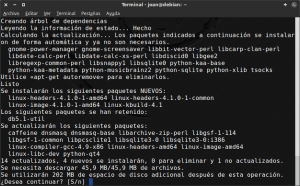
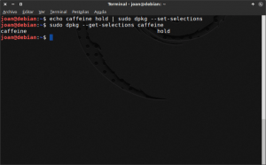
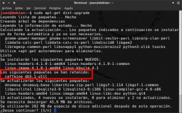
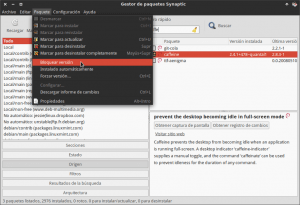
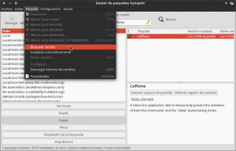

En determinadas circunstancias resulta especialmente útil retener paquetes en Linux para bloquear la actualización de ciertos programas. En mi caso particular, después de actualizar el programa [caffeine]() observé que dejo de funcionar. Para solucionar el problema volví a instalar la versión anterior de caffeine, pero ahora cada vez que intento actualizar el sistema, tal y como se puede ver en la captura de pantalla, me fuerzan a actualizar caffeine.<!--more-->

[](images/Paquete-que-no-quiero-actualizar.png)

Para solucionar este problema la solución es muy simple ya que tan solo tenemos que retener el paquete caffeine. Para retener el paquete caffeine tenemos varias opciones, pero la solución que acostumbro a aplicar y me funciona es la siguiente:

## BLOQUEAR LA ACTUALIZACIÓN DE UN PAQUETE MEDIANTE DPKG

Para retener paquetes mediante la herramienta dpkg tenemos que seguir las siguientes instrucciones:

### Retener paquetes mediante dpkg

El primer y único paso para retener el paquete caffeine es **abrir una terminal y ejecutar el siguiente comando**:

```
sudo echo caffeine hold | sudo dpkg --set-selections
```

###### Nota: La palabra caffeine se deberá sustituir por el nombre del paquete/programa que quieran retener.

###### Nota: La instalación del paquete se bloqueará indiferentemente de si usáis apt-get, aptitude, o la utilidad (front-end) que trae por defecto vuestra distro para actualizar el sistema.

###### Nota: En el caso usar Synaptic, este procedimiento no bloqueará la actualización del paquete. En el caso de usar Synaptic ver el apartado de como retener paquetes con Synaptic.

Justo después de retener el paquete caffeine comprobaremos que realmente esté retenido. Para ello introducimos el siguiente comando en la terminal:

> ```
> sudo dpkg --get-selections caffeine
> ```

###### Nota: La palabra caffeine se deberá sustituir por el nombre del paquete que quieran comprobar su estado.

Tal y como se puede ver en la captura de pantalla, ahora el paquete está en estado hold:

[](images/Estado-del-paquete-caffeine.png)

Por lo tanto el paquete está retenido y de este modo evitaremos que se actualice el paquete en cuestión. Ahora cuando intentemos actualizar el sistema operativo obtendremos el siguiente resultado:

[](images/Paquete-retenido.png)

Tal y como se puede ver en la captura de pantalla, el paquete caffeine no se instalará porque está retenido. Ahora puedo actualizar mi sistema operativo tranquilamente y Caffeine seguirá funcionando sin problemas.

### Desbloquear un paquete retenido mediante dpkg

Si llega el día en que decidimos actualizar caffeine, tan solo tenemos que deshacer los pasos que hemos realizado para retener el paquete caffeine. Para ello tan solo tenemos que **abrir una terminal y ejecutar el siguiente comando:**

> ```
> echo caffeine install | sudo dpkg --set-selections
> ```

###### Nota: La palabra caffeine se deberá sustituir por el nombre del paquete que quieran desbloquear.

Una vez ejecutado este comando ya podremos actualizar el paquete caffeine sin ningún tipo de problema.

## BLOQUEAR LA ACTUALIZACIÓN DE UN PAQUETE CON SYNAPTIC

En el caso que alguien use Synaptic para gestionar sus paquetes y para actualizar el sistema, tienen que tener en cuenta que el procedimiento anterior no les funcionará. Para retener paquetes con Synaptic el procedimiento es el que se muestra a continuación.

###### Nota: Aunque Synaptic es un frond-end de apt-get, no tiene en cuenta los cambios aplicados con dpkg. El motivo de ello es que tienen que usar ficheros de configuración distintos.

### Retener paquetes con Synaptic package manager

Para retener paquetes con Synaptic, tal y como se puede en la captura de pantalla, tenemos que **seleccionar el paquete que queremos retener**, una vez seleccionado el paquete, tal y como se puede ver en la captura de pantalla, **accedemos al menú Paquete** y **clicamos encima de la opción Bloquear Versión**:

[](images/Retener-paquetes-con-synpatic.png)

Después de realizar estos pasos, el paquete ya está retenido y por lo tanto cuando intentemos actualizar nuestro sistema operativo mediante synaptic, el paquete caffeine no se actualizará.

### Desbloquear un paquete retenido con synaptic

Si una vez retenido un paquete deseamos desbloquearlo para actualizarlo, tan solo tenemos que repetir los pasos que acabamos de ver en el apartado anterior. Por lo tanto, tal y como se puede en la captura de pantalla, tenemos que **seleccionar el paquete que queremos desbloquear**, una vez seleccionado el paquete, tal y como se puede ver en la captura de pantalla, **accedemos al menú Paquete y clicamos encima de la opción Bloquear Versión**:

[](images/Desbloquear-paquete-con-Synaptic.png)

Después de realizar estos simples pasos podremos actualizar el paquete Caffeine sin ningún tipo de problema.

Para finalizar solo desear que este sencillo post pueda ayudar a mucha gente que se inicia en el uso del sistema operativo GNU-Linux.
