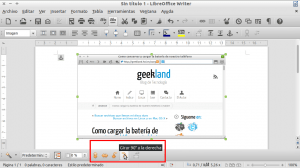
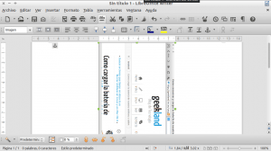
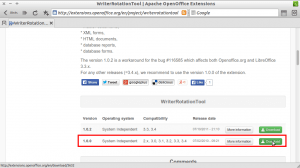
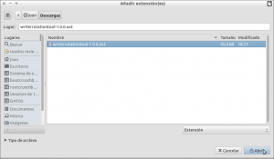
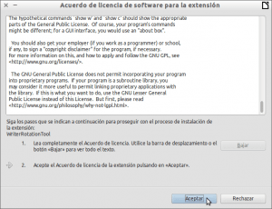
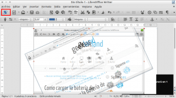
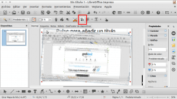
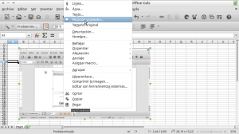
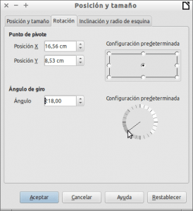
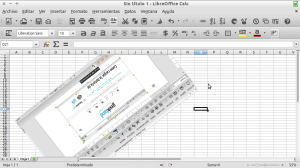

Para iniciar este post, y antes de comentar como rotar imágenes en Libreofffice, voy a comentar a los lectores del blog que la totalidad de los post que redacto lo hago utilizando el programa Writer de Libreoffice.<!--more-->

Mi opinión sobre Writer y Libreoffice es excelente y lo digo después de varios años de uso. A día de hoy me da absolutamente igual que Microsoft Office disponga de una [suite ofimática en la nube](https://office.live.com/start/default.aspx "Microsoft office online"), o que Microsoft sacará una versión nativa para Linux. Los motivos para realizar estas afirmación son simples:

1. Libreoffice es software libre mientras que Microsoft Office es software privativo. Personalmente si es posible prefiero usar software libre.
2. Libreoffice me ofrece una estabilidad excelente y me permite realizar el 100% de tareas que acostumbro a realizar en el día a día.
3. Libreoffice con sus sistema de extensiones, es más personalizable que Microsoft Word.
4. Aunque no lo parezca Libreoffice disponible de funcionalidades de las que no dispone Microsoft Word. Algunas de ellas por ejemplo son que libreoffice dispone de una [versión portable](https://www.libreoffice.org/download/portable-versions/ "Link de descarga de la versión portable de Libreoffice") que se puede arrancar desde una memoria USB, soporta más formatos de archivos, soporta más lenguajes de programación para poder realizar macros, permite transformar archivos a pdf sin necesidad de instalar software adicional, etc.

No obstante no quiero profundizar mucho más porque este no es el objetivo de este artículo. El objetivo principal de este artículo mostrar como rotar imágenes en Libreoffice.

## ROTAR IMÁGENES EN WRITER

No hace falta ninguna extensión ni hacer inventos raros para rotar imágenes en Writer. Tan solo **tenemos que insertar una imagen**.

Una vez insertada la imagen tan solo la tenemos que **seleccionar la imagen**. Una vez seleccionada e**n la parte inferior de la pantalla aparecerá el menú de herramientas de Imagen**.

Tal y como se puede ver en la captura de pantalla, **presionamos el botón ****girar 90º a la derecha******. Después de presionar el botón la imagen rotará 90º y quedará de la siguiente forma:

###### Nota: Aparte de la opción girar a la derecha 90º, tenemos disponibles las opciones Girar 90º a la izquierda, Reflejar horizontalmente y Reflejar verticalmente. Por lo tanto Libreoffice puede girar imágenes de forma nativa sin ningún tipo de problema.

**Los más observadores**, y probablemente los mas heavy users de la suite ofimática de Microsoft, **observaran que con lo comentado hasta el momento no se pueden rotar imágenes a 45 grados o a 25 grados** por ejemplo. **Si precisamos rotar imágenes con un ángulo determinado tendremos que instalar la extensión Writer Rotation tool.**

**Para instalar la extensión accedemos al siguiente** [enlace](http://extensions.openoffice.org/en/project/writerrotationtool "Link de descarga de la extensión Writer Rotation Tool"). Una vez dentro, tal y como se puede ver en la captura de pantalla, **descargamos la extensión guardándola en la carpeta de descargas** de nuestra partición home.

###### Nota: La versión de extensión que tenemos que instalar, tal y como se puede ver en la captura de pantalla, es la 1.0.0. Las versiones 1.0.2 y 1.0.3 de momento no son compatibles con Libreoffice.

Una vez descargada la extensión **abrimos Writer**. Seguidamente **accedemos al menú de** ****Herramientas**** y acto seguido **clicamos encima del submenu **Gestor de extensiones****.

Después de presionar en Gestor de extensiones aparecerá la ventana del gestor de extensiones. Tal y como se puede ver en la captura de pantalla, el siguiente paso es **presionar encima del botón**  ****Añadir****.

Al presionar el botón añadir se abrirá la ventana Añadir extensiones. Una vez abierta la ventana deberemos **navegar hacia la ubicación donde descargamos la extensión Writer Rotation tool**. Una vez dentro de la ubicación, tal y como se puede ver en la captura de pantalla, **seleccionaremos la extensión que queremos instalar y presionaremos sobre el botón ****Abrir******:

Justo después de presionar el botón Abrir empezará la instalación de la extensión. Si todo va correctamente aparecerá la siguiente ventana para aceptar la licencia de usuario.

**Presionamos el botón** ****Bajar**** **hasta llegar al final del acuerdo de licencia** y seguidamente, tal y como se puede ver en la captura de pantalla, **presionaremos sobre el botón** ****Aceptar**** y esperaremos un instante.

Después de este instante la extensión ya está instalada. Ahora tan solo tenemos que **reiniciar Writer y el proceso habrá finalizado**.

Después de reiniciar Writer, tal y como se puede ver en la captura de pantalla, veremos que aparece un nuevo icono llamado Rotate.

**Para comprobar que extensión funciona**, lo primero que tenemos que hacer es **clicar encima de la imagen que queremos rotar** para seleccionarla. Una vez seleccionada la imagen, **clicamos encima del nuevo icono Rotate**. Seguidamente **posicionamos el puntero del mouse en cualquiera de los puntos de ancla o nodos de color rojo de la Imagen**. Finalmente **presionamos el botón izquierdo del mouse y simultáneamente movemos el ratón hacia arriba, hacia abajo o hacia los lados para rotar la imagen**.

## ROTAR IMÁGENES EN DRAW

Rotar imágenes en Draw es sumamente fácil. **Una vez abierto Draw e insertada una imagen**, lo único que tenemos que realizar es seguir los siguientes pasos:

1. **Seleccionamos la imagen que queremos rotar**.
2. Seguidamente **clicamos encima del icono Rotate**. El icono Rotate es el que pueden ver en las capturas de pantalla de este apartado dentro del recuadro de color rojo.
3. A continuación **posicionamos el puntero del mouse en cualquiera de los puntos de ancla o nodos de color rojo de la imagen** que habíamos seleccionado previamente.
4. Finalmente **presionamos el botón izquierdo del mouse y simultáneamente movemos el ratón hacia arriba, hacia abajo o hacia los lados** para rotar la imagen. Al mover el ratón la imagen girará.

En la siguiente captura de pantalla se pueden ver reflejadas gran parte de las acciones a realizar para rotar una imagen en Draw.

Además el icono de Rotate, marcado dentro del recuadro de color rojo, ofrece opciones adicionales a la opción girar.

Tal y como se puede ver en la captura de pantalla, el icono rotate nos permitirá realizar operaciones adicionales como por ejemplo reflejar la imagen, distorsionar la imagen, inclinar la imagen, etc.

## ROTAR IMÁGENES EN IMPRESS

El procedimiento ha seguir para rotar imágenes en Impress, es exactamente el mismo que se tiene que seguir para rotar imágenes en Draw. Por lo tanto **una vez abierto Impress e insertada una imagen**, tenemos que seguir los siguientes pasos:

1. **Seleccionamos la imagen que queremos rotar**.
2. Seguidamente **clicamos encima del icono Rotate**. El icono Rotate es el que pueden ver en las capturas de pantalla de este apartado dentro del recuadro de color rojo.
3. A continuación **posicionamos el puntero del mouse en cualquiera de los puntos de ancla o nodos de color rojo de la imagen** que habíamos seleccionado previamente.
4. Finalmente **presionamos el botón izquierdo del mouse y simultáneamente movemos el ratón hacia arriba, hacia abajo o hacia los lados** para rotar la imagen. Al mover el ratón la imagen rotará.

En la siguiente captura de pantalla se pueden ver reflejadas gran parte de las acciones a realizar para rotar una imagen en Impress:

## ROTAR IMÁGENES EN CALC

Finalmente ya solo nos falta explicar como poder rotar imágenes con la hoja de cálculo Calc.

Para rotar imágenes con Cal tenemos que **seleccionar la imagen que queremos rotar**. Una vez seleccionada la imagen, **presionamos el botón derecho del mouse** y aparecerá un menú contextual. Tal y como se puede ver en la captura de pantalla deberemos **seleccionar la opción** ****Posición y tamaño...**** del menú contextual.

Una vez seleccionada esta opción, se nos abrirá la ventana posición y tamaño. En ella, tal y como se puede ver en la captura de pantalla, podemos **indicar** fácilmente **el ángulo de rotación que queremos aplicar a la imagen**.

Una vez seleccionando el ángulo de rotación, que en mi caso es de 218º, tan solo tenemos que **presionar el botón** ****Aceptar****. Después de presionar el botón Aceptar obtendremos el siguiente resultado.

Como se puede ver en la captura de pantalla, la imagen que habíamos seleccionado inicialmente ha girada 218º.

## COMPATIBILIDAD DE LAS EXTENSIONES INSTALADAS

Seguramente algunos lectores de este post habrán observado que estamos instalando una extensión de OpenOffice en Libreoffice. En principio esto no debe generar ningún tipo de problema, ya que la mayoría de extensiones de OpenOffice son compatibles con Libreoffice.

Por lo tanto quien quiera ampliar las funcionalidades de su suite ofimática a través de extensiones, tiene que saber que lo puede hacer tanto con extensiones de LibreOffice, que puede descargar del siguiente link:

[http://extensions.libreoffice.org/extension-center](http://extensions.libreoffice.org/extension-center "Link de descarga para extensiones de Libreoffice")

Como con extensiones de Openoffice que puede descargar del siguiente link:

[http://extensions.openoffice.org/](http://extensions.openoffice.org/ "Link de descarga para extensiones de Openoffice")
