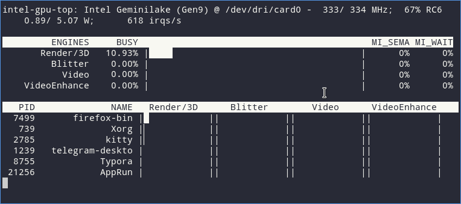
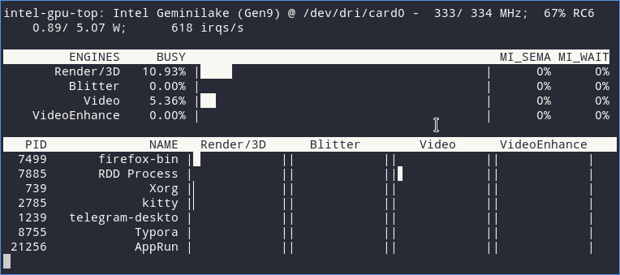

Si usan una tarjeta gráfica Intel y quieren saber si una aplicación que reproduce vídeo está usando la aceleración gráfica por hardware lo pueden hacer con el monitor de recursos intel-gpu-tools. La forma de hacerlo es la siguiente.<!--more-->

## INSTALAR LAS HERRAMIENTAS PARA COMPROBAR SI TENEMOS ACELERACIÓN GRÁFICA POR HARDWARE

Instalaremos las herramientas **vainfo** y **intel-gpu-tools**. La función de cada una de las herramientas es la siguiente:

1. La herramienta **vainfo** muestra información información sobre los códecs soportados por nuestro hardware.
2. La herramienta **intel-gpu-tools** es un monitor de recursos para ver el funcionamiento de nuestra tarjeta gráfica Intel.

Para la instalación de ambas herramientas ejecutaremos el siguiente comando en la terminal:

```shell
❯:~$ sudo apt install vainfo intel-gpu-tools
```

## COMPROBAR LOS CÓDECS QUE SOPORTA NUESTRO HARDWARE REALIZAR ACELERACIÓN POR HARDWARE

Una vez instalada la herramienta **vainfo** podemos ver los códecs que soporta nuestra tarjeta gráfica. Para ello tan solo tenemos que ejecutar el siguiente comando en la terminal:

```shell
❯:~$ vainfo
```

El resultado que podremos ver será parecido al siguiente:

```shell
vainfo: Supported profile and entrypoints
      VAProfileNone                   :	VAEntrypointVideoProc
      VAProfileNone                   :	VAEntrypointStats
      VAProfileMPEG2Simple            :	VAEntrypointVLD
      VAProfileMPEG2Main              :	VAEntrypointVLD
      VAProfileH264Main               :	VAEntrypointVLD
      VAProfileH264Main               :	VAEntrypointEncSlice
      VAProfileH264Main               :	VAEntrypointFEI
      VAProfileH264Main               :	VAEntrypointEncSliceLP
      VAProfileH264High               :	VAEntrypointVLD
      VAProfileH264High               :	VAEntrypointEncSlice
      VAProfileH264High               :	VAEntrypointFEI
      VAProfileH264High               :	VAEntrypointEncSliceLP
      VAProfileVC1Simple              :	VAEntrypointVLD
      VAProfileVC1Main                :	VAEntrypointVLD
      VAProfileVC1Advanced            :	VAEntrypointVLD
      VAProfileJPEGBaseline           :	VAEntrypointVLD
      VAProfileJPEGBaseline           :	VAEntrypointEncPicture
      VAProfileH264ConstrainedBaseline:	VAEntrypointVLD
      VAProfileH264ConstrainedBaseline:	VAEntrypointEncSlice
      VAProfileH264ConstrainedBaseline:	VAEntrypointFEI
      VAProfileH264ConstrainedBaseline:	VAEntrypointEncSliceLP
      VAProfileVP8Version0_3          :	VAEntrypointVLD
      VAProfileVP8Version0_3          :	VAEntrypointEncSlice
      VAProfileHEVCMain               :	VAEntrypointVLD
      VAProfileHEVCMain               :	VAEntrypointEncSlice
      VAProfileHEVCMain               :	VAEntrypointFEI
      VAProfileHEVCMain10             :	VAEntrypointVLD
      VAProfileHEVCMain10             :	VAEntrypointEncSlice
      VAProfileVP9Profile0            :	VAEntrypointVLD
      VAProfileVP9Profile2            :	VAEntrypointVLD
```

La forma de leer la salida es la siguiente. Si os fijáis veréis que en la columna de la izquierda aparecen menciones a distintos tipos de códecs como por ejemplo:

1. `H264 (x264)`
2. `HEVC(HEVC/H.265)`
3. `VP9`
4. etc

A la correspondiente columna de la derecha veremos salidas del tipo `VAEntrypointVLD` y `VAEntrypointEnc`. Su significado es el siguiente:

1. `VAEntrypointVLD`.: Capacidad para decodificar mediante hardware.
2. `VAEntrypointEnc*`: Capacidad para codificación mediante hardware.

Por lo tanto si a modo de ejemplo analizamos las siguientes líneas:

```shell
      VAProfileHEVCMain               :	VAEntrypointVLD
      VAProfileHEVCMain               :	VAEntrypointEncSlice
      VAProfileHEVCMain               :	VAEntrypointFEI
```

Llegamos a la conclusión que:

1. Mi tarjeta gráfica Intel tiene la capacidad de decodificar/reproducir ficheros de vídeo con el códec `HEVC(HEVC/H.265)` mediante aceleración por hardware.
2. Mi tarjeta gráfica Intel tiene la capacidad de codificar ficheros de vídeo con el códec `HEVC(HEVC/H.265)` mediante aceleración por hardware.

Si ahora nos fijamos en las siguiente líneas:

```shell
      VAProfileVP9Profile0            :	VAEntrypointVLD
      VAProfileVP9Profile2            :	VAEntrypointVLD
```

Concluimos que mi tarjeta gráfica puede decodificar/reproducir ficheros de vídeo con el códec `VP9` mediante aceleración por hardware, pero no puede codificarlos.

**Nota:** Una solución alternativa a la mencionada en este apartado es identificar su tarjeta gráfica Intel y visitar la siguiente página para [consultar si su hardware](https://en.wikipedia.org/wiki/Intel_Quick_Sync_Video#Hardware_decoding_and_encoding) dispone de aceleración gráfica.

## COMPROBAR SI ESTAMOS USANDO LA ACELERACIÓN GRÁFICA POR HARDWARE

Para comprobar si tenemos aceleración gráfica por hardware tienen que reproducir un vídeo. Por lo tanto les recomiendo que por ejemplo abran el reproductor de vídeo VLC y empiecen a reproducir un vídeo cualquiera. Otra opción, que es la que he usado en mi caso, es abrir el navegador Firefox y empezar a reproducir un vídeo de Youtube.

Acto seguido abriremos una terminal y ejecutaremos el siguiente comando para abrir el monitor de recursos de nuestra tarjeta gráfica Intel:

```shell
❯:~$ sudo intel_gpu_top
```

Justo después de ejecutar el comando verán lo siguiente:



Si observan la salida del comando verán que el parámetro **Video** está al 0%. Esto significa que no se está usando la GPU para decodificar vídeo y por lo tanto el software que estamos usando para la ver el vídeo, que en mi caso es Firefox, no hace uso de la aceleración gráfica por hardware.

En el caso que Firefox estuviera usando la aceleración por hardware verían la siguiente salida:



Ahora **el parámetro Video tiene un consumo del 5,36%**. Este valor es el porcentaje de uso de GPU dedicado a la decodificación por hardware. Esto es un indicativo que estamos usando la GPU para decodificar vídeo.

### Otros parámetros mostrados por el monitor de recursos

El monitor de recursos de GPU intel-gpu-tools proporciona información diversa. Aparte de saber si estamos usando la aceleración por hardware podremos:

1. Analizar los procesos y programas están haciendo uso de la GPU.
2. Ver la potencia que está consumiendo la GPU.
3. Ver la frecuencia de trabajo de la GPU.
4. etc.

## ¿VALE LA PENA USAR LA GPU PARA REPRODUCIR Y CODIFICAR VÍDEO?

Mediante el monitor de recursos de mi equipo he analizado los siguientes parámetros al reproducir un vídeo de Youtube a 1080p con Firefox:

1. Carga media de la CPU al repoducir un vídeo.
2. Temperatura de la CPU del ordenador.
3. Frames perdidos al reproducir un vídeo.

Los resultados obtenidos han sido los siguientes:

|  | **Carga media CPU "uptime 15min"** | **temperatura CPU (ºC)** | **frames perdidos** |
| --- | --- | --- | --- |
| **Sin aceleración gráfica en Firefox** | 0,82 | 57 | 13 |
| **Con aceleración gráfica en Firefox** | 0,73 | 52 | 2 |

Por lo tanto en mi caso usar la aceleración gráfica por hardware mejora el rendimiento de mi equipo. No obstante si ahora reproducimos el mismo vídeo en VLC vemos lo siguiente:

|  | **Carga media CPU "uptime 15min"** | **temperatura CPU (ºC)** |
| --- | --- | --- |
| **con aceleración gráfica en VLC** | 0,45 | 49 |

Las conclusiones a las que podemos llegar mediante el estudio de los resultados son las siguientes:

1. El rendimiento de mi equipo es mejor al reproducir vídeo mediante la aceleración gráfica por hardware.
2. Firefox no usa de forma eficiente la tarjeta gráfica de mi equipo. Un software como VLC saca mayor partido a la tarjeta gráfica de nuestro equipo a la hora de reproducir vídeo. Por este motivo en mi caso [uso VLC y MPV para reproducir los vídeos de youtube y de internet]().

No obstante en vuestro caso la experiencia puede ser diferente y me explico en el siguiente apartado.

## PROBLEMAS QUE PUEDE GENERAR USAR LA GPU PARA REPRODUCIR VÍDEO

En casos puntuales la aceleración gráfica por hardware puede presentar los siguientes problemas y/o inconvenientes:

1. Generar inestabilidad a la hora de reproducir vídeos. Puede darse el caso que el vídeo no se puede reproducir de forma fluida o se vea a trompicones.
2. En el caso que tengan una CPU de última generación la diferencia existente entre usar la aceleración gráfica por hardware y software puede que no sea muy grande. Por lo tanto puede que haya usuarios que prefieran usar la aceleración por software porque ofrece más estabilidad.

No obstante si el funcionamiento es el adecuado la aceleración gráfica por hardware debe aportar los siguientes beneficios.

## VENTAJAS DE DISPONER DE ACELERACIÓN GRÁFICA POR HARDWARE

Alguna de las ventajas que proporcionadas por la aceleración gráfica por GPU a la hora de reproducir vídeo son las siguientes:

1. La CPU del ordenador tendrá menos carga al reproducir un vídeo. Esto será así porque gran parte del trabajo necesario para decodificar el vídeo será realizado por la GPU o tarjeta gráfica. Esta liberación de carga implica que nuestra CPU tendrá más capacidad de procesamiento para realizar otras tareas y por lo tanto el equipo tendrá un mejor desempeño. La mejora de rendimiento se notará especialmente en ordenadores que tengan bajas prestaciones.
2. El consumo de energía será menor ya que la GPU es mucho más eficiente que una CPU a la hora de decodificar y codificar vídeo. Un menor consumo de energía significa menos calentamiento y una mejor duración de la batería de nuestro ordenador.
3. El ordenador se calentará menos. Si el trabajo de renderizado tiene que ser realizado por la CPU el ordenador acosumbra a celntarse y la eficiencia es menor.

#### Fuentes

[https://wiki.debian.org/HardwareVideoAcceleration](https://wiki.debian.org/HardwareVideoAcceleration)
