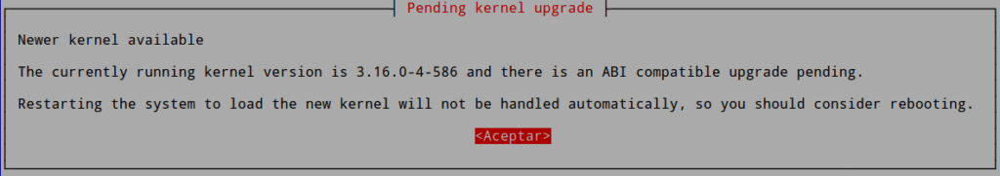
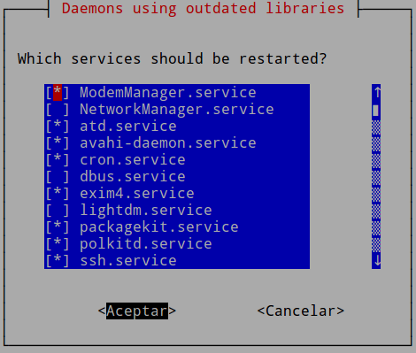
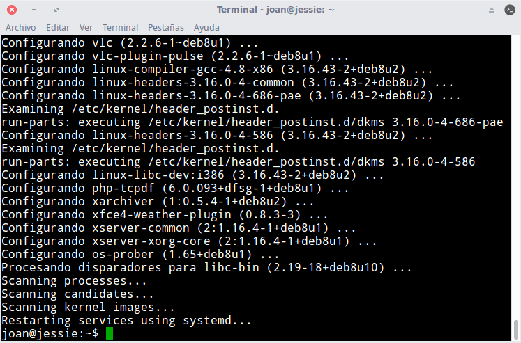

Tras una actualización de paquetes en nuestro sistema operativo puede ser necesario reiniciar algún servicio o proceso para que nuestro sistema operativo o servidor siga funcionando de forma adecuada. Por este motivo en el siguiente artículo aprenderemos a usar el programa needrestart.<!--more-->

## ¿POR QUÉ EN LINUX ES NECESARIO REINICIAR EL EQUIPO, UN SERVICIO O UN PROCESO?

No es del todo cierto que en Linux no sea necesario reiniciar servicios, procesos o el sistema operativo.

En ciertas ocasiones recibiremos actualizaciones de programas y librerías en nuestro sistema operativo.

Una vez actualizado el sistema operativo es probable que en nuestra memoria aún estén cargadas las librerías y procesos antiguos. Por lo tanto en el momento de usar un programa o un servicio existe la posibilidad que estemos usando librerías no actualizadas y procesos viejos.

Esto puede ocasionar los siguientes inconvenientes:

1. Un riesgo de seguridad porque que los procesos y librerías antiguas pueden tener vulnerabilidades de seguridad.
2. Algún programa o servicio puede dejar de funcionar o funcionar de forma incorrecta.

Para evitar lo que acabo de mencionar tenemos 2 herramientas. La primera es **needrestart** y la segunda **checkrestart**. En el transcurso de este artículo veremos como podemos instalar y usar needrestart.

## CONOCER LOS SERVICIOS Y/O PROGRAMAS A REINICIAR TRAS UNA ACTUALIZACIÓN

### ¿En qué sistemas operativos podemos usar needrestart?

Needrestart es una herramienta que puede funcionar en los siguientes gestores de paquetes:

1. Dpkg (apt).
2. RPM.
3. Pacman.

Por lo tanto es capaz de funcionar en prácticamente la totalidad de distros Linux. Algunas de ellas son Debian, Ubuntu, Linux Mint, Fedora o Archlinux.

Instalar needrestart para detectar servicios a reiniciarInstalar needrestart en Debian y en distribuciones que usan paquetería .deb es extremadamente fácil. Tan solo hay que abrir una terminal y ejecutar el siguiente comando:

> ```
> sudo apt-get install needrestart
> ```

Needrestart también está disponible en los repositorios AUR de Archlinux. Para instalarlo en Archlinux hay que ejecutar el siguiente comando en la terminal:

> ```
> yaourt needrestart
> ```

Para instalarlo en Fedora resulta un poco más complicado. En el caso que alguien esté interesado puede seguir las siguientes  [Instrucciones](https://gist.github.com/joemiller/2de728fd8defa4565c34).

### Usar needrestart para detectar procesos y servicios a reiniciar

Una vez instalado el programa se ejecutará de forma automática cada vez que actualicemos nuestro sistema operativo.

Por lo tanto únicamente tenemos que actualizar nuestro sistema operativo de forma habitual ejecutando, por ejemplo, el comando:

> ```
> sudo apt-get dist-upgrade
> ```

Una vez instalados y configurados los nuevos paquetes se ejecutará needrestart. En el caso que se detecten incidencias obtendremos notificaciones del siguiente tipo:

En mi caso, la primera notificación que me ha aparecido es la siguiente:

[](images/reiniciar-por-actualizacion-kernel.png)

El mensaje me informa que para usar la nueva versión del Kernel que se ha instalado es necesario reiniciar el equipo. Para salir de la advertencia presionamos en la opción Aceptar.

Seguidamente me aparece una advertencia de la totalidad de procesos que son necesarios reiniciar:

[](images/advertencia-servicios-a-reiniciar.png)

Si los queremos reiniciar de forma automática tan solo tenemos que presionar encima de la opción Aceptar. En caso que no los queramos reiniciar presionamos en la opción Cancelar. Una vez finalizado el proceso de actualización con apt-get he obtenido los siguientes resultados:

[](images/resultado-final-usando-needrestart.png)

### Usar needrestart de forma manual para detectar procesos y servicios a reiniciar

Si lo precisamos también podemos ejecutar needrestart de forma manual.

Para ello tan solo tenemos que abrir una terminal y ejecutar el siguiente comando:

> ```
> sudo needrestart
> ```

Después de ejecutar el comando se analizarán los programas, procesos, librerías del Kernel y contenedores de Docker, machined o LXC, que son necesarios reiniciar. En mi caso el resultado obtenido al aplicar este comando ha sido el siguiente:

|   joan@jessie:~$ sudo needrestart Scanning processes…  Scanning candidates…  Scanning linux images…  Running kernel seems to be up-to-date. No services need to be restarted. No containers need to be restarted. User sessions running outdated binaries: joan @ session #2: xfce4-session\[20676\] |
| --- |

En este caso recibo una advertencia que un fichero binario está siendo usado sin ser la versión más actual. Por lo tanto, en este caso seria recomendable reiniciar el ordenador para solucionar esta incidencia.

### Otras opciones del comando needrestart

En el ejemplo que acabamos de ver hemos usado las opciones estándar de needrestart. Si lo precisamos podemos ajustar su funcionamiento con diferentes opciones.

Para conocer al detalle la totalidad de opciones que ofrece needrestart tan solo tienen que ejecutar el siguiente comando en la terminal:

> ```
> man needrestart
> ```

De este modo, si por ejemplo queremos restaurar la totalidad de servicios de forma automática deberemos ejecutar el siguiente comando en la terminal:

> ```
> sudo needrestart -r a
> ```

De este modo needrestart no nos preguntará si queremos reiniciar los servicios. Simplemente los reiniciará y listo.

## CONFIGURACIÓN DE NEEDRESTART

La configuración estándar de needrestart es 100% funcional. No obstante el archivo de configuración de needrestart nos permite modificar ciertos parámetros como por ejemplo los siguientes:

1. El modo en que se realiza el reinicio del proceso. Podemos seleccionar entre un reinicio automático, interactivo o que simplemente nos indique los reinicios a realizar para que nosotros los podamos hacer de forma manual. De serie los reinicios están configurados para ser interactivos.
2. Procesos, archivos binarios y servicios que no queremos que se analicen después de la actualización del sistema.
3. El nivel de información proporcionada por la utilidad needrestart.
4. Etc.

Para acceder al fichero de configuración tan solo tienen que ejecutar el siguiente comando en la terminal.

> ```
> sudo nano /etc/needrestart/needrestart.conf
> ```

Cuando se abra el editor de textos podrán modificar los parámetros que consideren oportunos. Tan solo tienen que leer los comentarios del archivo de configuración y a partir de aquí podrán adaptar el funcionamiento de needrestart a sus necesidades.
