Existen muchas personas que compran discos duros de red, dispositivos NAS, o Raspberry Pi para simplemente disponer de un disco duro de red, o para ver series y películas en su televisor, ordenador o tablet. Si la gente quiere usar estos dispositivos me parece perfecto, pero deberían saber que prácticamente la totalidad de routers actuales  disponen de un servidor multimedia DLNA incorporado. Por lo tanto, si en los routers actuales le enchufamos un disco duro, o memoria USB, podremos:<!--more-->

1. Disponer de un disco duro de red.
2. Visualizar y reproducir la totalidad de archivos de vídeo, imagen y música que tenemos en el disco duro de red mediante nuestro smart TV, ordenador o tablet.

En el momento que usamos nuestro Router como servidor multimedia o disco duro de red obtendremos las siguientes ventajas:

1. No tendremos que invertir en dispositivos nuevos para conseguir nuestro objetivo.
2. El consumo energético será menor ya que evitaremos conectar nuevos aparatos a la red eléctrica.

Quizás el procedimiento para poder lanzar el vídeo a través del servidor multimedia de nuestro router no sea tan amigable como en una Raspberry Pi o un NAS. No obstante el vídeo lo podremos ver a la perfección.

## CONECTAR UN DISCO DURO O MEMORIA USB A NUESTRO ROUTER

La gran mayoría de Routers disponen de un conector USB. Por lo tanto el primer paso es localizar este conector y enchufarle un disco duro o memoria USB.

[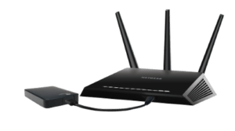](images/conectar-disco-duro-al-router.png)

## ACTIVAR EL SERVIDOR MULTIMEDIA DE NUESTRO ROUTER

A continuación tenemos que acceder a la configuración de nuestro Router. Para ello abrimos nuestro navegador.

En la barra de direcciones tecleamos nuestra puerta de entrada, que en mi caso es 192.168.1.1, y presionamos la tecla Enter.

Seguidamente aparecerá una ventana en la que deberemos ingresar el nombre de usuario y la contraseña de nuestro router. Una vez introducidos presionamos sobre el botón Iniciar Sesión.

[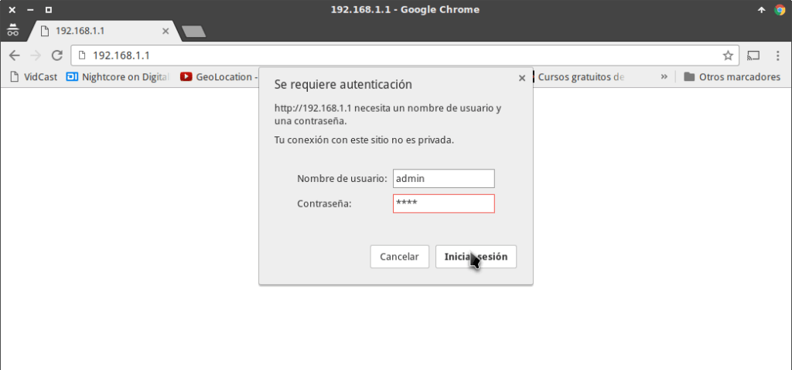](images/acceder-configuracion-router.png)

###### Nota: Por norma general, el nombre de usuario y la contraseña acostumbran a ser admin y admin respectivamente. En el caso que no sea admin admin pueden probar otras combinaciones como por ejemplo 1234 1234, admin 1234, 1234 admin, etc. Si ninguna les funciona llamen a su proveedor de internet.

Una vez dentro de la configuración del router tenemos que activar el servidor multimedia DLNA. Para ello en mi caso tengo que seguir los siguientes pasos:

1. En el menú de navegación de la izquierda clico sobre la opción Advanced Setup.
2. Dentro del apartado Advanced setup clico sobre la opción DLNA.
3. Seguidamente activo el servidor multimedia clicando encima de la casilla Enable on-board digital media server.
4. A continuación, en el apartado Media Library Path aseguramos que la ruta de montaje indicada sea la del disco duro que hemos enchufado al router.
5. Finalmente presionamos encima del botón Apply/Save.

[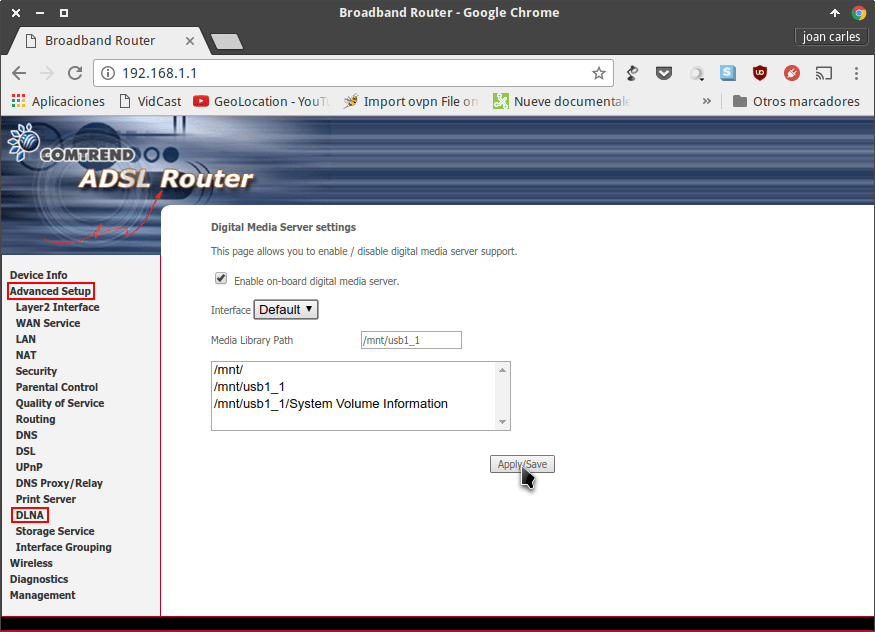](images/activar-servidor-multimedia-router.png)

###### Nota: El procedimiento de este apartado puede ser ligeramente diferente en función del router de que dispongáis.

En estos momentos el servidor multimedia está activado. Por lo tanto ya estamos en condiciones de poder visualizar contenido a través de nuestro servidor multimedia.

## INTRODUCIR CONTENIDO A NUESTRO SERVIDOR MULTIMEDIA

La gran mayoría de routers disponen del protocolo samba activado por defecto. Por lo tanto usaremos Samba para introducir contenido a nuestro servidor multimedia.

En caso de no disponer del protocolo samba existen otras opciones como por ejemplo usar el protocolo ftp. La gran mayoría de routers también disponen de un servidor ftp que por lo general viene desactivado.

### Introducir películas, series y archivos de audio al servidor multimedia en Linux

Los pasos a seguir para introducir contenido en nuestro servidor multimedia son los siguientes:

1. Aseguramos que nuestro ordenador esté conectado a internet a través del router en el que hemos enchufado el disco duro.
2. Abrimos el gestor de archivos de nuestro ordenador personal.
3. A continuación presionamos la combinación de teclas Ctrl+L
4. En la barra de direcciones introducimos el comando smb://192.168.1.1 y presionamos la tecla Enter.

[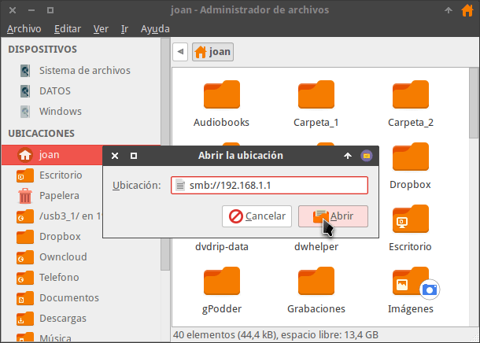](images/entrar-servidor-multimedia-samba.png)

###### Nota: En el comando para conectarme al disco duro utilizo la dirección 192.168.1.1. Esta dirección corresponde a la puerta de entrada de nuestro router. Si vuestra puerta de entrada es diferente deberéis reemplazar la dirección 192.168.1.1 por vuestra puerta de entrada.

Siguiendo estos sencillos pasos nos conectaremos al disco duro de nuestro router. En estos momentos, copiando y pegando podremos introducir el contenido que queramos en nuestro servidor multimedia.

Una vez hayamos introducido el contenido podemos crear un acceso directo de conexión a nuestro router. Para ello tenemos que realizar los siguiente pasos:

1. En el apartado de redes seleccionamos la conexión que hemos establecido.
2. Presionamos el botón derecho del menú.
3. Cuando aparezca el menú contextual clicamos encima de Crear acceso directo.

[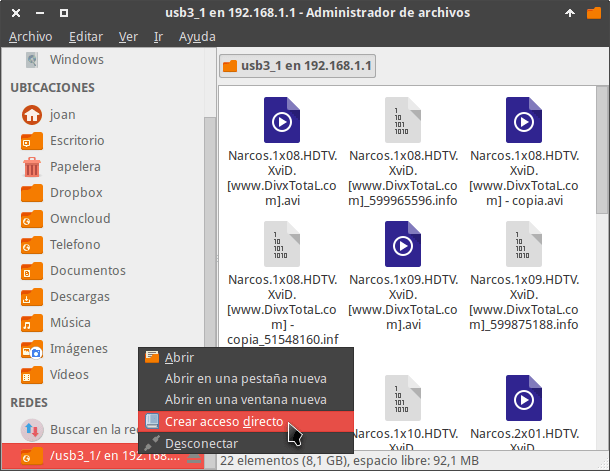](images/crear-acceso-directo-servidor-multimedia.png)

De esta forma tan simple, en el apartado de Ubicaciones se creará un acceso directo a nuestro Router o servidor multimedia. De esta forma la siguiente vez que queramos acceder a nuestro servidor multimedia no será necesario introducir ningún tipo de dirección. Tan solo tendremos que clicar encima del icono del acceso directo.

###### Nota: Mediante iOS o Android también es posible introducir contenido a nuestro servidor multimedia. No obstante en este tutorial no se detalla el procedimiento.

### Introducir películas, series y archivos de audio al servidor multimedia en Windows

Hay varias formas de introducir contenido a nuestro servidor multimedia. En nuestro caso lo haremos mediante el protocolo Samba operando de la siguiente forma.

El primer paso consiste en asegurar que nuestro ordenador sea capaz de detectar el disco duro de nuestro servidor multimedia. Para ello presionamos la combinación de teclas Ctrl+I. Cuando se abra el menú de configuración de Windows clicamos encima de la opción Red e Internet.

[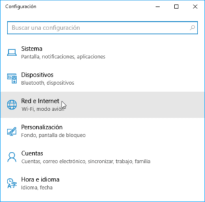](images/configuracion-red-e-internet.png)

A continuación clicamos encima de la opción Opciones de uso Compartido.

[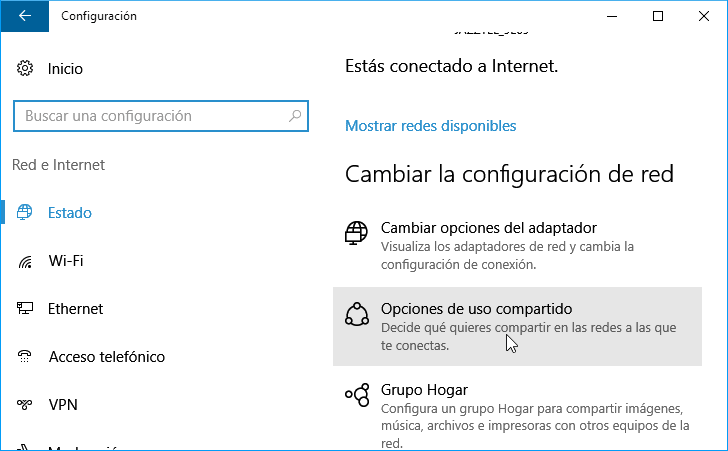](images/entrar-opciones-de-uso-compartido.png)

A continuación comprueben que la totalidad de opciones de uso compartido estén como en la siguiente captura de pantalla. En el caso que tengáis una configuración diferente la modificáis y seguidamente presionáis sobre el botón Guardar cambios.

[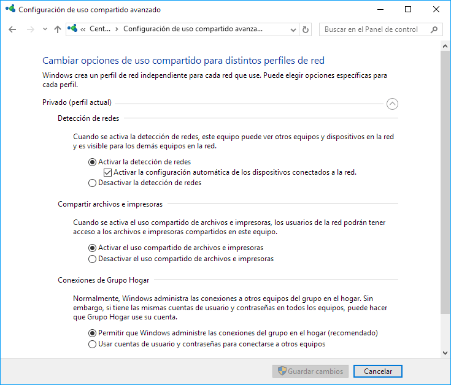](images/mi-configuracion-de-uso-compartido.png)

En estos momentos abrimos el gestor de archivos y en el panel de la izquierda clicamos en el apartado de Red. A continuación en el panel de la derecha clicaremos en la ubicación de red correspondiente a nuestro Router que en mi caso es COMTREND.

[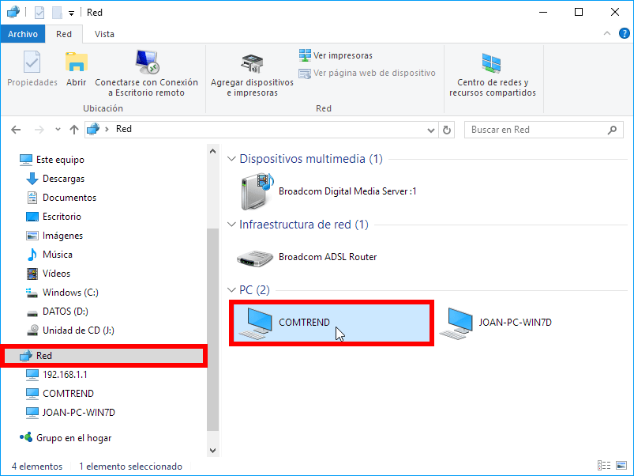](images/acceder-servidor-multimedia-windows.png)

En estos momentos ya tengo pleno acceso al contenido del Router. Por lo tanto copiando, pegando y eliminando seré capaz de introducir y quitar contenido de mi servidor multimedia sin ningún tipo de problema.

[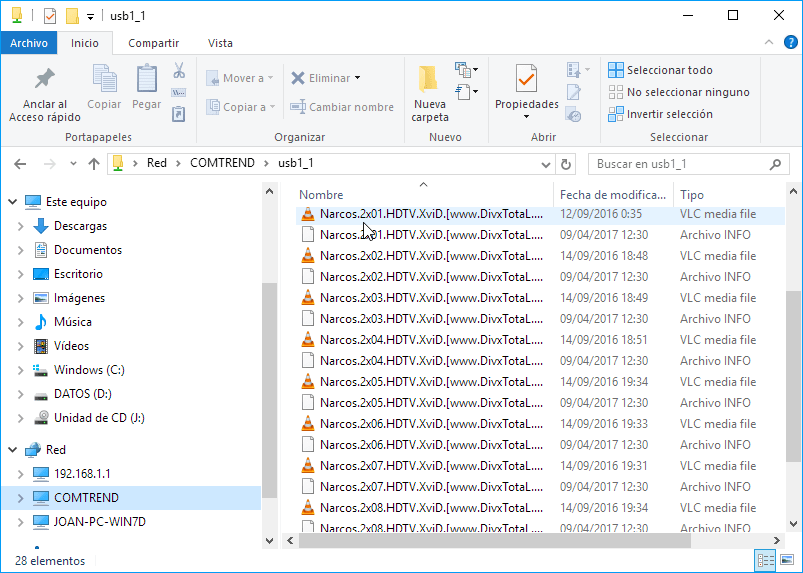](images/introducir-contenido-servidor-windows-1.png)

###### Nota: Mediante iOS o Android también es posible introducir contenido a nuestro servidor multimedia. No obstante en este tutorial no se detalla el procedimiento.

## VER PELÍCULAS Y SERIES A TRAVÉS DE NUESTRA TABLET, ORDENADOR O TELEVISOR

A continuación veremos como podemos visualizar el contenido almacenado en nuestro servidor multimedia.

### Ver Películas y series y escuchar audio del servidor multimedia mediante nuestro televisor

El método de este apartado dependerá mucho de vuestro modelo de SmartTV. En mi caso tengo una Samsung y el proceso es tan simple como el que mostraré a continuación:

En mi mando distancia presiono el botón Source. Justo al presionar el botón veréis que una de las fuentes detectadas es el servidor multimedia de nuestro Router. Mediante el mando a distancia accedemos dentro de nuestro servidor.

[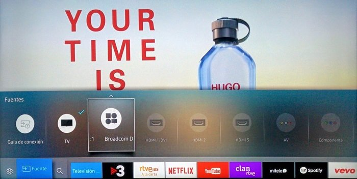](images/acceder-servidor-multimedia-smartv.jpg)

Una vez dentro de nuestro servidor multimedia podremos escuchar y ver la totalidad de audios y vídeos que tenemos almacenados. Para ello tan solo tenemos que seleccionar el archivo de audio o vídeo que queremos visualizar o escuchar y presionar el botón OK de nuestro mando a distancia.

[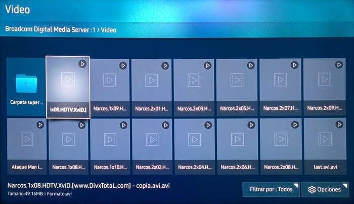](images/ver-videos-desde-nuestro-smartv.jpg)

Acto seguido empezará la reproducción del archivo de audio o de vídeo.

### Ver Películas y series del servidor multimedia en una tablet o teléfono con iOS

En el dispositivo iOS les recomiendo instalar y usar la Aplicación [AVPplayer](https://itunes.apple.com/es/app/avplayerhd/id407976815?mt=8). Aunque se trata de una aplicación de pago, puedo afirmar que es la única aplicación de al Appstore que lee absolutamente todos los formatos de vídeo y de audio.

Una vez instalada la aplicación aseguran que su dispositivo iOS disponga de conexión a Internet a través del Router que hará que servidor multimedia

Seguidamente abren AVplayerHD y clican sobre la opción Wi-Fi Transfer.

[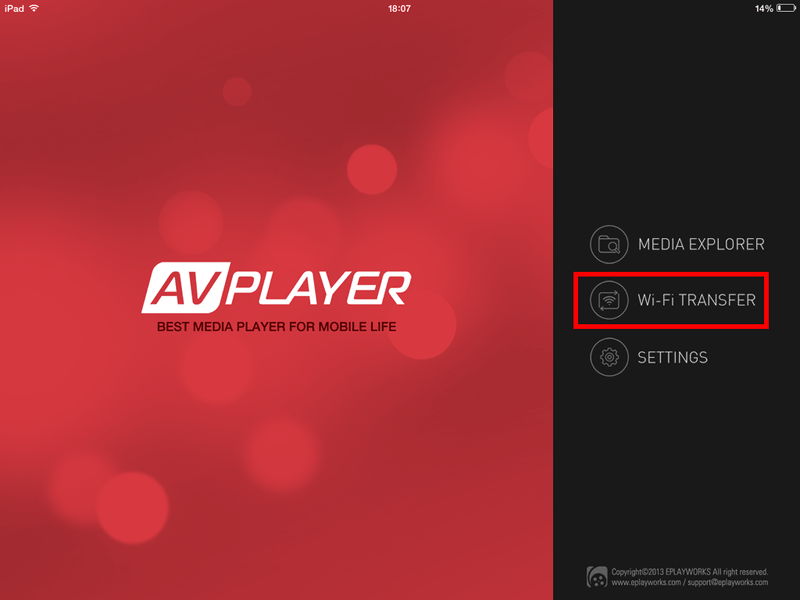](images/acceder-a-wifi-transfer.png)

A continuación clican sobre la opción UpnP/DLNA.

[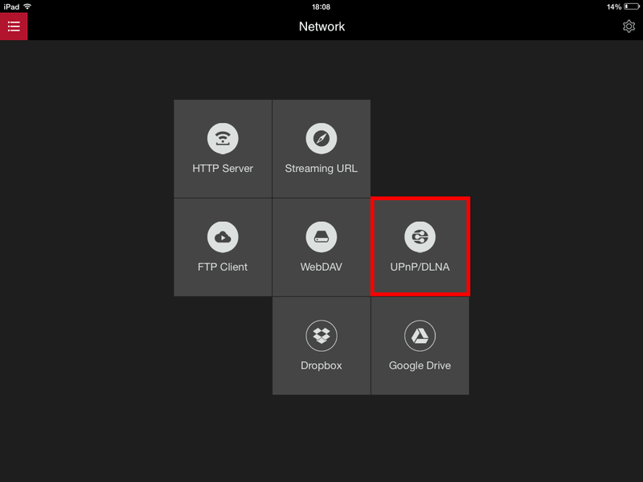](images/detectar-servidores-dlna-en-la-red.png)

Seguidamente accedemos al disco duro de nuestro router clicando encima del servidor multimedia de nuestro router.

[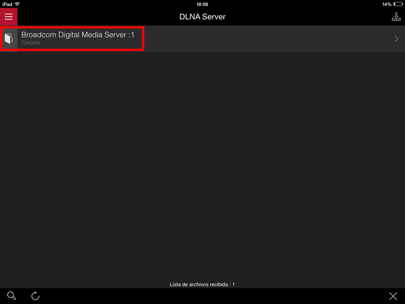](images/seleccionar-servidor-DLNA-que-queremos-acceder.png)

Finalmente tan solo tienen que clicar encima del archivo de vídeo que quieran visualizar y empezará la reproducción.

[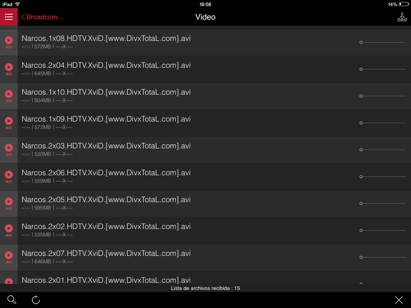](images/reproducir-video-y-audio-servidor-ios.png)

### Ver Películas y series de nuestro servidor multimedia en Android

Para visualizar películas a través de nuestro servidor multimedia en Android les recomiendo usar VLC. Una vez instalado lo abren y siguen las siguientes instrucciones:

Aseguran que el dispositivo Android disponga de conexión a Internet a través del Router que hará que servidor multimedia. Seguidamente clican encima de las 3 barras horizontales de la parte superior izquierda.

[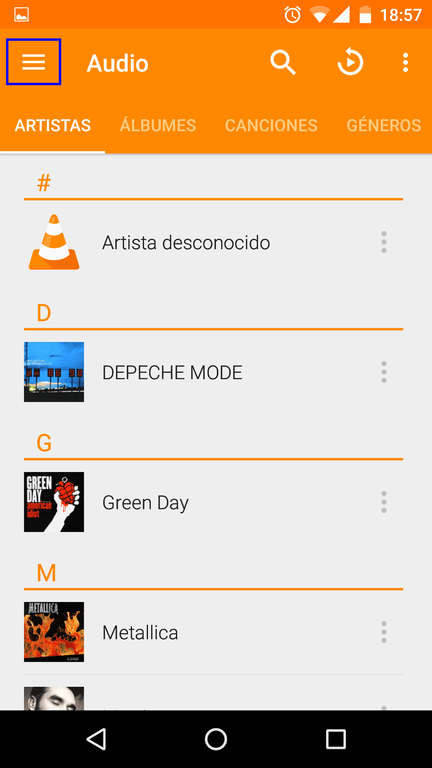](images/acceder-menu-configuracion-VLC-android.png)

Cuando se abra el menú de la aplicación presionan encima de la opción Red local.

[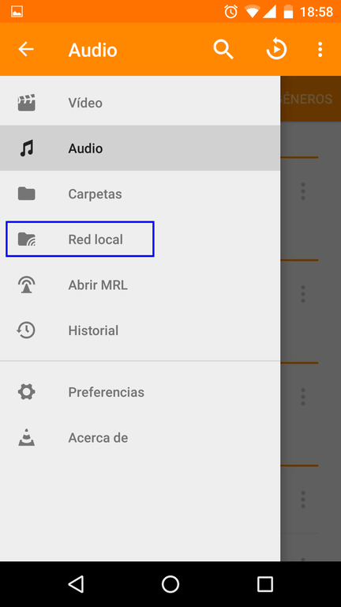](images/detectar-dispositivos-red-local.png)

A continuación les aparecerá la pantalla en la que podrán seleccionar el protocolo que quieren usar para conectarse al router. En mi caso me da la posibilidad de conectarme a través de Samba o DLNA. Podéis elegir cualquiera de los 2, pero en mi caso acostumbro a utilizar Samba.

[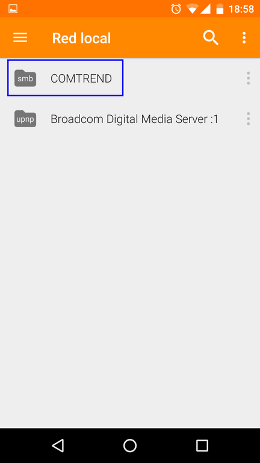](images/acceder-al-servidor-via-samba-android.png)

Finalmente accederéis al disco duro de vuestro router y podréis escuchar o visualizar cualquier archivo de vídeo, audio o imagen que tengáis almacenado.

[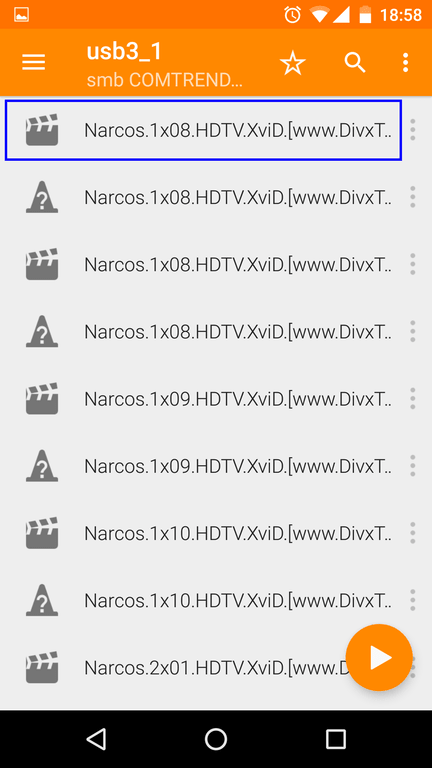](images/consumir-contenido-servidor-Multimedia-android.png)

### Ver Películas y series de nuestro servidor multimedia con Linux

Con el ordenador conectado a internet a través de nuestro router abrimos el gestor de archivos.

Seguidamente clicamos encima del acceso directo del apartado Ubicaciones que creamos en apartados anteriores:

[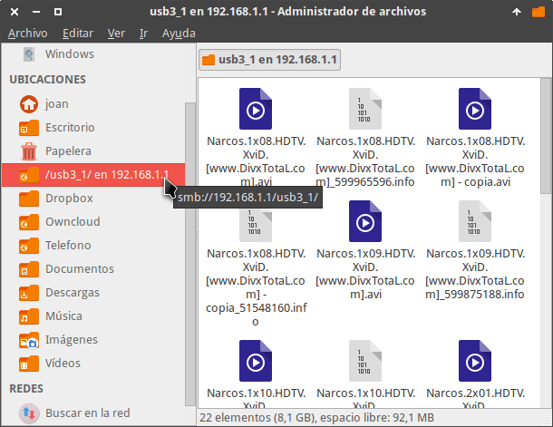](images/introducir-contenido-servidor-multimedia.png)

Finalmente abrimos el archivo de audio o de vídeo que queramos mediante el reproductor de vídeo VLC.

[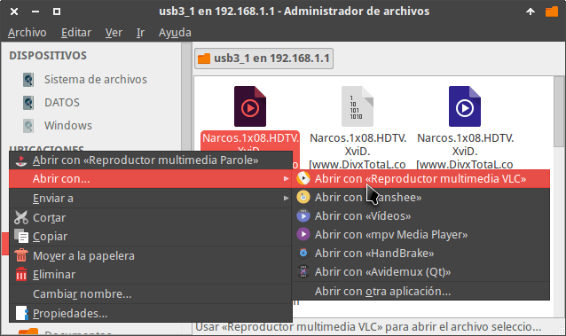](images/ver-videos-con-VLC-en-linux.png)

###### Nota: Recomiendo usar el reproductor de vídeo VLC porque es capaz de reproducir vídeo en red y además lee todos los formatos de vídeo y audio.

### Ver Películas y series de nuestro servidor multimedia a través de Microsoft Windows

Si hemos seguido los pasos mencionados en el apartado “Introducir películas, series y archivos de audio en Windows”, el procedimiento a seguir es muy sencillo.

Primero aseguramos que nuestro ordenador dispone de conexión a Internet a través del router que hace de servidor multimedia.

A continuación abrimos el gestor de archivos y en el panel de la izquierda clicamos en el apartado de Red. A continuación en el panel de la derecha clicaremos en la ubicación de red correspondiente a nuestro Router que en mi caso es COMTREND.

En estos momentos ya tenemos pleno acceso al contenido de nuestro servidor multimedia. Ahora tan solo tenemos que abrir el archivo que queramos mediante el reproductor de vídeo VLC.

[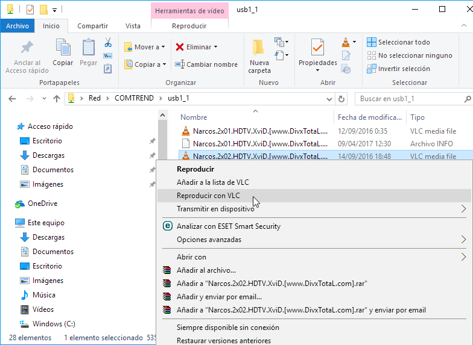](images/reproducir-video-servidor-multimedia-VLC-windows.png)

Acto seguida empezará la reproducción del vídeo.
