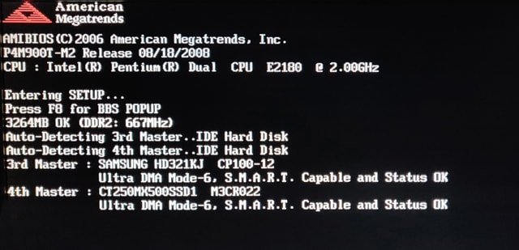
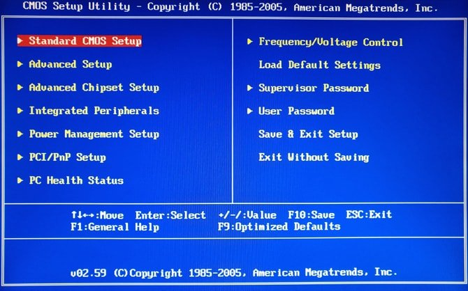
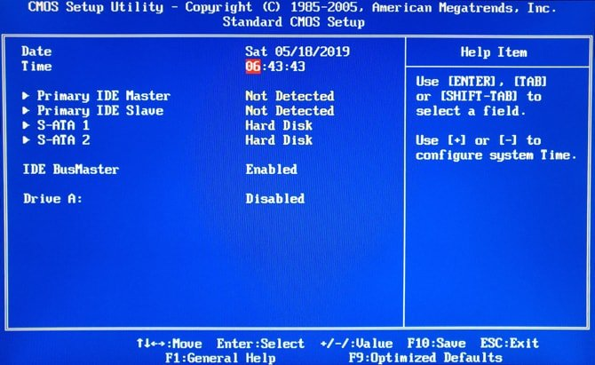
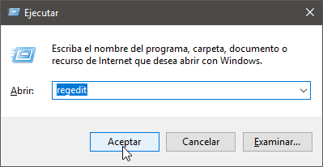
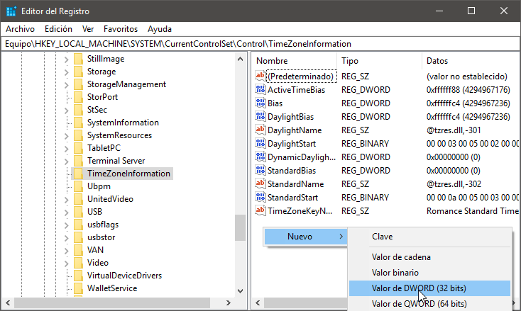
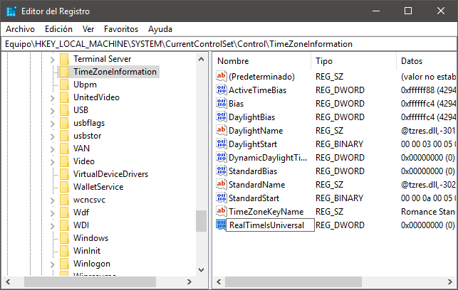
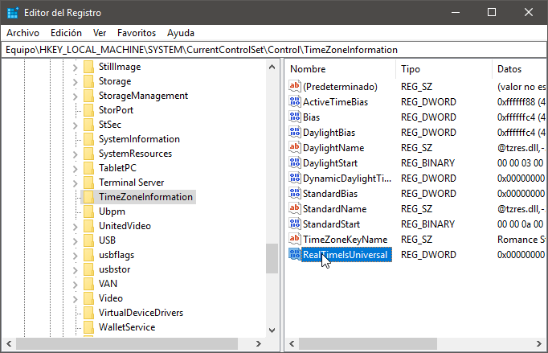
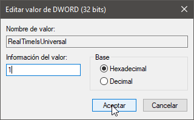
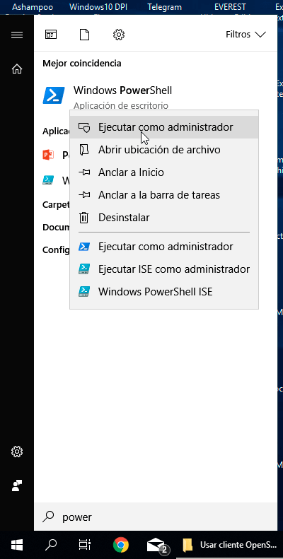

Mi ordenador dispone de un arranque dual con Windows y Linux. El principal problema es que la hora de Windows nunca coincide con la de Linux. En mi caso siempre había un desfaz de exactamente 2 horas. Para solucionar este problema y para sincronizar la hora entre Windows y Linux en un ordenador con dual boot hay que realizar lo siguiente.<!--more-->

## ¿POR QUÉ EXISTEN PROBLEMAS AL SINCRONIZAR LA HORA ENTRE LINUX Y WINDOWS?

Cuando apagamos el ordenador, los sistemas operativos almacenan la hora en el reloj de hardware ubicado en la placa base.

El sistema operativo GNU-Linux almacena la hora en el formato UTC, mientras que Windows la almacena en formato de hora local. Esto ocasiona que al cambiar entre sistemas operativos se produzcan desfases de hora.

Para solucionar este problema y sincronizar la hora entre Windows y Linux existen 2 soluciones:

1. **La primera** de ellas es configurar Windows para que trabaje con la hora UTC.
2. **La segunda** es modificar la configuración de GNU Linux para que trabaje y almacene la hora en formato de hora local.

Haciendo caso omiso a las recomendaciones que veréis en la web prefiero usar la primera opción. Los motivos son los siguientes:

1. La hora se cambiará sin problemas en el momento que cambiemos de horario de invierno a horario de verano y viceversa.
2. La hora se actualizará automáticamente en el caso que cambiemos de zona horaria.
3. Mi sistema operativo principal es Linux. Por lo tanto prefiero no modificar la configuración estándar de Linux.
4. Hace tiempo que estoy usando la opción 1 para sincronizar la hora entre windows y Linux. Nunca me ha generado ningún problema.

Por lo tanto, a continuación realizaremos la siguientes acciones:

1. Aseguraremos que la BIOS o UEFI de nuestro ordenador tenga la hora adecuada.
2. Modificaremos la configuración de Windows para que almacene la hora en el reloj de hardware con el formato UTC.
3. Comprobaremos que la configuración de GNU-Linux es la adecuada para que la hora se sincronice bien entre Windows y Linux

## ASEGURAR QUE LA BIOS O UEFI TIENEN LA HORA CORRECTA

En el apartado anterior hemos visto que existen 2 soluciones para sincronizar la hora entre Linux y Windows. En nuestro caso aplicaremos la solución 1, por lo tanto tenemos que asegurar que la hora que está almacenada en nuestra BIOS o UEFI sea la hora UTC. Para averiguar la hora UTC visiten la siguiente página web:

[https://time.is/es/UTC](https://time.is/es/UTC)

Una vez hayan accedido a la web verán la hora UTC que en mi caso es 21:08:04. Por lo tanto, en mi zona horaria veo que la hora UTC son 2 horas menos respecto al horario local.

[](images/averiguar-hora-utc.png)

Acto seguido accedan a la BIOS o UEFI de su ordenador y aseguren que la hora que estén usando sea la UTC.

El proceso para acceder a la BIOS varía en función del ordenador que usen. En mi caso, para acceder a la BIOS tengo que pulsar la tecla Supr justo en los momentos iniciales de arrancar el ordenador: [](images/acceder-a-la-bios-o-uefi.jpg) Una vez dentro de la BIOS o UEFI accedo al apartado donde se configura el día y la hora. En mi caso el apartado es Standard CMOS Setup.

[](images/acceso-configuracion-hora-bios.jpg)

Una vez dentro del apartado de configuración de la hora comprobaremos que la hora que se muestra sea la UTC. En caso que la hora sea incorrecta tendrán que modificarla y guardar los cambios.

[](images/asegurar-BIOS-use-hora-UTC.jpg)

Una vez guardados los cambios salen de la configuración de la BIOS o UEFI y arrancan el sistema operativo Windows.

## CONFIGURAR WINDOWS PARA QUE TRABAJE CON LA HORA UTC Y DE ESTA FORMA SINCRONIZAR LA HORA

Una vez estemos en Windows modificaremos la configuración para que Windows almacene la hora en formato UTC. De esta forma podremos sincronizar la hora entre Windows y Linux sin ningún tipo de problema. Para conseguir nuestro propósito seguiremos las siguientes instrucciones:

Inicialmente presionamos la combinación de teclas Win+R. Cuando aparezca la ventana Ejecutar escribimos regedit y presionamos el botón Aceptar.

[](images/acceder-registro-windows.png)

Justo después de presionar el botón Aceptar se abrirá el editor de registro de Windows. Seguidamente navegaremos hasta la siguiente ubicación:

> ```
> HKEY_LOCAL_MACHINE -> SYSTEM -> CurrentControlSet -> Control -> TimeZoneInformation
> ```

Una vez dentro de la ruta mencionada posicionen el puntero del ratón en la mitad derecha de la ventana y sigan las siguientes instrucciones:

1. Presionen el botón derecho del ratón.
2. En el momento que aparezca el menú contextual Nuevo, posicionen el puntero del ratón en Nuevo.
3. Cuando aparezcan las opciones del menú Nuevo cliquen sobre la opción Valor de DWORD (32 bits). Acto seguido se creará una entrada con nombre Nuevo valor #1 en el registro de Windows.

[](images/crear-entrada-registro-sistema.png)

Seleccionen la entrada Nuevo valor #1 y presionen la tecla F2. Acto seguido cambien el nombre de Nuevo valor #1 a RealTimeIsUniversal y presionan la tecla Enter.

[](images/crear-el-registro-RealTimeIsUniversal-1.png)

Seguidamente hagan doble clic sobre la entrada RealTimeIsUniversal.

[](images/editar-el-registro-RealTimeIsUniversal.png)

Finalmente asignen el valor 1 y presionen sobre el botón Aceptar.

[](images/activar-hora-utc-windows.png)

Después de realizar estos pasos podremos cambiar de sistema operativo siempre que queramos y la hora se mostrará correctamente.

###### Nota: Para revertir los cambios tan solo tenemos que modificar el valor de la entrada RealTimeIsUniversal. Si el valor de la entrada es 0 Windows volverá a trabajar con la hora local.

## COMPROBAR QUE GNU-LINUX USE LA HORA UTC

Linux almacena y recupera la hora almacenada en el reloj de hardware usando el formato UTC. Por lo tanto, lo único que tenemos que comprobar es que Linux esté bien configurado. Para ello abrimos una terminal y ejecutaremos le siguiente comando:

> ```
> joan@debian:~$ timedatectl
>   Local time: sáb 2019-05-18 10:42:59 CEST
>   Universal time: sáb 2019-05-18 08:42:59 UTC
>   RTC time: sáb 2019-05-18 08:42:59
>   Time zone: Europe/Madrid (CEST, +0200)
>   System clock synchronized: yes
>   NTP service: active
>   RTC in local TZ: no
> ```

El valor del parámetro RTC in local TZ es no. Por lo tanto podemos asegurar que nuestro sistema GNU-Linux tiene configurada la hora UTC y no es necesario modificar absolutamente nada.

En el caso poco probable que el valor de RTC in local TZ: fuera yes tendríamos que ejecutar el siguiente comando en la terminal:

> ```
> sudo timedatectl set-local-rtc 0
> ```

###### Nota: En el caso poco probable que quisieran que Linux trabajará con la hora local tendrían que ejecutar el comando sudo timedatectl set-local-rtc 1

## OTROS PASOS A SEGUIR EN EL CASO QUE LA HORA SIGA SIN SINCRONIZARSE CORRECTAMENTE

En el caso que los pasos seguidos hasta el momento no hayan funcionado pueden intentar lo siguiente.

### Deshabilitar el servicio de hora de Windows

Para deshabilitar el servicio de hora de Windows abran un Powershell como administrador:

[](images/powershell-como-administrador.png)

Acto seguido tan solo tienen que ejecutar el siguiente comando en la línea de comandos:

> ```
> sc config w32time start= disabled
> ```

Una vez ejecutado el comando reinicien ambos sistemas operativos para comprobar que efectivamente la hora se esté sincronizando adecuadamente.

Si alguna vez quisieran reactivar el servicio de hora tendrían que ejecutar lo siguientes comandos:

> ```
> sc config servicename start= demand
> 
> sc config servicename start= auto
> ```

De esta forma tan simple conseguiremos que la hora entre Windows y Linux se sincronice sin problema alguno.
