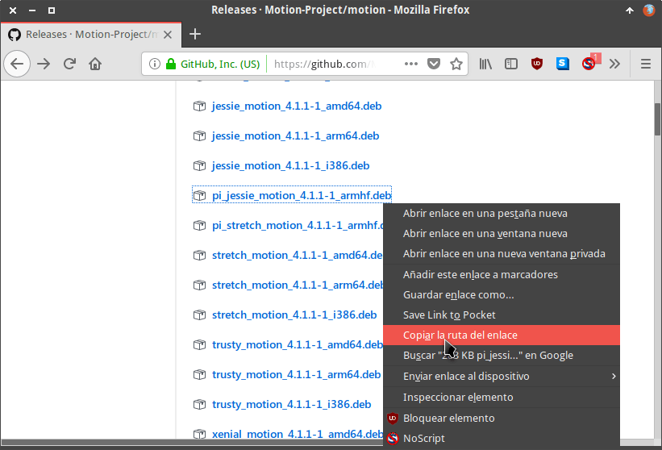
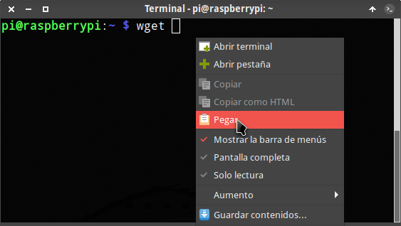
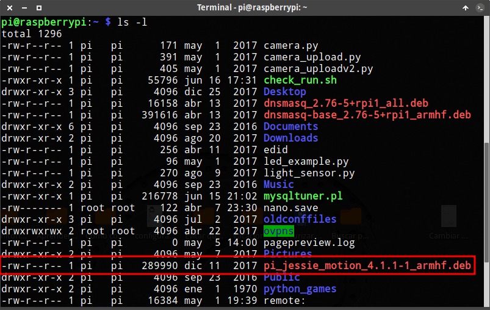
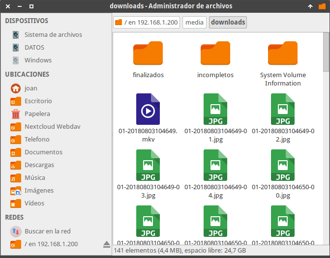
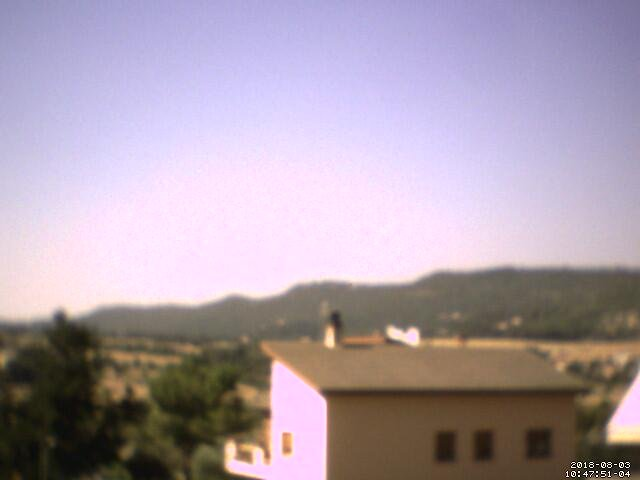
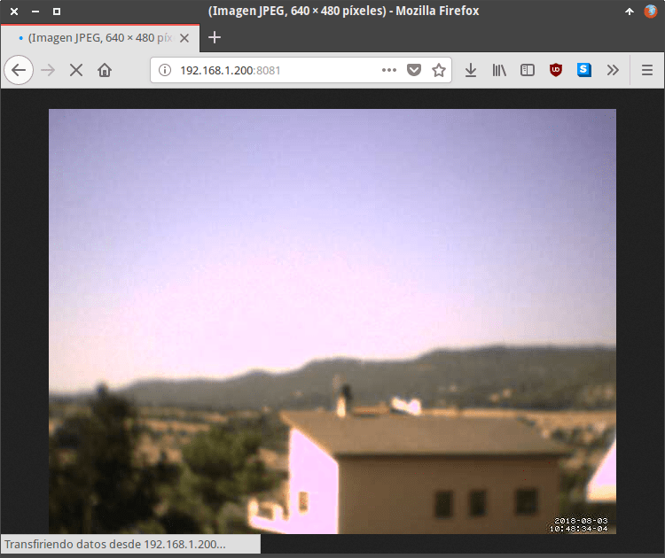
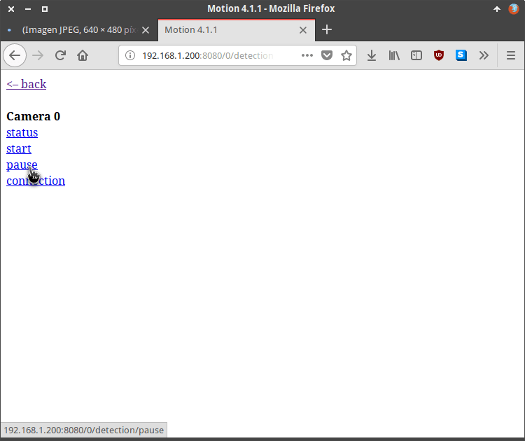

En el siguiente artículo veremos como usar una Raspberry Pi o cualquier equipo con Linux para poder montar un sistema de videovigilancia. Para ello utilizaremos el software Motion y una simple webcam USB.<!--more-->

## ¿QUÉ ES Y COMO FUNCIONA MOTION?

Motion es un software open source escrito en C que realiza las funciones de un sistema de videovigilancia.

Su forma de trabajar es la siguiente:

1. Motion está constantemente monitorizando las imágenes captadas por una o varias cámaras.
2. Si entre las imágenes consecutivas captadas por una de las cámaras no hay absolutamente ninguna diferencia, Motion no realizará ninguna acción.
3. Si entre imágenes consecutivas se observan variaciones importantes, la cámara empezará a tomar fotografías y a grabar vídeo hasta que la diferencia entre imágenes consecutivas se vuelve a estabilizar.

Por lo tanto, en el momento que una persona entre dentro del perímetro de vigilancia de una cámara, Motion empezará a capturar imágenes y grabará un vídeo. De esta forma podremos detectar e identificar la persona que ha vulnerado el perímetro de seguridad.

## FUNCIONES ADICIONALES PROPORCIONADAS POR MOTION

Podemos usar Motion como un sistema de videovigilancia, pero aparte ofrece otras funcionalidades como por ejemplo las siguientes:

1. Realizar timelapse.
2. Capturar imágenes de forma periódica.

A lo largo del artículo verán las opciones de configuración a usar para poder realizar un timelapse o para capturar imágenes.

## REQUISITOS NECESARIOS PARA MONTAR EL SISTEMA DE VIDEOVIGILANCIA

Los requisitos para montar un sistema de videovigilancia siguiendo las instrucciones de este tutorial son los siguientes:

1. Disponer de una Raspberry Pi o cualquier ordenador con el sistema operativo GNU-Linux.
2. La distribución GNU-Linux que utilicen tiene que usar paquetería .deb.
3. Como mínimo deben disponer de una Webcam USB. La webcam tiene que ser compatible con el sistema operativo GNU-Linux que están usando.

Si cumplen con los requisitos mencionados pueden seguir los sencillos pasos que verán a continuación.

## COMPROBAR LA COMPATIBILIDAD DE LA CÁMARA CON EL SISTEMA OPERATIVO

Enchufamos una webcam USB a la Raspberry Pi o a nuestro ordenador con el sistema operativo GNU-Linux. Acto seguido ejecutamos el siguiente comando en la terminal:

> ```
> lsusb
> ```

En mi caso la salida del comando es la siguiente:

|   Bus 001 Device 006: ID 0c45:627b Microdia PC Camera (SN9C201 + OV7660) Bus 001 Device 004: ID 0930:6544 Toshiba Corp. Kingston DataTraveler 2.0 Stick (2GB) Bus 001 Device 003: ID 0424:ec00 Standard Microsystems Corp. SMSC9512/9514 Fast Ethernet Adapter Bus 001 Device 002: ID 0424:9514 Standard Microsystems Corp. Bus 001 Device 001: ID 1d6b:0002 Linux Foundation 2.0 root hub   |
| --- |

Observando los resultados de la salida puedo afirmar con total seguridad que mi webcam ha sido detectada. En el caso que no sea detectada es muy posible que su webcam no sea compatible con el sistema operativo Linux que están usando.

En el caso que tengan que comprar una webcam para usar Motion en una Raspberry Pi les recomiendo que visiten el siguiente enlace:

[https://elinux.org/RPi\_USB\_Webcams](https://elinux.org/RPi_USB_Webcams "Listado de cámaras web compatibles con las Raspberry Pi")

En el enlace encontrarán algunas de las webcam que son compatibles con el sistema operativo Raspbian. Si compran una de las webcam de la lista motion debería funciona sin problema alguno.

## INSTALAR EL SISTEMA DE VIDEOVIGILANCIA MOTION

Existen varias opciones para instalar el software Motion. La primera de ellas es a través de los repositorios de nuestra distribución, mientras que la segunda es a través de los archivos binarios que están en la web del desarrollador.

### Instalar Motion a través de los repositorios de su distribución

Para instalar Motion tan solo tienen que ejecutar el siguiente comando en la terminal:

> ```
> sudo apt-get install motion
> ```

Acto seguido se instalará Motion. De este modo tan sencillo ya tendremos instalado un sistema de videovigilancia.

### Instalar Motion con los binarios de la plataforma del desarrollador

Existe la posibilidad que la versión de Motion de los repositorios no sea la más actual. Para instalar la última versión estable pueden seguir las siguientes instrucciones:

Accedan a la siguiente página web:

[https://github.com/Motion-Project/motion/releases/](https://github.com/Motion-Project/motion/releases/ "Web que aloja los archivos de instalación de Motion")

Una vez dentro de la página web:

1. Posicionen el puntero del ratón sobre la versión de Motion que quieren instalar. Como en mi caso quiero instalar la última versión de Motion en una Raspberry Pi con Debian Jessie posiciono el puntero del ratón sobre la opción pi\_jessie\_motion\_4.1.1-1\_armhf.deb
2. Presionen el botón derecho del ratón.
3. Cuando aparezca el menú contextual cliquen encima de la opción Copiar la ruta del enlace.

[](images/ruta-descarga-motion.png)

Seguidamente nos conectamos vía SSH al dispositivo que queremos instalar Motion. A continuación realizamos lo siguiente:

1. Escribimos wget y dejamos un espacio con la barra espaciadora.
2. Seguidamente presionamos el botón derecho del ratón y cuando aparezca el menú contextual clicamos sobre la opción Pegar.
3. Finalmente presionamos Enter y se descargará el paquete binario para instalar Motion.

[](images/pegar-direccion-descarga-motion.png)

Una vez descargado el binario ejecutamos el siguiente comando para ver el nombre del paquete que acabamos de descargar:

> ```
> ls -l
> ```

Tal y como se puede ver en la captura de pantalla el archivo binario descargado es:

> ```
> pi_jessie_motion_4.1.1-1_armhf.deb
> ```

[](images/nombre-paquete-descargado.png)

Para instalar el paquete que acabamos de descargar instalamos gdebi ejecutando el siguiente comando en la terminal:

> ```
> sudo apt-get install gdebi
> ```

Acto seguido ejecutamos el comando sudo gdebi seguido del nombre del paquete deb que acabamos de descargar.

> ```
> sudo gdebi pi_jessie_motion_4.1.1-1_armhf.deb
> ```

Justo después de ejecutar el comando se nos preguntará si queremos instalar el paquete pi\_jessie\_motion\_4.1.1-1\_armhf.deb. Respondemos que Sí y presionamos Enter. Seguidamente se procederá a la instalación de Motion.

## CONFIGURAR MOTION COMO SISTEMA DE VIDEOVIGILANCIA

Una vez instalado Motion tan solo tenemos que adaptar su configuración a nuestras necesidades.

Antes de modificar la configuración realizaremos una copia de seguridad del archivo de configuración. Para ello ejecutamos el siguiente comando en la terminal:

> ```
> sudo cp /etc/motion/motion.conf /etc/motion/motion.conf.bak
> ```

Una vez realizada la copia de seguridad editaremos el fichero de configuración ejecutando el siguiente comando en la terminal:

> ```
> sudo nano /etc/motion/motion.conf
> ```

Una vez dentro del fichero de configuración podemos modificar los siguientes parámetros:

### Modo de ejecución de Motion

Para configurar el modo en que se inicia Motion deben modificar los siguientes parámetros:

 
|   **Parámetro**   |   **Valor**   |
| --- | --- |
|   daemon   |   on (De esta forma Motion se ejecutará en segundo plano. Elegir la opción off puede ser útil para detectar errores en la ejecución del programa.)   |
|   setup\_mode   |   off (permite activar o desactivar el modo de configuración. Si cambiamos el parámetro a on activaremos el modo de configuración. El modo configuración nos mostrará más información de lo normal para intentar ajustar el funcionamiento de motion. En mi caso recomiendo dejarlo en off. Si queremos arrancar en modo configuración lo podemos hacer ejecutando el comando sudo motion -s)   |

### Configuración de las imágenes capturadas por la cámara

Con los siguientes parámetros del archivo de configuración podemos configurar las imágenes capturadas por nuestra cámara o webcam:

 
|   **Parámetro**   |   **Valor**   |
| --- | --- |
|   rotate   |   0 (Indicar la rotación que queremos aplicar a las imágenes capturadas por la cámara. Posibles valores de este parámetro son 0, 90, 180 o 270.)   |
|   width   |   640 (La anchura de las imágenes en píxeles que capturará nuestra cámara.)   |
|   height   |   480 (La altura de las imágenes en píxeles que capturará nuestra cámara.)   |
|   framerate   |   5 (Las imágenes por segundo que capturará la cámara. Los valores a elegir son entre 2 y 100 capturas por segundo.)   |
|   auto\_brightness   |   Off (Permite ajustar el nivel de brillo de las imágenes y vídeos de forma automática. Está función únicamente debe activarse en cámaras que dispongan de función autobrillo.)   |
|   brightness   |   0 (Indicamos el nivel de brillo que queremos que tengan las imágenes captadas por nuestra cámara. Podemos seleccionar un valor entre 0 y 255.)   |
|   contrast   |   0 (Para indicar el nivel de contraste que queremos que tengan las imágenes captadas por nuestra cámara. Podemos seleccionar un valor entre 0 y 255.)   |
|   saturation   |   0 (Para indicar el nivel de saturación que queremos que tengan las imágenes captadas por nuestra cámara. Podemos seleccionar un valor entre 0 y 255.)   |
|   output\_pictures   |   on (De esta forma no se borran las imágenes capturadas para realizar el vídeo. Por lo tanto al finalizar la captura tendremos un vídeo y la totalidad de imágenes usadas para construir el vídeo.)   |
|   quality   |   75 (Para seleccionar la calidad de las fotografías capturadas. Podemos seleccionar un valor entre 1 y 100 dónde 1 será la peor calidad y 100 la mejor calidad.)   |
|   picture\_type   |   jpeg (Para seleccionar el formato de la foto capturada. Otros formatos posible son ppm o webp.)   |
|   text\_right   |   %Y-%m-%d\\n%T-%q (Definimos el texto que aparecerá en la parte inferior derecha de cada una de las imágenes capturadas. Si queremos queremos que no aparezca ningún texto dejamos la opción en blanco.)   |
|   picture\_filename   |   %v-%Y%m%d%H%M%S-%q (Seleccionar el formato de nombre en que se almacenarán las imágenes capturadas.)   |

### Configuración para la codificación del vídeo generado por Motion

Para configurar los archivos de vídeo que generará Motion podemos modificar los siguientes parámetros del archivo de configuración:

 
|   **Parámetro**   |   **Valor**   |
| --- | --- |
|   ffmpeg\_output\_movies   |   on (Con el valor on usamos ffmpeg para codificar los vídeos. Si especificáramos la opción off no se generaría ningún vídeo.)   |
|   ffmpeg\_bps   |   400000 (Es la tasa de muestreo que se usará en el caso que hayamos seleccionado crear un vídeo con una tasa de muestro constante. En este parámetro podemos usar valores entre 0 y 9999999.)   |
|   ffmpeg\_variable\_bitrate   |   0 (Al seleccionar 0 los vídeos generados dispondrán de una tasa de muestro constante. Si queremos definir una tasa de muestreo variable deberán seleccionar valores entre 2 y 31 donde 31 será la opción que proporciona peor calidad.)   |
|   ffmpeg\_video:codec   |   mkv (Seleccionamos el tipo de contenedor que almacenará nuestro vídeo. En mi caso selecciono mkv pero podemos usar otros contenedores como mpeg4, msmpeg4, swf, flv, ffv1, mov, mp4 y hevc.)   |
|   movie\_filename   |   %v-%Y%m%d%H%M%S (Se define el nombre que tendrán las vídeos capturados por Motion.)   |

### Seleccionar la ubicación donde se guardan las fotos y vídeos de Motion

Para definir donde se guardaran la totalidad de imágenes y vídeos generados por Motion deberán configurar el siguiente parámetro del archivo de configuración.

 
|   **Parámetro**   |   **Valor**   |
| --- | --- |
|   target\_dir   |   /media/downloads (Elegimos la ubicación donde se guardarán las imágenes y vídeos capturados. En mi caso la totalidad de vídeos y fotos se guardarán en la ubicación /media/downloads.)   |

### Visualizar el contenido que están captando las webcam

Motion dispone de un pequeño servidor web en el que podemos visualizar en tiempo real las imágenes que están captando cada una de las webcam. Para configurar el miniservidor web debemos modificar los siguientes parámetros del archivo de configuración:

 
|   **Parámetro**   |   **Valor**   |
| --- | --- |
|   daemonstream\_port   |   8081 (Definimos el puerto en el que estará estuchando el servidor web que mostrará el contenido captado por las cámaras. Podemos elegir cualquier puerto siempre y cuando esté disponible.)   |
|   stream\_quality   |   50 (Seleccionamos la calidad de las imágenes que veremos a través de nuestro navegador web. En este parámetro podemos seleccionar un valor de 1 a 100.)   |
|   stream\_maxrate   |   1 (Definimos las imágenes por segundo que mostrará nuestra cámara web cuando haga funciones de streaming.)   |
|   stream\_localhost   |   off (Seleccionando la opción off cualquier equipo de nuestra red local podrá tener acceso al servidor web que está emitiendo las imágenes captadas por nuestra cámara. Si elegimos la opción on únicamente el equipo que está corriendo Motion podrá acceder a la interfaz web para visualizar el contenido captado por las webcam.)   |
|   stream\_auth\_method   |   2 (Seleccionar el método de autenticación para poder acceder al servidor web y ver lo que está captando nuestra cámara. Otros valores disponibles 0, 1 y 2. En mi caso selecciono el método de autenticación 2 porque es el más seguro. Si no quieren usar ningún método de autenticación seleccionen la opción 0.)   |
|   stream\_authentication   |   usuario:contraseña (Definimos un usuario y contraseña para poder acceder al servidor web. Cada vez que se conecten al servidor web para visualizar el contenido captado por las webcam deberán usar este usuario y contraseña. Este parámetro no tendrá efecto si el valor del parámetro stream\_auth\_method es 0.)   |

### Configurar y controlar Motion a través de una interfaz web

Motion dispone una interfaz web para consultar y modificar los parámetros de configuración. Para poder acceder al panel web de configuración deben modificar los siguientes parámetros del archivo de configuración:

 
|   **Parámetro**   |   **Valor**   |
| --- | --- |
|   webcontrol\_port   |   8080 (Definimos el puerto en el que estará estuchando el servidor web que permitirá consultar y modificar los parámetros de configuración de Motion. Podemos elegir cualquier puerto siempre y cuando esté disponible.)   |
|   webcontrol\_localhost   |   off (Seleccionando la opción off podremos acceder al contenido al panel de configuración desde cualquier equipo. En el caso que seleccionáramos la opción on únicamente podríamos acceder al panel de configuración web desde el equipo que está corriendo Motion.)   |
|   webcontrol\_authentication   |   usuario:contraseña (Si en el parámetro stream\_auth\_method seleccionamos la opción 1 o 2, en webcontrol\_authentication definimos el nombre de usuario y contraseña a usar para ingresar en el panel de administración web.)   |
|   webcontrol\_parms   |   2 (Indicamos la profundidad de parámetros que podemos regular a través de la interfaz web. Podemos seleccionar 0, 1, 2 y 3. En función del número seleccionado podremos modificar más o menos parámetros. Seleccionando la opción 0 no podremos modificar ningún parámetro. La opción que permitirá configurar más parámetros es la 2.)   |

###### Nota: En el personal no utilizo esta opción. Prefiero modificar la configuración a través del archivo de configuración.

### Configuración de la sensibilidad de la cámara para que empiece a grabar

En el fichero de configuración hay una serie de parámetros que nos permiten configurar la sensibilidad de nuestra cámara. Estos parámetros son los siguientes:

 
|   **Parámetro**   |   **Valor**   |
| --- | --- |
|   threshold   |   1500 (Para configurar la sensibilidad con la que la cámara empezará a tomar imágenes y grabar vídeo.1500 significa que la cámara empezará a grabar cuando detecte que al menos 1500 píxeles de la cámara han variado de una imagen a otra. En este apartado podemos seleccionar valores entre 1 y 2147483647.)   |
|   threshold\_tune   |   off (Si el valor es on, Motion ajustará el parámetro treshold de forma automática. En mi caso tengo seleccionada la opción off.)   |
|   noise\_level   |   32 (Parámetro que se usa para que el ruido de la cámara no genere falsos positivos de movimiento. Podemos elegir un número entre el 1 y el 255. Cuanto más grande sea el número menor será el número de falsos positivos. El número que asignamos a este parámetro da una tolerancia a la variación de cada uno de los píxeles de la imagen que capta la cámara. Este parámetro se tiene que tener en cuenta en ambientes oscuros.)   |
|   noise\_tune   |   on (Si el valor es on, Motion ajustará de forma automática el parámetro noise\_level. Si es off siempre aplicará el valor que asignamos al parámetro noise\_level.)   |
|   lightswitch   |   0 (Valor entre el 0 y el 100 que sirve para ignorar o no ignorar los cambios repentinos de luz. Con el valor 0 no se ignorarán los cambios repentinos de luz. Por lo tanto, cuando una habitación esté oscura y se encienda la luz se empezará a capturar imágenes y vídeo.)   |

### Parámetros de configuración para realizar un timelapse

Motion puede ser usado para otros menesteres como por ejemplo realizar un timelapse. Para ello dentro del fichero de configuración disponemos de los siguientes parámetros:

 
|   **Parámetro**   |   **Valor**   |
| --- | --- |
|   timelapse\_interval   |   60 (Frecuencia en segundos con que se realizará una captura de imagen para realizar un timelapse. En este parámetro se puede elegir un valor entre 0 y 2147483647 segundos)   |
|   timelapse\_mode   |   daily (Indica la frecuencia con que se generará el vídeo que contiene el timelapse. La totalidad de valores que podemos elegir son hourly, daily, weekly-sunday, weekly-monday, monthly y manual.)   |
|   timelapse\_fps   |   30 (Las imágenes por segundo que contendrá el timelapse que se creará.)   |
|   timelapse\_codec   |   mpg (Para seleccionar el contenedor de vídeo en el que se almacenará el timelapse. Tenemos 2 opciones disponibles, mpg y mpeg4.)   |
|   timelapse\_filename   |   %Y%m%d-timelapse (para determinar el nombre que tendrá el vídeo que contiene el timelapse.)   |

Si en el fichero de configuración introducimos los parámetros que acabamos de leer en la tabla obtendremos el siguiente resultado:

1. Realizaremos un timelapse de las imágenes capturas durante 1 día.
2. Se capturará una imagen cada 60 segundos. Por lo tanto se realizará un timelapse que contendrá 1440 imágenes.
3. En cada segundo del timelapse se mostrarán 30 imágenes por segundo. Por lo tanto la duración del vídeo que contendrá el timelapse será de 48 segundos.
4. El contenedor del vídeo que generaremos será .mpg.

### Realizar capturas de imagen de forma periódica

Si tan solo pretendemos usar Motion para realizar una captura de pantalla cada X segundos podemos usar los siguientes parámetros en el fichero de configuración

 
|   **Parámetro**   |   **Valor**   |
| --- | --- |
|   snapshot\_interval   |   0 (Para realizar una captura de imagen cada x segundos. Si seleccionamos 0 no se hará ninguna captura de imagen. Si usamos el valor 10 se capturará una imagen cada 10 segundos.)   |
|   snapshot\_filename   |   %v-%Y%m%d%H%M%S-snapshot (Para definir el nombre que tendrán las capturas de imagen.)   |

### Configurar más de una cámara en el sistema de videovigilancia

Para usar varias cámaras con el software Motion tenemos que tener en cuenta los siguientes aspectos.

Las configuraciones especificadas en el archivo /etc/motion/motion.conf se aplicarán a todas las cámaras del sistema de videovigilancia.

Si queremos realizar una configuración específica a una de las cámaras deberemos usar los siguientes archivos de configuración:

> ```
> /etc/motion/camera1.conf
> /etc/motion/camera2.conf
> /etc/motion/camera3.conf
> /etc/motion/camera4.conf
> ```

Por lo tanto, para trabajar con 2 cámaras deberemos editar 3 ficheros que son los siguientes:

1. El fichero (/etc/motion/motion.conf) que contendrá la configuración común para las 2 cámaras.
2. El segundo fichero (/etc/motion/camera1.conf) que contendrá la configuración específica para la cámara 1.
3. El último fichero (/etc/motion/camera2.conf) que especificará la configuración para la cámara 2.

A modo de ejemplo. Si tenemos 2 cámaras y queremos que cada una de las cámaras guarde las fotos y vídeos en una ubicación específica accedemos al archivo de configuración principal ejecutando el siguiente comando en la terminal:

> ```
> sudo nano /etc/motion/motion.conf
> ```

Acto seguido localizamos las siguientes líneas y las comentamos:

> ```
> # videodevice /dev/video0
> # target_dir /media/downloads
> ```

Seguidamente, al tener 2 cámaras tenemos que buscar y descomentar las siguientes líneas:

> ```
> camera /etc/motion/camera1.conf
> camera /etc/motion/camera2.conf
> ```

Finalmente guardamos los cambios y cerramos el fichero.

El siguiente paso consiste en definir la ubicación donde guardará las imágenes y vídeos la primera de las cámaras. Para ello ejecutamos el siguiente comando en la terminal:

> ```
> sudo nano /etc/motion/camera1.conf
> ```

Cuando se abra el editor de textos nano definiremos la videocámara que estamos configurando y la ubicación donde guardaremos las imágenes y los vídeos. Para ello escribiremos el siguiente código:

> ```
> videodevice /dev/video0
> target_dir /media/downloads/camara1
> ```

Una vez realizados los cambios los guardamos y cerramos el fichero. Ahora tan solo tenemos que repetir el mismo proceso para la segunda cámara. Para ello ejecutamos le siguiente comando en la terminal:

> ```
> sudo nano /etc/motion/camera2.conf
> ```

Al abrirse el editor de textos nano pegamos el siguiente código:

> ```
> videodevice /dev/video1
> target_dir /media/downloads/camara2
> ```

Finalmente guardamos los cambios y cerramos el fichero. La próxima vez que reiniciemos Motion, la cámara 1 y la cámara 2 funcionarán del mismo modo, pero con la siguiente particularidad:

1. La totalidad de imágenes y vídeos captados por la cámara 1 serán almacenados en la ubicación /media/downloads/camara1.
2. Las imágenes y vídeos de la cámara 2 serán almacenados en la ubicación /media/downloads/camara2.

## OTROS PARÁMETROS PARA CONFIGURAR MOTION

Dentro del fichero de configuración existen más parámetros que no se han mencionado en este artículo. Si los quieren consultar pueden visitar la siguiente página web:

[http://www.lavrsen.dk/foswiki/bin/view/Motion/ConfigFileOptions](http://www.lavrsen.dk/foswiki/bin/view/Motion/ConfigFileOptions)

## COMO INICIAR EL SISTEMA DE VIDEOVIGILANCIA MOTION

Para iniciar el sistema de videovigilancia tan solo tenemos que ejecutar el siguiente comando en la terminal:

> ```
> sudo motion
> ```

Acto seguido se activará el sistema de videovigilancia y empezaremos a obtener resultados.

Si queremos que Motion se inicie de forma automática al iniciar nuestro equipo tenemos que ejecutar el siguiente comando en la terminal:

> ```
> sudo nano /etc/default/motion
> ```

Cuando se abra el editor de textos cambiamos la siguiente linea:

> ```
> start_motion_daemon=no
> ```

por la siguiente:

> ```
> start_motion_daemon=yes
> ```

De este modo, cada vez que arranquemos o reiniciemos nuestro equipo se activará el sistema de videovigilancia de forma automática.

## COMPROBAR QUE MOTION ESTA FUNCIONANDO

Para comprobar que Motion está funcionando de forma adecuada podemos realizar las siguientes comprobaciones.

### Comprobar que se están generando las imágenes y vídeos

Una vez iniciado Motion accedemos a la ubicación que almacena las imágenes y vídeos. Si el sistema de videovigilancia a detectado algún tipo de movimiento veremos que está capturando imágenes y vídeos.

[](images/imagenes-videos-capturados-motion.png)

Si visualizamos una imagen o vídeo podremos ver las lo que ha captado el sistema de videovigilancia.

[](images/imagen-captada-camara.jpg)

###### Nota: Las imágenes captadas por mi webcam se ven borrosas por diversos motivos. En el caso que tengáis una webcam decente las imágenes se verán perfectas.

### Acceder al servidor web para visualizar y configurar la cámara

Para ver las imágenes que está captando nuestra cámara a través de un equipo perteneciente a nuestra red local tenemos que realizar lo siguiente:

1. Abrir un navegador web
2. En la barra de direcciones hay que escribir IP del equipo en que instalamos Motion.
3. Seguidamente tecleamos **:**.
4. Finalmente tecleamos el puerto que está usando el servidor web de Motion y presionamos Enter.

Por lo tanto, en mi caso escribo la siguiente dirección en la barra de direcciones y presiono la tecla Enter.

> ```
> 192.168.1.200:8081
> ```

El resultado obtenido es el siguiente:

[](images/ver-camara-tiempo-real.png)

Si lo precisamos, mediante port forwarding también podremos visualizar lo que está captando nuestra cámara de seguridad desde cualquier ubicación fuera de nuestra red local.

Si queremos **acceder al panel de administración web** tan solo tenemos que cambiar el puerto 8081 por el puerto en que está escuchando el panel de administración web. Por lo tanto en mi caso la dirección a introducir en la barra de direcciones de mi navegador es la siguiente:

> ```
> 192.168.1.200:8080
> ```

[](images/panel-configuracion-web-motion.png)

## COMO ARRANCAR Y PARAR EL SISTEMA DE VIDEOVIGILANCIA

Si en algún momento queremos parar el sistema de videovigilancia tan solo tenemos que acceder a una terminal local o remota y ejecutar el siguiente comando:

> ```
> sudo killall motion
> ```

Si quieren volver a arrancar el servicio de videovigilancia tendrán ejecutar el siguiente comando en la terminal:

> ```
> sudo motion
> ```

En el caso que únicamente pretendan saber si el servicio está activo pueden ejecutar el siguiente comando en la terminal:

> ```
> sudo service motion status
> ```

## RECOMENDACIONES ÚTILES EN EL CASO QUE USÉIS MOTION

En el artículo únicamente se han mostrado algunas de las opciones que ofrece Motion. Si usan Motion con regularidad les ruego que tengan en cuenta los siguientes consejos:

1. Podemos implementar un sistema de alerta vía email. De esta forma cada vez que Motion capte movimiento se nos enviará una notificación vía email.
2. Con el tiempo se acumularan grandes cantidades de imágenes y vídeos que llenarán nuestra capacidad de almacenamiento. Para solucionar este inconveniente podemos crear un trabajo cron que borre el contenido del directorio que almacena fotos y vídeos de forma periódica.
3. Mediante un software como rclone podemos subir las imágenes y vídeos generados a una nube privada.
4. Mediante los trabajos cron podemos programar el sistema de videovigilancia para que se inicie y pare en las horas que nosotros creamos conveniente.

Si quieren añadir recomendaciones adicionales las pueden dejar en los comentarios del artículo.
