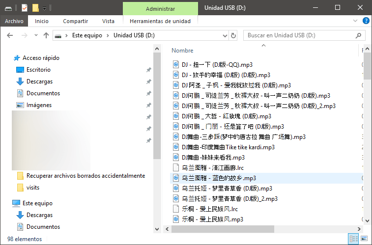
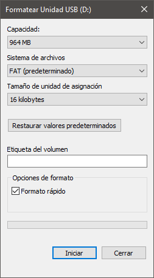
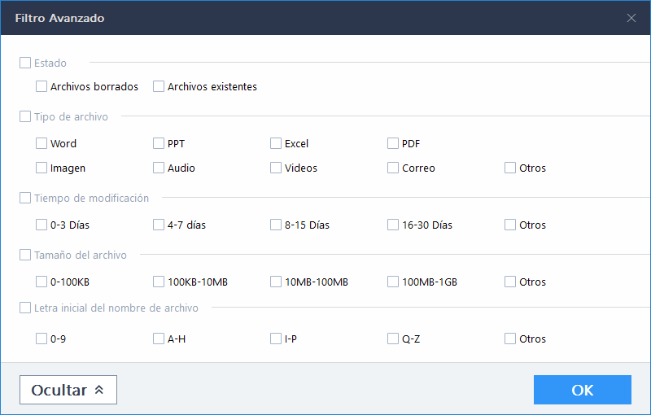

A día de hoy prácticamente todo el mundo sabe que es indispensable realizar copias de seguridad de la información importante. No obstante, es común que se den las siguientes situaciones:<!--more-->

1. La gente se olvida de realizar las copias de seguridad.
2. De repente la tarjeta de memoria de nuestra cámara de fotos o vídeo se corrompe.
3. Las copias de seguridad se dañan y no las podemos restaurar.
4. A veces los discos duros mueren sin dar ningún aviso.
5. La gente borra un archivo que pensaba que no era necesario, pero después se da cuenta que realmente lo era.
6. Trabajadores enfadados pueden borrar intencionalmente información de su ordenador.
7. Puede darse el caso que un usuario elimine una partición de forma accidental.
8. Un virus borra archivos de nuestro ordenador.
9. Etc.

Frente a estas situaciones Windows nos ofrece [herramientas para intentar recuperar archivos borrados](), en caso que las herramientas de Windows no funcionen podemos usar un software de [recuperación de datos](https://es.easeus.com/data-recovery-software/data-recovery-wizard-free.html "Información del Software para recuperar datos EaseUS") como por ejemplo EaseUS.

En el pasado hablé de otros software de recuperación de datos como por ejemplo Recuva o Diskdrill. En esta ocasión nos centraremos en las opciones y rendimiento que nos proporciona EaseUS.

## COMPARACIÓN DE RENDIMIENTO ENTRE EL ARCHICONOCIDO RECUVA Y EASEUS

Parto de un pendrive con una capacidad de 1 GB que tiene almacenado 94 archivos .mp3. Es un USB prestado que no tengo ni idea del contenido que ha almacenado a lo largo de su vida.

Formateo completamente el pendrive usando el formateo rápido de Windows. En el momento de formatear el pendrive disponía de 416MB libres y 548MB ocupados.

###### Nota: Si realizáis un formateo lento ninguno de los 2 software de recuperación de datos podrá recuperar la información.

Una vez formateado el pendrive he realizado el ejercicio de intentar recuperar los archivos borrados con los 2 software. Los resultados obtenidos han sido los siguientes:

|  |   **EaseUS**   |   **Recuva**   |
| --- | --- | --- |
| Tiempo empleado en el escaneo profundo (1GB) |   1 min 15 seg.   |   1 min 16 seg.   |
| Tiempo necesario para recuperar archivos |   53 seg.   |   40,77 seg.   |
| Archivos hallados y recuperados en el escaneo profundo |   124   |   90   |
| Datos totales recuperados |   697 MB   |   529 MB   |
| Archivos mp3 que contenía el pendrive antes de formatearlo |   94   |   94   |
| Archivos mp3 recuperados con nombres y algunos de sus metadatos |   94   |   80   |
| Archivos .mp3 recuperados sin preservar nombres ni metadatos |   16   |   0   |
| Otros archivos adicionales recuperados |   8 archivos pdf. Ninguno de ellos se puede abrir   |   8 archivos pdf. Ninguno de ellos se puede abrir   |

Otros datos a destacar de cada uno de los 2 software de recuperación de datos analizados son los siguientes:

|  |   **EaseUS**   |   **Recuva**   |
| --- | --- | --- |
| Sistemas operativos en que se puede usar |   Windows, MacOS   |   Windows   |
| Versión gratuita |   Sí, con limitaciones   |   Sí, con menos limitaciones que EaseUS   |
| Tamaño máximo de datos que puede recuperar la versión gratuita |   2000 MB si promocionamos el programa en redes sociales.  500 MB si no promocionamos el programa en redes sociales   |   No existe limitación   |
| Sistemas de archivos soportados |   FAT, FAT12, FAT16, FAT32, exFAT, NTFS, NTFS5, ext2/ext3, HFS+, ReFS   |   FAT, FAT32, exFAT, NTFS, NTFS5 y NTFS + EFS, EXT2, EXT3, EXT4   |
| Sistemas operativos en los que puede recuperar datos |   MacOS, Android, iOS, Windows   |   Windows y Linux   |
| Tipos de archivo que pueden recuperar |   Más de 200 tipos de archivo.   |   39   |
| Sistema para filtrar la información a recuperar |   Sí, Avanzado   |   Sí, pero extremadamente básico   |
| Previsualización de los archivos a recuperar |   Sí   |   No   |
| Recuperación de datos perdidos en Raid |   Sí   |   No   |
| Recuperación de particiones borradas |   Sí   |   No   |

## CONCLUSIONES SOBRE EL SOFTWARE DE RECUPERACIÓN DE DATOS EASEUS

Las 2 opciones analizadas son perfectamente válidas. No obstante, en las pruebas que he realizado he podido observar lo siguiente:

1. EaseUS ha sido capaz de recuperar más archivos que Recuva. De hecho, me sorprende que Recuva no haya sido capaz de recuperar la totalidad de archivos que he formateado intencionadamente.
2. El entorno de usuario de EaseUS es más amigable e intuitivo que Recuva.
3. EaseUS permite previsualizar los archivos antes de ser recuperados. Por lo tanto, en el caso que queramos recuperar una imagen podemos identificarla y recuperar tan solo la que nos interesa.

Además, EaseUS clasifica la información recuperada en carpetas y facilita la búsqueda de información una vez se ha recuperado. Por si no fuera poco dispone de un práctico filtro para recuperar únicamente los archivos que nos interesan. El filtro nos permitirá filtrar por:

1. Tipo de archivo.
2. Tamaño del archivo.
3. Por fecha de modificación del archivo que queremos recuperar.
4. Por la letra inicial del archivo que intentamos recuperar.

Podemos afirmar que EaseUS es una solución completa para la recuperación de datos. Nos permite recuperar datos en:

1. Discos duros que han quedado en formato .raw completamente inutilizados.
2. Recuperar datos en equipos que no son capaces arrancar.
3. Recuperar datos en particiones corruptas que no se pueden montar.
4. Rescatar información de sistemas de almacenaje RAID.
5. Etc.

No obstante, para mi el software presenta un par de inconvenientes importantes:

1. En el momento de finalizar el escaneo no nos da ninguna pista de la integridad de los archivos a recuperar.
2. El precio de los 3 tipos de licencia que ofrecen [es elevado](https://www.easeus.com/data-recovery-software/ "Información de los precios de EaseUS"). Además, los usuarios tendrán que pagar un precio elevado sin saber si pueden o no recuperar sus datos. Si la versión Free tuviera un indicador de integridad de los archivos a recuperar, entonces los usuarios podrían pagar una licencia con garantías que a posteriori podrán recuperar sus archivos.
